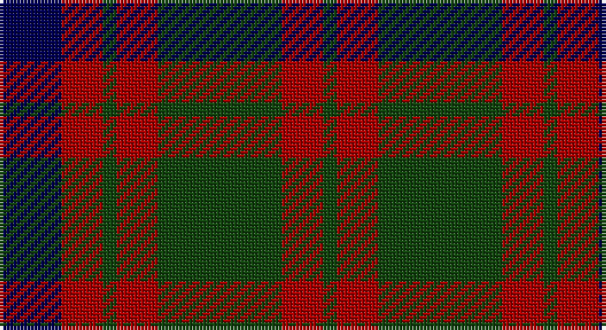

This page is one **sett** — a single exact thread-count. It belongs to the [tartan](/setts/db9r6dg2r6dg18r6dg2/)
(the same proportion at any scale), whose colour order is pattern [BRGRGRG](/stripes/brgrgrg/).

Sourced from weddslist.  It is a [7 stripe tartan](/stripes/stripes7/).

Original link http://www.weddslist.com/cgi-bin/tartans/pg.pl?source=tinsel

## Thread count
DB/18 DR12 DG4 DR12 DG36 DR12 DG/4

One full sett is **174 threads**.

## Palette

Palette: <strong>custom</strong>
<table><thead><tr><th>Colour</th><th>Threads</th><th>Shade</th><th>Base</th><th>OKLCh</th></tr></thead><tbody><tr><td>DB/</td><td style="text-align:right;font-variant-numeric:tabular-nums">18</td><td><code style="background-color:#000052;">#000052</code> <small style="color:#888">#000052</small></td><td>B <code style="background-color:#2A418A;">#2A418A</code></td><td><small style="color:#888">oklch(19.8% 0.137 264.1)</small></td></tr><tr><td>DR</td><td style="text-align:right;font-variant-numeric:tabular-nums">12</td><td><code style="background-color:#AA0000;">#AA0000</code> <small style="color:#888">#AA0000</small></td><td>R <code style="background-color:#CC0000;">#CC0000</code></td><td><small style="color:#888">oklch(46.3% 0.190 29.2)</small></td></tr><tr><td>DG</td><td style="text-align:right;font-variant-numeric:tabular-nums">4</td><td><code style="background-color:#11450D;">#11450D</code> <small style="color:#888">#11450D</small></td><td>G <code style="background-color:#006100;">#006100</code></td><td><small style="color:#888">oklch(34.4% 0.101 142.1)</small></td></tr><tr><td>DR</td><td style="text-align:right;font-variant-numeric:tabular-nums">12</td><td><code style="background-color:#AA0000;">#AA0000</code> <small style="color:#888">#AA0000</small></td><td>R <code style="background-color:#CC0000;">#CC0000</code></td><td><small style="color:#888">oklch(46.3% 0.190 29.2)</small></td></tr><tr><td>DG</td><td style="text-align:right;font-variant-numeric:tabular-nums">36</td><td><code style="background-color:#11450D;">#11450D</code> <small style="color:#888">#11450D</small></td><td>G <code style="background-color:#006100;">#006100</code></td><td><small style="color:#888">oklch(34.4% 0.101 142.1)</small></td></tr><tr><td>DR</td><td style="text-align:right;font-variant-numeric:tabular-nums">12</td><td><code style="background-color:#AA0000;">#AA0000</code> <small style="color:#888">#AA0000</small></td><td>R <code style="background-color:#CC0000;">#CC0000</code></td><td><small style="color:#888">oklch(46.3% 0.190 29.2)</small></td></tr><tr><td>DG/</td><td style="text-align:right;font-variant-numeric:tabular-nums">4</td><td><code style="background-color:#11450D;">#11450D</code> <small style="color:#888">#11450D</small></td><td>G <code style="background-color:#006100;">#006100</code></td><td><small style="color:#888">oklch(34.4% 0.101 142.1)</small></td></tr></tbody></table>

# Sample pattern

## Nearest tartans

The nearest existing variants by ΔTartan distance, with this tartan at the top so the swatches line up against it.

ΔTartan

Tartan

Sett

—

<a href="/ttd/edit/#slug=db9r6dg2r6dg18r6dg2~x2">Skene D</a> <a class="nn-out" href="/variants/s7/db9r6dg2r6dg18r6dg2~x2/" title="open its dictionary page">↗</a>

0.68

<a href="/ttd/edit/#slug=db3r19db13r5g21r8db3~x2&amp;base=db9r6dg2r6dg18r6dg2~x2">MacBean of Tomatin (Clan)</a> <a class="nn-out" href="/variants/s7/db3r19db13r5g21r8db3~x2/" title="open its dictionary page">↗</a>

0.78

<a href="/ttd/edit/#slug=db9r6dg2r6dg18r6dg2&amp;base=db9r6dg2r6dg18r6dg2~x2">Skene D</a> <a class="nn-out" href="/variants/s7/db9r6dg2r6dg18r6dg2/" title="open its dictionary page">↗</a>

0.94

<a href="/ttd/edit/#slug=dg28r4dp25r22dg27r4dp2~x2&amp;base=db9r6dg2r6dg18r6dg2~x2">Glasgow, Ciity of (District)</a> <a class="nn-out" href="/variants/s7/dg28r4dp25r22dg27r4dp2~x2/" title="open its dictionary page">↗</a>

1.02

<a href="/ttd/edit/#slug=dt30r5g30r22dt30r5g4&amp;base=db9r6dg2r6dg18r6dg2~x2">GS Gaelic School (School)</a> <a class="nn-out" href="/variants/s7/dt30r5g30r22dt30r5g4/" title="open its dictionary page">↗</a>

1.03

<a href="/ttd/edit/#slug=dg25r4db24r21dg25r3db4~x2&amp;base=db9r6dg2r6dg18r6dg2~x2">Glasgow #2</a> <a class="nn-out" href="/variants/s7/dg25r4db24r21dg25r3db4~x2/" title="open its dictionary page">↗</a>

1.08

<a href="/ttd/edit/#slug=k3g13k10r13k2r3~x2&amp;base=db9r6dg2r6dg18r6dg2~x2">MacCormick (Dress)</a> <a class="nn-out" href="/variants/s6/k3g13k10r13k2r3~x2/" title="open its dictionary page">↗</a>

1.10

<a href="/ttd/edit/#slug=db6r3g1r3g12r3g1~x4&amp;base=db9r6dg2r6dg18r6dg2~x2">Skene - 1831 (Clan)</a> <a class="nn-out" href="/variants/s7/db6r3g1r3g12r3g1~x4/" title="open its dictionary page">↗</a>

1.14

<a href="/ttd/edit/#slug=g4r28db6g10k10g3~x2&amp;base=db9r6dg2r6dg18r6dg2~x2">Canadian Autumn</a> <a class="nn-out" href="/variants/s6/g4r28db6g10k10g3~x2/" title="open its dictionary page">↗</a>

1.14

<a href="/ttd/edit/#slug=g28r4dp25r22g27r4dp2~x2&amp;base=db9r6dg2r6dg18r6dg2~x2">Glasgow, City of</a> <a class="nn-out" href="/variants/s7/g28r4dp25r22g27r4dp2~x2/" title="open its dictionary page">↗</a>

1.18

<a href="/ttd/edit/#slug=db9r3db1g9r3db1~x2&amp;base=db9r6dg2r6dg18r6dg2~x2">Logan #5</a> <a class="nn-out" href="/variants/s6/db9r3db1g9r3db1~x2/" title="open its dictionary page">↗</a>

## Neighbour map

Every grey dot is one of 14360 variants placed by the first two principal components of the ΔTartan feature space (44% of its variance). Red is this tartan; blue dots are its nearest — click one to open its page.

<svg viewBox="0 0 640 380" role="img" style="max-width:100%;height:auto;border:1px solid #e0e0e0;border-radius:4px;display:block" xmlns="http://www.w3.org/2000/svg"><image href="/nn/cloud.v1.png" width="640" height="380"/><a href="/variants/s7/db3r19db13r5g21r8db3~x2/"><circle cx="256.1" cy="258.6" r="4" fill="#3465a4"><title>MacBean of Tomatin (Clan)</title></circle></a><a href="/variants/s7/db9r6dg2r6dg18r6dg2/"><circle cx="255.6" cy="234.4" r="4" fill="#3465a4"><title>Skene D</title></circle></a><a href="/variants/s7/dg28r4dp25r22dg27r4dp2~x2/"><circle cx="305.7" cy="229.9" r="4" fill="#3465a4"><title>Glasgow, Ciity of (District)</title></circle></a><a href="/variants/s7/dt30r5g30r22dt30r5g4/"><circle cx="270.0" cy="262.9" r="4" fill="#3465a4"><title>GS Gaelic School (School)</title></circle></a><a href="/variants/s7/dg25r4db24r21dg25r3db4~x2/"><circle cx="281.5" cy="262.5" r="4" fill="#3465a4"><title>Glasgow #2</title></circle></a><a href="/variants/s6/k3g13k10r13k2r3~x2/"><circle cx="228.1" cy="275.6" r="4" fill="#3465a4"><title>MacCormick (Dress)</title></circle></a><a href="/variants/s7/db6r3g1r3g12r3g1~x4/"><circle cx="298.3" cy="217.5" r="4" fill="#3465a4"><title>Skene - 1831 (Clan)</title></circle></a><a href="/variants/s6/g4r28db6g10k10g3~x2/"><circle cx="267.4" cy="227.4" r="4" fill="#3465a4"><title>Canadian Autumn</title></circle></a><a href="/variants/s7/g28r4dp25r22g27r4dp2~x2/"><circle cx="298.2" cy="224.7" r="4" fill="#3465a4"><title>Glasgow, City of</title></circle></a><a href="/variants/s6/db9r3db1g9r3db1~x2/"><circle cx="260.4" cy="243.6" r="4" fill="#3465a4"><title>Logan #5</title></circle></a><circle cx="276.9" cy="247.2" r="5" fill="#c00000"/></svg>

ID: /variants/s7/db9r6dg2r6dg18r6dg2~x2/
