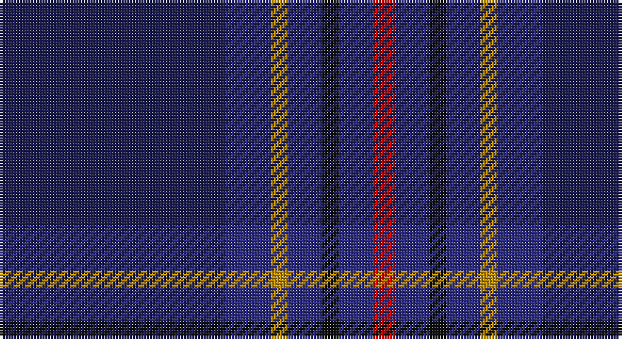

This page is one **sett** — a single exact thread-count. It belongs to the [tartan](/setts/dbi40db8lo3db6k3db6r4/)
(the same proportion at any scale), whose colour order is pattern [BBYBKBR](/stripes/bbybkbr/).

Sourced from tartans-authority.  It is a [7 stripe tartan](/stripes/stripes7/).

Original link http://www.tartansauthority.com/tartan-ferret/display/7401/

## Also known as

This cloth is also recorded under:

- Edinburgh & Lothian T.B.
- Edinburgh & Lothian Tourist Board

2 attestations — the source records this cloth was collapsed from (oldest owns this page)

<ul>
<li>1995 — Edinburgh & Lothian T.B. (Corporate) (tartans-authority, <a href="http://www.tartansauthority.com/tartan-ferret/display/7401/">record</a>)</li>
<li>undated — Edinburgh & Lothian Tourist Board (register-of-tartans, <a href="https://www.tartanregister.gov.uk/tartanDetails.aspx?ref=5485">record</a>)</li>
</ul>

## Register references

External register numbers recorded for this tartan.

- Scottish Register of Tartans: [5485](https://www.tartanregister.gov.uk/tartanDetails.aspx?ref=5485)
- Scottish Tartans Authority (ITI): 7401

## Thread count
DBa/80 DB16 DY6 DB12 K6 DB12 R/8

One full sett is **192 threads**.

## Palette

Palette: <strong>Tartan Register</strong>
<table><thead><tr><th>Colour</th><th>Threads</th><th>Shade</th><th>Base</th><th>OKLCh</th></tr></thead><tbody><tr><td>DBa/</td><td style="text-align:right;font-variant-numeric:tabular-nums">80</td><td><code style="background-color:#1C1C50;">#1C1C50</code> <small style="color:#888">#1C1C50</small></td><td>B <code style="background-color:#2A418A;">#2A418A</code></td><td><small style="color:#888">oklch(26.2% 0.093 277.9)</small></td></tr><tr><td>DB</td><td style="text-align:right;font-variant-numeric:tabular-nums">16</td><td><code style="background-color:#2C2C80;">#2C2C80</code> <small style="color:#888">#2C2C80</small></td><td>B <code style="background-color:#2A418A;">#2A418A</code></td><td><small style="color:#888">oklch(35.0% 0.138 276.6)</small></td></tr><tr><td>DY</td><td style="text-align:right;font-variant-numeric:tabular-nums">6</td><td><code style="background-color:#BC8C00;">#BC8C00</code> <small style="color:#888">#BC8C00</small></td><td>Y <code style="background-color:#F2BF00;">#F2BF00</code></td><td><small style="color:#888">oklch(66.8% 0.137 84.1)</small></td></tr><tr><td>DB</td><td style="text-align:right;font-variant-numeric:tabular-nums">12</td><td><code style="background-color:#2C2C80;">#2C2C80</code> <small style="color:#888">#2C2C80</small></td><td>B <code style="background-color:#2A418A;">#2A418A</code></td><td><small style="color:#888">oklch(35.0% 0.138 276.6)</small></td></tr><tr><td>K</td><td style="text-align:right;font-variant-numeric:tabular-nums">6</td><td><code style="background-color:#101010;">#101010</code> <small style="color:#888">#101010</small></td><td>K <code style="background-color:#000000;">#000000</code></td><td><small style="color:#888">oklch(17.3% 0.000 89.9)</small></td></tr><tr><td>DB</td><td style="text-align:right;font-variant-numeric:tabular-nums">12</td><td><code style="background-color:#2C2C80;">#2C2C80</code> <small style="color:#888">#2C2C80</small></td><td>B <code style="background-color:#2A418A;">#2A418A</code></td><td><small style="color:#888">oklch(35.0% 0.138 276.6)</small></td></tr><tr><td>R/</td><td style="text-align:right;font-variant-numeric:tabular-nums">8</td><td><code style="background-color:#C80000;">#C80000</code> <small style="color:#888">#C80000</small></td><td>R <code style="background-color:#CC0000;">#CC0000</code></td><td><small style="color:#888">oklch(52.3% 0.215 29.2)</small></td></tr></tbody></table>

# Sample pattern

## Nearest tartans

The nearest existing variants by ΔTartan distance, with this tartan at the top so the swatches line up against it.

ΔTartan

Tartan

Sett

—

<a href="/ttd/edit/#slug=dbi40db8lo3db6k3db6r4~x2">Edinburgh &amp; Lothian T.B. (Corporate)</a> <a class="nn-out" href="/variants/s7/dbi40db8lo3db6k3db6r4~x2/" title="open its dictionary page">↗</a>

1.27

<a href="/ttd/edit/#slug=db4lo2db20dt2r4dt2db3dt12db2~x2&amp;base=dbi40db8lo3db6k3db6r4~x2">Stone of Destiny, The (Commemorative</a> <a class="nn-out" href="/variants/s9/db4lo2db20dt2r4dt2db3dt12db2~x2/" title="open its dictionary page">↗</a>

1.44

<a href="/ttd/edit/#slug=db2w2dp16lg2dp2r5db37dp6lg2db2~x2&amp;base=dbi40db8lo3db6k3db6r4~x2">Pride of Fife</a> <a class="nn-out" href="/variants/s10/db2w2dp16lg2dp2r5db37dp6lg2db2~x2/" title="open its dictionary page">↗</a>

1.45

<a href="/variants/s6/db19ki4dr1ki4dg9k1~x4/">Monarchs Corporate Sport Tartan</a>

1.51

<a href="/ttd/edit/#slug=db47dg14dp5do2r3dg7~x2&amp;base=dbi40db8lo3db6k3db6r4~x2">Round Table (1997)</a> <a class="nn-out" href="/variants/s6/db47dg14dp5do2r3dg7~x2/" title="open its dictionary page">↗</a>

1.62

<a href="/ttd/edit/#slug=dg24t4dg3db11dp8db37k3db2r4~x2&amp;base=dbi40db8lo3db6k3db6r4~x2">Stewmann (Personal)</a> <a class="nn-out" href="/variants/s9/dg24t4dg3db11dp8db37k3db2r4~x2/" title="open its dictionary page">↗</a>

1.64

<a href="/variants/s7/k40db8o3db6ki3db6r4~x2/">Edinburgh and Lothian Tourist Board</a>

1.65

<a href="/ttd/edit/#slug=dt6o4dt2db25k30g2k2~x2&amp;base=dbi40db8lo3db6k3db6r4~x2">Passion of Scotland (Fashion)</a> <a class="nn-out" href="/variants/s7/dt6o4dt2db25k30g2k2~x2/" title="open its dictionary page">↗</a>

1.65

<a href="/ttd/edit/#slug=dt30dp4dt5dg3dt2dg2dt2dg10dp7k2dp9~x2&amp;base=dbi40db8lo3db6k3db6r4~x2">Paxton Tartan</a> <a class="nn-out" href="/variants/s11/dt30dp4dt5dg3dt2dg2dt2dg10dp7k2dp9~x2/" title="open its dictionary page">↗</a>

1.65

<a href="/ttd/edit/#slug=db80k28dp9k3m5k12~x2&amp;base=dbi40db8lo3db6k3db6r4~x2">Earl Blue Marl</a> <a class="nn-out" href="/variants/s6/db80k28dp9k3m5k12~x2/" title="open its dictionary page">↗</a>

1.65

<a href="/ttd/edit/#slug=lo4dp2db30k3dp8db5dp1r2~x2&amp;base=dbi40db8lo3db6k3db6r4~x2">Royal British Legion Scotland (Corp)</a> <a class="nn-out" href="/variants/s8/lo4dp2db30k3dp8db5dp1r2~x2/" title="open its dictionary page">↗</a>

## Neighbour map

Every grey dot is one of 14360 variants placed by the first two principal components of the ΔTartan feature space (44% of its variance). Red is this tartan; blue dots are its nearest — click one to open its page.

<svg viewBox="0 0 640 380" role="img" style="max-width:100%;height:auto;border:1px solid #e0e0e0;border-radius:4px;display:block" xmlns="http://www.w3.org/2000/svg"><image href="/nn/cloud.v1.png" width="640" height="380"/><a href="/variants/s9/db4lo2db20dt2r4dt2db3dt12db2~x2/"><circle cx="400.7" cy="234.0" r="4" fill="#3465a4"><title>Stone of Destiny, The (Commemorative</title></circle></a><a href="/variants/s10/db2w2dp16lg2dp2r5db37dp6lg2db2~x2/"><circle cx="373.0" cy="150.6" r="4" fill="#3465a4"><title>Pride of Fife</title></circle></a><a href="/variants/s6/db19ki4dr1ki4dg9k1~x4/"><circle cx="351.2" cy="212.4" r="4" fill="#3465a4"><title>Monarchs Corporate Sport Tartan</title></circle></a><a href="/variants/s6/db47dg14dp5do2r3dg7~x2/"><circle cx="442.1" cy="192.3" r="4" fill="#3465a4"><title>Round Table (1997)</title></circle></a><a href="/variants/s9/dg24t4dg3db11dp8db37k3db2r4~x2/"><circle cx="325.7" cy="165.7" r="4" fill="#3465a4"><title>Stewmann (Personal)</title></circle></a><a href="/variants/s7/k40db8o3db6ki3db6r4~x2/"><circle cx="368.5" cy="192.2" r="4" fill="#3465a4"><title>Edinburgh and Lothian Tourist Board</title></circle></a><a href="/variants/s7/dt6o4dt2db25k30g2k2~x2/"><circle cx="335.1" cy="211.3" r="4" fill="#3465a4"><title>Passion of Scotland (Fashion)</title></circle></a><a href="/variants/s11/dt30dp4dt5dg3dt2dg2dt2dg10dp7k2dp9~x2/"><circle cx="385.1" cy="206.4" r="4" fill="#3465a4"><title>Paxton Tartan</title></circle></a><a href="/variants/s6/db80k28dp9k3m5k12~x2/"><circle cx="453.0" cy="201.0" r="4" fill="#3465a4"><title>Earl Blue Marl</title></circle></a><a href="/variants/s8/lo4dp2db30k3dp8db5dp1r2~x2/"><circle cx="450.6" cy="154.1" r="4" fill="#3465a4"><title>Royal British Legion Scotland (Corp)</title></circle></a><circle cx="399.9" cy="203.3" r="5" fill="#c00000"/></svg>

ID: /variants/s7/dbi40db8lo3db6k3db6r4~x2/
