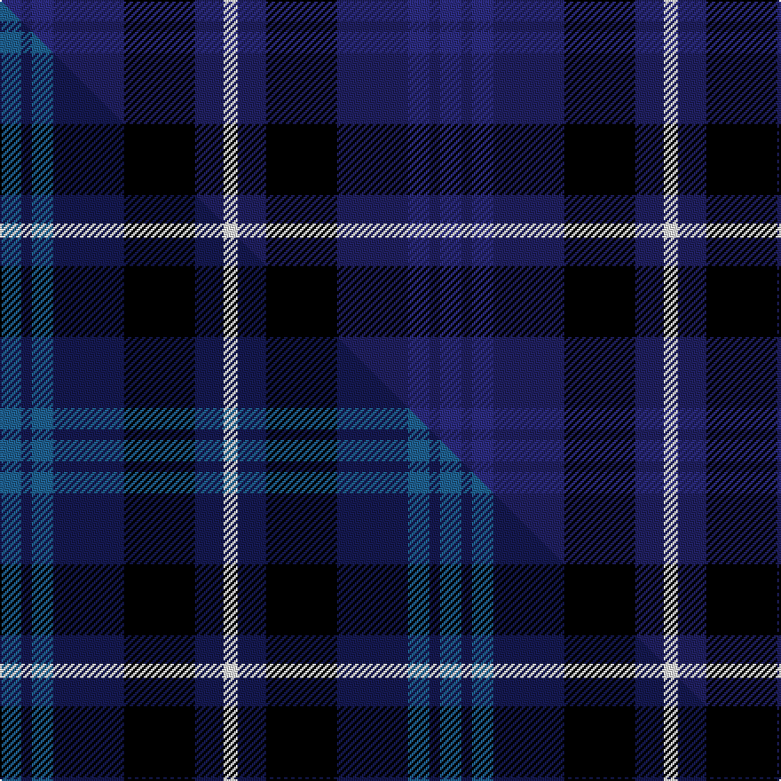

This page is one **sett** — a single exact thread-count. It belongs to the [tartan](/setts/dbi6db3dbi6db20k20db8w4/)
(the same proportion at any scale), whose colour order is pattern [BBBBKBW](/stripes/bbbbkbw/).

Part of the [Allianz Deutschland 2012](/tartans/allianz-deutschland-2012/) tartan — the named design grouping this sett with its other cloths.

Sourced from tartans-authority.  It is a [7 stripe tartan](/stripes/stripes7/).

Original link http://www.tartansauthority.com/tartan-ferret/display/10684/

## Register references

External register numbers recorded for this tartan.

- Scottish Register of Tartans: [10684](https://www.tartanregister.gov.uk/tartanDetails?ref=10684)
- Scottish Tartans Authority (ITI): 10684

## Thread count
DBi/12 DB6 DBi12 DB40 K40 DB16 W/8

One full sett is **248 threads**.

## Palette
<table><thead><tr><th>Colour</th><th>Shade</th><th>OKLCh</th></tr></thead><tbody><tr><td>DB</td><td><code style="background-color:#2C2C80;">#2C2C80</code> <small style="color:#888">#2C2C80</small></td><td><small style="color:#888">oklch(35.0% 0.138 276.6)</small></td></tr><tr><td>DB</td><td><code style="background-color:#202060;">#202060</code> <small style="color:#888">#202060</small></td><td><small style="color:#888">oklch(28.9% 0.111 276.9)</small></td></tr><tr><td>K</td><td><code style="background-color:#000000;">#000000</code> <small style="color:#888">#000000</small></td><td><small style="color:#888">oklch(0.0% 0.000 0.0)</small></td></tr><tr><td>W</td><td><code style="background-color:#F7F7F7;">#F7F7F7</code> <small style="color:#888">#F7F7F7</small></td><td><small style="color:#888">oklch(97.6% 0.000 89.9)</small></td></tr></tbody></table>

# Sample pattern

## Compared to the master

This cloth is one sett of its design; the master sett (the exemplar the design is anchored on) is below for comparison.

Its **ΔTartan distance** from the master is **0.53** — the same measure the nearest-tartans table ranks by (0 is identical; a re-scale of the same cloth is near 0, a recolour or a different proportion further).

<figure class="master-compare" style="margin:0">

this sett
master sett ★

<figcaption style="color:#888;font-size:smaller">One weave of this sett against the <a href="/setts/t6db3t6db20k20db8w4/">master sett ★</a>, split on the diagonal: a shared proportion runs seamlessly across it with only the shades shifting; a different proportion breaks on it.</figcaption>
</figure>

## Nearest variants

The nearest existing variants by ΔTartan distance, with this cloth at the top so the swatches line up against it.

ΔTartan

Threads

Variant

Sett

—

248

<a href="/variants/s7/dbi6db3dbi6db20k20db8w4~x2~dbi1406275-db1204274/">Allianz Deutschland 2012 (Corporate)</a>

<a href="/ttd/edit/#slug=t6db3t6db20k20db8w4~x2~t1904245-db1004274&amp;base=dbi6db3dbi6db20k20db8w4~x2~dbi1406275-db1204274" title="compare in the TTD">0.00</a>

248

<a href="/variants/s7/t6db3t6db20k20db8w4~x2~t1904245-db1004274/">Allianz Deutschland 2012</a>

<a href="/ttd/edit/#slug=dbi3k13dbi13db13w2db13w3~x2~dbi1406275-db1106275&amp;base=dbi6db3dbi6db20k20db8w4~x2~dbi1406275-db1204274" title="compare in the TTD">2.50</a>

228

<a href="/variants/s7/dbi3k13dbi13db13w2db13w3~x2~dbi1406275-db1106275/">Brodie Countryfare (Corporate)</a>

<a href="/ttd/edit/#slug=k3r2k14lb2db6lb2db16lb3~x2&amp;base=dbi6db3dbi6db20k20db8w4~x2~dbi1406275-db1204274" title="compare in the TTD">2.51</a>

180

<a href="/variants/s8/k3r2k14lb2db6lb2db16lb3~x2/">Immanuel Presbyterian Church (Milwaukee)</a>

<a href="/ttd/edit/#slug=db4g18db3k17db18dp4~x2&amp;base=dbi6db3dbi6db20k20db8w4~x2~dbi1406275-db1204274" title="compare in the TTD">2.87</a>

240

<a href="/variants/s6/db4g18db3k17db18dp4~x2/">Scottish Airports (Corporate)</a>

<a href="/ttd/edit/#slug=g1k9lb4db9lb1~x6&amp;base=dbi6db3dbi6db20k20db8w4~x2~dbi1406275-db1204274" title="compare in the TTD">2.98</a>

276

<a href="/variants/s5/g1k9lb4db9lb1~x6/">Wallace Blue Dress Tartan</a>

## Neighbour map

Every grey dot is one of 13620 variants placed by the first two principal components of the ΔTartan feature space (42% of its variance). Red is this tartan; blue dots are its nearest — click one to open its page.

<svg viewBox="0 0 640 380" role="img" style="max-width:100%;height:auto;border:1px solid #e0e0e0;border-radius:4px;display:block" xmlns="http://www.w3.org/2000/svg"><image href="/nn/cloud.v1.png" width="640" height="380"/><a href="/variants/s7/t6db3t6db20k20db8w4~x2~t1904245-db1004274/"><circle cx="195.5" cy="219.7" r="4" fill="#3465a4"><title>Allianz Deutschland 2012</title></circle></a><a href="/variants/s7/dbi3k13dbi13db13w2db13w3~x2~dbi1406275-db1106275/"><circle cx="172.0" cy="233.0" r="4" fill="#3465a4"><title>Brodie Countryfare (Corporate)</title></circle></a><a href="/variants/s8/k3r2k14lb2db6lb2db16lb3~x2/"><circle cx="193.4" cy="179.4" r="4" fill="#3465a4"><title>Immanuel Presbyterian Church (Milwaukee)</title></circle></a><a href="/variants/s6/db4g18db3k17db18dp4~x2/"><circle cx="157.1" cy="238.9" r="4" fill="#3465a4"><title>Scottish Airports (Corporate)</title></circle></a><a href="/variants/s5/g1k9lb4db9lb1~x6/"><circle cx="159.6" cy="210.7" r="4" fill="#3465a4"><title>Wallace Blue Dress Tartan</title></circle></a><circle cx="206.4" cy="221.9" r="5" fill="#c00000"/><text x="320" y="376" text-anchor="middle" font-size="11" fill="#999">ground</text><text x="11" y="190" text-anchor="middle" font-size="11" fill="#999" transform="rotate(-90 11 190)">complexity</text></svg>

ID: /variants/s7/dbi6db3dbi6db20k20db8w4~x2~dbi1406275-db1204274/
