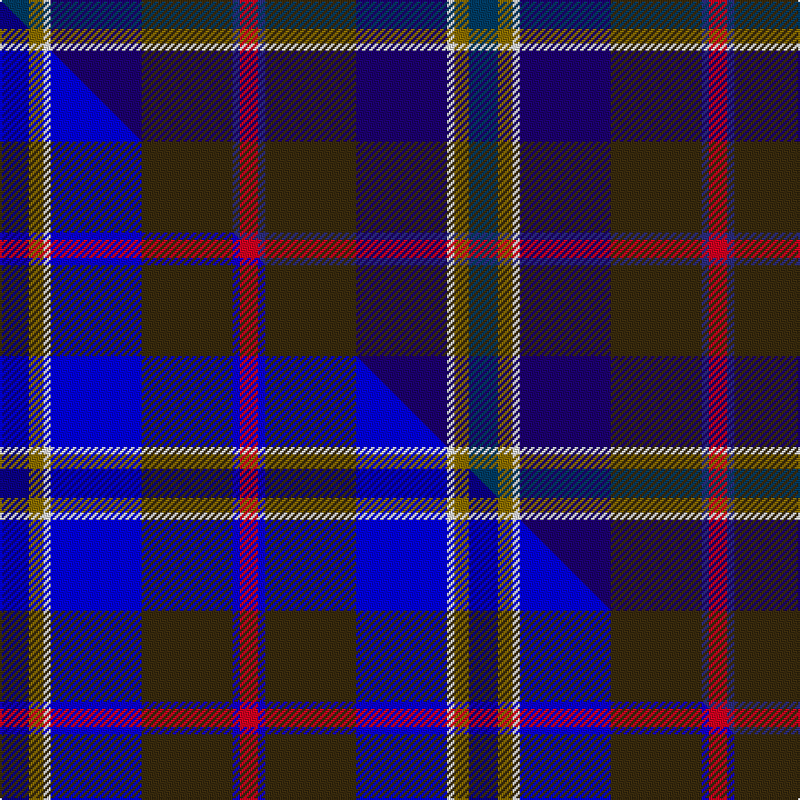

This page is one **sett** — a single exact thread-count. It belongs to the [tartan](/setts/dbi8y4w2db25dy25dbii2r5/)
(the same proportion at any scale), whose colour order is pattern [BGWBGBR](/stripes/bgwbgbr/).

Part of the [Kildrummie](/tartans/kildrummie/) tartan — the named design grouping this sett with its other cloths.

Sourced from tartans-authority.  It is a [7 stripe tartan](/stripes/stripes7/).

Original link http://www.tartansauthority.com/tartan-ferret/display/10048/

## Register references

External register numbers recorded for this tartan.

- Scottish Register of Tartans: [10048](https://www.tartanregister.gov.uk/tartanDetails?ref=10048)
- Scottish Tartans Authority (ITI): 10048

## Thread count
DBi/16 Y8 W4 DB50 DY50 DBii4 R/10

One full sett is **258 threads**.

## Palette
<table><thead><tr><th>Colour</th><th>Shade</th><th>OKLCh</th></tr></thead><tbody><tr><td>DB</td><td><code style="background-color:#2C2C80;">#2C2C80</code> <small style="color:#888">#2C2C80</small></td><td><small style="color:#888">oklch(35.0% 0.138 276.6)</small></td></tr><tr><td>DB</td><td><code style="background-color:#1C0070;">#1C0070</code> <small style="color:#888">#1C0070</small></td><td><small style="color:#888">oklch(26.3% 0.162 277.1)</small></td></tr><tr><td>DB</td><td><code style="background-color:#003C64;">#003C64</code> <small style="color:#888">#003C64</small></td><td><small style="color:#888">oklch(34.5% 0.089 246.0)</small></td></tr><tr><td>W</td><td><code style="background-color:#F7F7F7;">#F7F7F7</code> <small style="color:#888">#F7F7F7</small></td><td><small style="color:#888">oklch(97.6% 0.000 89.9)</small></td></tr><tr><td>R</td><td><code style="background-color:#D60020;">#D60020</code> <small style="color:#888">#D60020</small></td><td><small style="color:#888">oklch(55.2% 0.224 25.5)</small></td></tr><tr><td>DY</td><td><code style="background-color:#3A2B0D;">#3A2B0D</code> <small style="color:#888">#3A2B0D</small></td><td><small style="color:#888">oklch(30.0% 0.049 82.0)</small></td></tr><tr><td>Y</td><td><code style="background-color:#8B6E00;">#8B6E00</code> <small style="color:#888">#8B6E00</small></td><td><small style="color:#888">oklch(55.1% 0.113 90.4)</small></td></tr></tbody></table>

# Sample pattern

## Compared to the master

This cloth is one sett of its design; the master sett (the exemplar the design is anchored on) is below for comparison.

Its **ΔTartan distance** from the master is **2.08** — the same measure the nearest-tartans table ranks by (0 is identical; a re-scale of the same cloth is near 0, a recolour or a different proportion further).

<figure class="master-compare" style="margin:0">

this sett
master sett ★

<figcaption style="color:#888;font-size:smaller">One weave of this sett against the <a href="/setts/db8y4w2bi25dy25b2r5/">master sett ★</a>, split on the diagonal: a shared proportion runs seamlessly across it with only the shades shifting; a different proportion breaks on it.</figcaption>
</figure>

## Nearest tartan variants

The nearest existing variants by ΔTartan distance, with this cloth at the top so the swatches line up against it.

ΔTartan

Threads

Variant

Sett

—

258

<a href="/variants/s7/dbi8y4w2db25dy25dbii2r5~x2~dbi1404245-db1106275-dbii1406275/">Kildrummie (Name)</a>

2.88

—

<a href="/variants/s6/w3dbi17dy16db2dg17y2~x2~dbi1406275-db1204274/">Atlantic Ancient Trade Tartan</a>

<a href="/ttd/edit/#slug=r2ly2db9dy1dg9r1w1~x2&amp;base=dbi8y4w2db25dy25dbii2r5~x2~dbi1404245-db1106275-dbii1406275" title="compare in the TTD">2.88</a>

94

<a href="/variants/s7/r2ly2db9dy1dg9r1w1~x2/">Unidentified (ex Tony Murray)</a>

## Neighbour map

Every grey dot is one of 13620 variants placed by the first two principal components of the ΔTartan feature space (42% of its variance). Red is this tartan; blue dots are its nearest — click one to open its page.

<svg viewBox="0 0 640 380" role="img" style="max-width:100%;height:auto;border:1px solid #e0e0e0;border-radius:4px;display:block" xmlns="http://www.w3.org/2000/svg"><image href="/nn/cloud.v1.png" width="640" height="380"/><a href="/variants/s6/w3dbi17dy16db2dg17y2~x2~dbi1406275-db1204274/"><circle cx="209.5" cy="241.4" r="4" fill="#3465a4"><title>Atlantic Ancient Trade Tartan</title></circle></a><a href="/variants/s7/r2ly2db9dy1dg9r1w1~x2/"><circle cx="164.9" cy="176.5" r="4" fill="#3465a4"><title>Unidentified (ex Tony Murray)</title></circle></a><circle cx="201.9" cy="169.0" r="5" fill="#c00000"/><text x="320" y="376" text-anchor="middle" font-size="11" fill="#999">ground</text><text x="11" y="190" text-anchor="middle" font-size="11" fill="#999" transform="rotate(-90 11 190)">complexity</text></svg>

ID: /variants/s7/dbi8y4w2db25dy25dbii2r5~x2~dbi1404245-db1106275-dbii1406275/
