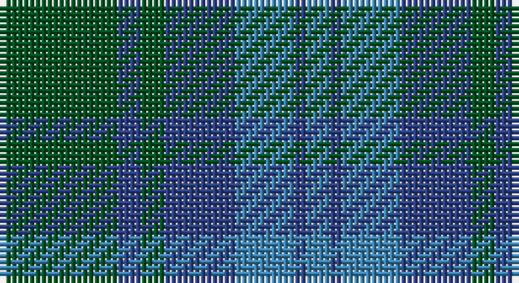

This page is one **sett** — a single exact thread-count. It belongs to the [tartan](/setts/dg10db2dg2db6t5db1t2/)
(the same proportion at any scale), whose colour order is pattern [BBBBGBG](/stripes/bbbbgbg/).

Sourced from register-of-tartans.  It is a [7 stripe tartan](/stripes/stripes7/).

Original link https://www.tartanregister.gov.uk/tartanDetails.aspx?ref=4315

## Register references

External register numbers recorded for this tartan.

- Scottish Register of Tartans: [4315](https://www.tartanregister.gov.uk/tartanDetails.aspx?ref=4315)
- Scottish Tartans World Register: 35

## Thread count
G/20 Ba4 G4 Ba12 B10 Ba2 B/4

One full sett is **88 threads**.

## Palette

Palette: <strong>Tartan Register</strong>
<table><thead><tr><th>Colour</th><th>Threads</th><th>Shade</th><th>Base</th><th>OKLCh</th></tr></thead><tbody><tr><td>G/</td><td style="text-align:right;font-variant-numeric:tabular-nums">20</td><td><code style="background-color:#005020;">#005020</code> <small style="color:#888">#005020</small></td><td>G <code style="background-color:#006100;">#006100</code></td><td><small style="color:#888">oklch(37.7% 0.105 149.6)</small></td></tr><tr><td>Ba</td><td style="text-align:right;font-variant-numeric:tabular-nums">4</td><td><code style="background-color:#2C4084;">#2C4084</code> <small style="color:#888">#2C4084</small></td><td>B <code style="background-color:#2A418A;">#2A418A</code></td><td><small style="color:#888">oklch(39.4% 0.117 268.3)</small></td></tr><tr><td>G</td><td style="text-align:right;font-variant-numeric:tabular-nums">4</td><td><code style="background-color:#005020;">#005020</code> <small style="color:#888">#005020</small></td><td>G <code style="background-color:#006100;">#006100</code></td><td><small style="color:#888">oklch(37.7% 0.105 149.6)</small></td></tr><tr><td>Ba</td><td style="text-align:right;font-variant-numeric:tabular-nums">12</td><td><code style="background-color:#2C4084;">#2C4084</code> <small style="color:#888">#2C4084</small></td><td>B <code style="background-color:#2A418A;">#2A418A</code></td><td><small style="color:#888">oklch(39.4% 0.117 268.3)</small></td></tr><tr><td>B</td><td style="text-align:right;font-variant-numeric:tabular-nums">10</td><td><code style="background-color:#3C82AF;">#3C82AF</code> <small style="color:#888">#3C82AF</small></td><td>B <code style="background-color:#2A418A;">#2A418A</code></td><td><small style="color:#888">oklch(58.1% 0.099 239.8)</small></td></tr><tr><td>Ba</td><td style="text-align:right;font-variant-numeric:tabular-nums">2</td><td><code style="background-color:#2C4084;">#2C4084</code> <small style="color:#888">#2C4084</small></td><td>B <code style="background-color:#2A418A;">#2A418A</code></td><td><small style="color:#888">oklch(39.4% 0.117 268.3)</small></td></tr><tr><td>B/</td><td style="text-align:right;font-variant-numeric:tabular-nums">4</td><td><code style="background-color:#3C82AF;">#3C82AF</code> <small style="color:#888">#3C82AF</small></td><td>B <code style="background-color:#2A418A;">#2A418A</code></td><td><small style="color:#888">oklch(58.1% 0.099 239.8)</small></td></tr></tbody></table>

# Sample pattern

## Nearest tartans

The nearest existing variants by ΔTartan distance, with this tartan at the top so the swatches line up against it.

ΔTartan

Tartan

Sett

—

<a href="/ttd/edit/#slug=dg10db2dg2db6t5db1t2~x2">Unidentified No 17</a> <a class="nn-out" href="/variants/s7/dg10db2dg2db6t5db1t2~x2/" title="open its dictionary page">↗</a>

1.13

<a href="/ttd/edit/#slug=dbi7db2dbi25db10g21db2~x2&amp;base=dg10db2dg2db6t5db1t2~x2">Sugiyama</a> <a class="nn-out" href="/variants/s6/dbi7db2dbi25db10g21db2~x2/" title="open its dictionary page">↗</a>

1.34

<a href="/ttd/edit/#slug=g10db2g2db6t5db1t2~x2&amp;base=dg10db2dg2db6t5db1t2~x2">Unnamed, No 17</a> <a class="nn-out" href="/variants/s7/g10db2g2db6t5db1t2~x2/" title="open its dictionary page">↗</a>

1.44

<a href="/ttd/edit/#slug=db20dy2db2dy2db2dy6g15dy2~x2&amp;base=dg10db2dg2db6t5db1t2~x2">Gammell (Brown) (Personal)</a> <a class="nn-out" href="/variants/s8/db20dy2db2dy2db2dy6g15dy2~x2/" title="open its dictionary page">↗</a>

1.48

<a href="/ttd/edit/#slug=t11db1t1db1t1db8dg8db1dg8db8t8db1t1~x2&amp;base=dg10db2dg2db6t5db1t2~x2">Sutherland #3</a> <a class="nn-out" href="/variants/s13/t11db1t1db1t1db8dg8db1dg8db8t8db1t1~x2/" title="open its dictionary page">↗</a>

1.49

<a href="/ttd/edit/#slug=dg4db1dg12db12w1db4~x2&amp;base=dg10db2dg2db6t5db1t2~x2">Unidentified Tweed</a> <a class="nn-out" href="/variants/s6/dg4db1dg12db12w1db4~x2/" title="open its dictionary page">↗</a>

1.53

<a href="/ttd/edit/#slug=db22g3db3g3db3g9y28g3y6~x2&amp;base=dg10db2dg2db6t5db1t2~x2">Manx Centenary</a> <a class="nn-out" href="/variants/s9/db22g3db3g3db3g9y28g3y6~x2/" title="open its dictionary page">↗</a>

1.56

<a href="/ttd/edit/#slug=db1g10db9b10db1b1~x4&amp;base=dg10db2dg2db6t5db1t2~x2">Black Watch (Aljean)</a> <a class="nn-out" href="/variants/s6/db1g10db9b10db1b1~x4/" title="open its dictionary page">↗</a>

1.56

<a href="/ttd/edit/#slug=r2y23db11b22r2~x2&amp;base=dg10db2dg2db6t5db1t2~x2">Skibo (Corporate)</a> <a class="nn-out" href="/variants/s5/r2y23db11b22r2~x2/" title="open its dictionary page">↗</a>

1.58

<a href="/ttd/edit/#slug=dp4dt18r2dt2r2dt9g20dt3g4~x2&amp;base=dg10db2dg2db6t5db1t2~x2">St. Andrews New Golf Club</a> <a class="nn-out" href="/variants/s9/dp4dt18r2dt2r2dt9g20dt3g4~x2/" title="open its dictionary page">↗</a>

1.64

<a href="/ttd/edit/#slug=db21g2db3g2db2g14dy15g4dy15g14db14g2db3~x2&amp;base=dg10db2dg2db6t5db1t2~x2">Montmorency Family Tartan</a> <a class="nn-out" href="/variants/s13/db21g2db3g2db2g14dy15g4dy15g14db14g2db3~x2/" title="open its dictionary page">↗</a>

## Neighbour map

Every grey dot is one of 14360 variants placed by the first two principal components of the ΔTartan feature space (44% of its variance). Red is this tartan; blue dots are its nearest — click one to open its page.

<svg viewBox="0 0 640 380" role="img" style="max-width:100%;height:auto;border:1px solid #e0e0e0;border-radius:4px;display:block" xmlns="http://www.w3.org/2000/svg"><image href="/nn/cloud.v1.png" width="640" height="380"/><a href="/variants/s6/dbi7db2dbi25db10g21db2~x2/"><circle cx="345.7" cy="268.0" r="4" fill="#3465a4"><title>Sugiyama</title></circle></a><a href="/variants/s7/g10db2g2db6t5db1t2~x2/"><circle cx="276.6" cy="259.0" r="4" fill="#3465a4"><title>Unnamed, No 17</title></circle></a><a href="/variants/s8/db20dy2db2dy2db2dy6g15dy2~x2/"><circle cx="340.6" cy="239.6" r="4" fill="#3465a4"><title>Gammell (Brown) (Personal)</title></circle></a><a href="/variants/s13/t11db1t1db1t1db8dg8db1dg8db8t8db1t1~x2/"><circle cx="288.9" cy="236.7" r="4" fill="#3465a4"><title>Sutherland #3</title></circle></a><a href="/variants/s6/dg4db1dg12db12w1db4~x2/"><circle cx="385.7" cy="270.2" r="4" fill="#3465a4"><title>Unidentified Tweed</title></circle></a><a href="/variants/s9/db22g3db3g3db3g9y28g3y6~x2/"><circle cx="303.5" cy="229.9" r="4" fill="#3465a4"><title>Manx Centenary</title></circle></a><a href="/variants/s6/db1g10db9b10db1b1~x4/"><circle cx="251.0" cy="259.4" r="4" fill="#3465a4"><title>Black Watch (Aljean)</title></circle></a><a href="/variants/s5/r2y23db11b22r2~x2/"><circle cx="291.1" cy="268.8" r="4" fill="#3465a4"><title>Skibo (Corporate)</title></circle></a><a href="/variants/s9/dp4dt18r2dt2r2dt9g20dt3g4~x2/"><circle cx="341.2" cy="233.8" r="4" fill="#3465a4"><title>St. Andrews New Golf Club</title></circle></a><a href="/variants/s13/db21g2db3g2db2g14dy15g4dy15g14db14g2db3~x2/"><circle cx="279.9" cy="238.9" r="4" fill="#3465a4"><title>Montmorency Family Tartan</title></circle></a><circle cx="309.5" cy="278.0" r="5" fill="#c00000"/></svg>

ID: /variants/s7/dg10db2dg2db6t5db1t2~x2/
