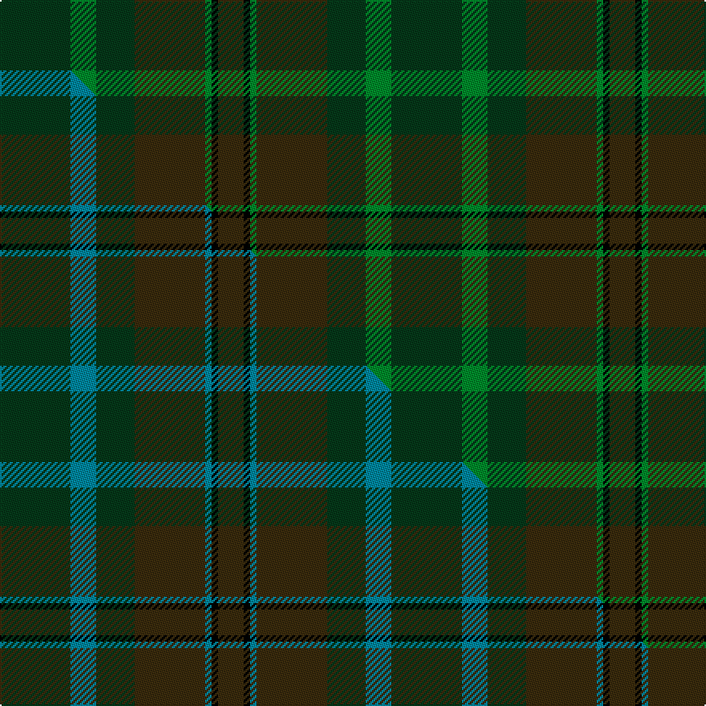

This is one **variant** — a specific cloth: this exact thread count and colourway, with its own
provenance below. It is one weaving of the [sett](/tartans/c/ca/calais/) (the scale-free proportion — the
same cloth at any scale or shade), whose colour order is pattern [GGGGGKG](/stripes/gggggkg/).

Part of the [Calais](/tartans/c/ca/calais/) tartan — the named design grouping this sett with its other cloths.

Sourced from tartans-authority.  It is a [7 stripe tartan](/stripes/stripes7/).

Original link <code>http://www.tartansauthority.com/tartan-ferret/display/3779/</code> — retired · [Internet Archive copy](https://web.archive.org/web/*/http://www.tartansauthority.com/tartan-ferret/display/3779/*)

Dataset <small>— provenance for this record, inherited from the source manifest</small>

<dl class="dataset-prov">
<dt>source</dt><dd><a href="/sources/tartans-authority/">Scottish Tartans Authority</a></dd>
<dt>data captured from</dt><dd><a href="https://github.com/thetartan/tartan-database/blob/master/data/tartans-authority/data.csv">https://github.com/thetartan/tartan-database/blob/master/data/tartans-authority/data.csv</a></dd>
<dt>data date</dt><dd>pre 2002 <small>(this record)</small></dd>
<dt>licence</dt><dd><a href="https://creativecommons.org/licenses/by-nc-nd/4.0/">CC BY-NC-ND 4.0</a></dd>
</dl>

Capture chain <small>— the hands this data passed through, oldest first; each capture carries its own licence</small>

<ol class="capture-chain">
<li><a href="https://www.tartansauthority.com/">Scottish Tartans Authority</a> <small>the heritage body’s archive — its tartan-ferret record browser is retired; dead record links are shown unlinked, with an Internet Archive copy (ITI numbers are not SRT references)</small></li>
<li><a href="https://github.com/thetartan/tartan-database">thetartan/tartan-database</a> <small>2016-2017</small> · <a href="https://creativecommons.org/licenses/by-nc-nd/4.0/">CC BY-NC-ND 4.0</a> <small>Levko Kravets's frozen compilation — the capture we vendored, and where its CC licence text came from</small></li>
<li>this dictionary <small>captured 2026-06-10 · commit 5bf86c7566</small> <small>each re-capture is a git commit to data/sources</small></li>
</ol>

## Register references

External register numbers recorded for this tartan.

- Scottish Tartans Authority (ITI): 3779

## Thread count
DG/44 G16 DG24 DY44 G4 K4 DY/16

One full sett is **244 threads**.

## Palette
<table><thead><tr><th>Colour</th><th>Shade</th><th>OKLCh</th></tr></thead><tbody><tr><td>G</td><td><code style="background-color:#008B2A;">#008B2A</code> <small style="color:#888">#008B2A</small></td><td><small style="color:#888">oklch(55.4% 0.170 145.9)</small></td></tr><tr><td>DG</td><td><code style="background-color:#053819;">#053819</code> <small style="color:#888">#053819</small></td><td><small style="color:#888">oklch(30.0% 0.075 151.3)</small></td></tr><tr><td>K</td><td><code style="background-color:#000000;">#000000</code> <small style="color:#888">#000000</small></td><td><small style="color:#888">oklch(0.0% 0.000 0.0)</small></td></tr><tr><td>DY</td><td><code style="background-color:#3A2B0D;">#3A2B0D</code> <small style="color:#888">#3A2B0D</small></td><td><small style="color:#888">oklch(30.0% 0.049 82.0)</small></td></tr></tbody></table>

# Sample pattern

## Compared to the master

This cloth is one sett of its design; the master sett (the exemplar the design is anchored on) is below for comparison.

Its **ΔTartan distance** from the master is **0.60** — the same measure the nearest-tartans table ranks by (0 is identical; a re-scale of the same cloth is near 0, a recolour or a different proportion further).

<figure class="master-compare" style="margin:0">

this sett
master sett ★

<figcaption style="color:#888;font-size:smaller">One weave of this sett against the <a href="/setts/dg11t4dg6dy11t1k1dy4/">master sett ★</a>, split on the diagonal: a shared proportion runs seamlessly across it with only the shades shifting; a different proportion breaks on it.</figcaption>
</figure>

## Nearest tartan variants

The nearest existing variants by ΔTartan distance, with this cloth at the top so the swatches line up against it.

ΔTartan

Threads

Variant

Sett

—

244

<a href="/variants/s7/dg11g4dg6dy11g1k1dy4~x4/">Calais (Fashion)</a>

<a href="/ttd/edit/#slug=dg11t4dg6dy11t1k1dy4~x4&amp;base=dg11g4dg6dy11g1k1dy4~x4" title="compare in the TTD">0.60</a>

244

<a href="/variants/s7/dg11t4dg6dy11t1k1dy4~x4/">Calais (Fashion)</a>

<a href="/ttd/edit/#slug=g8y1g8y12r1y1~x4&amp;base=dg11g4dg6dy11g1k1dy4~x4" title="compare in the TTD">1.92</a>

212

<a href="/variants/s6/g8y1g8y12r1y1~x4/">Forget Family (Yonne)</a>

<a href="/ttd/edit/#slug=g4dg18dgi6dg6dgi24k3~x2~dg3007159-dgi4112135&amp;base=dg11g4dg6dy11g1k1dy4~x4" title="compare in the TTD">2.79</a>

230

<a href="/variants/s6/g4dg18dgi6dg6dgi24k3~x2~dg3007159-dgi4112135/">Park Estate</a>

<a href="/ttd/edit/#slug=g4dg18dgi6dg6dgi24ly3~x2~dg3007159-dgi4112135&amp;base=dg11g4dg6dy11g1k1dy4~x4" title="compare in the TTD">3.22</a>

230

<a href="/variants/s6/g4dg18dgi6dg6dgi24ly3~x2~dg3007159-dgi4112135/">Park (Estate Check)</a>

<a href="/ttd/edit/#slug=g25y6dg5r3y10~x4&amp;base=dg11g4dg6dy11g1k1dy4~x4" title="compare in the TTD">3.31</a>

252

<a href="/variants/s5/g25y6dg5r3y10~x4/">Pendlebury, Andrew (Personal)</a>

<a href="/ttd/edit/#slug=r3dg2g32dg32g2y3~x2~dg4514144-g6019141&amp;base=dg11g4dg6dy11g1k1dy4~x4" title="compare in the TTD">3.41</a>

284

<a href="/variants/s6/r3dg2g32dg32g2y3~x2~dg4514144-g6019141/">Galloway Green (yellow line)</a>

## Neighbour map

Every grey dot is one of 13662 variants placed by the first two principal components of the ΔTartan feature space (42% of its variance). Red is this tartan; blue dots are its nearest — click one to open its page. The map is a flat projection of a many-dimensional space — [how to read it](/posts/neighbourhood-maps/).

<svg viewBox="0 0 640 380" role="img" style="max-width:100%;height:auto;border:1px solid #e0e0e0;border-radius:4px;display:block" xmlns="http://www.w3.org/2000/svg"><image href="/nn/cloud.v1.png" width="640" height="380"/><a href="/variants/s7/dg11t4dg6dy11t1k1dy4~x4/"><circle cx="377.1" cy="261.6" r="4" fill="#3465a4"><title>Calais (Fashion)</title></circle></a><a href="/variants/s6/g8y1g8y12r1y1~x4/"><circle cx="549.8" cy="304.8" r="4" fill="#3465a4"><title>Forget Family (Yonne)</title></circle></a><a href="/variants/s6/g4dg18dgi6dg6dgi24k3~x2~dg3007159-dgi4112135/"><circle cx="394.5" cy="274.3" r="4" fill="#3465a4"><title>Park Estate</title></circle></a><a href="/variants/s6/g4dg18dgi6dg6dgi24ly3~x2~dg3007159-dgi4112135/"><circle cx="418.0" cy="295.7" r="4" fill="#3465a4"><title>Park (Estate Check)</title></circle></a><a href="/variants/s5/g25y6dg5r3y10~x4/"><circle cx="394.6" cy="279.9" r="4" fill="#3465a4"><title>Pendlebury, Andrew (Personal)</title></circle></a><a href="/variants/s6/r3dg2g32dg32g2y3~x2~dg4514144-g6019141/"><circle cx="461.0" cy="243.5" r="4" fill="#3465a4"><title>Galloway Green (yellow line)</title></circle></a><circle cx="386.9" cy="266.0" r="5" fill="#c00000"/><text x="320" y="376" text-anchor="middle" font-size="11" fill="#999">ground</text><text x="11" y="190" text-anchor="middle" font-size="11" fill="#999" transform="rotate(-90 11 190)">complexity</text></svg>

ID: /variants/s7/dg11g4dg6dy11g1k1dy4~x4/
