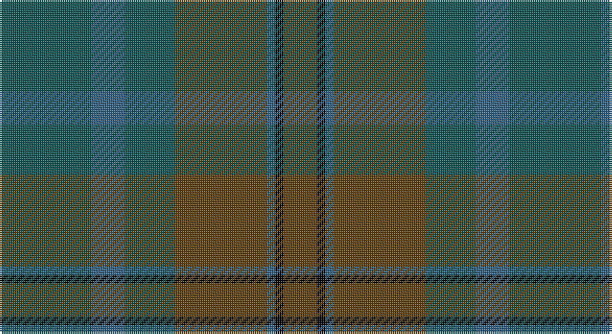

This page is one **sett** — a single exact thread-count. It belongs to the [tartan](/setts/dg11n4dg6dy11n1k1dy4/)
(the same proportion at any scale), whose colour order is pattern [GBGGBKG](/stripes/gbggbkg/).

Sourced from tartans-authority.  It is a [7 stripe tartan](/stripes/stripes7/).

Original link http://www.tartansauthority.com/tartan-ferret/display/3779/

2 attestations — the source records this cloth was collapsed from (oldest owns this page)

<ul>
<li>pre 2002 — Calais (Fashion) (tartans-authority, <a href="http://www.tartansauthority.com/tartan-ferret/display/3779/">record</a>)</li>
<li>undated — Calais (Fashion) (register-of-tartans, <a href="https://www.tartanregister.gov.uk/tartanDetails.aspx?ref=5032">record</a>)</li>
</ul>

## Register references

External register numbers recorded for this tartan.

- Scottish Register of Tartans: [5032](https://www.tartanregister.gov.uk/tartanDetails.aspx?ref=5032)
- Scottish Tartans Authority (ITI): 3779

## Thread count
G/44 B16 G24 T44 B4 K4 T/16

One full sett is **244 threads**.

## Palette

Palette: <strong>Tartan Register</strong> <small style="color:#888">(2 of 4 colours)</small>
<table><thead><tr><th>Colour</th><th>Threads</th><th>Shade</th><th>Base</th><th>OKLCh</th></tr></thead><tbody><tr><td>G/</td><td style="text-align:right;font-variant-numeric:tabular-nums">44</td><td><code style="background-color:#085454;">#085454</code> <small style="color:#888">#085454</small></td><td>G <code style="background-color:#006100;">#006100</code></td><td><small style="color:#888">oklch(40.5% 0.066 194.8)</small></td></tr><tr><td>B</td><td style="text-align:right;font-variant-numeric:tabular-nums">16</td><td><code style="background-color:#306084;">#306084</code> <small style="color:#888">#306084</small></td><td>B <code style="background-color:#2A418A;">#2A418A</code></td><td><small style="color:#888">oklch(47.2% 0.079 243.2)</small></td></tr><tr><td>G</td><td style="text-align:right;font-variant-numeric:tabular-nums">24</td><td><code style="background-color:#085454;">#085454</code> <small style="color:#888">#085454</small></td><td>G <code style="background-color:#006100;">#006100</code></td><td><small style="color:#888">oklch(40.5% 0.066 194.8)</small></td></tr><tr><td>T</td><td style="text-align:right;font-variant-numeric:tabular-nums">44</td><td><code style="background-color:#604000;">#604000</code> <small style="color:#888">#604000</small></td><td>G <code style="background-color:#006100;">#006100</code></td><td><small style="color:#888">oklch(39.8% 0.083 76.8)</small></td></tr><tr><td>B</td><td style="text-align:right;font-variant-numeric:tabular-nums">4</td><td><code style="background-color:#306084;">#306084</code> <small style="color:#888">#306084</small></td><td>B <code style="background-color:#2A418A;">#2A418A</code></td><td><small style="color:#888">oklch(47.2% 0.079 243.2)</small></td></tr><tr><td>K</td><td style="text-align:right;font-variant-numeric:tabular-nums">4</td><td><code style="background-color:#000000;">#000000</code> <small style="color:#888">#000000</small></td><td>K <code style="background-color:#000000;">#000000</code></td><td><small style="color:#888">oklch(0.0% 0.000 0.0)</small></td></tr><tr><td>T/</td><td style="text-align:right;font-variant-numeric:tabular-nums">16</td><td><code style="background-color:#604000;">#604000</code> <small style="color:#888">#604000</small></td><td>G <code style="background-color:#006100;">#006100</code></td><td><small style="color:#888">oklch(39.8% 0.083 76.8)</small></td></tr></tbody></table>

# Sample pattern

## Nearest tartans

The nearest existing variants by ΔTartan distance, with this tartan at the top so the swatches line up against it.

ΔTartan

Tartan

Sett

—

<a href="/ttd/edit/#slug=dg11n4dg6dy11n1k1dy4~x4">Calais (Fashion)</a> <a class="nn-out" href="/variants/s7/dg11n4dg6dy11n1k1dy4~x4/" title="open its dictionary page">↗</a>

1.13

<a href="/ttd/edit/#slug=dg5k2dg28k10dy26db4dg4~x2&amp;base=dg11n4dg6dy11n1k1dy4~x4">John Telfar Dunbar Hunting</a> <a class="nn-out" href="/variants/s7/dg5k2dg28k10dy26db4dg4~x2/" title="open its dictionary page">↗</a>

1.52

<a href="/ttd/edit/#slug=dg1dy8dg8r1dg8dy8w1~x2&amp;base=dg11n4dg6dy11n1k1dy4~x4">MacKinnon Hunting</a> <a class="nn-out" href="/variants/s7/dg1dy8dg8r1dg8dy8w1~x2/" title="open its dictionary page">↗</a>

1.66

<a href="/ttd/edit/#slug=y4dg18dgi6dg6dgi24ly3~x2&amp;base=dg11n4dg6dy11n1k1dy4~x4">Park (Estate Check)</a> <a class="nn-out" href="/variants/s6/y4dg18dgi6dg6dgi24ly3~x2/" title="open its dictionary page">↗</a>

1.67

<a href="/ttd/edit/#slug=dgi4db2dgi17dg2r4dg2dgi3dg11dgi2~x2&amp;base=dg11n4dg6dy11n1k1dy4~x4">Conlon</a> <a class="nn-out" href="/variants/s9/dgi4db2dgi17dg2r4dg2dgi3dg11dgi2~x2/" title="open its dictionary page">↗</a>

1.69

<a href="/ttd/edit/#slug=dg1r1dgi22dy21dg12r11dgi22r1dg1~x2&amp;base=dg11n4dg6dy11n1k1dy4~x4">MacNaughton Htg</a> <a class="nn-out" href="/variants/s9/dg1r1dgi22dy21dg12r11dgi22r1dg1~x2/" title="open its dictionary page">↗</a>

1.70

<a href="/ttd/edit/#slug=dg7db1dg1k4dp4k1~x4&amp;base=dg11n4dg6dy11n1k1dy4~x4">MacArthur of Milton Hunting</a> <a class="nn-out" href="/variants/s6/dg7db1dg1k4dp4k1~x4/" title="open its dictionary page">↗</a>

1.75

<a href="/ttd/edit/#slug=y4dg18dgi6dg6dgi24k3~x2&amp;base=dg11n4dg6dy11n1k1dy4~x4">Park Estate</a> <a class="nn-out" href="/variants/s6/y4dg18dgi6dg6dgi24k3~x2/" title="open its dictionary page">↗</a>

1.76

<a href="/ttd/edit/#slug=db3dy14dg14dy2db14dy2db14dy2dg14dy14r3~x2&amp;base=dg11n4dg6dy11n1k1dy4~x4">Buchanan Hunting</a> <a class="nn-out" href="/variants/s11/db3dy14dg14dy2db14dy2db14dy2dg14dy14r3~x2/" title="open its dictionary page">↗</a>

1.78

<a href="/ttd/edit/#slug=dy8dg20db15dy6dg4dy8db4dy6dg20dy8db6dy4b2dy4db6&amp;base=dg11n4dg6dy11n1k1dy4~x4">Unidentified Fragment #2</a> <a class="nn-out" href="/variants/s15/dy8dg20db15dy6dg4dy8db4dy6dg20dy8db6dy4b2dy4db6/" title="open its dictionary page">↗</a>

1.79

<a href="/ttd/edit/#slug=doi10k4do16k4do10k16do8k24do28r3doi4r3&amp;base=dg11n4dg6dy11n1k1dy4~x4">St. Mirren (Corporate)</a> <a class="nn-out" href="/variants/s12/doi10k4do16k4do10k16do8k24do28r3doi4r3/" title="open its dictionary page">↗</a>

## Neighbour map

Every grey dot is one of 14360 variants placed by the first two principal components of the ΔTartan feature space (44% of its variance). Red is this tartan; blue dots are its nearest — click one to open its page.

<svg viewBox="0 0 640 380" role="img" style="max-width:100%;height:auto;border:1px solid #e0e0e0;border-radius:4px;display:block" xmlns="http://www.w3.org/2000/svg"><image href="/nn/cloud.v1.png" width="640" height="380"/><a href="/variants/s7/dg5k2dg28k10dy26db4dg4~x2/"><circle cx="392.5" cy="269.3" r="4" fill="#3465a4"><title>John Telfar Dunbar Hunting</title></circle></a><a href="/variants/s7/dg1dy8dg8r1dg8dy8w1~x2/"><circle cx="371.4" cy="296.3" r="4" fill="#3465a4"><title>MacKinnon Hunting</title></circle></a><a href="/variants/s6/y4dg18dgi6dg6dgi24ly3~x2/"><circle cx="377.6" cy="303.8" r="4" fill="#3465a4"><title>Park (Estate Check)</title></circle></a><a href="/variants/s9/dgi4db2dgi17dg2r4dg2dgi3dg11dgi2~x2/"><circle cx="444.6" cy="289.0" r="4" fill="#3465a4"><title>Conlon</title></circle></a><a href="/variants/s9/dg1r1dgi22dy21dg12r11dgi22r1dg1~x2/"><circle cx="402.1" cy="242.5" r="4" fill="#3465a4"><title>MacNaughton Htg</title></circle></a><a href="/variants/s6/dg7db1dg1k4dp4k1~x4/"><circle cx="345.8" cy="314.7" r="4" fill="#3465a4"><title>MacArthur of Milton Hunting</title></circle></a><a href="/variants/s6/y4dg18dgi6dg6dgi24k3~x2/"><circle cx="370.3" cy="301.5" r="4" fill="#3465a4"><title>Park Estate</title></circle></a><a href="/variants/s11/db3dy14dg14dy2db14dy2db14dy2dg14dy14r3~x2/"><circle cx="267.3" cy="280.6" r="4" fill="#3465a4"><title>Buchanan Hunting</title></circle></a><a href="/variants/s15/dy8dg20db15dy6dg4dy8db4dy6dg20dy8db6dy4b2dy4db6/"><circle cx="299.4" cy="264.7" r="4" fill="#3465a4"><title>Unidentified Fragment #2</title></circle></a><a href="/variants/s12/doi10k4do16k4do10k16do8k24do28r3doi4r3/"><circle cx="390.8" cy="284.4" r="4" fill="#3465a4"><title>St. Mirren (Corporate)</title></circle></a><circle cx="370.0" cy="292.8" r="5" fill="#c00000"/></svg>

ID: /variants/s7/dg11n4dg6dy11n1k1dy4~x4/
