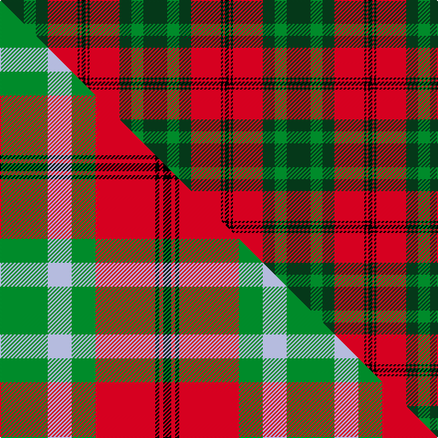

This is one **variant** — a specific cloth: this exact thread count and colourway, with its own
provenance below. It is one weaving of the [sett](/setts/dg12g6dg6r15k1r1k2/) (the scale-free proportion — the
same cloth at any scale or shade), whose colour order is pattern [GGGRKRK](/stripes/gggrkrk/).

Part of the [Cook](/tartans/c/co/cook/) tartan — the named design grouping this sett with its other cloths.

Sourced from tartans-authority.  It is a [7 stripe tartan](/stripes/stripes7/).

Original link [https://www.tartanregister.gov.uk/tartanDetails.aspx?ref=3403](https://www.tartanregister.gov.uk/tartanDetails.aspx?ref=3403)

2 attestations — the source records this cloth was collapsed from (oldest owns this page)

<ul>
<li>pre 2002 — Cook (Name) (tartans-authority, <a href="https://www.tartanregister.gov.uk/tartanDetails.aspx?ref=3403">record</a>)  <em>Designed by Richard Cook, Tustin, California as a general tartan for all Cooks and MacCooks especially those originating from Islay, Arran and Kintyre. Without agreement from the 'head of the Cook family' this tartan remains a personal tartan rather than a clan/family one but this does not prevent any of the above-mentioned Cooks from wearing it.</em></li>
<li>undated — Cook (register-of-tartans, <a href="https://www.tartanregister.gov.uk/tartanDetails.aspx?ref=5151">record</a>)  <em>Designed by Richard Cook, Tustin, California as a general tartan for all Cooks and MacCooks especially those originating from Islay, Arran and Kintyre. See also Cook by Peter MacDonald. Without agreement from the 'head of the Cook family' this tartan remains a personal tartan rather than a clan/family one but this does not prevent any of the above-mentioned Cooks from wearing it.</em></li>
</ul>

Dataset <small>— provenance for this record, inherited from the source manifest</small>

<dl class="dataset-prov">
<dt>source</dt><dd><a href="/sources/tartans-authority/">Scottish Tartans Authority</a></dd>
<dt>data captured from</dt><dd><a href="https://github.com/thetartan/tartan-database/blob/master/data/tartans-authority/data.csv">https://github.com/thetartan/tartan-database/blob/master/data/tartans-authority/data.csv</a></dd>
<dt>data date</dt><dd>pre 2002 <small>(this record)</small></dd>
<dt>licence</dt><dd><a href="https://creativecommons.org/licenses/by-nc-nd/4.0/">CC BY-NC-ND 4.0</a></dd>
</dl>

Capture chain <small>— the hands this data passed through, oldest first; each capture carries its own licence</small>

<ol class="capture-chain">
<li><a href="https://www.tartansauthority.com/">Scottish Tartans Authority</a> <small>the heritage body's archive — its tartan-ferret record browser is retired (links repaired to the SRT, above)</small></li>
<li><a href="https://github.com/thetartan/tartan-database">thetartan/tartan-database</a> <small>2016-2017</small> · <a href="https://creativecommons.org/licenses/by-nc-nd/4.0/">CC BY-NC-ND 4.0</a> <small>Levko Kravets's frozen compilation — the capture we vendored, and where its CC licence text came from</small></li>
<li>this dictionary <small>captured 2026-06-10 · commit 5bf86c7566</small> <small>each re-capture is a git commit to data/sources</small></li>
</ol>

## Register references

External register numbers recorded for this tartan.

- Scottish Register of Tartans: [5151](https://www.tartanregister.gov.uk/tartanDetails.aspx?ref=5151)
- Scottish Tartans Authority (ITI): 3403

## Thread count
DG/24 G12 DG12 R30 K2 R2 K/4

One full sett is **144 threads**.

## Palette
<table><thead><tr><th>Colour</th><th>Shade</th><th>OKLCh</th></tr></thead><tbody><tr><td>G</td><td><code style="background-color:#008B2A;">#008B2A</code> <small style="color:#888">#008B2A</small></td><td><small style="color:#888">oklch(55.4% 0.170 145.9)</small></td></tr><tr><td>DG</td><td><code style="background-color:#053819;">#053819</code> <small style="color:#888">#053819</small></td><td><small style="color:#888">oklch(30.0% 0.075 151.3)</small></td></tr><tr><td>K</td><td><code style="background-color:#000000;">#000000</code> <small style="color:#888">#000000</small></td><td><small style="color:#888">oklch(0.0% 0.000 0.0)</small></td></tr><tr><td>R</td><td><code style="background-color:#D60020;">#D60020</code> <small style="color:#888">#D60020</small></td><td><small style="color:#888">oklch(55.2% 0.224 25.5)</small></td></tr></tbody></table>

# Sample pattern

## Compared to the master

This cloth is one sett of its design; the master sett (the exemplar the design is anchored on) is below for comparison.

Its **ΔTartan distance** from the master is **0.43** — the same measure the nearest-tartans table ranks by (0 is identical; a re-scale of the same cloth is near 0, a recolour or a different proportion further).

<figure class="master-compare" style="margin:0">

this sett
master sett ★

<figcaption style="color:#888;font-size:smaller">One weave of this sett against the <a href="/setts/g12lb6g6r15k1r1k2/">master sett ★</a>, split on the diagonal: a shared proportion runs seamlessly across it with only the shades shifting; a different proportion breaks on it.</figcaption>
</figure>

## Nearest tartan variants

The nearest existing variants by ΔTartan distance, with this cloth at the top so the swatches line up against it.

ΔTartan

Threads

Variant

Sett

—

144

<a href="/variants/s7/dg12g6dg6r15k1r1k2~x2/">Cook (Name)</a>

<a href="/ttd/edit/#slug=g12lb6g6r15k1r1k2~x4&amp;base=dg12g6dg6r15k1r1k2~x2" title="compare in the TTD">0.43</a>

288

<a href="/variants/s7/g12lb6g6r15k1r1k2~x4/">McCook/Cook (Name)</a>

<a href="/ttd/edit/#slug=g12lb6g6r15k1r1k2~x2&amp;base=dg12g6dg6r15k1r1k2~x2" title="compare in the TTD">0.43</a>

144

<a href="/variants/s7/g12lb6g6r15k1r1k2~x2/">(2) Cook</a>

<a href="/ttd/edit/#slug=g28db3g3k10r2k10r20y4~x2&amp;base=dg12g6dg6r15k1r1k2~x2" title="compare in the TTD">1.26</a>

256

<a href="/variants/s8/g28db3g3k10r2k10r20y4~x2/">Garvock (2015)</a>

<a href="/ttd/edit/#slug=dr8g2dr12k6dr3db3g24k2~x2&amp;base=dg12g6dg6r15k1r1k2~x2" title="compare in the TTD">2.07</a>

220

<a href="/variants/s8/dr8g2dr12k6dr3db3g24k2~x2/">McInery (Personal)</a>

<a href="/ttd/edit/#slug=dg8o2dg12k6dg3db6o24k4~x2~dg1806142-o2208036&amp;base=dg12g6dg6r15k1r1k2~x2" title="compare in the TTD">2.10</a>

236

<a href="/variants/s8/dg8o2dg12k6dg3db6o24k4~x2~dg1806142-o2208036/">Dickie</a>

<a href="/ttd/edit/#slug=k2r7k6g12y1g1k2~x4&amp;base=dg12g6dg6r15k1r1k2~x2" title="compare in the TTD">2.15</a>

232

<a href="/variants/s7/k2r7k6g12y1g1k2~x4/">Blackstock Hunting Family Tartan</a>

<a href="/ttd/edit/#slug=lo2dg7k6r11k1r1lo2~x4~r1908029&amp;base=dg12g6dg6r15k1r1k2~x2" title="compare in the TTD">2.23</a>

224

<a href="/variants/s7/lo2dg7k6r11k1r1lo2~x4~r1908029/">Blackstock Red (Dress)</a>

<a href="/ttd/edit/#slug=k3dr8k3dr8lo19dr7dt36dr3~x2&amp;base=dg12g6dg6r15k1r1k2~x2" title="compare in the TTD">2.25</a>

336

<a href="/variants/s8/k3dr8k3dr8lo19dr7dt36dr3~x2/">Private SA Club</a>

<a href="/ttd/edit/#slug=lo2dg7k6r11k1r1lo2~x4&amp;base=dg12g6dg6r15k1r1k2~x2" title="compare in the TTD">2.25</a>

224

<a href="/variants/s7/lo2dg7k6r11k1r1lo2~x4/">Blackstock, Red Dress (Clan)</a>

<a href="/ttd/edit/#slug=y2g7k6r12k1r1y2~x4&amp;base=dg12g6dg6r15k1r1k2~x2" title="compare in the TTD">2.26</a>

232

<a href="/variants/s7/y2g7k6r12k1r1y2~x4/">Blackstock Dress Family Tartan</a>

## Neighbour map

Every grey dot is one of 13621 variants placed by the first two principal components of the ΔTartan feature space (42% of its variance). Red is this tartan; blue dots are its nearest — click one to open its page.

<svg viewBox="0 0 640 380" role="img" style="max-width:100%;height:auto;border:1px solid #e0e0e0;border-radius:4px;display:block" xmlns="http://www.w3.org/2000/svg"><image href="/nn/cloud.v1.png" width="640" height="380"/><a href="/variants/s7/g12lb6g6r15k1r1k2~x4/"><circle cx="210.3" cy="174.1" r="4" fill="#3465a4"><title>McCook/Cook (Name)</title></circle></a><a href="/variants/s7/g12lb6g6r15k1r1k2~x2/"><circle cx="210.3" cy="174.1" r="4" fill="#3465a4"><title>(2) Cook</title></circle></a><a href="/variants/s8/g28db3g3k10r2k10r20y4~x2/"><circle cx="147.0" cy="148.4" r="4" fill="#3465a4"><title>Garvock (2015)</title></circle></a><a href="/variants/s8/dr8g2dr12k6dr3db3g24k2~x2/"><circle cx="227.3" cy="176.6" r="4" fill="#3465a4"><title>McInery (Personal)</title></circle></a><a href="/variants/s8/dg8o2dg12k6dg3db6o24k4~x2~dg1806142-o2208036/"><circle cx="191.6" cy="177.8" r="4" fill="#3465a4"><title>Dickie</title></circle></a><a href="/variants/s7/k2r7k6g12y1g1k2~x4/"><circle cx="175.4" cy="171.4" r="4" fill="#3465a4"><title>Blackstock Hunting Family Tartan</title></circle></a><a href="/variants/s7/lo2dg7k6r11k1r1lo2~x4~r1908029/"><circle cx="168.5" cy="176.2" r="4" fill="#3465a4"><title>Blackstock Red (Dress)</title></circle></a><a href="/variants/s8/k3dr8k3dr8lo19dr7dt36dr3~x2/"><circle cx="210.5" cy="169.0" r="4" fill="#3465a4"><title>Private SA Club</title></circle></a><a href="/variants/s7/lo2dg7k6r11k1r1lo2~x4/"><circle cx="162.4" cy="173.0" r="4" fill="#3465a4"><title>Blackstock, Red Dress (Clan)</title></circle></a><a href="/variants/s7/y2g7k6r12k1r1y2~x4/"><circle cx="179.5" cy="170.5" r="4" fill="#3465a4"><title>Blackstock Dress Family Tartan</title></circle></a><circle cx="222.5" cy="175.2" r="5" fill="#c00000"/><text x="320" y="376" text-anchor="middle" font-size="11" fill="#999">ground</text><text x="11" y="190" text-anchor="middle" font-size="11" fill="#999" transform="rotate(-90 11 190)">complexity</text></svg>

ID: /variants/s7/dg12g6dg6r15k1r1k2~x2/
