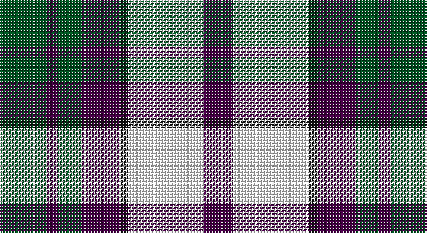

This page is one **sett** — a single exact thread-count. It belongs to the [tartan](/setts/dg16dp4dg8dp13k3w26dp10/)
(the same proportion at any scale), whose colour order is pattern [BWKBGBG](/stripes/bwkbgbg/).

Sourced from register-of-tartans.  It is a [7 stripe tartan](/stripes/stripes7/).

Original link https://www.tartanregister.gov.uk/tartanDetails.aspx?ref=11654

## Register references

External register numbers recorded for this tartan.

- Scottish Register of Tartans: [11654](https://www.tartanregister.gov.uk/tartanDetails.aspx?ref=11654)

## Thread count
G/32 DP8 G16 DP26 K6 W52 DP/20

One full sett is **268 threads**.

## Palette

Palette: <strong>Tartan Register</strong>
<table><thead><tr><th>Colour</th><th>Threads</th><th>Shade</th><th>Base</th><th>OKLCh</th></tr></thead><tbody><tr><td>G/</td><td style="text-align:right;font-variant-numeric:tabular-nums">32</td><td><code style="background-color:#005020;">#005020</code> <small style="color:#888">#005020</small></td><td>G <code style="background-color:#006100;">#006100</code></td><td><small style="color:#888">oklch(37.7% 0.105 149.6)</small></td></tr><tr><td>DP</td><td style="text-align:right;font-variant-numeric:tabular-nums">8</td><td><code style="background-color:#440044;">#440044</code> <small style="color:#888">#440044</small></td><td>B <code style="background-color:#2A418A;">#2A418A</code></td><td><small style="color:#888">oklch(27.1% 0.125 328.4)</small></td></tr><tr><td>G</td><td style="text-align:right;font-variant-numeric:tabular-nums">16</td><td><code style="background-color:#005020;">#005020</code> <small style="color:#888">#005020</small></td><td>G <code style="background-color:#006100;">#006100</code></td><td><small style="color:#888">oklch(37.7% 0.105 149.6)</small></td></tr><tr><td>DP</td><td style="text-align:right;font-variant-numeric:tabular-nums">26</td><td><code style="background-color:#440044;">#440044</code> <small style="color:#888">#440044</small></td><td>B <code style="background-color:#2A418A;">#2A418A</code></td><td><small style="color:#888">oklch(27.1% 0.125 328.4)</small></td></tr><tr><td>K</td><td style="text-align:right;font-variant-numeric:tabular-nums">6</td><td><code style="background-color:#101010;">#101010</code> <small style="color:#888">#101010</small></td><td>K <code style="background-color:#000000;">#000000</code></td><td><small style="color:#888">oklch(17.3% 0.000 89.9)</small></td></tr><tr><td>W</td><td style="text-align:right;font-variant-numeric:tabular-nums">52</td><td><code style="background-color:#FFFFFF;">#FFFFFF</code> <small style="color:#888">#FFFFFF</small></td><td>W <code style="background-color:#F7F7F7;">#F7F7F7</code></td><td><small style="color:#888">oklch(100.0% 0.000 89.9)</small></td></tr><tr><td>DP/</td><td style="text-align:right;font-variant-numeric:tabular-nums">20</td><td><code style="background-color:#440044;">#440044</code> <small style="color:#888">#440044</small></td><td>B <code style="background-color:#2A418A;">#2A418A</code></td><td><small style="color:#888">oklch(27.1% 0.125 328.4)</small></td></tr></tbody></table>

# Sample pattern

## Nearest tartans

The nearest existing variants by ΔTartan distance, with this tartan at the top so the swatches line up against it.

ΔTartan

Tartan

Sett

—

<a href="/ttd/edit/#slug=dg16dp4dg8dp13k3w26dp10~x2">Because You Care</a> <a class="nn-out" href="/variants/s7/dg16dp4dg8dp13k3w26dp10~x2/" title="open its dictionary page">↗</a>

0.87

<a href="/ttd/edit/#slug=g7k1m7k1w7k10w7k2w4~x2&amp;base=dg16dp4dg8dp13k3w26dp10~x2">Borthwick Dress Artifact Tartan</a> <a class="nn-out" href="/variants/s9/g7k1m7k1w7k10w7k2w4~x2/" title="open its dictionary page">↗</a>

0.90

<a href="/ttd/edit/#slug=w8k2y12k11w1r6y4~x2&amp;base=dg16dp4dg8dp13k3w26dp10~x2">Unidentified</a> <a class="nn-out" href="/variants/s7/w8k2y12k11w1r6y4~x2/" title="open its dictionary page">↗</a>

0.93

<a href="/ttd/edit/#slug=g7k1r8k2w7k10w7k2w4~x4&amp;base=dg16dp4dg8dp13k3w26dp10~x2">Borthwick Dress (Clan)</a> <a class="nn-out" href="/variants/s9/g7k1r8k2w7k10w7k2w4~x4/" title="open its dictionary page">↗</a>

0.98

<a href="/ttd/edit/#slug=r2o20k5w10k10r2~x2&amp;base=dg16dp4dg8dp13k3w26dp10~x2">Thompson Grey Family Tartan</a> <a class="nn-out" href="/variants/s6/r2o20k5w10k10r2~x2/" title="open its dictionary page">↗</a>

1.02

<a href="/ttd/edit/#slug=g12k2r12k3w7k16w7k3w6~x2&amp;base=dg16dp4dg8dp13k3w26dp10~x2">Borthwick Dress</a> <a class="nn-out" href="/variants/s9/g12k2r12k3w7k16w7k3w6~x2/" title="open its dictionary page">↗</a>

1.03

<a href="/ttd/edit/#slug=g7k1r7k1w7k10w7k2w4~x2&amp;base=dg16dp4dg8dp13k3w26dp10~x2">Borthwick, dress</a> <a class="nn-out" href="/variants/s9/g7k1r7k1w7k10w7k2w4~x2/" title="open its dictionary page">↗</a>

1.04

<a href="/ttd/edit/#slug=r6k14r6dg14w27k4&amp;base=dg16dp4dg8dp13k3w26dp10~x2">Fraser Dress</a> <a class="nn-out" href="/variants/s6/r6k14r6dg14w27k4/" title="open its dictionary page">↗</a>

1.04

<a href="/ttd/edit/#slug=dt8w22dt5w4k24r6k2r6~x2&amp;base=dg16dp4dg8dp13k3w26dp10~x2">Unidentified (ex Tony Murray)</a> <a class="nn-out" href="/variants/s8/dt8w22dt5w4k24r6k2r6~x2/" title="open its dictionary page">↗</a>

1.04

<a href="/ttd/edit/#slug=r2y20k5w10k10r2~x2&amp;base=dg16dp4dg8dp13k3w26dp10~x2">Thom(p)son, Grey</a> <a class="nn-out" href="/variants/s6/r2y20k5w10k10r2~x2/" title="open its dictionary page">↗</a>

1.04

<a href="/ttd/edit/#slug=k4ly2k13ly1w8o13ly2o4~x2&amp;base=dg16dp4dg8dp13k3w26dp10~x2">Bannockbane Grey #1</a> <a class="nn-out" href="/variants/s8/k4ly2k13ly1w8o13ly2o4~x2/" title="open its dictionary page">↗</a>

## Neighbour map

Every grey dot is one of 14360 variants placed by the first two principal components of the ΔTartan feature space (44% of its variance). Red is this tartan; blue dots are its nearest — click one to open its page.

<svg viewBox="0 0 640 380" role="img" style="max-width:100%;height:auto;border:1px solid #e0e0e0;border-radius:4px;display:block" xmlns="http://www.w3.org/2000/svg"><image href="/nn/cloud.v1.png" width="640" height="380"/><a href="/variants/s9/g7k1m7k1w7k10w7k2w4~x2/"><circle cx="126.7" cy="188.0" r="4" fill="#3465a4"><title>Borthwick Dress Artifact Tartan</title></circle></a><a href="/variants/s7/w8k2y12k11w1r6y4~x2/"><circle cx="142.9" cy="194.3" r="4" fill="#3465a4"><title>Unidentified</title></circle></a><a href="/variants/s9/g7k1r8k2w7k10w7k2w4~x4/"><circle cx="110.4" cy="188.7" r="4" fill="#3465a4"><title>Borthwick Dress (Clan)</title></circle></a><a href="/variants/s6/r2o20k5w10k10r2~x2/"><circle cx="173.9" cy="193.4" r="4" fill="#3465a4"><title>Thompson Grey Family Tartan</title></circle></a><a href="/variants/s9/g12k2r12k3w7k16w7k3w6~x2/"><circle cx="99.0" cy="196.0" r="4" fill="#3465a4"><title>Borthwick Dress</title></circle></a><a href="/variants/s9/g7k1r7k1w7k10w7k2w4~x2/"><circle cx="120.8" cy="188.2" r="4" fill="#3465a4"><title>Borthwick, dress</title></circle></a><a href="/variants/s6/r6k14r6dg14w27k4/"><circle cx="119.7" cy="209.0" r="4" fill="#3465a4"><title>Fraser Dress</title></circle></a><a href="/variants/s8/dt8w22dt5w4k24r6k2r6~x2/"><circle cx="139.6" cy="165.6" r="4" fill="#3465a4"><title>Unidentified (ex Tony Murray)</title></circle></a><a href="/variants/s6/r2y20k5w10k10r2~x2/"><circle cx="164.2" cy="191.7" r="4" fill="#3465a4"><title>Thom(p)son, Grey</title></circle></a><a href="/variants/s8/k4ly2k13ly1w8o13ly2o4~x2/"><circle cx="151.5" cy="167.9" r="4" fill="#3465a4"><title>Bannockbane Grey #1</title></circle></a><circle cx="119.3" cy="199.8" r="5" fill="#c00000"/></svg>

ID: /variants/s7/dg16dp4dg8dp13k3w26dp10~x2/
