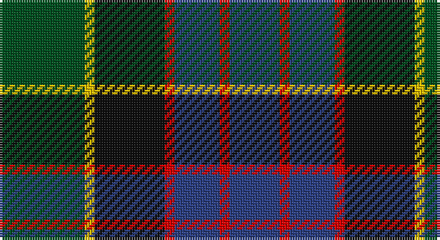

This page is one **sett** — a single exact thread-count. It belongs to the [tartan](/setts/dg17ly2k14r2db9r2db10/)
(the same proportion at any scale), whose colour order is pattern [BRBRKYG](/stripes/brbrkyg/).

Part of the [MacDonald](/tartans/macdonald/) tartan — the named design grouping this sett with its other cloths.

Sourced from register-of-tartans.  It is a [7 stripe tartan](/stripes/stripes7/).

Original link https://www.tartanregister.gov.uk/tartanDetails.aspx?ref=2342

## Also known as

This cloth is also recorded under:

- MacDonald #2
- MacDonald #3
- MacDonald #4
- MacDonald #5
- MacDonald #6
- MacDonald #8
- MacDonald,

## Register references

External register numbers recorded for this tartan.

- Scottish Register of Tartans: [2342](https://www.tartanregister.gov.uk/tartanDetails.aspx?ref=2342)
- Scottish Tartans World Register: 437

## Thread count
G/34 Y4 K28 R4 B18 R4 B/20

One full sett is **170 threads**.

## Palette

Palette: <strong>Tartan Register</strong>
<table><thead><tr><th>Colour</th><th>Threads</th><th>Shade</th><th>Base</th><th>OKLCh</th></tr></thead><tbody><tr><td>G/</td><td style="text-align:right;font-variant-numeric:tabular-nums">34</td><td><code style="background-color:#005020;">#005020</code> <small style="color:#888">#005020</small></td><td>G <code style="background-color:#006100;">#006100</code></td><td><small style="color:#888">oklch(37.7% 0.105 149.6)</small></td></tr><tr><td>Y</td><td style="text-align:right;font-variant-numeric:tabular-nums">4</td><td><code style="background-color:#E8C000;">#E8C000</code> <small style="color:#888">#E8C000</small></td><td>Y <code style="background-color:#F2BF00;">#F2BF00</code></td><td><small style="color:#888">oklch(81.9% 0.168 93.7)</small></td></tr><tr><td>K</td><td style="text-align:right;font-variant-numeric:tabular-nums">28</td><td><code style="background-color:#101010;">#101010</code> <small style="color:#888">#101010</small></td><td>K <code style="background-color:#000000;">#000000</code></td><td><small style="color:#888">oklch(17.3% 0.000 89.9)</small></td></tr><tr><td>R</td><td style="text-align:right;font-variant-numeric:tabular-nums">4</td><td><code style="background-color:#DC0000;">#DC0000</code> <small style="color:#888">#DC0000</small></td><td>R <code style="background-color:#CC0000;">#CC0000</code></td><td><small style="color:#888">oklch(56.2% 0.230 29.2)</small></td></tr><tr><td>B</td><td style="text-align:right;font-variant-numeric:tabular-nums">18</td><td><code style="background-color:#2C4084;">#2C4084</code> <small style="color:#888">#2C4084</small></td><td>B <code style="background-color:#2A418A;">#2A418A</code></td><td><small style="color:#888">oklch(39.4% 0.117 268.3)</small></td></tr><tr><td>R</td><td style="text-align:right;font-variant-numeric:tabular-nums">4</td><td><code style="background-color:#DC0000;">#DC0000</code> <small style="color:#888">#DC0000</small></td><td>R <code style="background-color:#CC0000;">#CC0000</code></td><td><small style="color:#888">oklch(56.2% 0.230 29.2)</small></td></tr><tr><td>B/</td><td style="text-align:right;font-variant-numeric:tabular-nums">20</td><td><code style="background-color:#2C4084;">#2C4084</code> <small style="color:#888">#2C4084</small></td><td>B <code style="background-color:#2A418A;">#2A418A</code></td><td><small style="color:#888">oklch(39.4% 0.117 268.3)</small></td></tr></tbody></table>

# Sample pattern

## Compared to the master

This cloth is one sett of its design; the master sett (the exemplar the design is anchored on) is below for comparison.

<figure style="margin:0"><figcaption style="color:#888;font-size:smaller">this sett</figcaption></figure>
<figure style="margin:0"><figcaption style="color:#888;font-size:smaller"><a href="/setts/db17r2db2r5db29r2k31g29r5g2r2g17/">master sett →</a></figcaption></figure>

## Nearest tartans

The nearest existing variants by ΔTartan distance, with this tartan at the top so the swatches line up against it.

ΔTartan

Tartan

Sett

—

<a href="/ttd/edit/#slug=dg17ly2k14r2db9r2db10~x2">MacDonald (Flora.. )</a> <a class="nn-out" href="/variants/s7/dg17ly2k14r2db9r2db10~x2/" title="open its dictionary page">↗</a>

0.34

<a href="/ttd/edit/#slug=r2k1db8k8g8k1t2~x2&amp;base=dg17ly2k14r2db9r2db10~x2">Argyll</a> <a class="nn-out" href="/variants/s7/r2k1db8k8g8k1t2~x2/" title="open its dictionary page">↗</a>

0.34

<a href="/ttd/edit/#slug=r2k1db8k8g8k1t2~x4&amp;base=dg17ly2k14r2db9r2db10~x2">Campbell of Cawdor</a> <a class="nn-out" href="/variants/s7/r2k1db8k8g8k1t2~x4/" title="open its dictionary page">↗</a>

0.36

<a href="/ttd/edit/#slug=r2k1db8k8g8k1y2~x2&amp;base=dg17ly2k14r2db9r2db10~x2">Campbell of Cawdor Clan Tartan</a> <a class="nn-out" href="/variants/s7/r2k1db8k8g8k1y2~x2/" title="open its dictionary page">↗</a>

0.45

<a href="/ttd/edit/#slug=r4dg16k16db4dg3db12lo2~x2&amp;base=dg17ly2k14r2db9r2db10~x2">Junior Chamber International (Corp)</a> <a class="nn-out" href="/variants/s7/r4dg16k16db4dg3db12lo2~x2/" title="open its dictionary page">↗</a>

0.55

<a href="/ttd/edit/#slug=db20k6o4db3k16g20w2~x2&amp;base=dg17ly2k14r2db9r2db10~x2">Deloughery, Paul</a> <a class="nn-out" href="/variants/s7/db20k6o4db3k16g20w2~x2/" title="open its dictionary page">↗</a>

0.62

<a href="/ttd/edit/#slug=g11t3g5r3g5k22db22k5~x2&amp;base=dg17ly2k14r2db9r2db10~x2">Wood (Personal)</a> <a class="nn-out" href="/variants/s8/g11t3g5r3g5k22db22k5~x2/" title="open its dictionary page">↗</a>

0.65

<a href="/ttd/edit/#slug=k1g8w1k8db8r1~x4&amp;base=dg17ly2k14r2db9r2db10~x2">Leslie Hunting</a> <a class="nn-out" href="/variants/s6/k1g8w1k8db8r1~x4/" title="open its dictionary page">↗</a>

0.65

<a href="/ttd/edit/#slug=t4g14ly2k14db14k2db3~x2&amp;base=dg17ly2k14r2db9r2db10~x2">Hogarth of Firhill (Clan)</a> <a class="nn-out" href="/variants/s7/t4g14ly2k14db14k2db3~x2/" title="open its dictionary page">↗</a>

0.67

<a href="/ttd/edit/#slug=r5g19w3k19db19k3db2~x2&amp;base=dg17ly2k14r2db9r2db10~x2">Fruin Colquhoun (Commemorative?)</a> <a class="nn-out" href="/variants/s7/r5g19w3k19db19k3db2~x2/" title="open its dictionary page">↗</a>

0.69

<a href="/ttd/edit/#slug=db1r1db6k6dg6w1~x2&amp;base=dg17ly2k14r2db9r2db10~x2">Wellington</a> <a class="nn-out" href="/variants/s6/db1r1db6k6dg6w1~x2/" title="open its dictionary page">↗</a>

## Neighbour map

Every grey dot is one of 14360 variants placed by the first two principal components of the ΔTartan feature space (44% of its variance). Red is this tartan; blue dots are its nearest — click one to open its page.

<svg viewBox="0 0 640 380" role="img" style="max-width:100%;height:auto;border:1px solid #e0e0e0;border-radius:4px;display:block" xmlns="http://www.w3.org/2000/svg"><image href="/nn/cloud.v1.png" width="640" height="380"/><a href="/variants/s7/r2k1db8k8g8k1t2~x2/"><circle cx="151.0" cy="217.9" r="4" fill="#3465a4"><title>Argyll</title></circle></a><a href="/variants/s7/r2k1db8k8g8k1t2~x4/"><circle cx="151.0" cy="217.9" r="4" fill="#3465a4"><title>Campbell of Cawdor</title></circle></a><a href="/variants/s7/r2k1db8k8g8k1y2~x2/"><circle cx="149.5" cy="216.9" r="4" fill="#3465a4"><title>Campbell of Cawdor Clan Tartan</title></circle></a><a href="/variants/s7/r4dg16k16db4dg3db12lo2~x2/"><circle cx="161.7" cy="228.1" r="4" fill="#3465a4"><title>Junior Chamber International (Corp)</title></circle></a><a href="/variants/s7/db20k6o4db3k16g20w2~x2/"><circle cx="167.3" cy="216.9" r="4" fill="#3465a4"><title>Deloughery, Paul</title></circle></a><a href="/variants/s8/g11t3g5r3g5k22db22k5~x2/"><circle cx="172.5" cy="217.9" r="4" fill="#3465a4"><title>Wood (Personal)</title></circle></a><a href="/variants/s6/k1g8w1k8db8r1~x4/"><circle cx="160.6" cy="222.5" r="4" fill="#3465a4"><title>Leslie Hunting</title></circle></a><a href="/variants/s7/t4g14ly2k14db14k2db3~x2/"><circle cx="134.9" cy="222.1" r="4" fill="#3465a4"><title>Hogarth of Firhill (Clan)</title></circle></a><a href="/variants/s7/r5g19w3k19db19k3db2~x2/"><circle cx="148.1" cy="204.2" r="4" fill="#3465a4"><title>Fruin Colquhoun (Commemorative?)</title></circle></a><a href="/variants/s6/db1r1db6k6dg6w1~x2/"><circle cx="142.2" cy="237.6" r="4" fill="#3465a4"><title>Wellington</title></circle></a><circle cx="160.9" cy="221.6" r="5" fill="#c00000"/></svg>

ID: /variants/s7/dg17ly2k14r2db9r2db10~x2/
