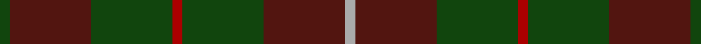
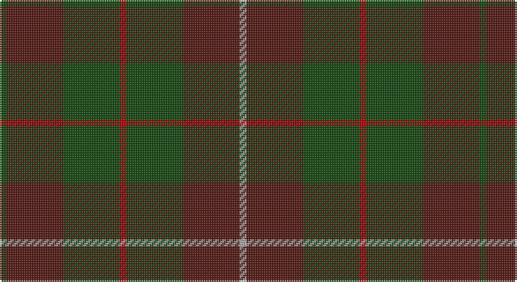

This page is one **sett** — a single exact thread-count. It belongs to the [tartan](/setts/dg1dr8dg8r1dg8dr8lr1/)
(the same proportion at any scale), whose colour order is pattern [GBGRGBY](/stripes/gbgrgby/).

Part of the [MacKinnon Hunting](/tartans/mackinnon-hunting/) tartan — the named design grouping this sett with its other cloths.

Sourced from weddslist.  It is a [7 stripe tartan](/stripes/stripes7/).

Original link http://www.weddslist.com/cgi-bin/tartans/pg.pl?source=tinsel

## Also known as

This cloth is also recorded under:

- MacKinnon Htg
- MacKinnon Hunting #2
- MacKinnon Hunting #3
- MacKinnon, hunting

## Thread count
DG/4 DRa32 DG32 DR4 DG32 DRa32 N/4

One full sett is **272 threads**.

## Palette

Palette: <strong>custom</strong>
<table><thead><tr><th>Colour</th><th>Threads</th><th>Shade</th><th>Base</th><th>OKLCh</th></tr></thead><tbody><tr><td>DG/</td><td style="text-align:right;font-variant-numeric:tabular-nums">4</td><td><code style="background-color:#11450D;">#11450D</code> <small style="color:#888">#11450D</small></td><td>G <code style="background-color:#006100;">#006100</code></td><td><small style="color:#888">oklch(34.4% 0.101 142.1)</small></td></tr><tr><td>DRa</td><td style="text-align:right;font-variant-numeric:tabular-nums">32</td><td><code style="background-color:#521510;">#521510</code> <small style="color:#888">#521510</small></td><td>B <code style="background-color:#2A418A;">#2A418A</code></td><td><small style="color:#888">oklch(29.8% 0.092 28.5)</small></td></tr><tr><td>DG</td><td style="text-align:right;font-variant-numeric:tabular-nums">32</td><td><code style="background-color:#11450D;">#11450D</code> <small style="color:#888">#11450D</small></td><td>G <code style="background-color:#006100;">#006100</code></td><td><small style="color:#888">oklch(34.4% 0.101 142.1)</small></td></tr><tr><td>DR</td><td style="text-align:right;font-variant-numeric:tabular-nums">4</td><td><code style="background-color:#AA0000;">#AA0000</code> <small style="color:#888">#AA0000</small></td><td>R <code style="background-color:#CC0000;">#CC0000</code></td><td><small style="color:#888">oklch(46.3% 0.190 29.2)</small></td></tr><tr><td>DG</td><td style="text-align:right;font-variant-numeric:tabular-nums">32</td><td><code style="background-color:#11450D;">#11450D</code> <small style="color:#888">#11450D</small></td><td>G <code style="background-color:#006100;">#006100</code></td><td><small style="color:#888">oklch(34.4% 0.101 142.1)</small></td></tr><tr><td>DRa</td><td style="text-align:right;font-variant-numeric:tabular-nums">32</td><td><code style="background-color:#521510;">#521510</code> <small style="color:#888">#521510</small></td><td>B <code style="background-color:#2A418A;">#2A418A</code></td><td><small style="color:#888">oklch(29.8% 0.092 28.5)</small></td></tr><tr><td>N/</td><td style="text-align:right;font-variant-numeric:tabular-nums">4</td><td><code style="background-color:#AAAAAA;">#AAAAAA</code> <small style="color:#888">#AAAAAA</small></td><td>Y <code style="background-color:#F2BF00;">#F2BF00</code></td><td><small style="color:#888">oklch(73.8% 0.000 89.9)</small></td></tr></tbody></table>

# Sample pattern

## Nearest tartans

The nearest existing variants by ΔTartan distance, with this tartan at the top so the swatches line up against it.

ΔTartan

Tartan

Sett

—

<a href="/ttd/edit/#slug=dg1dr8dg8r1dg8dr8lr1~x4">MacKinnon Hunting</a> <a class="nn-out" href="/variants/s7/dg1dr8dg8r1dg8dr8lr1~x4/" title="open its dictionary page">↗</a>

0.00

<a href="/ttd/edit/#slug=dg1dr8dg8r1dg8dr8lr1~x2&amp;base=dg1dr8dg8r1dg8dr8lr1~x4">MacKinnon Hunting</a> <a class="nn-out" href="/variants/s7/dg1dr8dg8r1dg8dr8lr1~x2/" title="open its dictionary page">↗</a>

1.44

<a href="/ttd/edit/#slug=db1dy9dg5dy1k5dy1dg5dy9w1~x2&amp;base=dg1dr8dg8r1dg8dr8lr1~x4">Duchess of York</a> <a class="nn-out" href="/variants/s9/db1dy9dg5dy1k5dy1dg5dy9w1~x2/" title="open its dictionary page">↗</a>

1.45

<a href="/ttd/edit/#slug=g1dy8g8r1g8dy8w1~x2&amp;base=dg1dr8dg8r1dg8dr8lr1~x4">MacKinnon Hunting Clan Tartan</a> <a class="nn-out" href="/variants/s7/g1dy8g8r1g8dy8w1~x2/" title="open its dictionary page">↗</a>

1.53

<a href="/ttd/edit/#slug=k1dy4dg1k1dg1k1dy1~x10&amp;base=dg1dr8dg8r1dg8dr8lr1~x4">McCanna NW Htg (Personal)</a> <a class="nn-out" href="/variants/s7/k1dy4dg1k1dg1k1dy1~x10/" title="open its dictionary page">↗</a>

1.55

<a href="/ttd/edit/#slug=dg15r3n11b2~x2&amp;base=dg1dr8dg8r1dg8dr8lr1~x4">MacNab WI 2</a> <a class="nn-out" href="/variants/s4/dg15r3n11b2~x2/" title="open its dictionary page">↗</a>

1.55

<a href="/ttd/edit/#slug=dg15r3n11b2&amp;base=dg1dr8dg8r1dg8dr8lr1~x4">MacNab WI2</a> <a class="nn-out" href="/variants/s4/dg15r3n11b2/" title="open its dictionary page">↗</a>

1.58

<a href="/ttd/edit/#slug=r2dy15dg12dy2dt12dy2dg12dy15o2~x4&amp;base=dg1dr8dg8r1dg8dr8lr1~x4">Amazing Union (Personal)</a> <a class="nn-out" href="/variants/s9/r2dy15dg12dy2dt12dy2dg12dy15o2~x4/" title="open its dictionary page">↗</a>

1.60

<a href="/ttd/edit/#slug=dg1dy8dg8r1dg8dy8w1~x2&amp;base=dg1dr8dg8r1dg8dr8lr1~x4">MacKinnon Hunting</a> <a class="nn-out" href="/variants/s7/dg1dy8dg8r1dg8dy8w1~x2/" title="open its dictionary page">↗</a>

1.65

<a href="/ttd/edit/#slug=k1dy4g1k1g1k1dy1~x14&amp;base=dg1dr8dg8r1dg8dr8lr1~x4">McCanna NW (Olympia, USA) Hunting (Personal)</a> <a class="nn-out" href="/variants/s7/k1dy4g1k1g1k1dy1~x14/" title="open its dictionary page">↗</a>

1.74

<a href="/ttd/edit/#slug=dy11db1dy3dbi1db9r1~x4&amp;base=dg1dr8dg8r1dg8dr8lr1~x4">Dege of Saville Row</a> <a class="nn-out" href="/variants/s6/dy11db1dy3dbi1db9r1~x4/" title="open its dictionary page">↗</a>

## Neighbour map

Every grey dot is one of 14360 variants placed by the first two principal components of the ΔTartan feature space (44% of its variance). Red is this tartan; blue dots are its nearest — click one to open its page.

<svg viewBox="0 0 640 380" role="img" style="max-width:100%;height:auto;border:1px solid #e0e0e0;border-radius:4px;display:block" xmlns="http://www.w3.org/2000/svg"><image href="/nn/cloud.v1.png" width="640" height="380"/><a href="/variants/s7/dg1dr8dg8r1dg8dr8lr1~x2/"><circle cx="361.7" cy="282.6" r="4" fill="#3465a4"><title>MacKinnon Hunting</title></circle></a><a href="/variants/s9/db1dy9dg5dy1k5dy1dg5dy9w1~x2/"><circle cx="327.8" cy="239.6" r="4" fill="#3465a4"><title>Duchess of York</title></circle></a><a href="/variants/s7/g1dy8g8r1g8dy8w1~x2/"><circle cx="353.0" cy="282.1" r="4" fill="#3465a4"><title>MacKinnon Hunting Clan Tartan</title></circle></a><a href="/variants/s7/k1dy4dg1k1dg1k1dy1~x10/"><circle cx="328.7" cy="313.7" r="4" fill="#3465a4"><title>McCanna NW Htg (Personal)</title></circle></a><a href="/variants/s4/dg15r3n11b2~x2/"><circle cx="335.6" cy="300.6" r="4" fill="#3465a4"><title>MacNab WI 2</title></circle></a><a href="/variants/s4/dg15r3n11b2/"><circle cx="335.6" cy="300.6" r="4" fill="#3465a4"><title>MacNab WI2</title></circle></a><a href="/variants/s9/r2dy15dg12dy2dt12dy2dg12dy15o2~x4/"><circle cx="270.8" cy="243.2" r="4" fill="#3465a4"><title>Amazing Union (Personal)</title></circle></a><a href="/variants/s7/dg1dy8dg8r1dg8dy8w1~x2/"><circle cx="371.4" cy="296.3" r="4" fill="#3465a4"><title>MacKinnon Hunting</title></circle></a><a href="/variants/s7/k1dy4g1k1g1k1dy1~x14/"><circle cx="317.5" cy="306.2" r="4" fill="#3465a4"><title>McCanna NW (Olympia, USA) Hunting (Personal)</title></circle></a><a href="/variants/s6/dy11db1dy3dbi1db9r1~x4/"><circle cx="399.4" cy="245.6" r="4" fill="#3465a4"><title>Dege of Saville Row</title></circle></a><circle cx="361.7" cy="282.6" r="5" fill="#c00000"/></svg>

ID: /variants/s7/dg1dr8dg8r1dg8dr8lr1~x4/
