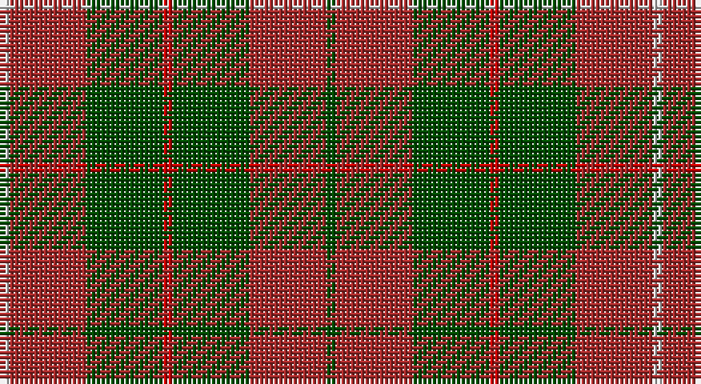

This page is one **sett** — a single exact thread-count. It belongs to the [tartan](/setts/dg1ri8dg8r1dg8ri8lb1/)
(the same proportion at any scale), whose colour order is pattern [GRGRGRW](/stripes/grgrgrw/).

Sourced from weddslist.  It is a [7 stripe tartan](/stripes/stripes7/).

Original link http://www.weddslist.com/cgi-bin/tartans/pg.pl?source=rb

## Thread count
N/2 DR16 G16 R2 G16 DR16 G/2

One full sett is **136 threads**.

## Palette

Palette: <strong>Tartan Register</strong> <small style="color:#888">(2 of 4 colours)</small>
<table><thead><tr><th>Colour</th><th>Threads</th><th>Shade</th><th>Base</th><th>OKLCh</th></tr></thead><tbody><tr><td>N/</td><td style="text-align:right;font-variant-numeric:tabular-nums">2</td><td><code style="background-color:#D0D0D0;">#D0D0D0</code> <small style="color:#888">#D0D0D0</small></td><td>W <code style="background-color:#F7F7F7;">#F7F7F7</code></td><td><small style="color:#888">oklch(85.8% 0.000 89.9)</small></td></tr><tr><td>DR</td><td style="text-align:right;font-variant-numeric:tabular-nums">16</td><td><code style="background-color:#A52A2A;">#A52A2A</code> <small style="color:#888">#A52A2A</small></td><td>R <code style="background-color:#CC0000;">#CC0000</code></td><td><small style="color:#888">oklch(48.1% 0.160 25.6)</small></td></tr><tr><td>G</td><td style="text-align:right;font-variant-numeric:tabular-nums">16</td><td><code style="background-color:#004C00;">#004C00</code> <small style="color:#888">#004C00</small></td><td>G <code style="background-color:#006100;">#006100</code></td><td><small style="color:#888">oklch(36.1% 0.123 142.5)</small></td></tr><tr><td>R</td><td style="text-align:right;font-variant-numeric:tabular-nums">2</td><td><code style="background-color:#C80000;">#C80000</code> <small style="color:#888">#C80000</small></td><td>R <code style="background-color:#CC0000;">#CC0000</code></td><td><small style="color:#888">oklch(52.3% 0.215 29.2)</small></td></tr><tr><td>G</td><td style="text-align:right;font-variant-numeric:tabular-nums">16</td><td><code style="background-color:#004C00;">#004C00</code> <small style="color:#888">#004C00</small></td><td>G <code style="background-color:#006100;">#006100</code></td><td><small style="color:#888">oklch(36.1% 0.123 142.5)</small></td></tr><tr><td>DR</td><td style="text-align:right;font-variant-numeric:tabular-nums">16</td><td><code style="background-color:#A52A2A;">#A52A2A</code> <small style="color:#888">#A52A2A</small></td><td>R <code style="background-color:#CC0000;">#CC0000</code></td><td><small style="color:#888">oklch(48.1% 0.160 25.6)</small></td></tr><tr><td>G/</td><td style="text-align:right;font-variant-numeric:tabular-nums">2</td><td><code style="background-color:#004C00;">#004C00</code> <small style="color:#888">#004C00</small></td><td>G <code style="background-color:#006100;">#006100</code></td><td><small style="color:#888">oklch(36.1% 0.123 142.5)</small></td></tr></tbody></table>

# Sample pattern

## Nearest tartans

The nearest existing variants by ΔTartan distance, with this tartan at the top so the swatches line up against it.

ΔTartan

Tartan

Sett

—

<a href="/ttd/edit/#slug=dg1ri8dg8r1dg8ri8lb1~x2">MacKinnon Hunting</a> <a class="nn-out" href="/variants/s7/dg1ri8dg8r1dg8ri8lb1~x2/" title="open its dictionary page">↗</a>

1.07

<a href="/ttd/edit/#slug=k1r9dg2r2dg4lr1dg4r1~x2&amp;base=dg1ri8dg8r1dg8ri8lb1~x2">Comyn</a> <a class="nn-out" href="/variants/s8/k1r9dg2r2dg4lr1dg4r1~x2/" title="open its dictionary page">↗</a>

1.15

<a href="/ttd/edit/#slug=r5dg12o4db4o22dg3o4r5&amp;base=dg1ri8dg8r1dg8ri8lb1~x2">Invertere, (Daks)</a> <a class="nn-out" href="/variants/s8/r5dg12o4db4o22dg3o4r5/" title="open its dictionary page">↗</a>

1.16

<a href="/ttd/edit/#slug=dg4r2dg13lb2r13dg2r4~x2&amp;base=dg1ri8dg8r1dg8ri8lb1~x2">Crossnor School</a> <a class="nn-out" href="/variants/s7/dg4r2dg13lb2r13dg2r4~x2/" title="open its dictionary page">↗</a>

1.23

<a href="/ttd/edit/#slug=dt5r19dti2y8r3y18dti2y9dti2~x2&amp;base=dg1ri8dg8r1dg8ri8lb1~x2">Hubbard (2016)</a> <a class="nn-out" href="/variants/s9/dt5r19dti2y8r3y18dti2y9dti2~x2/" title="open its dictionary page">↗</a>

1.25

<a href="/ttd/edit/#slug=r30dg18lr3dg18r20lb3g3~x2&amp;base=dg1ri8dg8r1dg8ri8lb1~x2">Tartan for London, A (Fashion)</a> <a class="nn-out" href="/variants/s7/r30dg18lr3dg18r20lb3g3~x2/" title="open its dictionary page">↗</a>

1.27

<a href="/ttd/edit/#slug=lr1r8dg2r2dg6r1dg6r2dg2r8ly1~x2&amp;base=dg1ri8dg8r1dg8ri8lb1~x2">Bruce</a> <a class="nn-out" href="/variants/s11/lr1r8dg2r2dg6r1dg6r2dg2r8ly1~x2/" title="open its dictionary page">↗</a>

1.32

<a href="/ttd/edit/#slug=ri4k2g17r6g6r6g15r20lo3~x2&amp;base=dg1ri8dg8r1dg8ri8lb1~x2">Fulton Family Tartan</a> <a class="nn-out" href="/variants/s9/ri4k2g17r6g6r6g15r20lo3~x2/" title="open its dictionary page">↗</a>

1.32

<a href="/ttd/edit/#slug=r4g14ly3g14r4g3r29y4~x2&amp;base=dg1ri8dg8r1dg8ri8lb1~x2">Burnett</a> <a class="nn-out" href="/variants/s8/r4g14ly3g14r4g3r29y4~x2/" title="open its dictionary page">↗</a>

1.33

<a href="/ttd/edit/#slug=dg13ly2dg2ly2dg4r10g2r2~x4&amp;base=dg1ri8dg8r1dg8ri8lb1~x2">Oakwood</a> <a class="nn-out" href="/variants/s8/dg13ly2dg2ly2dg4r10g2r2~x4/" title="open its dictionary page">↗</a>

1.42

<a href="/ttd/edit/#slug=db1r12g6ly1g6db1~x4&amp;base=dg1ri8dg8r1dg8ri8lb1~x2">Cetoloni (Personal)</a> <a class="nn-out" href="/variants/s6/db1r12g6ly1g6db1~x4/" title="open its dictionary page">↗</a>

## Neighbour map

Every grey dot is one of 14360 variants placed by the first two principal components of the ΔTartan feature space (44% of its variance). Red is this tartan; blue dots are its nearest — click one to open its page.

<svg viewBox="0 0 640 380" role="img" style="max-width:100%;height:auto;border:1px solid #e0e0e0;border-radius:4px;display:block" xmlns="http://www.w3.org/2000/svg"><image href="/nn/cloud.v1.png" width="640" height="380"/><a href="/variants/s8/k1r9dg2r2dg4lr1dg4r1~x2/"><circle cx="304.6" cy="206.9" r="4" fill="#3465a4"><title>Comyn</title></circle></a><a href="/variants/s8/r5dg12o4db4o22dg3o4r5/"><circle cx="285.0" cy="225.4" r="4" fill="#3465a4"><title>Invertere, (Daks)</title></circle></a><a href="/variants/s7/dg4r2dg13lb2r13dg2r4~x2/"><circle cx="326.5" cy="251.0" r="4" fill="#3465a4"><title>Crossnor School</title></circle></a><a href="/variants/s9/dt5r19dti2y8r3y18dti2y9dti2~x2/"><circle cx="316.8" cy="213.0" r="4" fill="#3465a4"><title>Hubbard (2016)</title></circle></a><a href="/variants/s7/r30dg18lr3dg18r20lb3g3~x2/"><circle cx="308.8" cy="216.7" r="4" fill="#3465a4"><title>Tartan for London, A (Fashion)</title></circle></a><a href="/variants/s11/lr1r8dg2r2dg6r1dg6r2dg2r8ly1~x2/"><circle cx="326.6" cy="211.7" r="4" fill="#3465a4"><title>Bruce</title></circle></a><a href="/variants/s9/ri4k2g17r6g6r6g15r20lo3~x2/"><circle cx="261.2" cy="193.9" r="4" fill="#3465a4"><title>Fulton Family Tartan</title></circle></a><a href="/variants/s8/r4g14ly3g14r4g3r29y4~x2/"><circle cx="307.7" cy="194.5" r="4" fill="#3465a4"><title>Burnett</title></circle></a><a href="/variants/s8/dg13ly2dg2ly2dg4r10g2r2~x4/"><circle cx="278.1" cy="217.6" r="4" fill="#3465a4"><title>Oakwood</title></circle></a><a href="/variants/s6/db1r12g6ly1g6db1~x4/"><circle cx="287.5" cy="198.5" r="4" fill="#3465a4"><title>Cetoloni (Personal)</title></circle></a><circle cx="303.1" cy="241.2" r="5" fill="#c00000"/></svg>

ID: /variants/s7/dg1ri8dg8r1dg8ri8lb1~x2/
