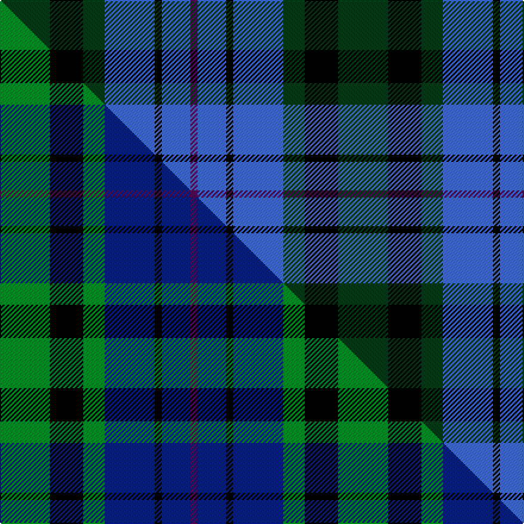

This page is one **sett** — a single exact thread-count. It belongs to the [tartan](/setts/dg21k14dg9b21k3b12dp3/)
(the same proportion at any scale), whose colour order is pattern [BBKBGKG](/stripes/bbkbgkg/).

Part of the [Scotsman](/tartans/scotsman/) tartan — the named design grouping this sett with its other cloths.

Sourced from weddslist.  It is a [7 stripe tartan](/stripes/stripes7/).

Original link http://www.weddslist.com/cgi-bin/tartans/pg.pl?source=sts

## Thread count
DG/42 K28 DG18 B42 K6 B24 DP/6

One full sett is **284 threads**.

## Palette
<table><thead><tr><th>Colour</th><th>Shade</th><th>OKLCh</th></tr></thead><tbody><tr><td>B</td><td><code style="background-color:#466CC8;">#466CC8</code> <small style="color:#888">#466CC8</small></td><td><small style="color:#888">oklch(55.1% 0.149 265.0)</small></td></tr><tr><td>DG</td><td><code style="background-color:#053819;">#053819</code> <small style="color:#888">#053819</small></td><td><small style="color:#888">oklch(30.0% 0.075 151.3)</small></td></tr><tr><td>K</td><td><code style="background-color:#000000;">#000000</code> <small style="color:#888">#000000</small></td><td><small style="color:#888">oklch(0.0% 0.000 0.0)</small></td></tr><tr><td>DP</td><td><code style="background-color:#4B0B4F;">#4B0B4F</code> <small style="color:#888">#4B0B4F</small></td><td><small style="color:#888">oklch(30.1% 0.125 325.4)</small></td></tr></tbody></table>

# Sample pattern

## Compared to the master

This cloth is one sett of its design; the master sett (the exemplar the design is anchored on) is below for comparison.

Its **ΔTartan distance** from the master is **0.75** — the same measure the nearest-tartans table ranks by (0 is identical; a re-scale of the same cloth is near 0, a recolour or a different proportion further).

<figure class="master-compare" style="margin:0">

this sett
master sett ★

<figcaption style="color:#888;font-size:smaller">One weave of this sett against the <a href="/setts/g21k14g9db21k3db12dp3/">master sett ★</a>, split on the diagonal: a shared proportion runs seamlessly across it with only the shades shifting; a different proportion breaks on it.</figcaption>
</figure>

## Nearest variants

The nearest existing variants by ΔTartan distance, with this cloth at the top so the swatches line up against it.

ΔTartan

Threads

Variant

Sett

—

284

<a href="/variants/s7/dg21k14dg9b21k3b12dp3~x2/">Scotsman</a>

<a href="/ttd/edit/#slug=g21k14g9db21k3db12dp3~x2&amp;base=dg21k14dg9b21k3b12dp3~x2" title="compare in the TTD">0.00</a>

284

<a href="/variants/s7/g21k14g9db21k3db12dp3~x2/">Scotsman</a>

<a href="/ttd/edit/#slug=g7k6db7k1db2~x2&amp;base=dg21k14dg9b21k3b12dp3~x2" title="compare in the TTD">1.58</a>

74

<a href="/variants/s5/g7k6db7k1db2~x2/">Campbell of Glenlyon</a>

<a href="/ttd/edit/#slug=db2k2db12k11g12w2~x2&amp;base=dg21k14dg9b21k3b12dp3~x2" title="compare in the TTD">1.68</a>

156

<a href="/variants/s6/db2k2db12k11g12w2~x2/">Campbell, The White Stripe</a>

<a href="/ttd/edit/#slug=db2k2db12k8g11r2~x2&amp;base=dg21k14dg9b21k3b12dp3~x2" title="compare in the TTD">1.74</a>

140

<a href="/variants/s6/db2k2db12k8g11r2~x2/">Murray #3</a>

<a href="/ttd/edit/#slug=db40k4db12k21g27w4~x2&amp;base=dg21k14dg9b21k3b12dp3~x2" title="compare in the TTD">1.98</a>

344

<a href="/variants/s6/db40k4db12k21g27w4~x2/">Granger (Personal)</a>

<a href="/ttd/edit/#slug=k1g4r1k4db1k1db7g1~x6&amp;base=dg21k14dg9b21k3b12dp3~x2" title="compare in the TTD">1.99</a>

228

<a href="/variants/s8/k1g4r1k4db1k1db7g1~x6/">Brabender</a>

<a href="/ttd/edit/#slug=db6k1db6k8r1g8r2&amp;base=dg21k14dg9b21k3b12dp3~x2" title="compare in the TTD">2.04</a>

56

<a href="/variants/s7/db6k1db6k8r1g8r2/">Fletcher C</a>

<a href="/ttd/edit/#slug=db6k1db6k8r1g8r2~x2&amp;base=dg21k14dg9b21k3b12dp3~x2" title="compare in the TTD">2.04</a>

112

<a href="/variants/s7/db6k1db6k8r1g8r2~x2/">Fletcher of Dunans</a>

<a href="/ttd/edit/#slug=db16g14w2g14k13db12k4~x2&amp;base=dg21k14dg9b21k3b12dp3~x2" title="compare in the TTD">2.34</a>

260

<a href="/variants/s7/db16g14w2g14k13db12k4~x2/">MacNeil of Colonsay (Clan)</a>

<a href="/ttd/edit/#slug=db4k3db16k14g14r3g3~x2&amp;base=dg21k14dg9b21k3b12dp3~x2" title="compare in the TTD">2.56</a>

214

<a href="/variants/s7/db4k3db16k14g14r3g3~x2/">Inneryne (Personal)</a>

## Neighbour map

Every grey dot is one of 13620 variants placed by the first two principal components of the ΔTartan feature space (42% of its variance). Red is this tartan; blue dots are its nearest — click one to open its page.

<svg viewBox="0 0 640 380" role="img" style="max-width:100%;height:auto;border:1px solid #e0e0e0;border-radius:4px;display:block" xmlns="http://www.w3.org/2000/svg"><image href="/nn/cloud.v1.png" width="640" height="380"/><a href="/variants/s7/g21k14g9db21k3db12dp3~x2/"><circle cx="157.3" cy="234.4" r="4" fill="#3465a4"><title>Scotsman</title></circle></a><a href="/variants/s5/g7k6db7k1db2~x2/"><circle cx="175.9" cy="261.6" r="4" fill="#3465a4"><title>Campbell of Glenlyon</title></circle></a><a href="/variants/s6/db2k2db12k11g12w2~x2/"><circle cx="124.0" cy="228.1" r="4" fill="#3465a4"><title>Campbell, The White Stripe</title></circle></a><a href="/variants/s6/db2k2db12k8g11r2~x2/"><circle cx="145.5" cy="229.0" r="4" fill="#3465a4"><title>Murray #3</title></circle></a><a href="/variants/s6/db40k4db12k21g27w4~x2/"><circle cx="206.8" cy="207.8" r="4" fill="#3465a4"><title>Granger (Personal)</title></circle></a><a href="/variants/s8/k1g4r1k4db1k1db7g1~x6/"><circle cx="162.1" cy="196.1" r="4" fill="#3465a4"><title>Brabender</title></circle></a><a href="/variants/s7/db6k1db6k8r1g8r2/"><circle cx="135.7" cy="215.4" r="4" fill="#3465a4"><title>Fletcher C</title></circle></a><a href="/variants/s7/db6k1db6k8r1g8r2~x2/"><circle cx="135.7" cy="215.4" r="4" fill="#3465a4"><title>Fletcher of Dunans</title></circle></a><a href="/variants/s7/db16g14w2g14k13db12k4~x2/"><circle cx="131.9" cy="242.2" r="4" fill="#3465a4"><title>MacNeil of Colonsay (Clan)</title></circle></a><a href="/variants/s7/db4k3db16k14g14r3g3~x2/"><circle cx="126.9" cy="227.8" r="4" fill="#3465a4"><title>Inneryne (Personal)</title></circle></a><circle cx="168.9" cy="235.3" r="5" fill="#c00000"/><text x="320" y="376" text-anchor="middle" font-size="11" fill="#999">ground</text><text x="11" y="190" text-anchor="middle" font-size="11" fill="#999" transform="rotate(-90 11 190)">complexity</text></svg>

ID: /variants/s7/dg21k14dg9b21k3b12dp3~x2/
