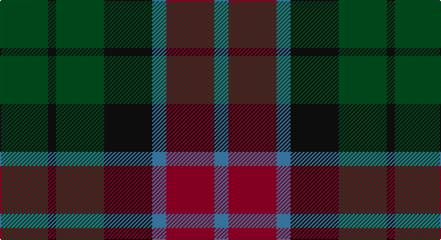

This page is one **sett** — a single exact thread-count. It belongs to the [tartan](/setts/dg24k4dg24k24t7r24t7/)
(the same proportion at any scale), whose colour order is pattern [BRBKGKG](/stripes/brbkgkg/).

Part of the [Unidentified Pinafore](/tartans/unidentified-pinafore/) tartan — the named design grouping this sett with its other cloths.

Sourced from register-of-tartans.  It is a [7 stripe tartan](/stripes/stripes7/).

Original link https://www.tartanregister.gov.uk/tartanDetails.aspx?ref=4341

## Also known as

This cloth is also recorded under:

- Unidentified, Pinafore

## Register references

External register numbers recorded for this tartan.

- Scottish Register of Tartans: [4341](https://www.tartanregister.gov.uk/tartanDetails.aspx?ref=4341)
- Scottish Tartans World Register: 413

## Thread count
G/48 K8 G48 K48 B14 DR48 B/14

One full sett is **394 threads**.

## Palette

Palette: <strong>Tartan Register</strong>
<table><thead><tr><th>Colour</th><th>Threads</th><th>Shade</th><th>Base</th><th>OKLCh</th></tr></thead><tbody><tr><td>G/</td><td style="text-align:right;font-variant-numeric:tabular-nums">48</td><td><code style="background-color:#005020;">#005020</code> <small style="color:#888">#005020</small></td><td>G <code style="background-color:#006100;">#006100</code></td><td><small style="color:#888">oklch(37.7% 0.105 149.6)</small></td></tr><tr><td>K</td><td style="text-align:right;font-variant-numeric:tabular-nums">8</td><td><code style="background-color:#101010;">#101010</code> <small style="color:#888">#101010</small></td><td>K <code style="background-color:#000000;">#000000</code></td><td><small style="color:#888">oklch(17.3% 0.000 89.9)</small></td></tr><tr><td>G</td><td style="text-align:right;font-variant-numeric:tabular-nums">48</td><td><code style="background-color:#005020;">#005020</code> <small style="color:#888">#005020</small></td><td>G <code style="background-color:#006100;">#006100</code></td><td><small style="color:#888">oklch(37.7% 0.105 149.6)</small></td></tr><tr><td>K</td><td style="text-align:right;font-variant-numeric:tabular-nums">48</td><td><code style="background-color:#101010;">#101010</code> <small style="color:#888">#101010</small></td><td>K <code style="background-color:#000000;">#000000</code></td><td><small style="color:#888">oklch(17.3% 0.000 89.9)</small></td></tr><tr><td>B</td><td style="text-align:right;font-variant-numeric:tabular-nums">14</td><td><code style="background-color:#3C82AF;">#3C82AF</code> <small style="color:#888">#3C82AF</small></td><td>B <code style="background-color:#2A418A;">#2A418A</code></td><td><small style="color:#888">oklch(58.1% 0.099 239.8)</small></td></tr><tr><td>DR</td><td style="text-align:right;font-variant-numeric:tabular-nums">48</td><td><code style="background-color:#960028;">#960028</code> <small style="color:#888">#960028</small></td><td>R <code style="background-color:#CC0000;">#CC0000</code></td><td><small style="color:#888">oklch(42.7% 0.171 18.3)</small></td></tr><tr><td>B/</td><td style="text-align:right;font-variant-numeric:tabular-nums">14</td><td><code style="background-color:#3C82AF;">#3C82AF</code> <small style="color:#888">#3C82AF</small></td><td>B <code style="background-color:#2A418A;">#2A418A</code></td><td><small style="color:#888">oklch(58.1% 0.099 239.8)</small></td></tr></tbody></table>

# Sample pattern

## Nearest tartans

The nearest existing variants by ΔTartan distance, with this tartan at the top so the swatches line up against it.

ΔTartan

Tartan

Sett

—

<a href="/ttd/edit/#slug=dg24k4dg24k24t7r24t7~x2">Unidentified Pinafore</a> <a class="nn-out" href="/variants/s7/dg24k4dg24k24t7r24t7~x2/" title="open its dictionary page">↗</a>

0.89

<a href="/ttd/edit/#slug=dr5g6dy1g6dr5db6dr1~x2&amp;base=dg24k4dg24k24t7r24t7~x2">Gleneagles Group Corporate Tartan</a> <a class="nn-out" href="/variants/s7/dr5g6dy1g6dr5db6dr1~x2/" title="open its dictionary page">↗</a>

0.90

<a href="/ttd/edit/#slug=r1dr7g7db7g7db7r1~x4&amp;base=dg24k4dg24k24t7r24t7~x2">Tennant</a> <a class="nn-out" href="/variants/s7/r1dr7g7db7g7db7r1~x4/" title="open its dictionary page">↗</a>

0.93

<a href="/ttd/edit/#slug=k6dg6ly1dg6k6dp6k1~x4&amp;base=dg24k4dg24k24t7r24t7~x2">Abercrombie (Wilsons No 2/64)</a> <a class="nn-out" href="/variants/s7/k6dg6ly1dg6k6dp6k1~x4/" title="open its dictionary page">↗</a>

1.04

<a href="/ttd/edit/#slug=g21k6t3g11k17db17k3~x2&amp;base=dg24k4dg24k24t7r24t7~x2">MacCallum</a> <a class="nn-out" href="/variants/s7/g21k6t3g11k17db17k3~x2/" title="open its dictionary page">↗</a>

1.05

<a href="/ttd/edit/#slug=r4g12k12g2db12g3~x2&amp;base=dg24k4dg24k24t7r24t7~x2">Gunn - 1810 (Clan)</a> <a class="nn-out" href="/variants/s6/r4g12k12g2db12g3~x2/" title="open its dictionary page">↗</a>

1.05

<a href="/ttd/edit/#slug=r3g6db2dbi2db11g9db2r3~x2&amp;base=dg24k4dg24k24t7r24t7~x2">Daks (Navy)</a> <a class="nn-out" href="/variants/s8/r3g6db2dbi2db11g9db2r3~x2/" title="open its dictionary page">↗</a>

1.07

<a href="/ttd/edit/#slug=db14g18k3g18r20k14lo3~x2&amp;base=dg24k4dg24k24t7r24t7~x2">Scottish Parliament (unofficial)</a> <a class="nn-out" href="/variants/s7/db14g18k3g18r20k14lo3~x2/" title="open its dictionary page">↗</a>

1.07

<a href="/ttd/edit/#slug=db7r3g7r1g7r3db7t1~x2&amp;base=dg24k4dg24k24t7r24t7~x2">Hebrides #8</a> <a class="nn-out" href="/variants/s8/db7r3g7r1g7r3db7t1~x2/" title="open its dictionary page">↗</a>

1.08

<a href="/ttd/edit/#slug=n4g18n3k17n18p4~x2&amp;base=dg24k4dg24k24t7r24t7~x2">Scottish Airports</a> <a class="nn-out" href="/variants/s6/n4g18n3k17n18p4~x2/" title="open its dictionary page">↗</a>

1.09

<a href="/ttd/edit/#slug=dg1db5dg1k5dg6ly1~x2&amp;base=dg24k4dg24k24t7r24t7~x2">MacKay (Bonner)</a> <a class="nn-out" href="/variants/s6/dg1db5dg1k5dg6ly1~x2/" title="open its dictionary page">↗</a>

## Neighbour map

Every grey dot is one of 14360 variants placed by the first two principal components of the ΔTartan feature space (44% of its variance). Red is this tartan; blue dots are its nearest — click one to open its page.

<svg viewBox="0 0 640 380" role="img" style="max-width:100%;height:auto;border:1px solid #e0e0e0;border-radius:4px;display:block" xmlns="http://www.w3.org/2000/svg"><image href="/nn/cloud.v1.png" width="640" height="380"/><a href="/variants/s7/dr5g6dy1g6dr5db6dr1~x2/"><circle cx="212.9" cy="284.6" r="4" fill="#3465a4"><title>Gleneagles Group Corporate Tartan</title></circle></a><a href="/variants/s7/r1dr7g7db7g7db7r1~x4/"><circle cx="180.0" cy="266.2" r="4" fill="#3465a4"><title>Tennant</title></circle></a><a href="/variants/s7/k6dg6ly1dg6k6dp6k1~x4/"><circle cx="192.8" cy="280.0" r="4" fill="#3465a4"><title>Abercrombie (Wilsons No 2/64)</title></circle></a><a href="/variants/s7/g21k6t3g11k17db17k3~x2/"><circle cx="205.9" cy="263.3" r="4" fill="#3465a4"><title>MacCallum</title></circle></a><a href="/variants/s6/r4g12k12g2db12g3~x2/"><circle cx="167.6" cy="264.9" r="4" fill="#3465a4"><title>Gunn - 1810 (Clan)</title></circle></a><a href="/variants/s8/r3g6db2dbi2db11g9db2r3~x2/"><circle cx="200.6" cy="248.3" r="4" fill="#3465a4"><title>Daks (Navy)</title></circle></a><a href="/variants/s7/db14g18k3g18r20k14lo3~x2/"><circle cx="143.2" cy="247.0" r="4" fill="#3465a4"><title>Scottish Parliament (unofficial)</title></circle></a><a href="/variants/s8/db7r3g7r1g7r3db7t1~x2/"><circle cx="193.5" cy="248.2" r="4" fill="#3465a4"><title>Hebrides #8</title></circle></a><a href="/variants/s6/n4g18n3k17n18p4~x2/"><circle cx="211.5" cy="276.1" r="4" fill="#3465a4"><title>Scottish Airports</title></circle></a><a href="/variants/s6/dg1db5dg1k5dg6ly1~x2/"><circle cx="213.0" cy="266.7" r="4" fill="#3465a4"><title>MacKay (Bonner)</title></circle></a><circle cx="192.4" cy="269.9" r="5" fill="#c00000"/></svg>

ID: /variants/s7/dg24k4dg24k24t7r24t7~x2/
