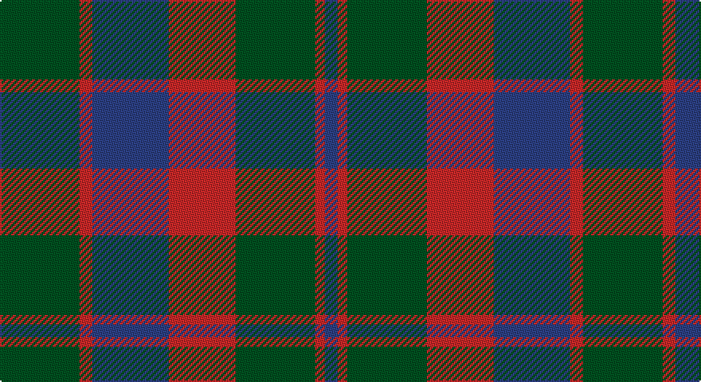

This page is one **sett** — a single exact thread-count. It belongs to the [tartan](/setts/dg25r4db24r21dg25r3db4/)
(the same proportion at any scale), whose colour order is pattern [BRGRBRG](/stripes/brgrbrg/).

Part of the [Glasgow](/tartans/glasgow/) tartan — the named design grouping this sett with its other cloths.

Sourced from register-of-tartans.  It is a [7 stripe tartan](/stripes/stripes7/).

Original link https://www.tartanregister.gov.uk/tartanDetails.aspx?ref=1349

## Also known as

This cloth is also recorded under:

- Glasgow #2

## Register references

External register numbers recorded for this tartan.

- Scottish Register of Tartans: [1349](https://www.tartanregister.gov.uk/tartanDetails.aspx?ref=1349)
- Scottish Tartans World Register: 534

## Thread count
G/50 R8 B48 R42 G50 R6 B/8

One full sett is **366 threads**.

## Palette

Palette: <strong>Tartan Register</strong>
<table><thead><tr><th>Colour</th><th>Threads</th><th>Shade</th><th>Base</th><th>OKLCh</th></tr></thead><tbody><tr><td>G/</td><td style="text-align:right;font-variant-numeric:tabular-nums">50</td><td><code style="background-color:#005020;">#005020</code> <small style="color:#888">#005020</small></td><td>G <code style="background-color:#006100;">#006100</code></td><td><small style="color:#888">oklch(37.7% 0.105 149.6)</small></td></tr><tr><td>R</td><td style="text-align:right;font-variant-numeric:tabular-nums">8</td><td><code style="background-color:#C82828;">#C82828</code> <small style="color:#888">#C82828</small></td><td>R <code style="background-color:#CC0000;">#CC0000</code></td><td><small style="color:#888">oklch(54.2% 0.196 26.8)</small></td></tr><tr><td>B</td><td style="text-align:right;font-variant-numeric:tabular-nums">48</td><td><code style="background-color:#2C4084;">#2C4084</code> <small style="color:#888">#2C4084</small></td><td>B <code style="background-color:#2A418A;">#2A418A</code></td><td><small style="color:#888">oklch(39.4% 0.117 268.3)</small></td></tr><tr><td>R</td><td style="text-align:right;font-variant-numeric:tabular-nums">42</td><td><code style="background-color:#C82828;">#C82828</code> <small style="color:#888">#C82828</small></td><td>R <code style="background-color:#CC0000;">#CC0000</code></td><td><small style="color:#888">oklch(54.2% 0.196 26.8)</small></td></tr><tr><td>G</td><td style="text-align:right;font-variant-numeric:tabular-nums">50</td><td><code style="background-color:#005020;">#005020</code> <small style="color:#888">#005020</small></td><td>G <code style="background-color:#006100;">#006100</code></td><td><small style="color:#888">oklch(37.7% 0.105 149.6)</small></td></tr><tr><td>R</td><td style="text-align:right;font-variant-numeric:tabular-nums">6</td><td><code style="background-color:#C82828;">#C82828</code> <small style="color:#888">#C82828</small></td><td>R <code style="background-color:#CC0000;">#CC0000</code></td><td><small style="color:#888">oklch(54.2% 0.196 26.8)</small></td></tr><tr><td>B/</td><td style="text-align:right;font-variant-numeric:tabular-nums">8</td><td><code style="background-color:#2C4084;">#2C4084</code> <small style="color:#888">#2C4084</small></td><td>B <code style="background-color:#2A418A;">#2A418A</code></td><td><small style="color:#888">oklch(39.4% 0.117 268.3)</small></td></tr></tbody></table>

# Sample pattern

## Nearest tartans

The nearest existing variants by ΔTartan distance, with this tartan at the top so the swatches line up against it.

ΔTartan

Tartan

Sett

—

<a href="/ttd/edit/#slug=dg25r4db24r21dg25r3db4~x2">Glasgow #2</a> <a class="nn-out" href="/variants/s7/dg25r4db24r21dg25r3db4~x2/" title="open its dictionary page">↗</a>

0.41

<a href="/ttd/edit/#slug=dt30r5g30r22dt30r5g4&amp;base=dg25r4db24r21dg25r3db4~x2">GS Gaelic School (School)</a> <a class="nn-out" href="/variants/s7/dt30r5g30r22dt30r5g4/" title="open its dictionary page">↗</a>

1.01

<a href="/ttd/edit/#slug=t3dg1t10dg4r10t2~x4&amp;base=dg25r4db24r21dg25r3db4~x2">Rob Roy (Film)</a> <a class="nn-out" href="/variants/s6/t3dg1t10dg4r10t2~x4/" title="open its dictionary page">↗</a>

1.01

<a href="/ttd/edit/#slug=g25m4db24m21g25m4db2~x2&amp;base=dg25r4db24r21dg25r3db4~x2">Glasgow, Rock and Wheel</a> <a class="nn-out" href="/variants/s7/g25m4db24m21g25m4db2~x2/" title="open its dictionary page">↗</a>

1.02

<a href="/ttd/edit/#slug=db3r19db13r5g21r8db3~x2&amp;base=dg25r4db24r21dg25r3db4~x2">MacBean of Tomatin (Clan)</a> <a class="nn-out" href="/variants/s7/db3r19db13r5g21r8db3~x2/" title="open its dictionary page">↗</a>

1.03

<a href="/ttd/edit/#slug=db9r6dg2r6dg18r6dg2~x2&amp;base=dg25r4db24r21dg25r3db4~x2">Skene D</a> <a class="nn-out" href="/variants/s7/db9r6dg2r6dg18r6dg2~x2/" title="open its dictionary page">↗</a>

1.11

<a href="/ttd/edit/#slug=db9r3db1g9r3db1~x2&amp;base=dg25r4db24r21dg25r3db4~x2">Logan #5</a> <a class="nn-out" href="/variants/s6/db9r3db1g9r3db1~x2/" title="open its dictionary page">↗</a>

1.15

<a href="/ttd/edit/#slug=t3dg1t10dg4dy10t2~x4&amp;base=dg25r4db24r21dg25r3db4~x2">Rob Roy (Film) (Corporate)</a> <a class="nn-out" href="/variants/s6/t3dg1t10dg4dy10t2~x4/" title="open its dictionary page">↗</a>

1.17

<a href="/ttd/edit/#slug=db5o15dy4o4dy24o4dy4db5&amp;base=dg25r4db24r21dg25r3db4~x2">Daks-Simpson (Muted Skye)</a> <a class="nn-out" href="/variants/s8/db5o15dy4o4dy24o4dy4db5/" title="open its dictionary page">↗</a>

1.18

<a href="/ttd/edit/#slug=db6r3g2r3g12r3g2~x2&amp;base=dg25r4db24r21dg25r3db4~x2">Skene Clan Tartan</a> <a class="nn-out" href="/variants/s7/db6r3g2r3g12r3g2~x2/" title="open its dictionary page">↗</a>

1.19

<a href="/ttd/edit/#slug=r6db2r2db21dg20r4dg4~x2&amp;base=dg25r4db24r21dg25r3db4~x2">Robertson of Struan</a> <a class="nn-out" href="/variants/s7/r6db2r2db21dg20r4dg4~x2/" title="open its dictionary page">↗</a>

## Neighbour map

Every grey dot is one of 14360 variants placed by the first two principal components of the ΔTartan feature space (44% of its variance). Red is this tartan; blue dots are its nearest — click one to open its page.

<svg viewBox="0 0 640 380" role="img" style="max-width:100%;height:auto;border:1px solid #e0e0e0;border-radius:4px;display:block" xmlns="http://www.w3.org/2000/svg"><image href="/nn/cloud.v1.png" width="640" height="380"/><a href="/variants/s7/dt30r5g30r22dt30r5g4/"><circle cx="270.0" cy="262.9" r="4" fill="#3465a4"><title>GS Gaelic School (School)</title></circle></a><a href="/variants/s6/t3dg1t10dg4r10t2~x4/"><circle cx="313.9" cy="247.8" r="4" fill="#3465a4"><title>Rob Roy (Film)</title></circle></a><a href="/variants/s7/g25m4db24m21g25m4db2~x2/"><circle cx="291.1" cy="245.9" r="4" fill="#3465a4"><title>Glasgow, Rock and Wheel</title></circle></a><a href="/variants/s7/db3r19db13r5g21r8db3~x2/"><circle cx="256.1" cy="258.6" r="4" fill="#3465a4"><title>MacBean of Tomatin (Clan)</title></circle></a><a href="/variants/s7/db9r6dg2r6dg18r6dg2~x2/"><circle cx="276.9" cy="247.2" r="4" fill="#3465a4"><title>Skene D</title></circle></a><a href="/variants/s6/db9r3db1g9r3db1~x2/"><circle cx="260.4" cy="243.6" r="4" fill="#3465a4"><title>Logan #5</title></circle></a><a href="/variants/s6/t3dg1t10dg4dy10t2~x4/"><circle cx="334.1" cy="266.3" r="4" fill="#3465a4"><title>Rob Roy (Film) (Corporate)</title></circle></a><a href="/variants/s8/db5o15dy4o4dy24o4dy4db5/"><circle cx="315.2" cy="254.7" r="4" fill="#3465a4"><title>Daks-Simpson (Muted Skye)</title></circle></a><a href="/variants/s7/db6r3g2r3g12r3g2~x2/"><circle cx="283.5" cy="254.3" r="4" fill="#3465a4"><title>Skene Clan Tartan</title></circle></a><a href="/variants/s7/r6db2r2db21dg20r4dg4~x2/"><circle cx="284.4" cy="229.6" r="4" fill="#3465a4"><title>Robertson of Struan</title></circle></a><circle cx="281.5" cy="262.5" r="5" fill="#c00000"/></svg>

ID: /variants/s7/dg25r4db24r21dg25r3db4~x2/
