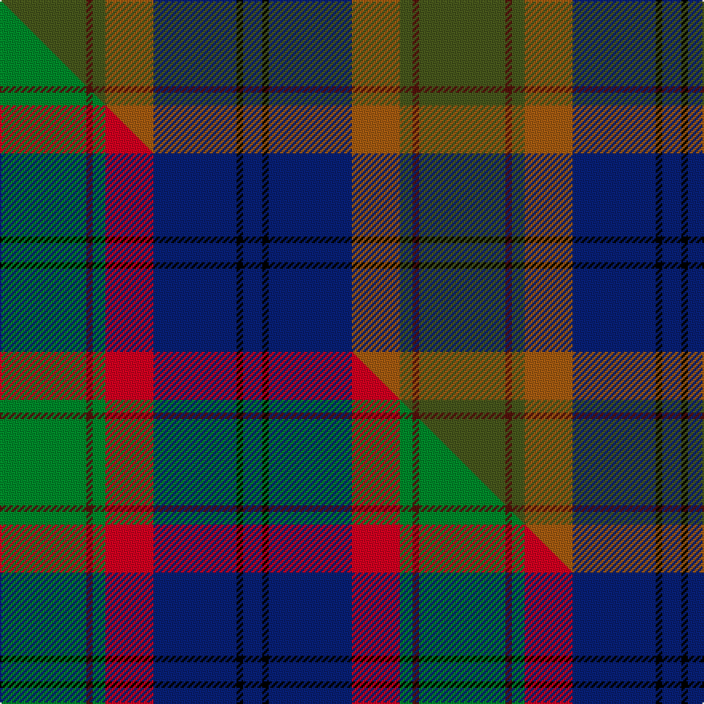

This page is one **sett** — a single exact thread-count. It belongs to the [tartan](/setts/dg27dr2dg4o15db26k2db6/)
(the same proportion at any scale), whose colour order is pattern [BKBRGBG](/stripes/bkbrgbg/).

Part of the [Bailies of Bennachie](/tartans/bailies-of-bennachie/) tartan — the named design grouping this sett with its other cloths.

Sourced from house-of-tartan.  It is a [7 stripe tartan](/stripes/stripes7/).

Original link http://www.house-of-tartan.scotland.net/house/TartanViewjs.asp?colr=Def&tnam=3628

## Provenance

Earliest known date: 2002 The Bailes of Bennachie were founded in 1973 as caretakers of the mountain in Aberdeenshire, with the aim of 'preserving the amenity of the hill'. The tartan was produced on the occasion of the 25th anniversary to help create funds to continue their task. The colours reflect the autumn shades on the hill.

## Thread count
DG/54 DR4 DG8 O30 DB52 K4 DB/12

One full sett is **262 threads**.

## Palette
<table><thead><tr><th>Colour</th><th>Shade</th><th>OKLCh</th></tr></thead><tbody><tr><td>LB</td><td><code style="background-color:#B5BBDE;">#B5BBDE</code> <small style="color:#888">#B5BBDE</small></td><td><small style="color:#888">oklch(79.9% 0.050 277.6)</small></td></tr><tr><td>DB</td><td><code style="background-color:#082077;">#082077</code> <small style="color:#888">#082077</small></td><td><small style="color:#888">oklch(30.0% 0.149 265.1)</small></td></tr><tr><td>O</td><td><code style="background-color:#A65C11;">#A65C11</code> <small style="color:#888">#A65C11</small></td><td><small style="color:#888">oklch(55.0% 0.125 58.3)</small></td></tr><tr><td>DR</td><td><code style="background-color:#55120C;">#55120C</code> <small style="color:#888">#55120C</small></td><td><small style="color:#888">oklch(30.0% 0.099 29.3)</small></td></tr><tr><td>DG</td><td><code style="background-color:#48581C;">#48581C</code> <small style="color:#888">#48581C</small></td><td><small style="color:#888">oklch(43.3% 0.086 122.8)</small></td></tr><tr><td>Y</td><td><code style="background-color:#848850;">#848850</code> <small style="color:#888">#848850</small></td><td><small style="color:#888">oklch(61.0% 0.078 112.0)</small></td></tr><tr><td>K</td><td><code style="background-color:#000000;">#000000</code> <small style="color:#888">#000000</small></td><td><small style="color:#888">oklch(0.0% 0.000 0.0)</small></td></tr><tr><td>R</td><td><code style="background-color:#D60020;">#D60020</code> <small style="color:#888">#D60020</small></td><td><small style="color:#888">oklch(55.2% 0.224 25.5)</small></td></tr></tbody></table>

# Sample pattern

## Compared to the master

This cloth is one sett of its design; the master sett (the exemplar the design is anchored on) is below for comparison.

Its **ΔTartan distance** from the master is **1.71** — the same measure the nearest-tartans table ranks by (0 is identical; a re-scale of the same cloth is near 0, a recolour or a different proportion further).

<figure class="master-compare" style="margin:0">

this sett
master sett ★

<figcaption style="color:#888;font-size:smaller">One weave of this sett against the <a href="/setts/g27dr2g4r15db26k2db6/">master sett ★</a>, split on the diagonal: a shared proportion runs seamlessly across it with only the shades shifting; a different proportion breaks on it.</figcaption>
</figure>

## Nearest tartan variants

The nearest existing variants by ΔTartan distance, with this cloth at the top so the swatches line up against it.

ΔTartan

Threads

Variant

Sett

—

262

<a href="/variants/s7/dg27dr2dg4o15db26k2db6~x2~dg1703114/">Bailies of Bennachie Corporate Tartan</a>

<a href="/ttd/edit/#slug=dg5lp3dg32k16db32r3db5~x2&amp;base=dg27dr2dg4o15db26k2db6~x2~dg1703114" title="compare in the TTD">2.18</a>

364

<a href="/variants/s7/dg5lp3dg32k16db32r3db5~x2/">MacThomas (Clan)</a>

<a href="/ttd/edit/#slug=dr4dg27o2db25ly5dg3o3~x2&amp;base=dg27dr2dg4o15db26k2db6~x2~dg1703114" title="compare in the TTD">2.29</a>

262

<a href="/variants/s7/dr4dg27o2db25ly5dg3o3~x2/">Kilkenny, County (District)</a>

<a href="/ttd/edit/#slug=dr5dg27o2b25y7dg3dr3~x2&amp;base=dg27dr2dg4o15db26k2db6~x2~dg1703114" title="compare in the TTD">2.29</a>

272

<a href="/variants/s7/dr5dg27o2b25y7dg3dr3~x2/">Kilkenny</a>

<a href="/ttd/edit/#slug=r4dg4k2dg29db21k3db3y3~x2&amp;base=dg27dr2dg4o15db26k2db6~x2~dg1703114" title="compare in the TTD">2.33</a>

262

<a href="/variants/s8/r4dg4k2dg29db21k3db3y3~x2/">Peter of Lee (Chief) (Personal)</a>

<a href="/ttd/edit/#slug=b32do6o5do6dg19o3dg5~x2&amp;base=dg27dr2dg4o15db26k2db6~x2~dg1703114" title="compare in the TTD">2.62</a>

230

<a href="/variants/s7/b32do6o5do6dg19o3dg5~x2/">Roscommon</a>

<a href="/ttd/edit/#slug=dg3db12lb1k12dg13r2dg2~x2&amp;base=dg27dr2dg4o15db26k2db6~x2~dg1703114" title="compare in the TTD">2.62</a>

170

<a href="/variants/s7/dg3db12lb1k12dg13r2dg2~x2/">MacPhedran/MacFadzean</a>

<a href="/ttd/edit/#slug=dg3b22do10o5dg21r6b3~x2&amp;base=dg27dr2dg4o15db26k2db6~x2~dg1703114" title="compare in the TTD">2.81</a>

268

<a href="/variants/s7/dg3b22do10o5dg21r6b3~x2/">Swankie</a>

## Neighbour map

Every grey dot is one of 13620 variants placed by the first two principal components of the ΔTartan feature space (42% of its variance). Red is this tartan; blue dots are its nearest — click one to open its page.

<svg viewBox="0 0 640 380" role="img" style="max-width:100%;height:auto;border:1px solid #e0e0e0;border-radius:4px;display:block" xmlns="http://www.w3.org/2000/svg"><image href="/nn/cloud.v1.png" width="640" height="380"/><a href="/variants/s7/dg5lp3dg32k16db32r3db5~x2/"><circle cx="219.7" cy="188.6" r="4" fill="#3465a4"><title>MacThomas (Clan)</title></circle></a><a href="/variants/s7/dr4dg27o2db25ly5dg3o3~x2/"><circle cx="278.4" cy="184.1" r="4" fill="#3465a4"><title>Kilkenny, County (District)</title></circle></a><a href="/variants/s7/dr5dg27o2b25y7dg3dr3~x2/"><circle cx="274.6" cy="192.6" r="4" fill="#3465a4"><title>Kilkenny</title></circle></a><a href="/variants/s8/r4dg4k2dg29db21k3db3y3~x2/"><circle cx="302.4" cy="161.7" r="4" fill="#3465a4"><title>Peter of Lee (Chief) (Personal)</title></circle></a><a href="/variants/s7/b32do6o5do6dg19o3dg5~x2/"><circle cx="283.3" cy="220.2" r="4" fill="#3465a4"><title>Roscommon</title></circle></a><a href="/variants/s7/dg3db12lb1k12dg13r2dg2~x2/"><circle cx="203.3" cy="183.2" r="4" fill="#3465a4"><title>MacPhedran/MacFadzean</title></circle></a><a href="/variants/s7/dg3b22do10o5dg21r6b3~x2/"><circle cx="203.3" cy="229.8" r="4" fill="#3465a4"><title>Swankie</title></circle></a><circle cx="252.6" cy="190.1" r="5" fill="#c00000"/><text x="320" y="376" text-anchor="middle" font-size="11" fill="#999">ground</text><text x="11" y="190" text-anchor="middle" font-size="11" fill="#999" transform="rotate(-90 11 190)">complexity</text></svg>

ID: /variants/s7/dg27dr2dg4o15db26k2db6~x2~dg1703114/
