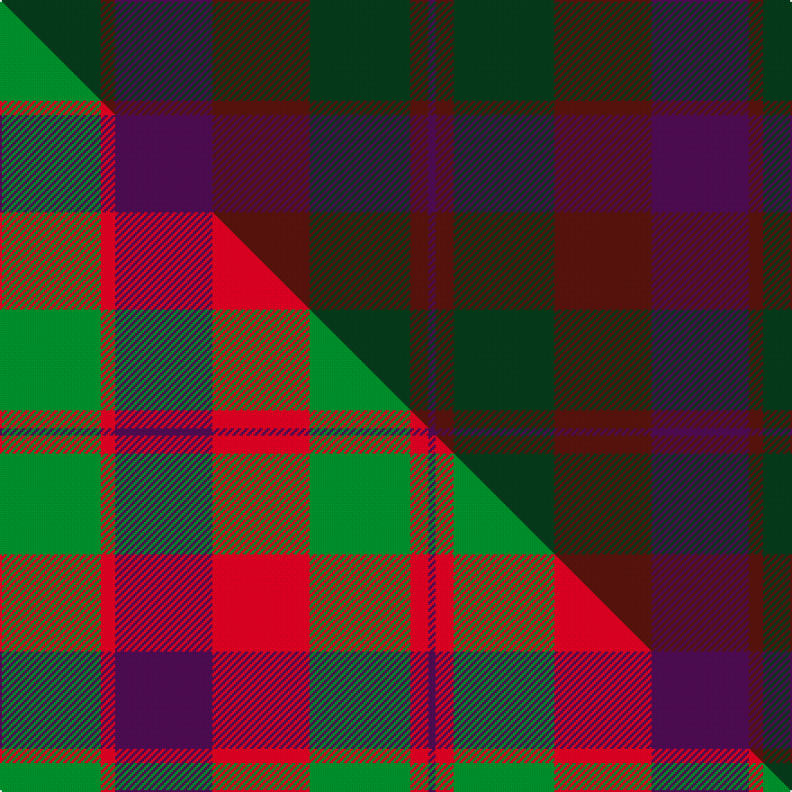

This page is one **sett** — a single exact thread-count. It belongs to the [tartan](/setts/dg28dr4dp27dr27dg28dr5dp2/)
(the same proportion at any scale), whose colour order is pattern [BBGBBBG](/stripes/bbgbbbg/).

Part of the [Madder](/tartans/madder/) tartan — the named design grouping this sett with its other cloths.

Sourced from tartans-authority.  It is a [7 stripe tartan](/stripes/stripes7/).

Original link http://www.tartansauthority.com/tartan-ferret/display/5693/

## Register references

External register numbers recorded for this tartan.

- Scottish Tartans Authority (ITI): 5693

## Thread count
DG/56 DR8 DP54 DR54 DG56 DR10 DP/4

One full sett is **424 threads**.

## Palette
<table><thead><tr><th>Colour</th><th>Shade</th><th>OKLCh</th></tr></thead><tbody><tr><td>DP</td><td><code style="background-color:#4B0B4F;">#4B0B4F</code> <small style="color:#888">#4B0B4F</small></td><td><small style="color:#888">oklch(30.1% 0.125 325.4)</small></td></tr><tr><td>DR</td><td><code style="background-color:#55120C;">#55120C</code> <small style="color:#888">#55120C</small></td><td><small style="color:#888">oklch(30.0% 0.099 29.3)</small></td></tr><tr><td>DG</td><td><code style="background-color:#053819;">#053819</code> <small style="color:#888">#053819</small></td><td><small style="color:#888">oklch(30.0% 0.075 151.3)</small></td></tr></tbody></table>

# Sample pattern

## Compared to the master

This cloth is one sett of its design; the master sett (the exemplar the design is anchored on) is below for comparison.

Its **ΔTartan distance** from the master is **6.25** — the same measure the nearest-tartans table ranks by (0 is identical; a re-scale of the same cloth is near 0, a recolour or a different proportion further).

<figure class="master-compare" style="margin:0">

this sett
master sett ★

<figcaption style="color:#888;font-size:smaller">One weave of this sett against the <a href="/setts/g28r4dp27r27g28r5dp2/">master sett ★</a>, split on the diagonal: a shared proportion runs seamlessly across it with only the shades shifting; a different proportion breaks on it.</figcaption>
</figure>

## Nearest tartan variants

The nearest existing variants by ΔTartan distance, with this cloth at the top so the swatches line up against it.

ΔTartan

Threads

Variant

Sett

—

424

<a href="/variants/s7/dg28dr4dp27dr27dg28dr5dp2~x2/">Madder - 1819</a>

<a href="/ttd/edit/#slug=dp26dr6dg16dp8dg3dr2~x2&amp;base=dg28dr4dp27dr27dg28dr5dp2~x2" title="compare in the TTD">1.77</a>

188

<a href="/variants/s6/dp26dr6dg16dp8dg3dr2~x2/">Perthshire Tourist Board (Corporate)</a>

<a href="/ttd/edit/#slug=dt6dr1dt24dr28dt1dr4~x2&amp;base=dg28dr4dp27dr27dg28dr5dp2~x2" title="compare in the TTD">2.83</a>

236

<a href="/variants/s6/dt6dr1dt24dr28dt1dr4~x2/">Mary Erskine School, The</a>

## Neighbour map

Every grey dot is one of 13620 variants placed by the first two principal components of the ΔTartan feature space (42% of its variance). Red is this tartan; blue dots are its nearest — click one to open its page.

<svg viewBox="0 0 640 380" role="img" style="max-width:100%;height:auto;border:1px solid #e0e0e0;border-radius:4px;display:block" xmlns="http://www.w3.org/2000/svg"><image href="/nn/cloud.v1.png" width="640" height="380"/><a href="/variants/s6/dp26dr6dg16dp8dg3dr2~x2/"><circle cx="549.5" cy="293.4" r="4" fill="#3465a4"><title>Perthshire Tourist Board (Corporate)</title></circle></a><a href="/variants/s6/dt6dr1dt24dr28dt1dr4~x2/"><circle cx="626.0" cy="302.6" r="4" fill="#3465a4"><title>Mary Erskine School, The</title></circle></a><circle cx="497.3" cy="308.5" r="5" fill="#c00000"/><text x="320" y="376" text-anchor="middle" font-size="11" fill="#999">ground</text><text x="11" y="190" text-anchor="middle" font-size="11" fill="#999" transform="rotate(-90 11 190)">complexity</text></svg>

ID: /variants/s7/dg28dr4dp27dr27dg28dr5dp2~x2/
