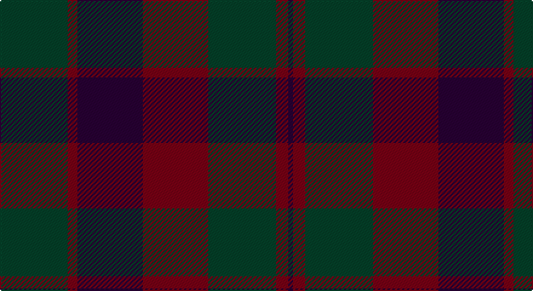

This page is one **sett** — a single exact thread-count. It belongs to the [tartan](/setts/dg28r4dp27r27dg28r5dp2/)
(the same proportion at any scale), whose colour order is pattern [BRGRBRG](/stripes/brgrbrg/).

Sourced from register-of-tartans.  It is a [7 stripe tartan](/stripes/stripes7/).

Original link https://www.tartanregister.gov.uk/tartanDetails.aspx?ref=2778

2 attestations — the source records this cloth was collapsed from (oldest owns this page)

<ul>
<li>01/01/1819 — Madder (register-of-tartans, <a href="https://www.tartanregister.gov.uk/tartanDetails.aspx?ref=2778">record</a>)</li>
<li>1819 — Madder - 1819 (tartans-authority, <a href="http://www.tartansauthority.com/tartan-ferret/display/5693/">record</a>)</li>
</ul>

## Register references

External register numbers recorded for this tartan.

- Scottish Register of Tartans: [2778](https://www.tartanregister.gov.uk/tartanDetails.aspx?ref=2778)
- Scottish Tartans Authority (ITI): 5693

## Thread count
DG/56 DR8 DP54 DR54 DG56 DR10 DP/4

One full sett is **424 threads**.

## Palette

Palette: <strong>custom</strong>
<table><thead><tr><th>Colour</th><th>Threads</th><th>Shade</th><th>Base</th><th>OKLCh</th></tr></thead><tbody><tr><td>DG/</td><td style="text-align:right;font-variant-numeric:tabular-nums">56</td><td><code style="background-color:#044028;">#044028</code> <small style="color:#888">#044028</small></td><td>G <code style="background-color:#006100;">#006100</code></td><td><small style="color:#888">oklch(32.9% 0.072 160.0)</small></td></tr><tr><td>DR</td><td style="text-align:right;font-variant-numeric:tabular-nums">8</td><td><code style="background-color:#780014;">#780014</code> <small style="color:#888">#780014</small></td><td>R <code style="background-color:#CC0000;">#CC0000</code></td><td><small style="color:#888">oklch(36.1% 0.146 23.0)</small></td></tr><tr><td>DP</td><td style="text-align:right;font-variant-numeric:tabular-nums">54</td><td><code style="background-color:#280034;">#280034</code> <small style="color:#888">#280034</small></td><td>B <code style="background-color:#2A418A;">#2A418A</code></td><td><small style="color:#888">oklch(20.5% 0.100 316.9)</small></td></tr><tr><td>DR</td><td style="text-align:right;font-variant-numeric:tabular-nums">54</td><td><code style="background-color:#780014;">#780014</code> <small style="color:#888">#780014</small></td><td>R <code style="background-color:#CC0000;">#CC0000</code></td><td><small style="color:#888">oklch(36.1% 0.146 23.0)</small></td></tr><tr><td>DG</td><td style="text-align:right;font-variant-numeric:tabular-nums">56</td><td><code style="background-color:#044028;">#044028</code> <small style="color:#888">#044028</small></td><td>G <code style="background-color:#006100;">#006100</code></td><td><small style="color:#888">oklch(32.9% 0.072 160.0)</small></td></tr><tr><td>DR</td><td style="text-align:right;font-variant-numeric:tabular-nums">10</td><td><code style="background-color:#780014;">#780014</code> <small style="color:#888">#780014</small></td><td>R <code style="background-color:#CC0000;">#CC0000</code></td><td><small style="color:#888">oklch(36.1% 0.146 23.0)</small></td></tr><tr><td>DP/</td><td style="text-align:right;font-variant-numeric:tabular-nums">4</td><td><code style="background-color:#280034;">#280034</code> <small style="color:#888">#280034</small></td><td>B <code style="background-color:#2A418A;">#2A418A</code></td><td><small style="color:#888">oklch(20.5% 0.100 316.9)</small></td></tr></tbody></table>

# Sample pattern

## Nearest tartans

The nearest existing variants by ΔTartan distance, with this tartan at the top so the swatches line up against it.

ΔTartan

Tartan

Sett

—

<a href="/ttd/edit/#slug=dg28r4dp27r27dg28r5dp2~x2">Madder</a> <a class="nn-out" href="/variants/s7/dg28r4dp27r27dg28r5dp2~x2/" title="open its dictionary page">↗</a>

1.29

<a href="/ttd/edit/#slug=dp32dg16o14k4o6dp7k2~x2&amp;base=dg28r4dp27r27dg28r5dp2~x2">Aisteach</a> <a class="nn-out" href="/variants/s7/dp32dg16o14k4o6dp7k2~x2/" title="open its dictionary page">↗</a>

1.50

<a href="/ttd/edit/#slug=dg24db3dg3db3dg3db9m24dg3m4~x2&amp;base=dg28r4dp27r27dg28r5dp2~x2">Lindsay (Chisholm Red)</a> <a class="nn-out" href="/variants/s9/dg24db3dg3db3dg3db9m24dg3m4~x2/" title="open its dictionary page">↗</a>

1.52

<a href="/ttd/edit/#slug=k26r6dg16k8dg3r2~x2&amp;base=dg28r4dp27r27dg28r5dp2~x2">Perthshire Tourist Board</a> <a class="nn-out" href="/variants/s6/k26r6dg16k8dg3r2~x2/" title="open its dictionary page">↗</a>

1.55

<a href="/ttd/edit/#slug=dg24dt3dg3dt3dg3dt9m24dg3m4~x2&amp;base=dg28r4dp27r27dg28r5dp2~x2">Lindsay</a> <a class="nn-out" href="/variants/s9/dg24dt3dg3dt3dg3dt9m24dg3m4~x2/" title="open its dictionary page">↗</a>

1.58

<a href="/ttd/edit/#slug=dt4dg2dr16dr10dg10dt32n3~x2&amp;base=dg28r4dp27r27dg28r5dp2~x2">Dempster Family Tartan</a> <a class="nn-out" href="/variants/s7/dt4dg2dr16dr10dg10dt32n3~x2/" title="open its dictionary page">↗</a>

1.59

<a href="/ttd/edit/#slug=dg2dp10dy15dg10dp2~x4&amp;base=dg28r4dp27r27dg28r5dp2~x2">Harmony 6</a> <a class="nn-out" href="/variants/s5/dg2dp10dy15dg10dp2~x4/" title="open its dictionary page">↗</a>

1.66

<a href="/ttd/edit/#slug=dg20db2dg2db2dg2db8dr24db2dr3~x2&amp;base=dg28r4dp27r27dg28r5dp2~x2">Lindsay</a> <a class="nn-out" href="/variants/s9/dg20db2dg2db2dg2db8dr24db2dr3~x2/" title="open its dictionary page">↗</a>

1.66

<a href="/ttd/edit/#slug=dg20db2dg2db2dg2db8dr24db2dr3&amp;base=dg28r4dp27r27dg28r5dp2~x2">Lindsay</a> <a class="nn-out" href="/variants/s9/dg20db2dg2db2dg2db8dr24db2dr3/" title="open its dictionary page">↗</a>

1.66

<a href="/ttd/edit/#slug=r8lr2o30dg12o3dg12o3~x2&amp;base=dg28r4dp27r27dg28r5dp2~x2">Wasko (Personal)</a> <a class="nn-out" href="/variants/s7/r8lr2o30dg12o3dg12o3~x2/" title="open its dictionary page">↗</a>

1.69

<a href="/ttd/edit/#slug=do2dy12do12r1k12dy2~x6&amp;base=dg28r4dp27r27dg28r5dp2~x2">Ferguson Britt (Corporate)</a> <a class="nn-out" href="/variants/s6/do2dy12do12r1k12dy2~x6/" title="open its dictionary page">↗</a>

## Neighbour map

Every grey dot is one of 14360 variants placed by the first two principal components of the ΔTartan feature space (44% of its variance). Red is this tartan; blue dots are its nearest — click one to open its page.

<svg viewBox="0 0 640 380" role="img" style="max-width:100%;height:auto;border:1px solid #e0e0e0;border-radius:4px;display:block" xmlns="http://www.w3.org/2000/svg"><image href="/nn/cloud.v1.png" width="640" height="380"/><a href="/variants/s7/dp32dg16o14k4o6dp7k2~x2/"><circle cx="351.7" cy="236.0" r="4" fill="#3465a4"><title>Aisteach</title></circle></a><a href="/variants/s9/dg24db3dg3db3dg3db9m24dg3m4~x2/"><circle cx="342.1" cy="251.9" r="4" fill="#3465a4"><title>Lindsay (Chisholm Red)</title></circle></a><a href="/variants/s6/k26r6dg16k8dg3r2~x2/"><circle cx="405.0" cy="262.3" r="4" fill="#3465a4"><title>Perthshire Tourist Board</title></circle></a><a href="/variants/s9/dg24dt3dg3dt3dg3dt9m24dg3m4~x2/"><circle cx="336.5" cy="248.7" r="4" fill="#3465a4"><title>Lindsay</title></circle></a><a href="/variants/s7/dt4dg2dr16dr10dg10dt32n3~x2/"><circle cx="384.1" cy="251.5" r="4" fill="#3465a4"><title>Dempster Family Tartan</title></circle></a><a href="/variants/s5/dg2dp10dy15dg10dp2~x4/"><circle cx="304.8" cy="310.2" r="4" fill="#3465a4"><title>Harmony 6</title></circle></a><a href="/variants/s9/dg20db2dg2db2dg2db8dr24db2dr3~x2/"><circle cx="351.2" cy="231.0" r="4" fill="#3465a4"><title>Lindsay</title></circle></a><a href="/variants/s9/dg20db2dg2db2dg2db8dr24db2dr3/"><circle cx="351.2" cy="231.0" r="4" fill="#3465a4"><title>Lindsay</title></circle></a><a href="/variants/s7/r8lr2o30dg12o3dg12o3~x2/"><circle cx="385.4" cy="226.6" r="4" fill="#3465a4"><title>Wasko (Personal)</title></circle></a><a href="/variants/s6/do2dy12do12r1k12dy2~x6/"><circle cx="260.8" cy="247.5" r="4" fill="#3465a4"><title>Ferguson Britt (Corporate)</title></circle></a><circle cx="353.4" cy="271.6" r="5" fill="#c00000"/></svg>

ID: /variants/s7/dg28r4dp27r27dg28r5dp2~x2/
