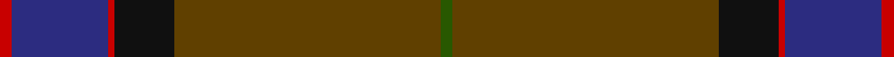
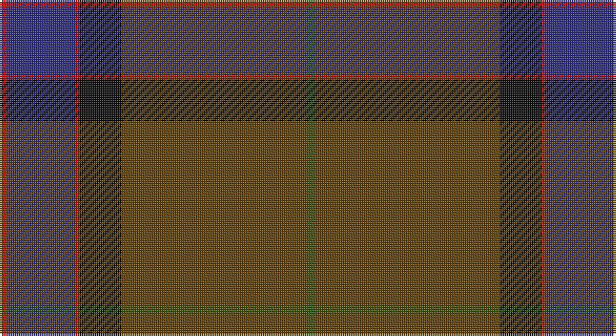

This page is one **sett** — a single exact thread-count. It belongs to the [tartan](/setts/dg2dy32dy12k10r1db16r2/)
(the same proportion at any scale), whose colour order is pattern [GGGKRBR](/stripes/gggkrbr/).

Part of the [MacWilliam Hunting](/tartans/macwilliam-hunting/) tartan — the named design grouping this sett with its other cloths.

Sourced from tartans-authority.  It is a [7 stripe tartan](/stripes/stripes7/).

Original link http://www.tartansauthority.com/tartan-ferret/display/1417/

## Also known as

This cloth is also recorded under:

- MacWilliam Htg

## Register references

External register numbers recorded for this tartan.

- Scottish Tartans Authority (ITI): 1417

## Thread count
R/4 DB32 R2 K20 T24 T64 G/4

One full sett is **292 threads**.

## Palette

Palette: <strong>Tartan Register</strong>
<table><thead><tr><th>Colour</th><th>Threads</th><th>Shade</th><th>Base</th><th>OKLCh</th></tr></thead><tbody><tr><td>R/</td><td style="text-align:right;font-variant-numeric:tabular-nums">4</td><td><code style="background-color:#C80000;">#C80000</code> <small style="color:#888">#C80000</small></td><td>R <code style="background-color:#CC0000;">#CC0000</code></td><td><small style="color:#888">oklch(52.3% 0.215 29.2)</small></td></tr><tr><td>DB</td><td style="text-align:right;font-variant-numeric:tabular-nums">32</td><td><code style="background-color:#2C2C80;">#2C2C80</code> <small style="color:#888">#2C2C80</small></td><td>B <code style="background-color:#2A418A;">#2A418A</code></td><td><small style="color:#888">oklch(35.0% 0.138 276.6)</small></td></tr><tr><td>R</td><td style="text-align:right;font-variant-numeric:tabular-nums">2</td><td><code style="background-color:#C80000;">#C80000</code> <small style="color:#888">#C80000</small></td><td>R <code style="background-color:#CC0000;">#CC0000</code></td><td><small style="color:#888">oklch(52.3% 0.215 29.2)</small></td></tr><tr><td>K</td><td style="text-align:right;font-variant-numeric:tabular-nums">20</td><td><code style="background-color:#101010;">#101010</code> <small style="color:#888">#101010</small></td><td>K <code style="background-color:#000000;">#000000</code></td><td><small style="color:#888">oklch(17.3% 0.000 89.9)</small></td></tr><tr><td>T</td><td style="text-align:right;font-variant-numeric:tabular-nums">24</td><td><code style="background-color:#604000;">#604000</code> <small style="color:#888">#604000</small></td><td>G <code style="background-color:#006100;">#006100</code></td><td><small style="color:#888">oklch(39.8% 0.083 76.8)</small></td></tr><tr><td>T</td><td style="text-align:right;font-variant-numeric:tabular-nums">64</td><td><code style="background-color:#604000;">#604000</code> <small style="color:#888">#604000</small></td><td>G <code style="background-color:#006100;">#006100</code></td><td><small style="color:#888">oklch(39.8% 0.083 76.8)</small></td></tr><tr><td>G/</td><td style="text-align:right;font-variant-numeric:tabular-nums">4</td><td><code style="background-color:#285800;">#285800</code> <small style="color:#888">#285800</small></td><td>G <code style="background-color:#006100;">#006100</code></td><td><small style="color:#888">oklch(41.0% 0.122 135.8)</small></td></tr></tbody></table>

# Sample pattern

## Compared to the master

This cloth is one sett of its design; the master sett (the exemplar the design is anchored on) is below for comparison.

<figure style="margin:0"><figcaption style="color:#888;font-size:smaller">this sett</figcaption></figure>
<figure style="margin:0"><figcaption style="color:#888;font-size:smaller"><a href="/setts/dy2dg44k10r1db16r1/">master sett →</a></figcaption></figure>

## Nearest tartans

The nearest existing variants by ΔTartan distance, with this tartan at the top so the swatches line up against it.

ΔTartan

Tartan

Sett

—

<a href="/ttd/edit/#slug=dg2dy32dy12k10r1db16r2~x2">MacWilliam Htg</a> <a class="nn-out" href="/variants/s7/dg2dy32dy12k10r1db16r2~x2/" title="open its dictionary page">↗</a>

1.22

<a href="/ttd/edit/#slug=n36k18n5dt7n5k7r1g2~x2&amp;base=dg2dy32dy12k10r1db16r2~x2">Suttle (Personal)</a> <a class="nn-out" href="/variants/s8/n36k18n5dt7n5k7r1g2~x2/" title="open its dictionary page">↗</a>

1.26

<a href="/ttd/edit/#slug=t5k1y30dp15r8y30r8dp2&amp;base=dg2dy32dy12k10r1db16r2~x2">Shaw of Tordarroch Hunting Clan Tartan</a> <a class="nn-out" href="/variants/s8/t5k1y30dp15r8y30r8dp2/" title="open its dictionary page">↗</a>

1.43

<a href="/ttd/edit/#slug=n30do9w1r5ly1~x4&amp;base=dg2dy32dy12k10r1db16r2~x2">Dunning Primary (School)</a> <a class="nn-out" href="/variants/s5/n30do9w1r5ly1~x4/" title="open its dictionary page">↗</a>

1.49

<a href="/ttd/edit/#slug=r4dg10lo1lb1dt4lb1dt25r2~x2&amp;base=dg2dy32dy12k10r1db16r2~x2">Raymond of Doune</a> <a class="nn-out" href="/variants/s8/r4dg10lo1lb1dt4lb1dt25r2~x2/" title="open its dictionary page">↗</a>

1.50

<a href="/ttd/edit/#slug=t5k1y30p15r8y30r8p2~x2&amp;base=dg2dy32dy12k10r1db16r2~x2">Shaw of Tordarroch, hunting</a> <a class="nn-out" href="/variants/s8/t5k1y30p15r8y30r8p2~x2/" title="open its dictionary page">↗</a>

1.59

<a href="/ttd/edit/#slug=db2dy18dg10dy1k10dy2dg10dy18w2~x2&amp;base=dg2dy32dy12k10r1db16r2~x2">Duchess of York (Fashion)</a> <a class="nn-out" href="/variants/s9/db2dy18dg10dy1k10dy2dg10dy18w2~x2/" title="open its dictionary page">↗</a>

1.62

<a href="/ttd/edit/#slug=do68k4do18dt20k3lb3k10lr8lo4&amp;base=dg2dy32dy12k10r1db16r2~x2">Carbon</a> <a class="nn-out" href="/variants/s9/do68k4do18dt20k3lb3k10lr8lo4/" title="open its dictionary page">↗</a>

1.63

<a href="/ttd/edit/#slug=n4dt2n7dti30n8dti7r5dt1w2~x2&amp;base=dg2dy32dy12k10r1db16r2~x2">Hebridean Heather</a> <a class="nn-out" href="/variants/s9/n4dt2n7dti30n8dti7r5dt1w2~x2/" title="open its dictionary page">↗</a>

1.64

<a href="/ttd/edit/#slug=db13k3db20dy70db20dy30w3~x2&amp;base=dg2dy32dy12k10r1db16r2~x2">Unidentified #44</a> <a class="nn-out" href="/variants/s7/db13k3db20dy70db20dy30w3~x2/" title="open its dictionary page">↗</a>

1.65

<a href="/ttd/edit/#slug=lp4dy2dp4dy35n27r3~x2&amp;base=dg2dy32dy12k10r1db16r2~x2">Deeside, Royal</a> <a class="nn-out" href="/variants/s6/lp4dy2dp4dy35n27r3~x2/" title="open its dictionary page">↗</a>

## Neighbour map

Every grey dot is one of 14360 variants placed by the first two principal components of the ΔTartan feature space (44% of its variance). Red is this tartan; blue dots are its nearest — click one to open its page.

<svg viewBox="0 0 640 380" role="img" style="max-width:100%;height:auto;border:1px solid #e0e0e0;border-radius:4px;display:block" xmlns="http://www.w3.org/2000/svg"><image href="/nn/cloud.v1.png" width="640" height="380"/><a href="/variants/s8/n36k18n5dt7n5k7r1g2~x2/"><circle cx="397.0" cy="152.9" r="4" fill="#3465a4"><title>Suttle (Personal)</title></circle></a><a href="/variants/s8/t5k1y30dp15r8y30r8dp2/"><circle cx="398.9" cy="164.5" r="4" fill="#3465a4"><title>Shaw of Tordarroch Hunting Clan Tartan</title></circle></a><a href="/variants/s5/n30do9w1r5ly1~x4/"><circle cx="465.3" cy="176.3" r="4" fill="#3465a4"><title>Dunning Primary (School)</title></circle></a><a href="/variants/s8/r4dg10lo1lb1dt4lb1dt25r2~x2/"><circle cx="416.0" cy="162.6" r="4" fill="#3465a4"><title>Raymond of Doune</title></circle></a><a href="/variants/s8/t5k1y30p15r8y30r8p2~x2/"><circle cx="387.6" cy="159.0" r="4" fill="#3465a4"><title>Shaw of Tordarroch, hunting</title></circle></a><a href="/variants/s9/db2dy18dg10dy1k10dy2dg10dy18w2~x2/"><circle cx="333.8" cy="201.6" r="4" fill="#3465a4"><title>Duchess of York (Fashion)</title></circle></a><a href="/variants/s9/do68k4do18dt20k3lb3k10lr8lo4/"><circle cx="402.9" cy="143.2" r="4" fill="#3465a4"><title>Carbon</title></circle></a><a href="/variants/s9/n4dt2n7dti30n8dti7r5dt1w2~x2/"><circle cx="368.3" cy="142.5" r="4" fill="#3465a4"><title>Hebridean Heather</title></circle></a><a href="/variants/s7/db13k3db20dy70db20dy30w3~x2/"><circle cx="481.5" cy="221.2" r="4" fill="#3465a4"><title>Unidentified #44</title></circle></a><a href="/variants/s6/lp4dy2dp4dy35n27r3~x2/"><circle cx="337.6" cy="188.7" r="4" fill="#3465a4"><title>Deeside, Royal</title></circle></a><circle cx="412.2" cy="178.8" r="5" fill="#c00000"/></svg>

ID: /variants/s7/dg2dy32dy12k10r1db16r2~x2/
