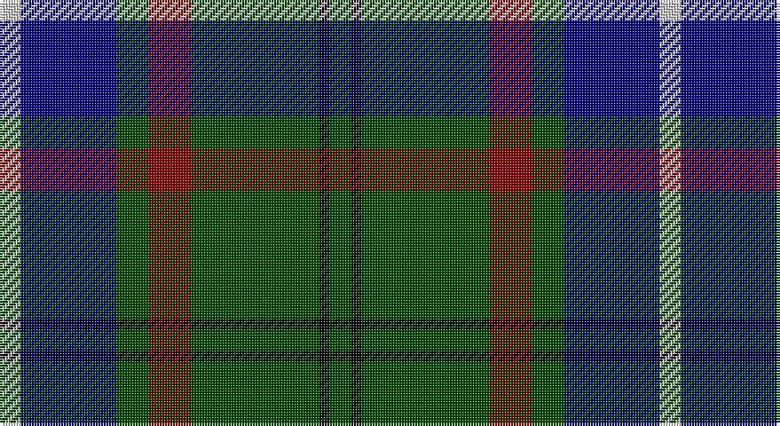

This page is one **sett** — a single exact thread-count. It belongs to the [tartan](/setts/dg2k1dg12r4dg3db9lb2/)
(the same proportion at any scale), whose colour order is pattern [GKGRGBW](/stripes/gkgrgbw/).

Sourced from register-of-tartans.  It is a [7 stripe tartan](/stripes/stripes7/).

Original link https://www.tartanregister.gov.uk/tartanDetails.aspx?ref=2080

2 attestations — the source records this cloth was collapsed from (oldest owns this page)

<ul>
<li>01/01/1995 — Lee (Personal) (register-of-tartans, <a href="https://www.tartanregister.gov.uk/tartanDetails.aspx?ref=2080">record</a>)</li>
<li>1995 — Lee (Name) (tartans-authority, <a href="http://www.tartansauthority.com/tartan-ferret/display/5407/">record</a>)</li>
</ul>

## Register references

External register numbers recorded for this tartan.

- Scottish Register of Tartans: [2080](https://www.tartanregister.gov.uk/tartanDetails.aspx?ref=2080)
- Scottish Tartans Authority (ITI): 5407

## Thread count
N/8 DB36 G12 DR16 G48 K4 G/8

One full sett is **248 threads**.

## Palette

Palette: <strong>Tartan Register</strong> <small style="color:#888">(4 of 5 colours)</small>
<table><thead><tr><th>Colour</th><th>Threads</th><th>Shade</th><th>Base</th><th>OKLCh</th></tr></thead><tbody><tr><td>N/</td><td style="text-align:right;font-variant-numeric:tabular-nums">8</td><td><code style="background-color:#C8C8C8;">#C8C8C8</code> <small style="color:#888">#C8C8C8</small></td><td>W <code style="background-color:#F7F7F7;">#F7F7F7</code></td><td><small style="color:#888">oklch(83.3% 0.000 89.9)</small></td></tr><tr><td>DB</td><td style="text-align:right;font-variant-numeric:tabular-nums">36</td><td><code style="background-color:#00008C;">#00008C</code> <small style="color:#888">#00008C</small></td><td>B <code style="background-color:#2A418A;">#2A418A</code></td><td><small style="color:#888">oklch(28.9% 0.200 264.1)</small></td></tr><tr><td>G</td><td style="text-align:right;font-variant-numeric:tabular-nums">12</td><td><code style="background-color:#004C00;">#004C00</code> <small style="color:#888">#004C00</small></td><td>G <code style="background-color:#006100;">#006100</code></td><td><small style="color:#888">oklch(36.1% 0.123 142.5)</small></td></tr><tr><td>DR</td><td style="text-align:right;font-variant-numeric:tabular-nums">16</td><td><code style="background-color:#8C0000;">#8C0000</code> <small style="color:#888">#8C0000</small></td><td>R <code style="background-color:#CC0000;">#CC0000</code></td><td><small style="color:#888">oklch(40.2% 0.165 29.2)</small></td></tr><tr><td>G</td><td style="text-align:right;font-variant-numeric:tabular-nums">48</td><td><code style="background-color:#004C00;">#004C00</code> <small style="color:#888">#004C00</small></td><td>G <code style="background-color:#006100;">#006100</code></td><td><small style="color:#888">oklch(36.1% 0.123 142.5)</small></td></tr><tr><td>K</td><td style="text-align:right;font-variant-numeric:tabular-nums">4</td><td><code style="background-color:#000000;">#000000</code> <small style="color:#888">#000000</small></td><td>K <code style="background-color:#000000;">#000000</code></td><td><small style="color:#888">oklch(0.0% 0.000 0.0)</small></td></tr><tr><td>G/</td><td style="text-align:right;font-variant-numeric:tabular-nums">8</td><td><code style="background-color:#004C00;">#004C00</code> <small style="color:#888">#004C00</small></td><td>G <code style="background-color:#006100;">#006100</code></td><td><small style="color:#888">oklch(36.1% 0.123 142.5)</small></td></tr></tbody></table>

# Sample pattern

## Nearest tartans

The nearest existing variants by ΔTartan distance, with this tartan at the top so the swatches line up against it.

ΔTartan

Tartan

Sett

—

<a href="/ttd/edit/#slug=dg2k1dg12r4dg3db9lb2~x4">Lee (Personal)</a> <a class="nn-out" href="/variants/s7/dg2k1dg12r4dg3db9lb2~x4/" title="open its dictionary page">↗</a>

0.88

<a href="/ttd/edit/#slug=db32k12db12g6r6g18k2ly3~x2&amp;base=dg2k1dg12r4dg3db9lb2~x4">Gillies</a> <a class="nn-out" href="/variants/s8/db32k12db12g6r6g18k2ly3~x2/" title="open its dictionary page">↗</a>

0.90

<a href="/ttd/edit/#slug=n10k7lt2lb2k27b7lt2b7~x2&amp;base=dg2k1dg12r4dg3db9lb2~x4">Croy, Jake (Personal)</a> <a class="nn-out" href="/variants/s8/n10k7lt2lb2k27b7lt2b7~x2/" title="open its dictionary page">↗</a>

0.93

<a href="/ttd/edit/#slug=g28k4g5dr4g5k19db19y2~x2&amp;base=dg2k1dg12r4dg3db9lb2~x4">City of Guelph</a> <a class="nn-out" href="/variants/s8/g28k4g5dr4g5k19db19y2~x2/" title="open its dictionary page">↗</a>

0.96

<a href="/ttd/edit/#slug=g26db3g12k10dp15w2~x2&amp;base=dg2k1dg12r4dg3db9lb2~x4">Lossiemouth/Hersbruck</a> <a class="nn-out" href="/variants/s6/g26db3g12k10dp15w2~x2/" title="open its dictionary page">↗</a>

1.01

<a href="/ttd/edit/#slug=g35k3dbi26k4db4w3~x2&amp;base=dg2k1dg12r4dg3db9lb2~x4">Pride of Yorkland (Fashion)</a> <a class="nn-out" href="/variants/s6/g35k3dbi26k4db4w3~x2/" title="open its dictionary page">↗</a>

1.01

<a href="/ttd/edit/#slug=k5g32db32r3db3ly3~x2&amp;base=dg2k1dg12r4dg3db9lb2~x4">Carmichael</a> <a class="nn-out" href="/variants/s6/k5g32db32r3db3ly3~x2/" title="open its dictionary page">↗</a>

1.02

<a href="/ttd/edit/#slug=g5db24g7k10g24ly2db2ly2r2~x2&amp;base=dg2k1dg12r4dg3db9lb2~x4">Maitland Chief</a> <a class="nn-out" href="/variants/s9/g5db24g7k10g24ly2db2ly2r2~x2/" title="open its dictionary page">↗</a>

1.07

<a href="/ttd/edit/#slug=w4g28db18r4db18ly3~x2&amp;base=dg2k1dg12r4dg3db9lb2~x4">MacIntyre, Inglis</a> <a class="nn-out" href="/variants/s6/w4g28db18r4db18ly3~x2/" title="open its dictionary page">↗</a>

1.07

<a href="/ttd/edit/#slug=k7db4dg31db3ly2db27lb4~x2&amp;base=dg2k1dg12r4dg3db9lb2~x4">Wishart Htg (Clan)</a> <a class="nn-out" href="/variants/s7/k7db4dg31db3ly2db27lb4~x2/" title="open its dictionary page">↗</a>

1.07

<a href="/ttd/edit/#slug=r4db24w2g13db2k3~x4&amp;base=dg2k1dg12r4dg3db9lb2~x4">Vance (Family Association)</a> <a class="nn-out" href="/variants/s6/r4db24w2g13db2k3~x4/" title="open its dictionary page">↗</a>

## Neighbour map

Every grey dot is one of 14360 variants placed by the first two principal components of the ΔTartan feature space (44% of its variance). Red is this tartan; blue dots are its nearest — click one to open its page.

<svg viewBox="0 0 640 380" role="img" style="max-width:100%;height:auto;border:1px solid #e0e0e0;border-radius:4px;display:block" xmlns="http://www.w3.org/2000/svg"><image href="/nn/cloud.v1.png" width="640" height="380"/><a href="/variants/s8/db32k12db12g6r6g18k2ly3~x2/"><circle cx="221.6" cy="168.7" r="4" fill="#3465a4"><title>Gillies</title></circle></a><a href="/variants/s8/n10k7lt2lb2k27b7lt2b7~x2/"><circle cx="266.5" cy="169.9" r="4" fill="#3465a4"><title>Croy, Jake (Personal)</title></circle></a><a href="/variants/s8/g28k4g5dr4g5k19db19y2~x2/"><circle cx="209.2" cy="180.2" r="4" fill="#3465a4"><title>City of Guelph</title></circle></a><a href="/variants/s6/g26db3g12k10dp15w2~x2/"><circle cx="275.1" cy="208.3" r="4" fill="#3465a4"><title>Lossiemouth/Hersbruck</title></circle></a><a href="/variants/s6/g35k3dbi26k4db4w3~x2/"><circle cx="252.4" cy="188.9" r="4" fill="#3465a4"><title>Pride of Yorkland (Fashion)</title></circle></a><a href="/variants/s6/k5g32db32r3db3ly3~x2/"><circle cx="250.5" cy="189.2" r="4" fill="#3465a4"><title>Carmichael</title></circle></a><a href="/variants/s9/g5db24g7k10g24ly2db2ly2r2~x2/"><circle cx="241.5" cy="173.8" r="4" fill="#3465a4"><title>Maitland Chief</title></circle></a><a href="/variants/s6/w4g28db18r4db18ly3~x2/"><circle cx="223.6" cy="207.3" r="4" fill="#3465a4"><title>MacIntyre, Inglis</title></circle></a><a href="/variants/s7/k7db4dg31db3ly2db27lb4~x2/"><circle cx="246.6" cy="169.8" r="4" fill="#3465a4"><title>Wishart Htg (Clan)</title></circle></a><a href="/variants/s6/r4db24w2g13db2k3~x4/"><circle cx="276.8" cy="179.4" r="4" fill="#3465a4"><title>Vance (Family Association)</title></circle></a><circle cx="248.2" cy="195.6" r="5" fill="#c00000"/></svg>

ID: /variants/s7/dg2k1dg12r4dg3db9lb2~x4/
