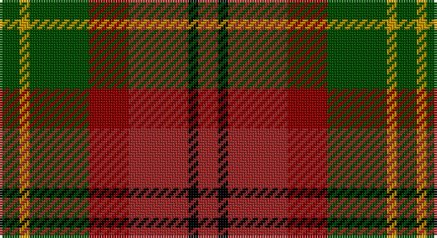

This page is one **sett** — a single exact thread-count. It belongs to the [tartan](/setts/dg2ly1dg6ri4r6k1r2/)
(the same proportion at any scale), whose colour order is pattern [GYGRRKR](/stripes/gygrrkr/).

Part of the [Unidentified Printing](/tartans/unidentified-printing/) tartan — the named design grouping this sett with its other cloths.

Sourced from register-of-tartans.  It is a [7 stripe tartan](/stripes/stripes7/).

Original link https://www.tartanregister.gov.uk/tartanDetails.aspx?ref=4361

## Also known as

This cloth is also recorded under:

- Unidentified Printing #2
- Unidentified Printing #3

## Register references

External register numbers recorded for this tartan.

- Scottish Register of Tartans: [4361](https://www.tartanregister.gov.uk/tartanDetails.aspx?ref=4361)
- Scottish Tartans Authority (ITI): 5049

## Thread count
G/8 DY4 G24 DR16 DRa24 K4 DRa/8

One full sett is **160 threads**.

## Palette

Palette: <strong>Tartan Register</strong> <small style="color:#888">(3 of 5 colours)</small>
<table><thead><tr><th>Colour</th><th>Threads</th><th>Shade</th><th>Base</th><th>OKLCh</th></tr></thead><tbody><tr><td>G/</td><td style="text-align:right;font-variant-numeric:tabular-nums">8</td><td><code style="background-color:#004C00;">#004C00</code> <small style="color:#888">#004C00</small></td><td>G <code style="background-color:#006100;">#006100</code></td><td><small style="color:#888">oklch(36.1% 0.123 142.5)</small></td></tr><tr><td>DY</td><td style="text-align:right;font-variant-numeric:tabular-nums">4</td><td><code style="background-color:#C89800;">#C89800</code> <small style="color:#888">#C89800</small></td><td>Y <code style="background-color:#F2BF00;">#F2BF00</code></td><td><small style="color:#888">oklch(70.6% 0.144 85.9)</small></td></tr><tr><td>G</td><td style="text-align:right;font-variant-numeric:tabular-nums">24</td><td><code style="background-color:#004C00;">#004C00</code> <small style="color:#888">#004C00</small></td><td>G <code style="background-color:#006100;">#006100</code></td><td><small style="color:#888">oklch(36.1% 0.123 142.5)</small></td></tr><tr><td>DR</td><td style="text-align:right;font-variant-numeric:tabular-nums">16</td><td><code style="background-color:#8C0000;">#8C0000</code> <small style="color:#888">#8C0000</small></td><td>R <code style="background-color:#CC0000;">#CC0000</code></td><td><small style="color:#888">oklch(40.2% 0.165 29.2)</small></td></tr><tr><td>DRa</td><td style="text-align:right;font-variant-numeric:tabular-nums">24</td><td><code style="background-color:#A02828;">#A02828</code> <small style="color:#888">#A02828</small></td><td>R <code style="background-color:#CC0000;">#CC0000</code></td><td><small style="color:#888">oklch(46.9% 0.157 25.6)</small></td></tr><tr><td>K</td><td style="text-align:right;font-variant-numeric:tabular-nums">4</td><td><code style="background-color:#000000;">#000000</code> <small style="color:#888">#000000</small></td><td>K <code style="background-color:#000000;">#000000</code></td><td><small style="color:#888">oklch(0.0% 0.000 0.0)</small></td></tr><tr><td>DRa/</td><td style="text-align:right;font-variant-numeric:tabular-nums">8</td><td><code style="background-color:#A02828;">#A02828</code> <small style="color:#888">#A02828</small></td><td>R <code style="background-color:#CC0000;">#CC0000</code></td><td><small style="color:#888">oklch(46.9% 0.157 25.6)</small></td></tr></tbody></table>

# Sample pattern

## Nearest tartans

The nearest existing variants by ΔTartan distance, with this tartan at the top so the swatches line up against it.

ΔTartan

Tartan

Sett

—

<a href="/ttd/edit/#slug=dg2ly1dg6ri4r6k1r2~x4">Unidentified Printing #3</a> <a class="nn-out" href="/variants/s7/dg2ly1dg6ri4r6k1r2~x4/" title="open its dictionary page">↗</a>

1.26

<a href="/ttd/edit/#slug=r5ly3r19do6ly5do6dg12db5dg12db3~x2&amp;base=dg2ly1dg6ri4r6k1r2~x4">Roscommon, County</a> <a class="nn-out" href="/variants/s10/r5ly3r19do6ly5do6dg12db5dg12db3~x2/" title="open its dictionary page">↗</a>

1.27

<a href="/ttd/edit/#slug=lo3do2o14lo8do14dg16o13do2lo3~x2&amp;base=dg2ly1dg6ri4r6k1r2~x4">Monaghan, County (District)</a> <a class="nn-out" href="/variants/s9/lo3do2o14lo8do14dg16o13do2lo3~x2/" title="open its dictionary page">↗</a>

1.31

<a href="/ttd/edit/#slug=lo3dy2o14dg17dy14lo8o14dy2lo3~x2&amp;base=dg2ly1dg6ri4r6k1r2~x4">Monaghan Irish County Tartan</a> <a class="nn-out" href="/variants/s9/lo3dy2o14dg17dy14lo8o14dy2lo3~x2/" title="open its dictionary page">↗</a>

1.35

<a href="/ttd/edit/#slug=k5do1g3do1g3do1k5r1ri5r1~x4&amp;base=dg2ly1dg6ri4r6k1r2~x4">Murdoch (Dalgliesh)</a> <a class="nn-out" href="/variants/s10/k5do1g3do1g3do1k5r1ri5r1~x4/" title="open its dictionary page">↗</a>

1.37

<a href="/ttd/edit/#slug=db8lo1g12r10y2r6y2r4~x4&amp;base=dg2ly1dg6ri4r6k1r2~x4">Indiana &quot;Cardinal&quot; (District)</a> <a class="nn-out" href="/variants/s8/db8lo1g12r10y2r6y2r4~x4/" title="open its dictionary page">↗</a>

1.37

<a href="/ttd/edit/#slug=g2lo9do6r3do2r3do2r10w2~x4&amp;base=dg2ly1dg6ri4r6k1r2~x4">Tinkler (Corporate)</a> <a class="nn-out" href="/variants/s9/g2lo9do6r3do2r3do2r10w2~x4/" title="open its dictionary page">↗</a>

1.40

<a href="/ttd/edit/#slug=ly1dy10k8r8dy1lyi1~x4&amp;base=dg2ly1dg6ri4r6k1r2~x4">Unidentified #66</a> <a class="nn-out" href="/variants/s6/ly1dy10k8r8dy1lyi1~x4/" title="open its dictionary page">↗</a>

1.40

<a href="/ttd/edit/#slug=dg19r3dg3r15lo13r15dg3r3dg19ly6lo6dy6~x2&amp;base=dg2ly1dg6ri4r6k1r2~x4">Maple Leaf</a> <a class="nn-out" href="/variants/s12/dg19r3dg3r15lo13r15dg3r3dg19ly6lo6dy6~x2/" title="open its dictionary page">↗</a>

1.43

<a href="/ttd/edit/#slug=lb4dg13g6r16lbi2r2g2~x2&amp;base=dg2ly1dg6ri4r6k1r2~x4">Caledonian Brewery (Corporate)</a> <a class="nn-out" href="/variants/s7/lb4dg13g6r16lbi2r2g2~x2/" title="open its dictionary page">↗</a>

1.47

<a href="/variants/s11/dyi6m2dyi2m4dyi13dy12o13m4o2m2o6~x2/">Glenmorangie #2</a>

## Neighbour map

Every grey dot is one of 14360 variants placed by the first two principal components of the ΔTartan feature space (44% of its variance). Red is this tartan; blue dots are its nearest — click one to open its page.

<svg viewBox="0 0 640 380" role="img" style="max-width:100%;height:auto;border:1px solid #e0e0e0;border-radius:4px;display:block" xmlns="http://www.w3.org/2000/svg"><image href="/nn/cloud.v1.png" width="640" height="380"/><a href="/variants/s10/r5ly3r19do6ly5do6dg12db5dg12db3~x2/"><circle cx="116.6" cy="209.2" r="4" fill="#3465a4"><title>Roscommon, County</title></circle></a><a href="/variants/s9/lo3do2o14lo8do14dg16o13do2lo3~x2/"><circle cx="201.7" cy="232.2" r="4" fill="#3465a4"><title>Monaghan, County (District)</title></circle></a><a href="/variants/s9/lo3dy2o14dg17dy14lo8o14dy2lo3~x2/"><circle cx="186.7" cy="222.3" r="4" fill="#3465a4"><title>Monaghan Irish County Tartan</title></circle></a><a href="/variants/s10/k5do1g3do1g3do1k5r1ri5r1~x4/"><circle cx="147.8" cy="225.5" r="4" fill="#3465a4"><title>Murdoch (Dalgliesh)</title></circle></a><a href="/variants/s8/db8lo1g12r10y2r6y2r4~x4/"><circle cx="236.4" cy="206.1" r="4" fill="#3465a4"><title>Indiana &quot;Cardinal&quot; (District)</title></circle></a><a href="/variants/s9/g2lo9do6r3do2r3do2r10w2~x4/"><circle cx="159.0" cy="206.4" r="4" fill="#3465a4"><title>Tinkler (Corporate)</title></circle></a><a href="/variants/s6/ly1dy10k8r8dy1lyi1~x4/"><circle cx="219.4" cy="215.3" r="4" fill="#3465a4"><title>Unidentified #66</title></circle></a><a href="/variants/s12/dg19r3dg3r15lo13r15dg3r3dg19ly6lo6dy6~x2/"><circle cx="161.5" cy="201.8" r="4" fill="#3465a4"><title>Maple Leaf</title></circle></a><a href="/variants/s7/lb4dg13g6r16lbi2r2g2~x2/"><circle cx="185.0" cy="198.0" r="4" fill="#3465a4"><title>Caledonian Brewery (Corporate)</title></circle></a><a href="/variants/s11/dyi6m2dyi2m4dyi13dy12o13m4o2m2o6~x2/"><circle cx="181.7" cy="226.0" r="4" fill="#3465a4"><title>Glenmorangie #2</title></circle></a><circle cx="180.1" cy="236.2" r="5" fill="#c00000"/></svg>

ID: /variants/s7/dg2ly1dg6ri4r6k1r2~x4/
