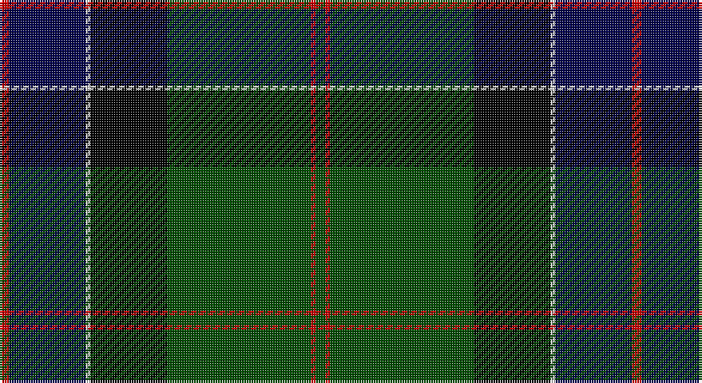

This page is one **sett** — a single exact thread-count. It belongs to the [tartan](/setts/dg2r1dg30k16lb1db16r2/)
(the same proportion at any scale), whose colour order is pattern [GRGKWBR](/stripes/grgkwbr/).

Sourced from weddslist.  It is a [7 stripe tartan](/stripes/stripes7/).

Original link http://www.weddslist.com/cgi-bin/tartans/pg.pl?source=rb

## Thread count
R/4 DB32 N2 K32 G60 R2 G/4

One full sett is **264 threads**.

## Palette

Palette: <strong>Tartan Register</strong> <small style="color:#888">(3 of 5 colours)</small>
<table><thead><tr><th>Colour</th><th>Threads</th><th>Shade</th><th>Base</th><th>OKLCh</th></tr></thead><tbody><tr><td>R/</td><td style="text-align:right;font-variant-numeric:tabular-nums">4</td><td><code style="background-color:#C80000;">#C80000</code> <small style="color:#888">#C80000</small></td><td>R <code style="background-color:#CC0000;">#CC0000</code></td><td><small style="color:#888">oklch(52.3% 0.215 29.2)</small></td></tr><tr><td>DB</td><td style="text-align:right;font-variant-numeric:tabular-nums">32</td><td><code style="background-color:#00004C;">#00004C</code> <small style="color:#888">#00004C</small></td><td>B <code style="background-color:#2A418A;">#2A418A</code></td><td><small style="color:#888">oklch(18.8% 0.130 264.1)</small></td></tr><tr><td>N</td><td style="text-align:right;font-variant-numeric:tabular-nums">2</td><td><code style="background-color:#D0D0D0;">#D0D0D0</code> <small style="color:#888">#D0D0D0</small></td><td>W <code style="background-color:#F7F7F7;">#F7F7F7</code></td><td><small style="color:#888">oklch(85.8% 0.000 89.9)</small></td></tr><tr><td>K</td><td style="text-align:right;font-variant-numeric:tabular-nums">32</td><td><code style="background-color:#000000;">#000000</code> <small style="color:#888">#000000</small></td><td>K <code style="background-color:#000000;">#000000</code></td><td><small style="color:#888">oklch(0.0% 0.000 0.0)</small></td></tr><tr><td>G</td><td style="text-align:right;font-variant-numeric:tabular-nums">60</td><td><code style="background-color:#004C00;">#004C00</code> <small style="color:#888">#004C00</small></td><td>G <code style="background-color:#006100;">#006100</code></td><td><small style="color:#888">oklch(36.1% 0.123 142.5)</small></td></tr><tr><td>R</td><td style="text-align:right;font-variant-numeric:tabular-nums">2</td><td><code style="background-color:#C80000;">#C80000</code> <small style="color:#888">#C80000</small></td><td>R <code style="background-color:#CC0000;">#CC0000</code></td><td><small style="color:#888">oklch(52.3% 0.215 29.2)</small></td></tr><tr><td>G/</td><td style="text-align:right;font-variant-numeric:tabular-nums">4</td><td><code style="background-color:#004C00;">#004C00</code> <small style="color:#888">#004C00</small></td><td>G <code style="background-color:#006100;">#006100</code></td><td><small style="color:#888">oklch(36.1% 0.123 142.5)</small></td></tr></tbody></table>

# Sample pattern

## Nearest tartans

The nearest existing variants by ΔTartan distance, with this tartan at the top so the swatches line up against it.

ΔTartan

Tartan

Sett

—

<a href="/ttd/edit/#slug=dg2r1dg30k16lb1db16r2~x2">Sinclair Hunting</a> <a class="nn-out" href="/variants/s7/dg2r1dg30k16lb1db16r2~x2/" title="open its dictionary page">↗</a>

0.46

<a href="/ttd/edit/#slug=dg2r1dg30k16lr1db16r2~x2&amp;base=dg2r1dg30k16lb1db16r2~x2">Sinclair Hunting</a> <a class="nn-out" href="/variants/s7/dg2r1dg30k16lr1db16r2~x2/" title="open its dictionary page">↗</a>

0.83

<a href="/ttd/edit/#slug=lr4dg30k1dg1k1dg3k12db10r3~x2&amp;base=dg2r1dg30k16lb1db16r2~x2">MacDonnald of ye Ylis</a> <a class="nn-out" href="/variants/s9/lr4dg30k1dg1k1dg3k12db10r3~x2/" title="open its dictionary page">↗</a>

0.83

<a href="/ttd/edit/#slug=lr4dg30k1dg1k1dg3k12db10r3&amp;base=dg2r1dg30k16lb1db16r2~x2">MacDonnald of ye Ylis</a> <a class="nn-out" href="/variants/s9/lr4dg30k1dg1k1dg3k12db10r3/" title="open its dictionary page">↗</a>

0.94

<a href="/ttd/edit/#slug=db4k2db16lb1k8dg24r4&amp;base=dg2r1dg30k16lb1db16r2~x2">Colquhoun VS</a> <a class="nn-out" href="/variants/s7/db4k2db16lb1k8dg24r4/" title="open its dictionary page">↗</a>

0.98

<a href="/ttd/edit/#slug=db28ly1db2k16dg24k1dg2r3~x2&amp;base=dg2r1dg30k16lb1db16r2~x2">Ogilvy VS</a> <a class="nn-out" href="/variants/s8/db28ly1db2k16dg24k1dg2r3~x2/" title="open its dictionary page">↗</a>

1.02

<a href="/ttd/edit/#slug=db24k8dg8r2dg8k1lb2&amp;base=dg2r1dg30k16lb1db16r2~x2">Fergusson</a> <a class="nn-out" href="/variants/s7/db24k8dg8r2dg8k1lb2/" title="open its dictionary page">↗</a>

1.05

<a href="/ttd/edit/#slug=db4k2db16lr1k8dg24r4~x2&amp;base=dg2r1dg30k16lb1db16r2~x2">Colqhoun VS</a> <a class="nn-out" href="/variants/s7/db4k2db16lr1k8dg24r4~x2/" title="open its dictionary page">↗</a>

1.05

<a href="/ttd/edit/#slug=lb4dg30k1dg1k1dg3k12db10r3&amp;base=dg2r1dg30k16lb1db16r2~x2">MacDonnald of ye Ylis</a> <a class="nn-out" href="/variants/s9/lb4dg30k1dg1k1dg3k12db10r3/" title="open its dictionary page">↗</a>

1.09

<a href="/ttd/edit/#slug=db24ly2k8dg16k1dg3k1dg3r4~x2&amp;base=dg2r1dg30k16lb1db16r2~x2">Ogilvy Hunting</a> <a class="nn-out" href="/variants/s9/db24ly2k8dg16k1dg3k1dg3r4~x2/" title="open its dictionary page">↗</a>

1.11

<a href="/ttd/edit/#slug=db24k8dg8r2dg8k1ly2~x2&amp;base=dg2r1dg30k16lb1db16r2~x2">MacLaren</a> <a class="nn-out" href="/variants/s7/db24k8dg8r2dg8k1ly2~x2/" title="open its dictionary page">↗</a>

## Neighbour map

Every grey dot is one of 14360 variants placed by the first two principal components of the ΔTartan feature space (44% of its variance). Red is this tartan; blue dots are its nearest — click one to open its page.

<svg viewBox="0 0 640 380" role="img" style="max-width:100%;height:auto;border:1px solid #e0e0e0;border-radius:4px;display:block" xmlns="http://www.w3.org/2000/svg"><image href="/nn/cloud.v1.png" width="640" height="380"/><a href="/variants/s7/dg2r1dg30k16lr1db16r2~x2/"><circle cx="292.7" cy="155.2" r="4" fill="#3465a4"><title>Sinclair Hunting</title></circle></a><a href="/variants/s9/lr4dg30k1dg1k1dg3k12db10r3~x2/"><circle cx="304.4" cy="126.0" r="4" fill="#3465a4"><title>MacDonnald of ye Ylis</title></circle></a><a href="/variants/s9/lr4dg30k1dg1k1dg3k12db10r3/"><circle cx="304.4" cy="126.0" r="4" fill="#3465a4"><title>MacDonnald of ye Ylis</title></circle></a><a href="/variants/s7/db4k2db16lb1k8dg24r4/"><circle cx="232.5" cy="163.8" r="4" fill="#3465a4"><title>Colquhoun VS</title></circle></a><a href="/variants/s8/db28ly1db2k16dg24k1dg2r3~x2/"><circle cx="250.1" cy="147.9" r="4" fill="#3465a4"><title>Ogilvy VS</title></circle></a><a href="/variants/s7/db24k8dg8r2dg8k1lb2/"><circle cx="254.1" cy="163.1" r="4" fill="#3465a4"><title>Fergusson</title></circle></a><a href="/variants/s7/db4k2db16lr1k8dg24r4~x2/"><circle cx="248.6" cy="171.9" r="4" fill="#3465a4"><title>Colqhoun VS</title></circle></a><a href="/variants/s9/lb4dg30k1dg1k1dg3k12db10r3/"><circle cx="290.0" cy="119.2" r="4" fill="#3465a4"><title>MacDonnald of ye Ylis</title></circle></a><a href="/variants/s9/db24ly2k8dg16k1dg3k1dg3r4~x2/"><circle cx="225.7" cy="140.0" r="4" fill="#3465a4"><title>Ogilvy Hunting</title></circle></a><a href="/variants/s7/db24k8dg8r2dg8k1ly2~x2/"><circle cx="267.4" cy="170.0" r="4" fill="#3465a4"><title>MacLaren</title></circle></a><circle cx="280.2" cy="149.4" r="5" fill="#c00000"/></svg>

ID: /variants/s7/dg2r1dg30k16lb1db16r2~x2/
