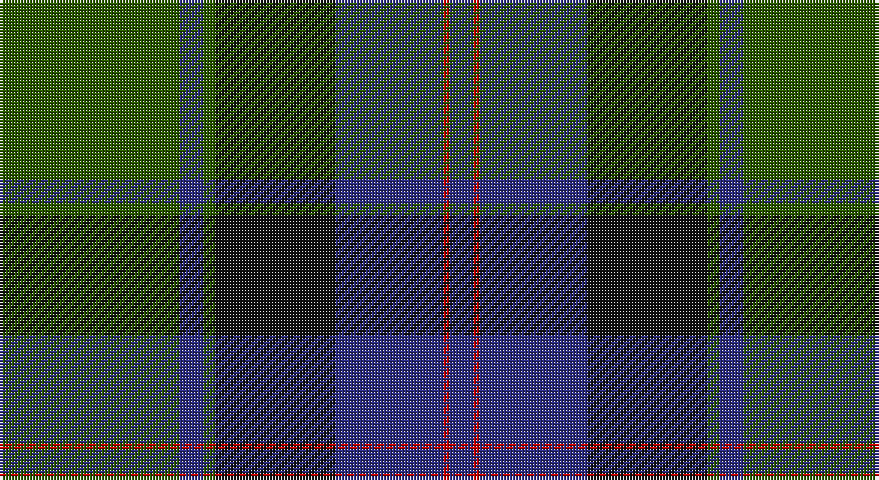

This page is one **sett** — a single exact thread-count. It belongs to the [tartan](/setts/dg30db4dg2k20db18r1db4/)
(the same proportion at any scale), whose colour order is pattern [BRBKGBG](/stripes/brbkgbg/).

Part of the [MacTaggart](/tartans/mactaggart/) tartan — the named design grouping this sett with its other cloths.

Sourced from register-of-tartans.  It is a [7 stripe tartan](/stripes/stripes7/).

Original link https://www.tartanregister.gov.uk/tartanDetails.aspx?ref=2766

2 attestations — the source records this cloth was collapsed from (oldest owns this page)

<ul>
<li>01/01/2002 — MacTaggart (register-of-tartans, <a href="https://www.tartanregister.gov.uk/tartanDetails.aspx?ref=2766">record</a>)</li>
<li>pre 2002 — MacTaggart (Clan) (tartans-authority, <a href="http://www.tartansauthority.com/tartan-ferret/display/409/">record</a>)</li>
</ul>

## Register references

External register numbers recorded for this tartan.

- Scottish Register of Tartans: [2766](https://www.tartanregister.gov.uk/tartanDetails.aspx?ref=2766)
- Scottish Tartans Authority (ITI): 409
- Scottish Tartans World Register: 409

## Thread count
G/60 DB8 G4 K40 DB36 R2 DB/8

One full sett is **248 threads**.

## Palette

Palette: <strong>Tartan Register</strong>
<table><thead><tr><th>Colour</th><th>Threads</th><th>Shade</th><th>Base</th><th>OKLCh</th></tr></thead><tbody><tr><td>G/</td><td style="text-align:right;font-variant-numeric:tabular-nums">60</td><td><code style="background-color:#285800;">#285800</code> <small style="color:#888">#285800</small></td><td>G <code style="background-color:#006100;">#006100</code></td><td><small style="color:#888">oklch(41.0% 0.122 135.8)</small></td></tr><tr><td>DB</td><td style="text-align:right;font-variant-numeric:tabular-nums">8</td><td><code style="background-color:#2C2C80;">#2C2C80</code> <small style="color:#888">#2C2C80</small></td><td>B <code style="background-color:#2A418A;">#2A418A</code></td><td><small style="color:#888">oklch(35.0% 0.138 276.6)</small></td></tr><tr><td>G</td><td style="text-align:right;font-variant-numeric:tabular-nums">4</td><td><code style="background-color:#285800;">#285800</code> <small style="color:#888">#285800</small></td><td>G <code style="background-color:#006100;">#006100</code></td><td><small style="color:#888">oklch(41.0% 0.122 135.8)</small></td></tr><tr><td>K</td><td style="text-align:right;font-variant-numeric:tabular-nums">40</td><td><code style="background-color:#101010;">#101010</code> <small style="color:#888">#101010</small></td><td>K <code style="background-color:#000000;">#000000</code></td><td><small style="color:#888">oklch(17.3% 0.000 89.9)</small></td></tr><tr><td>DB</td><td style="text-align:right;font-variant-numeric:tabular-nums">36</td><td><code style="background-color:#2C2C80;">#2C2C80</code> <small style="color:#888">#2C2C80</small></td><td>B <code style="background-color:#2A418A;">#2A418A</code></td><td><small style="color:#888">oklch(35.0% 0.138 276.6)</small></td></tr><tr><td>R</td><td style="text-align:right;font-variant-numeric:tabular-nums">2</td><td><code style="background-color:#C80000;">#C80000</code> <small style="color:#888">#C80000</small></td><td>R <code style="background-color:#CC0000;">#CC0000</code></td><td><small style="color:#888">oklch(52.3% 0.215 29.2)</small></td></tr><tr><td>DB/</td><td style="text-align:right;font-variant-numeric:tabular-nums">8</td><td><code style="background-color:#2C2C80;">#2C2C80</code> <small style="color:#888">#2C2C80</small></td><td>B <code style="background-color:#2A418A;">#2A418A</code></td><td><small style="color:#888">oklch(35.0% 0.138 276.6)</small></td></tr></tbody></table>

# Sample pattern

## Compared to the master

This cloth is one sett of its design; the master sett (the exemplar the design is anchored on) is below for comparison.

<figure style="margin:0"><figcaption style="color:#888;font-size:smaller">this sett</figcaption></figure>
<figure style="margin:0"><figcaption style="color:#888;font-size:smaller"><a href="/setts/db1r1db6k6g1b2g9b2g1k6db6r1/">master sett →</a></figcaption></figure>

## Nearest tartans

The nearest existing variants by ΔTartan distance, with this tartan at the top so the swatches line up against it.

ΔTartan

Tartan

Sett

—

<a href="/ttd/edit/#slug=dg30db4dg2k20db18r1db4~x2">MacTaggart</a> <a class="nn-out" href="/variants/s7/dg30db4dg2k20db18r1db4~x2/" title="open its dictionary page">↗</a>

0.81

<a href="/ttd/edit/#slug=k4db16k12g24r1g2k2~x2&amp;base=dg30db4dg2k20db18r1db4~x2">Dundas Clan Tartan</a> <a class="nn-out" href="/variants/s7/k4db16k12g24r1g2k2~x2/" title="open its dictionary page">↗</a>

1.00

<a href="/ttd/edit/#slug=k3db3k3db22dg26k2db1ly3~x2&amp;base=dg30db4dg2k20db18r1db4~x2">Johnstone/Johnston</a> <a class="nn-out" href="/variants/s8/k3db3k3db22dg26k2db1ly3~x2/" title="open its dictionary page">↗</a>

1.07

<a href="/ttd/edit/#slug=db26k1db2k18ly2g16k16~x2&amp;base=dg30db4dg2k20db18r1db4~x2">Mowat</a> <a class="nn-out" href="/variants/s7/db26k1db2k18ly2g16k16~x2/" title="open its dictionary page">↗</a>

1.07

<a href="/ttd/edit/#slug=db4k2db16w1k8dg24r4~x2&amp;base=dg30db4dg2k20db18r1db4~x2">Colquhoun</a> <a class="nn-out" href="/variants/s7/db4k2db16w1k8dg24r4~x2/" title="open its dictionary page">↗</a>

1.08

<a href="/ttd/edit/#slug=r2dg13r2dg13k13dt30k1ly2~x2&amp;base=dg30db4dg2k20db18r1db4~x2">Chan (Name?)</a> <a class="nn-out" href="/variants/s8/r2dg13r2dg13k13dt30k1ly2~x2/" title="open its dictionary page">↗</a>

1.13

<a href="/ttd/edit/#slug=dp6o2dp1g25db16k2db4~x2&amp;base=dg30db4dg2k20db18r1db4~x2">Lawrie Clan Tartan</a> <a class="nn-out" href="/variants/s7/dp6o2dp1g25db16k2db4~x2/" title="open its dictionary page">↗</a>

1.17

<a href="/ttd/edit/#slug=dp6r2dp1g25db16k2db4~x2&amp;base=dg30db4dg2k20db18r1db4~x2">Laurie Clan Tartan</a> <a class="nn-out" href="/variants/s7/dp6r2dp1g25db16k2db4~x2/" title="open its dictionary page">↗</a>

1.20

<a href="/ttd/edit/#slug=dp6ly2dp1g25db16k2db4~x2&amp;base=dg30db4dg2k20db18r1db4~x2">Lowry</a> <a class="nn-out" href="/variants/s7/dp6ly2dp1g25db16k2db4~x2/" title="open its dictionary page">↗</a>

1.20

<a href="/ttd/edit/#slug=dg5k1ly2k1dg19k15ly2dt20dg3~x2&amp;base=dg30db4dg2k20db18r1db4~x2">Maine Acadia (Fashion)</a> <a class="nn-out" href="/variants/s9/dg5k1ly2k1dg19k15ly2dt20dg3~x2/" title="open its dictionary page">↗</a>

1.21

<a href="/ttd/edit/#slug=k4db16k12g12r1g2k2~x2&amp;base=dg30db4dg2k20db18r1db4~x2">Dundas #2</a> <a class="nn-out" href="/variants/s7/k4db16k12g12r1g2k2~x2/" title="open its dictionary page">↗</a>

## Neighbour map

Every grey dot is one of 14360 variants placed by the first two principal components of the ΔTartan feature space (44% of its variance). Red is this tartan; blue dots are its nearest — click one to open its page.

<svg viewBox="0 0 640 380" role="img" style="max-width:100%;height:auto;border:1px solid #e0e0e0;border-radius:4px;display:block" xmlns="http://www.w3.org/2000/svg"><image href="/nn/cloud.v1.png" width="640" height="380"/><a href="/variants/s7/k4db16k12g24r1g2k2~x2/"><circle cx="292.0" cy="191.6" r="4" fill="#3465a4"><title>Dundas Clan Tartan</title></circle></a><a href="/variants/s8/k3db3k3db22dg26k2db1ly3~x2/"><circle cx="320.9" cy="171.5" r="4" fill="#3465a4"><title>Johnstone/Johnston</title></circle></a><a href="/variants/s7/db26k1db2k18ly2g16k16~x2/"><circle cx="286.8" cy="199.5" r="4" fill="#3465a4"><title>Mowat</title></circle></a><a href="/variants/s7/db4k2db16w1k8dg24r4~x2/"><circle cx="265.3" cy="175.7" r="4" fill="#3465a4"><title>Colquhoun</title></circle></a><a href="/variants/s8/r2dg13r2dg13k13dt30k1ly2~x2/"><circle cx="284.4" cy="169.6" r="4" fill="#3465a4"><title>Chan (Name?)</title></circle></a><a href="/variants/s7/dp6o2dp1g25db16k2db4~x2/"><circle cx="304.5" cy="170.4" r="4" fill="#3465a4"><title>Lawrie Clan Tartan</title></circle></a><a href="/variants/s7/dp6r2dp1g25db16k2db4~x2/"><circle cx="299.5" cy="166.8" r="4" fill="#3465a4"><title>Laurie Clan Tartan</title></circle></a><a href="/variants/s7/dp6ly2dp1g25db16k2db4~x2/"><circle cx="303.8" cy="170.1" r="4" fill="#3465a4"><title>Lowry</title></circle></a><a href="/variants/s9/dg5k1ly2k1dg19k15ly2dt20dg3~x2/"><circle cx="262.9" cy="182.6" r="4" fill="#3465a4"><title>Maine Acadia (Fashion)</title></circle></a><a href="/variants/s7/k4db16k12g12r1g2k2~x2/"><circle cx="248.8" cy="217.5" r="4" fill="#3465a4"><title>Dundas #2</title></circle></a><circle cx="311.3" cy="192.9" r="5" fill="#c00000"/></svg>

ID: /variants/s7/dg30db4dg2k20db18r1db4~x2/
