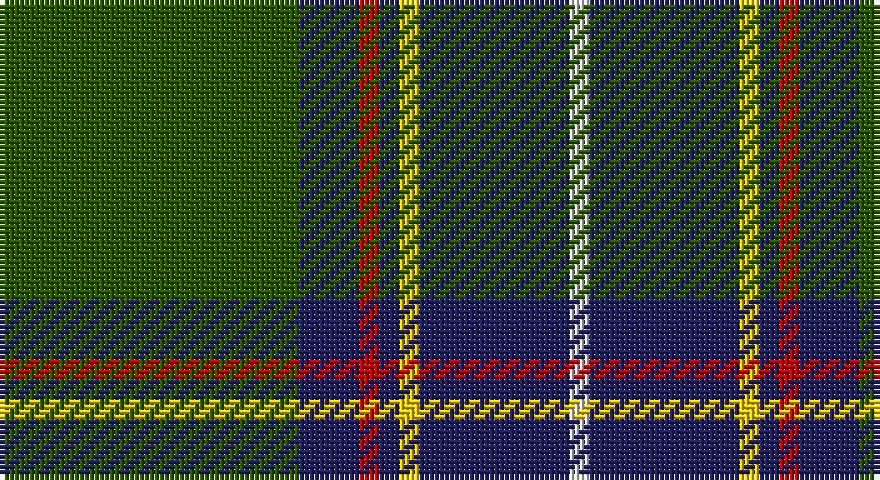

This page is one **sett** — a single exact thread-count. It belongs to the [tartan](/setts/dg30db6r2db2ly2db15w2/)
(the same proportion at any scale), whose colour order is pattern [GBRBYBW](/stripes/gbrbybw/).

Part of the [Hydesville Tower](/tartans/hydesville-tower/) tartan — the named design grouping this sett with its other cloths.

Sourced from tartans-authority.  It is a [7 stripe tartan](/stripes/stripes7/).

Original link http://www.tartansauthority.com/tartan-ferret/display/3993/

## Register references

External register numbers recorded for this tartan.

- Scottish Tartans Authority (ITI): 3993

## Thread count
G/60 DB12 R4 DB4 Y4 DB30 LN/4

One full sett is **172 threads**.

## Palette

Palette: <strong>Tartan Register</strong>
<table><thead><tr><th>Colour</th><th>Threads</th><th>Shade</th><th>Base</th><th>OKLCh</th></tr></thead><tbody><tr><td>G/</td><td style="text-align:right;font-variant-numeric:tabular-nums">60</td><td><code style="background-color:#285800;">#285800</code> <small style="color:#888">#285800</small></td><td>G <code style="background-color:#006100;">#006100</code></td><td><small style="color:#888">oklch(41.0% 0.122 135.8)</small></td></tr><tr><td>DB</td><td style="text-align:right;font-variant-numeric:tabular-nums">12</td><td><code style="background-color:#202060;">#202060</code> <small style="color:#888">#202060</small></td><td>B <code style="background-color:#2A418A;">#2A418A</code></td><td><small style="color:#888">oklch(28.9% 0.111 276.9)</small></td></tr><tr><td>R</td><td style="text-align:right;font-variant-numeric:tabular-nums">4</td><td><code style="background-color:#C80000;">#C80000</code> <small style="color:#888">#C80000</small></td><td>R <code style="background-color:#CC0000;">#CC0000</code></td><td><small style="color:#888">oklch(52.3% 0.215 29.2)</small></td></tr><tr><td>DB</td><td style="text-align:right;font-variant-numeric:tabular-nums">4</td><td><code style="background-color:#202060;">#202060</code> <small style="color:#888">#202060</small></td><td>B <code style="background-color:#2A418A;">#2A418A</code></td><td><small style="color:#888">oklch(28.9% 0.111 276.9)</small></td></tr><tr><td>Y</td><td style="text-align:right;font-variant-numeric:tabular-nums">4</td><td><code style="background-color:#FCCC00;">#FCCC00</code> <small style="color:#888">#FCCC00</small></td><td>Y <code style="background-color:#F2BF00;">#F2BF00</code></td><td><small style="color:#888">oklch(86.2% 0.176 91.5)</small></td></tr><tr><td>DB</td><td style="text-align:right;font-variant-numeric:tabular-nums">30</td><td><code style="background-color:#202060;">#202060</code> <small style="color:#888">#202060</small></td><td>B <code style="background-color:#2A418A;">#2A418A</code></td><td><small style="color:#888">oklch(28.9% 0.111 276.9)</small></td></tr><tr><td>LN/</td><td style="text-align:right;font-variant-numeric:tabular-nums">4</td><td><code style="background-color:#E0E0E0;">#E0E0E0</code> <small style="color:#888">#E0E0E0</small></td><td>W <code style="background-color:#F7F7F7;">#F7F7F7</code></td><td><small style="color:#888">oklch(90.7% 0.000 89.9)</small></td></tr></tbody></table>

# Sample pattern

## Compared to the master

This cloth is one sett of its design; the master sett (the exemplar the design is anchored on) is below for comparison.

<figure style="margin:0"><figcaption style="color:#888;font-size:smaller">this sett</figcaption></figure>
<figure style="margin:0"><figcaption style="color:#888;font-size:smaller"><a href="/setts/db15ly2db2r2db6dg30db6r2db2ly2db15w2/">master sett →</a></figcaption></figure>

## Nearest tartans

The nearest existing variants by ΔTartan distance, with this tartan at the top so the swatches line up against it.

ΔTartan

Tartan

Sett

—

<a href="/ttd/edit/#slug=dg30db6r2db2ly2db15w2~x2">Hydesville Tower (Corporate)</a> <a class="nn-out" href="/variants/s7/dg30db6r2db2ly2db15w2~x2/" title="open its dictionary page">↗</a>

0.90

<a href="/ttd/edit/#slug=r6dt4w2g27dt37ly2~x2&amp;base=dg30db6r2db2ly2db15w2~x2">Highlands of Durham (Corporate)</a> <a class="nn-out" href="/variants/s6/r6dt4w2g27dt37ly2~x2/" title="open its dictionary page">↗</a>

0.95

<a href="/ttd/edit/#slug=r3g14k2p2g14k36ly3~x2&amp;base=dg30db6r2db2ly2db15w2~x2">Vipont (Yellow line)</a> <a class="nn-out" href="/variants/s7/r3g14k2p2g14k36ly3~x2/" title="open its dictionary page">↗</a>

0.97

<a href="/ttd/edit/#slug=k3g36db28r2db2ly3~x2&amp;base=dg30db6r2db2ly2db15w2~x2">Carmichael</a> <a class="nn-out" href="/variants/s6/k3g36db28r2db2ly3~x2/" title="open its dictionary page">↗</a>

1.00

<a href="/ttd/edit/#slug=g13dp1g1dp1g3db5k4ly2~x2&amp;base=dg30db6r2db2ly2db15w2~x2">Carrick Hunting District Tartan</a> <a class="nn-out" href="/variants/s8/g13dp1g1dp1g3db5k4ly2~x2/" title="open its dictionary page">↗</a>

1.02

<a href="/ttd/edit/#slug=b9w2dg30o6r2o2r2o6~x2&amp;base=dg30db6r2db2ly2db15w2~x2">Ware/Warr (Name)</a> <a class="nn-out" href="/variants/s8/b9w2dg30o6r2o2r2o6~x2/" title="open its dictionary page">↗</a>

1.02

<a href="/ttd/edit/#slug=dt40dg3k3dg12w3dg3w3dg3r3~x2&amp;base=dg30db6r2db2ly2db15w2~x2">Todd</a> <a class="nn-out" href="/variants/s9/dt40dg3k3dg12w3dg3w3dg3r3~x2/" title="open its dictionary page">↗</a>

1.03

<a href="/ttd/edit/#slug=db3r3db36g17ly2g21w2r3~x2&amp;base=dg30db6r2db2ly2db15w2~x2">Singh</a> <a class="nn-out" href="/variants/s8/db3r3db36g17ly2g21w2r3~x2/" title="open its dictionary page">↗</a>

1.04

<a href="/ttd/edit/#slug=k2r1ly1g8k15g2dp1~x2&amp;base=dg30db6r2db2ly2db15w2~x2">Coalfields Regeneration Trust, The</a> <a class="nn-out" href="/variants/s7/k2r1ly1g8k15g2dp1~x2/" title="open its dictionary page">↗</a>

1.05

<a href="/ttd/edit/#slug=g28r2g2r2g8db24ly3r2~x2&amp;base=dg30db6r2db2ly2db15w2~x2">Leatherneck U.S.Marine Corps Corporate Tartan</a> <a class="nn-out" href="/variants/s8/g28r2g2r2g8db24ly3r2~x2/" title="open its dictionary page">↗</a>

1.08

<a href="/ttd/edit/#slug=k5g32db32r3db3ly3~x2&amp;base=dg30db6r2db2ly2db15w2~x2">Carmichael</a> <a class="nn-out" href="/variants/s6/k5g32db32r3db3ly3~x2/" title="open its dictionary page">↗</a>

## Neighbour map

Every grey dot is one of 14360 variants placed by the first two principal components of the ΔTartan feature space (44% of its variance). Red is this tartan; blue dots are its nearest — click one to open its page.

<svg viewBox="0 0 640 380" role="img" style="max-width:100%;height:auto;border:1px solid #e0e0e0;border-radius:4px;display:block" xmlns="http://www.w3.org/2000/svg"><image href="/nn/cloud.v1.png" width="640" height="380"/><a href="/variants/s6/r6dt4w2g27dt37ly2~x2/"><circle cx="301.0" cy="159.8" r="4" fill="#3465a4"><title>Highlands of Durham (Corporate)</title></circle></a><a href="/variants/s7/r3g14k2p2g14k36ly3~x2/"><circle cx="303.4" cy="161.5" r="4" fill="#3465a4"><title>Vipont (Yellow line)</title></circle></a><a href="/variants/s6/k3g36db28r2db2ly3~x2/"><circle cx="296.0" cy="164.0" r="4" fill="#3465a4"><title>Carmichael</title></circle></a><a href="/variants/s8/g13dp1g1dp1g3db5k4ly2~x2/"><circle cx="288.9" cy="173.7" r="4" fill="#3465a4"><title>Carrick Hunting District Tartan</title></circle></a><a href="/variants/s8/b9w2dg30o6r2o2r2o6~x2/"><circle cx="276.6" cy="145.4" r="4" fill="#3465a4"><title>Ware/Warr (Name)</title></circle></a><a href="/variants/s9/dt40dg3k3dg12w3dg3w3dg3r3~x2/"><circle cx="303.9" cy="138.0" r="4" fill="#3465a4"><title>Todd</title></circle></a><a href="/variants/s8/db3r3db36g17ly2g21w2r3~x2/"><circle cx="281.0" cy="157.0" r="4" fill="#3465a4"><title>Singh</title></circle></a><a href="/variants/s7/k2r1ly1g8k15g2dp1~x2/"><circle cx="319.6" cy="158.0" r="4" fill="#3465a4"><title>Coalfields Regeneration Trust, The</title></circle></a><a href="/variants/s8/g28r2g2r2g8db24ly3r2~x2/"><circle cx="330.0" cy="181.0" r="4" fill="#3465a4"><title>Leatherneck U.S.Marine Corps Corporate Tartan</title></circle></a><a href="/variants/s6/k5g32db32r3db3ly3~x2/"><circle cx="250.5" cy="189.2" r="4" fill="#3465a4"><title>Carmichael</title></circle></a><circle cx="306.8" cy="164.6" r="5" fill="#c00000"/></svg>

ID: /variants/s7/dg30db6r2db2ly2db15w2~x2/
