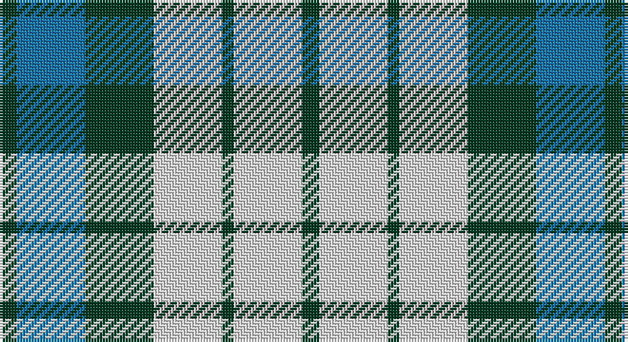

This page is one **sett** — a single exact thread-count. It belongs to the [tartan](/setts/dg3b12dg12w12dg2w12dg3/)
(the same proportion at any scale), whose colour order is pattern [GBGWGWG](/stripes/gbgwgwg/).

Part of the [Game Fair](/tartans/game-fair/) tartan — the named design grouping this sett with its other cloths.

Sourced from tartans-authority.  It is a [7 stripe tartan](/stripes/stripes7/).

Original link http://www.tartansauthority.com/tartan-ferret/display/4081/

## Register references

External register numbers recorded for this tartan.

- Scottish Tartans Authority (ITI): 4081

## Thread count
DG/6 B24 DGc24 LN24 DGa4 LN24 DGb/6

One full sett is **212 threads**.

## Palette

Palette: <strong>Tartan Register</strong>
<table><thead><tr><th>Colour</th><th>Threads</th><th>Shade</th><th>Base</th><th>OKLCh</th></tr></thead><tbody><tr><td>DG/</td><td style="text-align:right;font-variant-numeric:tabular-nums">6</td><td><code style="background-color:#003820;">#003820</code> <small style="color:#888">#003820</small></td><td>G <code style="background-color:#006100;">#006100</code></td><td><small style="color:#888">oklch(30.0% 0.070 158.3)</small></td></tr><tr><td>B</td><td style="text-align:right;font-variant-numeric:tabular-nums">24</td><td><code style="background-color:#1870A4;">#1870A4</code> <small style="color:#888">#1870A4</small></td><td>B <code style="background-color:#2A418A;">#2A418A</code></td><td><small style="color:#888">oklch(52.2% 0.113 241.2)</small></td></tr><tr><td>DGc</td><td style="text-align:right;font-variant-numeric:tabular-nums">24</td><td><code style="background-color:#003820;">#003820</code> <small style="color:#888">#003820</small></td><td>G <code style="background-color:#006100;">#006100</code></td><td><small style="color:#888">oklch(30.0% 0.070 158.3)</small></td></tr><tr><td>LN</td><td style="text-align:right;font-variant-numeric:tabular-nums">24</td><td><code style="background-color:#E0E0E0;">#E0E0E0</code> <small style="color:#888">#E0E0E0</small></td><td>W <code style="background-color:#F7F7F7;">#F7F7F7</code></td><td><small style="color:#888">oklch(90.7% 0.000 89.9)</small></td></tr><tr><td>DGa</td><td style="text-align:right;font-variant-numeric:tabular-nums">4</td><td><code style="background-color:#003820;">#003820</code> <small style="color:#888">#003820</small></td><td>G <code style="background-color:#006100;">#006100</code></td><td><small style="color:#888">oklch(30.0% 0.070 158.3)</small></td></tr><tr><td>LN</td><td style="text-align:right;font-variant-numeric:tabular-nums">24</td><td><code style="background-color:#E0E0E0;">#E0E0E0</code> <small style="color:#888">#E0E0E0</small></td><td>W <code style="background-color:#F7F7F7;">#F7F7F7</code></td><td><small style="color:#888">oklch(90.7% 0.000 89.9)</small></td></tr><tr><td>DGb/</td><td style="text-align:right;font-variant-numeric:tabular-nums">6</td><td><code style="background-color:#003820;">#003820</code> <small style="color:#888">#003820</small></td><td>G <code style="background-color:#006100;">#006100</code></td><td><small style="color:#888">oklch(30.0% 0.070 158.3)</small></td></tr></tbody></table>

# Sample pattern

## Compared to the master

This cloth is one sett of its design; the master sett (the exemplar the design is anchored on) is below for comparison.

<figure style="margin:0"><figcaption style="color:#888;font-size:smaller">this sett</figcaption></figure>
<figure style="margin:0"><figcaption style="color:#888;font-size:smaller"><a href="/setts/r3db12k12dg12b2dg12w3/">master sett →</a></figcaption></figure>

## Nearest tartans

The nearest existing variants by ΔTartan distance, with this tartan at the top so the swatches line up against it.

ΔTartan

Tartan

Sett

—

<a href="/ttd/edit/#slug=dg3b12dg12w12dg2w12dg3~x2">Game Fair (Corporate)</a> <a class="nn-out" href="/variants/s7/dg3b12dg12w12dg2w12dg3~x2/" title="open its dictionary page">↗</a>

1.21

<a href="/ttd/edit/#slug=g25r9b3ly7w3dp11&amp;base=dg3b12dg12w12dg2w12dg3~x2">Montessori School of Denver</a> <a class="nn-out" href="/variants/s6/g25r9b3ly7w3dp11/" title="open its dictionary page">↗</a>

1.21

<a href="/ttd/edit/#slug=k4db9ly6db22g4w20g6w4&amp;base=dg3b12dg12w12dg2w12dg3~x2">Ship Hector</a> <a class="nn-out" href="/variants/s8/k4db9ly6db22g4w20g6w4/" title="open its dictionary page">↗</a>

1.26

<a href="/ttd/edit/#slug=db13w13db4ly2g8r3~x2&amp;base=dg3b12dg12w12dg2w12dg3~x2">Unidentified (Winterbottom)</a> <a class="nn-out" href="/variants/s6/db13w13db4ly2g8r3~x2/" title="open its dictionary page">↗</a>

1.28

<a href="/ttd/edit/#slug=w4k1w4dg6k4w5r1t2~x2&amp;base=dg3b12dg12w12dg2w12dg3~x2">MacDuff Dress</a> <a class="nn-out" href="/variants/s8/w4k1w4dg6k4w5r1t2~x2/" title="open its dictionary page">↗</a>

1.32

<a href="/ttd/edit/#slug=k3db10ly5db16g3w16g5w3~x2&amp;base=dg3b12dg12w12dg2w12dg3~x2">Ship Hector, The (Commemorative)</a> <a class="nn-out" href="/variants/s8/k3db10ly5db16g3w16g5w3~x2/" title="open its dictionary page">↗</a>

1.33

<a href="/ttd/edit/#slug=dt2g2dt11o2w8t12ly2t2~x2&amp;base=dg3b12dg12w12dg2w12dg3~x2">Elora (District)</a> <a class="nn-out" href="/variants/s8/dt2g2dt11o2w8t12ly2t2~x2/" title="open its dictionary page">↗</a>

1.37

<a href="/ttd/edit/#slug=k3ly3db20g25lb18w3~x2&amp;base=dg3b12dg12w12dg2w12dg3~x2">Porteous (Clan)</a> <a class="nn-out" href="/variants/s6/k3ly3db20g25lb18w3~x2/" title="open its dictionary page">↗</a>

1.39

<a href="/ttd/edit/#slug=w4k1w4g6k4w5r1t2~x2&amp;base=dg3b12dg12w12dg2w12dg3~x2">MacDuff, dress</a> <a class="nn-out" href="/variants/s8/w4k1w4g6k4w5r1t2~x2/" title="open its dictionary page">↗</a>

1.40

<a href="/ttd/edit/#slug=g5db3t3g5w4ly2t1ly2db1r1~x6&amp;base=dg3b12dg12w12dg2w12dg3~x2">Northern College (Ontario)</a> <a class="nn-out" href="/variants/s10/g5db3t3g5w4ly2t1ly2db1r1~x6/" title="open its dictionary page">↗</a>

1.43

<a href="/ttd/edit/#slug=db20r2g9w6ly4k2g8~x2&amp;base=dg3b12dg12w12dg2w12dg3~x2">Crofters (Personal)</a> <a class="nn-out" href="/variants/s7/db20r2g9w6ly4k2g8~x2/" title="open its dictionary page">↗</a>

## Neighbour map

Every grey dot is one of 14360 variants placed by the first two principal components of the ΔTartan feature space (44% of its variance). Red is this tartan; blue dots are its nearest — click one to open its page.

<svg viewBox="0 0 640 380" role="img" style="max-width:100%;height:auto;border:1px solid #e0e0e0;border-radius:4px;display:block" xmlns="http://www.w3.org/2000/svg"><image href="/nn/cloud.v1.png" width="640" height="380"/><a href="/variants/s6/g25r9b3ly7w3dp11/"><circle cx="126.3" cy="168.8" r="4" fill="#3465a4"><title>Montessori School of Denver</title></circle></a><a href="/variants/s8/k4db9ly6db22g4w20g6w4/"><circle cx="114.7" cy="189.3" r="4" fill="#3465a4"><title>Ship Hector</title></circle></a><a href="/variants/s6/db13w13db4ly2g8r3~x2/"><circle cx="113.0" cy="207.2" r="4" fill="#3465a4"><title>Unidentified (Winterbottom)</title></circle></a><a href="/variants/s8/w4k1w4dg6k4w5r1t2~x2/"><circle cx="119.6" cy="206.1" r="4" fill="#3465a4"><title>MacDuff Dress</title></circle></a><a href="/variants/s8/k3db10ly5db16g3w16g5w3~x2/"><circle cx="109.3" cy="190.4" r="4" fill="#3465a4"><title>Ship Hector, The (Commemorative)</title></circle></a><a href="/variants/s8/dt2g2dt11o2w8t12ly2t2~x2/"><circle cx="82.0" cy="171.1" r="4" fill="#3465a4"><title>Elora (District)</title></circle></a><a href="/variants/s6/k3ly3db20g25lb18w3~x2/"><circle cx="98.8" cy="180.0" r="4" fill="#3465a4"><title>Porteous (Clan)</title></circle></a><a href="/variants/s8/w4k1w4g6k4w5r1t2~x2/"><circle cx="112.7" cy="204.2" r="4" fill="#3465a4"><title>MacDuff, dress</title></circle></a><a href="/variants/s10/g5db3t3g5w4ly2t1ly2db1r1~x6/"><circle cx="51.6" cy="195.2" r="4" fill="#3465a4"><title>Northern College (Ontario)</title></circle></a><a href="/variants/s7/db20r2g9w6ly4k2g8~x2/"><circle cx="130.0" cy="164.6" r="4" fill="#3465a4"><title>Crofters (Personal)</title></circle></a><circle cx="86.4" cy="194.8" r="5" fill="#c00000"/></svg>

ID: /variants/s7/dg3b12dg12w12dg2w12dg3~x2/
