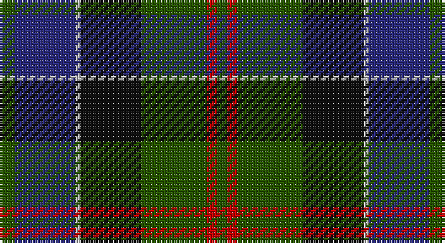

This page is one **sett** — a single exact thread-count. It belongs to the [tartan](/setts/dg3db12lb1k12dg13r2dg2/)
(the same proportion at any scale), whose colour order is pattern [GBWKGRG](/stripes/gbwkgrg/).

Sourced from tartans-authority.  It is a [7 stripe tartan](/stripes/stripes7/).

Original link http://www.tartansauthority.com/tartan-ferret/display/1102/

2 attestations — the source records this cloth was collapsed from (oldest owns this page)

<ul>
<li>pre 1880 — MacPhedran/MacFadzean (tartans-authority, <a href="http://www.tartansauthority.com/tartan-ferret/display/1102/">record</a>)</li>
<li>01/01/2002 — MacPhedran/MacFadzean (register-of-tartans, <a href="https://www.tartanregister.gov.uk/tartanDetails.aspx?ref=4812">record</a>)</li>
</ul>

## Register references

External register numbers recorded for this tartan.

- Scottish Register of Tartans: [4812](https://www.tartanregister.gov.uk/tartanDetails.aspx?ref=4812)
- Scottish Tartans Authority (ITI): 1102
- Scottish Tartans World Register: 1102

## Thread count
G/6 DB24 N2 K24 G26 R4 G/4

One full sett is **170 threads**.

## Palette

Palette: <strong>Tartan Register</strong>
<table><thead><tr><th>Colour</th><th>Threads</th><th>Shade</th><th>Base</th><th>OKLCh</th></tr></thead><tbody><tr><td>G/</td><td style="text-align:right;font-variant-numeric:tabular-nums">6</td><td><code style="background-color:#285800;">#285800</code> <small style="color:#888">#285800</small></td><td>G <code style="background-color:#006100;">#006100</code></td><td><small style="color:#888">oklch(41.0% 0.122 135.8)</small></td></tr><tr><td>DB</td><td style="text-align:right;font-variant-numeric:tabular-nums">24</td><td><code style="background-color:#2C2C80;">#2C2C80</code> <small style="color:#888">#2C2C80</small></td><td>B <code style="background-color:#2A418A;">#2A418A</code></td><td><small style="color:#888">oklch(35.0% 0.138 276.6)</small></td></tr><tr><td>N</td><td style="text-align:right;font-variant-numeric:tabular-nums">2</td><td><code style="background-color:#C0C0C0;">#C0C0C0</code> <small style="color:#888">#C0C0C0</small></td><td>W <code style="background-color:#F7F7F7;">#F7F7F7</code></td><td><small style="color:#888">oklch(80.8% 0.000 89.9)</small></td></tr><tr><td>K</td><td style="text-align:right;font-variant-numeric:tabular-nums">24</td><td><code style="background-color:#101010;">#101010</code> <small style="color:#888">#101010</small></td><td>K <code style="background-color:#000000;">#000000</code></td><td><small style="color:#888">oklch(17.3% 0.000 89.9)</small></td></tr><tr><td>G</td><td style="text-align:right;font-variant-numeric:tabular-nums">26</td><td><code style="background-color:#285800;">#285800</code> <small style="color:#888">#285800</small></td><td>G <code style="background-color:#006100;">#006100</code></td><td><small style="color:#888">oklch(41.0% 0.122 135.8)</small></td></tr><tr><td>R</td><td style="text-align:right;font-variant-numeric:tabular-nums">4</td><td><code style="background-color:#C80000;">#C80000</code> <small style="color:#888">#C80000</small></td><td>R <code style="background-color:#CC0000;">#CC0000</code></td><td><small style="color:#888">oklch(52.3% 0.215 29.2)</small></td></tr><tr><td>G/</td><td style="text-align:right;font-variant-numeric:tabular-nums">4</td><td><code style="background-color:#285800;">#285800</code> <small style="color:#888">#285800</small></td><td>G <code style="background-color:#006100;">#006100</code></td><td><small style="color:#888">oklch(41.0% 0.122 135.8)</small></td></tr></tbody></table>

# Sample pattern

## Nearest tartans

The nearest existing variants by ΔTartan distance, with this tartan at the top so the swatches line up against it.

ΔTartan

Tartan

Sett

—

<a href="/ttd/edit/#slug=dg3db12lb1k12dg13r2dg2~x2">MacPhedran/MacFadzean</a> <a class="nn-out" href="/variants/s7/dg3db12lb1k12dg13r2dg2~x2/" title="open its dictionary page">↗</a>

0.63

<a href="/ttd/edit/#slug=k2r1dg15k15db15ly1k2~x2&amp;base=dg3db12lb1k12dg13r2dg2~x2">MacCaskill (Personal)</a> <a class="nn-out" href="/variants/s7/k2r1dg15k15db15ly1k2~x2/" title="open its dictionary page">↗</a>

0.68

<a href="/ttd/edit/#slug=g3db12w1k12g13r2g2~x2&amp;base=dg3db12lb1k12dg13r2dg2~x2">Paterson (Personal)</a> <a class="nn-out" href="/variants/s7/g3db12w1k12g13r2g2~x2/" title="open its dictionary page">↗</a>

0.72

<a href="/ttd/edit/#slug=dy2g12k10r1db16r2~x2&amp;base=dg3db12lb1k12dg13r2dg2~x2">MacWilliam Clan Tartan</a> <a class="nn-out" href="/variants/s6/dy2g12k10r1db16r2~x2/" title="open its dictionary page">↗</a>

0.73

<a href="/ttd/edit/#slug=k30n20k10n5w2n10g20r2g10&amp;base=dg3db12lb1k12dg13r2dg2~x2">Cailleach (Fashion)</a> <a class="nn-out" href="/variants/s9/k30n20k10n5w2n10g20r2g10/" title="open its dictionary page">↗</a>

0.75

<a href="/ttd/edit/#slug=r2db23k14dg16k2w2~x2&amp;base=dg3db12lb1k12dg13r2dg2~x2">MacPhail Hunting</a> <a class="nn-out" href="/variants/s6/r2db23k14dg16k2w2~x2/" title="open its dictionary page">↗</a>

0.75

<a href="/ttd/edit/#slug=g27ri2g4r15db26k2db6~x2&amp;base=dg3db12lb1k12dg13r2dg2~x2">Bailies of Bennachie (Corporate)</a> <a class="nn-out" href="/variants/s7/g27ri2g4r15db26k2db6~x2/" title="open its dictionary page">↗</a>

0.76

<a href="/ttd/edit/#slug=g12k1g2r1g2k10db10lo1~x4&amp;base=dg3db12lb1k12dg13r2dg2~x2">Guelph, City Of</a> <a class="nn-out" href="/variants/s8/g12k1g2r1g2k10db10lo1~x4/" title="open its dictionary page">↗</a>

0.79

<a href="/ttd/edit/#slug=db3m2db22k11g24lp2g3~x2&amp;base=dg3db12lb1k12dg13r2dg2~x2">MacThomas Clan Tartan</a> <a class="nn-out" href="/variants/s7/db3m2db22k11g24lp2g3~x2/" title="open its dictionary page">↗</a>

0.80

<a href="/ttd/edit/#slug=db22r3db2r3db2k17g18lo4~x2&amp;base=dg3db12lb1k12dg13r2dg2~x2">Scotch House 2000 Original</a> <a class="nn-out" href="/variants/s8/db22r3db2r3db2k17g18lo4~x2/" title="open its dictionary page">↗</a>

0.82

<a href="/ttd/edit/#slug=k2dg12k12r1db12w2~x2&amp;base=dg3db12lb1k12dg13r2dg2~x2">Russell or Mitchell or Hunter or Galbraith</a> <a class="nn-out" href="/variants/s6/k2dg12k12r1db12w2~x2/" title="open its dictionary page">↗</a>

## Neighbour map

Every grey dot is one of 14360 variants placed by the first two principal components of the ΔTartan feature space (44% of its variance). Red is this tartan; blue dots are its nearest — click one to open its page.

<svg viewBox="0 0 640 380" role="img" style="max-width:100%;height:auto;border:1px solid #e0e0e0;border-radius:4px;display:block" xmlns="http://www.w3.org/2000/svg"><image href="/nn/cloud.v1.png" width="640" height="380"/><a href="/variants/s7/k2r1dg15k15db15ly1k2~x2/"><circle cx="234.0" cy="193.4" r="4" fill="#3465a4"><title>MacCaskill (Personal)</title></circle></a><a href="/variants/s7/g3db12w1k12g13r2g2~x2/"><circle cx="200.7" cy="195.4" r="4" fill="#3465a4"><title>Paterson (Personal)</title></circle></a><a href="/variants/s6/dy2g12k10r1db16r2~x2/"><circle cx="214.2" cy="201.6" r="4" fill="#3465a4"><title>MacWilliam Clan Tartan</title></circle></a><a href="/variants/s9/k30n20k10n5w2n10g20r2g10/"><circle cx="206.9" cy="196.2" r="4" fill="#3465a4"><title>Cailleach (Fashion)</title></circle></a><a href="/variants/s6/r2db23k14dg16k2w2~x2/"><circle cx="214.9" cy="210.7" r="4" fill="#3465a4"><title>MacPhail Hunting</title></circle></a><a href="/variants/s7/g27ri2g4r15db26k2db6~x2/"><circle cx="240.6" cy="195.7" r="4" fill="#3465a4"><title>Bailies of Bennachie (Corporate)</title></circle></a><a href="/variants/s8/g12k1g2r1g2k10db10lo1~x4/"><circle cx="220.0" cy="188.6" r="4" fill="#3465a4"><title>Guelph, City Of</title></circle></a><a href="/variants/s7/db3m2db22k11g24lp2g3~x2/"><circle cx="233.7" cy="195.6" r="4" fill="#3465a4"><title>MacThomas Clan Tartan</title></circle></a><a href="/variants/s8/db22r3db2r3db2k17g18lo4~x2/"><circle cx="188.3" cy="190.2" r="4" fill="#3465a4"><title>Scotch House 2000 Original</title></circle></a><a href="/variants/s6/k2dg12k12r1db12w2~x2/"><circle cx="180.5" cy="212.1" r="4" fill="#3465a4"><title>Russell or Mitchell or Hunter or Galbraith</title></circle></a><circle cx="220.5" cy="204.2" r="5" fill="#c00000"/></svg>

ID: /variants/s7/dg3db12lb1k12dg13r2dg2~x2/
