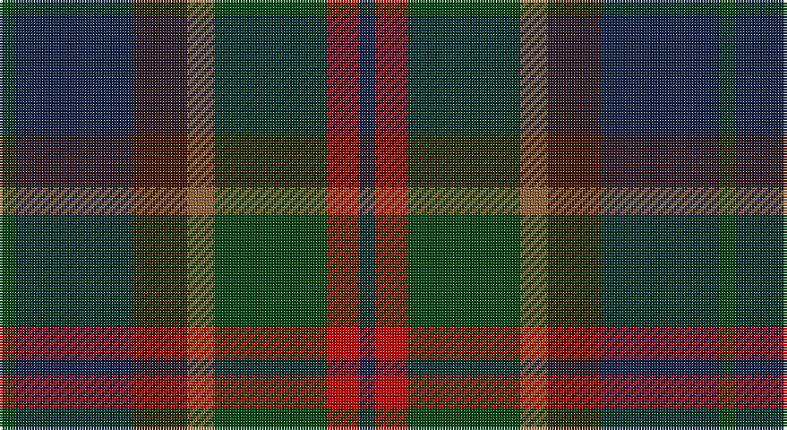

This page is one **sett** — a single exact thread-count. It belongs to the [tartan](/setts/dg3dt22dr10o5dg21r6dt3/)
(the same proportion at any scale), whose colour order is pattern [BRGRBBG](/stripes/brgrbbg/).

Part of the [Swankie](/tartans/swankie/) tartan — the named design grouping this sett with its other cloths.

Sourced from weddslist.  It is a [7 stripe tartan](/stripes/stripes7/).

Original link http://www.weddslist.com/cgi-bin/tartans/pg.pl?source=sts

## Thread count
DG/6 DB44 DR20 LT10 DG42 R12 DB/6

One full sett is **268 threads**.

## Palette

Palette: <strong>custom</strong>
<table><thead><tr><th>Colour</th><th>Threads</th><th>Shade</th><th>Base</th><th>OKLCh</th></tr></thead><tbody><tr><td>DG/</td><td style="text-align:right;font-variant-numeric:tabular-nums">6</td><td><code style="background-color:#004010;">#004010</code> <small style="color:#888">#004010</small></td><td>G <code style="background-color:#006100;">#006100</code></td><td><small style="color:#888">oklch(32.3% 0.098 146.3)</small></td></tr><tr><td>DB</td><td style="text-align:right;font-variant-numeric:tabular-nums">44</td><td><code style="background-color:#102040;">#102040</code> <small style="color:#888">#102040</small></td><td>B <code style="background-color:#2A418A;">#2A418A</code></td><td><small style="color:#888">oklch(24.9% 0.065 262.6)</small></td></tr><tr><td>DR</td><td style="text-align:right;font-variant-numeric:tabular-nums">20</td><td><code style="background-color:#401000;">#401000</code> <small style="color:#888">#401000</small></td><td>B <code style="background-color:#2A418A;">#2A418A</code></td><td><small style="color:#888">oklch(25.3% 0.079 39.9)</small></td></tr><tr><td>LT</td><td style="text-align:right;font-variant-numeric:tabular-nums">10</td><td><code style="background-color:#906030;">#906030</code> <small style="color:#888">#906030</small></td><td>R <code style="background-color:#CC0000;">#CC0000</code></td><td><small style="color:#888">oklch(53.1% 0.089 63.7)</small></td></tr><tr><td>DG</td><td style="text-align:right;font-variant-numeric:tabular-nums">42</td><td><code style="background-color:#004010;">#004010</code> <small style="color:#888">#004010</small></td><td>G <code style="background-color:#006100;">#006100</code></td><td><small style="color:#888">oklch(32.3% 0.098 146.3)</small></td></tr><tr><td>R</td><td style="text-align:right;font-variant-numeric:tabular-nums">12</td><td><code style="background-color:#C00000;">#C00000</code> <small style="color:#888">#C00000</small></td><td>R <code style="background-color:#CC0000;">#CC0000</code></td><td><small style="color:#888">oklch(50.7% 0.208 29.2)</small></td></tr><tr><td>DB/</td><td style="text-align:right;font-variant-numeric:tabular-nums">6</td><td><code style="background-color:#102040;">#102040</code> <small style="color:#888">#102040</small></td><td>B <code style="background-color:#2A418A;">#2A418A</code></td><td><small style="color:#888">oklch(24.9% 0.065 262.6)</small></td></tr></tbody></table>

# Sample pattern

## Compared to the master

This cloth is one sett of its design; the master sett (the exemplar the design is anchored on) is below for comparison.

<figure style="margin:0"><figcaption style="color:#888;font-size:smaller">this sett</figcaption></figure>
<figure style="margin:0"><figcaption style="color:#888;font-size:smaller"><a href="/setts/r6k20y4dy10b21k4b21dy10y4k20r6b3/">master sett →</a></figcaption></figure>

## Nearest tartans

The nearest existing variants by ΔTartan distance, with this tartan at the top so the swatches line up against it.

ΔTartan

Tartan

Sett

—

<a href="/ttd/edit/#slug=dg3dt22dr10o5dg21r6dt3~x2">Swankie</a> <a class="nn-out" href="/variants/s7/dg3dt22dr10o5dg21r6dt3~x2/" title="open its dictionary page">↗</a>

0.97

<a href="/ttd/edit/#slug=dt14k5dp5k5dt14dg32r4~x2&amp;base=dg3dt22dr10o5dg21r6dt3~x2">Bennachie (Whisky)</a> <a class="nn-out" href="/variants/s7/dt14k5dp5k5dt14dg32r4~x2/" title="open its dictionary page">↗</a>

1.10

<a href="/ttd/edit/#slug=ly4dg17k10dt3k3dt17r3dt3~x2&amp;base=dg3dt22dr10o5dg21r6dt3~x2">Royal Highland Society (Corporate)</a> <a class="nn-out" href="/variants/s8/ly4dg17k10dt3k3dt17r3dt3~x2/" title="open its dictionary page">↗</a>

1.21

<a href="/ttd/edit/#slug=do6o4n22r4k22do22k2r5k2do6~x2&amp;base=dg3dt22dr10o5dg21r6dt3~x2">Lochaber (Ingles Buchan)</a> <a class="nn-out" href="/variants/s10/do6o4n22r4k22do22k2r5k2do6~x2/" title="open its dictionary page">↗</a>

1.22

<a href="/variants/s6/r1n12ki6k1do10r1~x4/">Andover</a>

1.28

<a href="/ttd/edit/#slug=db5k3db18dg6k6dg6dy12r5dy12r3~x2&amp;base=dg3dt22dr10o5dg21r6dt3~x2">Longford, County</a> <a class="nn-out" href="/variants/s10/db5k3db18dg6k6dg6dy12r5dy12r3~x2/" title="open its dictionary page">↗</a>

1.30

<a href="/ttd/edit/#slug=dt13dg19k2dg7k2dg7k2db18r2dt13~x2&amp;base=dg3dt22dr10o5dg21r6dt3~x2">South Australia</a> <a class="nn-out" href="/variants/s10/dt13dg19k2dg7k2dg7k2db18r2dt13~x2/" title="open its dictionary page">↗</a>

1.30

<a href="/ttd/edit/#slug=dy4dt20dy3k20o24dt3~x2&amp;base=dg3dt22dr10o5dg21r6dt3~x2">Edinburgh International Conference Centre, The</a> <a class="nn-out" href="/variants/s6/dy4dt20dy3k20o24dt3~x2/" title="open its dictionary page">↗</a>

1.30

<a href="/ttd/edit/#slug=n5t4n22k15y22o4y4~x2&amp;base=dg3dt22dr10o5dg21r6dt3~x2">Cairngorm #2</a> <a class="nn-out" href="/variants/s7/n5t4n22k15y22o4y4~x2/" title="open its dictionary page">↗</a>

1.31

<a href="/ttd/edit/#slug=r4k15t4dt15dg24y4~x2&amp;base=dg3dt22dr10o5dg21r6dt3~x2">Haughfoot (Commemorative)</a> <a class="nn-out" href="/variants/s6/r4k15t4dt15dg24y4~x2/" title="open its dictionary page">↗</a>

1.33

<a href="/ttd/edit/#slug=lb4dg17k10dt3k3dt17r3dt3~x2&amp;base=dg3dt22dr10o5dg21r6dt3~x2">Royal Highland</a> <a class="nn-out" href="/variants/s8/lb4dg17k10dt3k3dt17r3dt3~x2/" title="open its dictionary page">↗</a>

## Neighbour map

Every grey dot is one of 14360 variants placed by the first two principal components of the ΔTartan feature space (44% of its variance). Red is this tartan; blue dots are its nearest — click one to open its page.

<svg viewBox="0 0 640 380" role="img" style="max-width:100%;height:auto;border:1px solid #e0e0e0;border-radius:4px;display:block" xmlns="http://www.w3.org/2000/svg"><image href="/nn/cloud.v1.png" width="640" height="380"/><a href="/variants/s7/dt14k5dp5k5dt14dg32r4~x2/"><circle cx="252.8" cy="243.6" r="4" fill="#3465a4"><title>Bennachie (Whisky)</title></circle></a><a href="/variants/s8/ly4dg17k10dt3k3dt17r3dt3~x2/"><circle cx="197.7" cy="246.0" r="4" fill="#3465a4"><title>Royal Highland Society (Corporate)</title></circle></a><a href="/variants/s10/do6o4n22r4k22do22k2r5k2do6~x2/"><circle cx="236.2" cy="206.8" r="4" fill="#3465a4"><title>Lochaber (Ingles Buchan)</title></circle></a><a href="/variants/s6/r1n12ki6k1do10r1~x4/"><circle cx="255.4" cy="217.3" r="4" fill="#3465a4"><title>Andover</title></circle></a><a href="/variants/s10/db5k3db18dg6k6dg6dy12r5dy12r3~x2/"><circle cx="155.0" cy="248.0" r="4" fill="#3465a4"><title>Longford, County</title></circle></a><a href="/variants/s10/dt13dg19k2dg7k2dg7k2db18r2dt13~x2/"><circle cx="235.3" cy="233.5" r="4" fill="#3465a4"><title>South Australia</title></circle></a><a href="/variants/s6/dy4dt20dy3k20o24dt3~x2/"><circle cx="217.8" cy="256.8" r="4" fill="#3465a4"><title>Edinburgh International Conference Centre, The</title></circle></a><a href="/variants/s7/n5t4n22k15y22o4y4~x2/"><circle cx="218.8" cy="269.7" r="4" fill="#3465a4"><title>Cairngorm #2</title></circle></a><a href="/variants/s6/r4k15t4dt15dg24y4~x2/"><circle cx="157.9" cy="245.8" r="4" fill="#3465a4"><title>Haughfoot (Commemorative)</title></circle></a><a href="/variants/s8/lb4dg17k10dt3k3dt17r3dt3~x2/"><circle cx="189.0" cy="241.6" r="4" fill="#3465a4"><title>Royal Highland</title></circle></a><circle cx="217.5" cy="249.3" r="5" fill="#c00000"/></svg>

ID: /variants/s7/dg3dt22dr10o5dg21r6dt3~x2/
