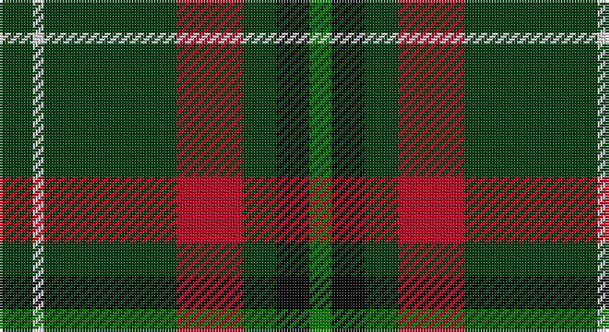

This page is one **sett** — a single exact thread-count. It belongs to the [tartan](/setts/dg3w1dg12r6dg3k3g2/)
(the same proportion at any scale), whose colour order is pattern [GKGRGWG](/stripes/gkgrgwg/).

Part of the [Arkansas](/tartans/arkansas/) tartan — the named design grouping this sett with its other cloths.

Sourced from weddslist.  It is a [7 stripe tartan](/stripes/stripes7/).

Original link http://www.weddslist.com/cgi-bin/tartans/pg.pl?source=sts

## Also known as

This cloth is also recorded under:

- Arkansas State

## Thread count
DG/12 LN4 DG48 R24 DG12 K12 G/8

One full sett is **220 threads**.

## Palette

Palette: <strong>Tartan Register</strong> <small style="color:#888">(2 of 5 colours)</small>
<table><thead><tr><th>Colour</th><th>Threads</th><th>Shade</th><th>Base</th><th>OKLCh</th></tr></thead><tbody><tr><td>DG/</td><td style="text-align:right;font-variant-numeric:tabular-nums">12</td><td><code style="background-color:#004010;">#004010</code> <small style="color:#888">#004010</small></td><td>G <code style="background-color:#006100;">#006100</code></td><td><small style="color:#888">oklch(32.3% 0.098 146.3)</small></td></tr><tr><td>LN</td><td style="text-align:right;font-variant-numeric:tabular-nums">4</td><td><code style="background-color:#E0E0E0;">#E0E0E0</code> <small style="color:#888">#E0E0E0</small></td><td>W <code style="background-color:#F7F7F7;">#F7F7F7</code></td><td><small style="color:#888">oklch(90.7% 0.000 89.9)</small></td></tr><tr><td>DG</td><td style="text-align:right;font-variant-numeric:tabular-nums">48</td><td><code style="background-color:#004010;">#004010</code> <small style="color:#888">#004010</small></td><td>G <code style="background-color:#006100;">#006100</code></td><td><small style="color:#888">oklch(32.3% 0.098 146.3)</small></td></tr><tr><td>R</td><td style="text-align:right;font-variant-numeric:tabular-nums">24</td><td><code style="background-color:#C00020;">#C00020</code> <small style="color:#888">#C00020</small></td><td>R <code style="background-color:#CC0000;">#CC0000</code></td><td><small style="color:#888">oklch(50.9% 0.206 24.5)</small></td></tr><tr><td>DG</td><td style="text-align:right;font-variant-numeric:tabular-nums">12</td><td><code style="background-color:#004010;">#004010</code> <small style="color:#888">#004010</small></td><td>G <code style="background-color:#006100;">#006100</code></td><td><small style="color:#888">oklch(32.3% 0.098 146.3)</small></td></tr><tr><td>K</td><td style="text-align:right;font-variant-numeric:tabular-nums">12</td><td><code style="background-color:#000000;">#000000</code> <small style="color:#888">#000000</small></td><td>K <code style="background-color:#000000;">#000000</code></td><td><small style="color:#888">oklch(0.0% 0.000 0.0)</small></td></tr><tr><td>G/</td><td style="text-align:right;font-variant-numeric:tabular-nums">8</td><td><code style="background-color:#008000;">#008000</code> <small style="color:#888">#008000</small></td><td>G <code style="background-color:#006100;">#006100</code></td><td><small style="color:#888">oklch(52.0% 0.177 142.5)</small></td></tr></tbody></table>

# Sample pattern

## Compared to the master

This cloth is one sett of its design; the master sett (the exemplar the design is anchored on) is below for comparison.

<figure style="margin:0"><figcaption style="color:#888;font-size:smaller">this sett</figcaption></figure>
<figure style="margin:0"><figcaption style="color:#888;font-size:smaller"><a href="/setts/dg10db4dg4db5dg6ly10r6dg18ly4/">master sett →</a></figcaption></figure>

## Nearest tartans

The nearest existing variants by ΔTartan distance, with this tartan at the top so the swatches line up against it.

ΔTartan

Tartan

Sett

—

<a href="/ttd/edit/#slug=dg3w1dg12r6dg3k3g2~x4">Arkansas</a> <a class="nn-out" href="/variants/s7/dg3w1dg12r6dg3k3g2~x4/" title="open its dictionary page">↗</a>

0.74

<a href="/ttd/edit/#slug=k4lo8k26o6g15o6k26w2~x2&amp;base=dg3w1dg12r6dg3k3g2~x4">Holestone (Corporate)</a> <a class="nn-out" href="/variants/s8/k4lo8k26o6g15o6k26w2~x2/" title="open its dictionary page">↗</a>

1.00

<a href="/ttd/edit/#slug=ly2dg12db6r3dg12r4db1&amp;base=dg3w1dg12r6dg3k3g2~x4">MacKintosh Hunting</a> <a class="nn-out" href="/variants/s7/ly2dg12db6r3dg12r4db1/" title="open its dictionary page">↗</a>

1.04

<a href="/ttd/edit/#slug=db1o9g5o1k5o1g5o9w1~x2&amp;base=dg3w1dg12r6dg3k3g2~x4">Duchess of York</a> <a class="nn-out" href="/variants/s9/db1o9g5o1k5o1g5o9w1~x2/" title="open its dictionary page">↗</a>

1.14

<a href="/ttd/edit/#slug=g15ly2k30g32r3w2~x2&amp;base=dg3w1dg12r6dg3k3g2~x4">Merwe</a> <a class="nn-out" href="/variants/s6/g15ly2k30g32r3w2~x2/" title="open its dictionary page">↗</a>

1.15

<a href="/ttd/edit/#slug=k17g48ly4r10db12g4&amp;base=dg3w1dg12r6dg3k3g2~x4">Asheville Firefighters, The</a> <a class="nn-out" href="/variants/s6/k17g48ly4r10db12g4/" title="open its dictionary page">↗</a>

1.15

<a href="/ttd/edit/#slug=lo10w4dg30k22dg27n4lb2~x2&amp;base=dg3w1dg12r6dg3k3g2~x4">Aggreko Shepherd (Personal)</a> <a class="nn-out" href="/variants/s7/lo10w4dg30k22dg27n4lb2~x2/" title="open its dictionary page">↗</a>

1.17

<a href="/ttd/edit/#slug=r17db7lo8dg58k6~x2&amp;base=dg3w1dg12r6dg3k3g2~x4">St Johns County's Sheriff's Office</a> <a class="nn-out" href="/variants/s5/r17db7lo8dg58k6~x2/" title="open its dictionary page">↗</a>

1.19

<a href="/ttd/edit/#slug=g26db3g12k10dp15w2~x2&amp;base=dg3w1dg12r6dg3k3g2~x4">Lossiemouth/Hersbruck</a> <a class="nn-out" href="/variants/s6/g26db3g12k10dp15w2~x2/" title="open its dictionary page">↗</a>

1.22

<a href="/ttd/edit/#slug=k17dg48ly4r10lb12dg4&amp;base=dg3w1dg12r6dg3k3g2~x4">Asheville Firefighters, The</a> <a class="nn-out" href="/variants/s6/k17dg48ly4r10lb12dg4/" title="open its dictionary page">↗</a>

1.24

<a href="/ttd/edit/#slug=dg50r5dg8w10dg8db8dg8lo21~x2&amp;base=dg3w1dg12r6dg3k3g2~x4">St Patrick's Krewe</a> <a class="nn-out" href="/variants/s8/dg50r5dg8w10dg8db8dg8lo21~x2/" title="open its dictionary page">↗</a>

## Neighbour map

Every grey dot is one of 14360 variants placed by the first two principal components of the ΔTartan feature space (44% of its variance). Red is this tartan; blue dots are its nearest — click one to open its page.

<svg viewBox="0 0 640 380" role="img" style="max-width:100%;height:auto;border:1px solid #e0e0e0;border-radius:4px;display:block" xmlns="http://www.w3.org/2000/svg"><image href="/nn/cloud.v1.png" width="640" height="380"/><a href="/variants/s8/k4lo8k26o6g15o6k26w2~x2/"><circle cx="287.0" cy="181.7" r="4" fill="#3465a4"><title>Holestone (Corporate)</title></circle></a><a href="/variants/s7/ly2dg12db6r3dg12r4db1/"><circle cx="301.7" cy="210.3" r="4" fill="#3465a4"><title>MacKintosh Hunting</title></circle></a><a href="/variants/s9/db1o9g5o1k5o1g5o9w1~x2/"><circle cx="248.1" cy="189.9" r="4" fill="#3465a4"><title>Duchess of York</title></circle></a><a href="/variants/s6/g15ly2k30g32r3w2~x2/"><circle cx="312.6" cy="185.1" r="4" fill="#3465a4"><title>Merwe</title></circle></a><a href="/variants/s6/k17g48ly4r10db12g4/"><circle cx="278.3" cy="190.3" r="4" fill="#3465a4"><title>Asheville Firefighters, The</title></circle></a><a href="/variants/s7/lo10w4dg30k22dg27n4lb2~x2/"><circle cx="263.6" cy="171.2" r="4" fill="#3465a4"><title>Aggreko Shepherd (Personal)</title></circle></a><a href="/variants/s5/r17db7lo8dg58k6~x2/"><circle cx="316.8" cy="198.3" r="4" fill="#3465a4"><title>St Johns County's Sheriff's Office</title></circle></a><a href="/variants/s6/g26db3g12k10dp15w2~x2/"><circle cx="275.1" cy="208.3" r="4" fill="#3465a4"><title>Lossiemouth/Hersbruck</title></circle></a><a href="/variants/s6/k17dg48ly4r10lb12dg4/"><circle cx="261.5" cy="178.8" r="4" fill="#3465a4"><title>Asheville Firefighters, The</title></circle></a><a href="/variants/s8/dg50r5dg8w10dg8db8dg8lo21~x2/"><circle cx="293.5" cy="165.6" r="4" fill="#3465a4"><title>St Patrick's Krewe</title></circle></a><circle cx="294.3" cy="191.2" r="5" fill="#c00000"/></svg>

ID: /variants/s7/dg3w1dg12r6dg3k3g2~x4/
