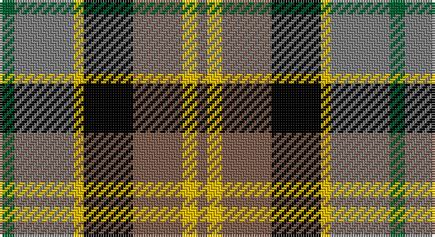

This page is one **sett** — a single exact thread-count. It belongs to the [tartan](/setts/dg3y12ly2k10o10ly3o2/)
(the same proportion at any scale), whose colour order is pattern [GGYKRYR](/stripes/ggykryr/).

Part of the [Rothesay](/tartans/rothesay/) tartan — the named design grouping this sett with its other cloths.

Sourced from weddslist.  It is a [7 stripe tartan](/stripes/stripes7/).

Original link http://www.weddslist.com/cgi-bin/tartans/pg.pl?source=sts

## Also known as

This cloth is also recorded under:

- Rothesay #2
- Rothesay, Red

## Thread count
G/6 N24 Y4 K20 LT20 Y6 LT/4

One full sett is **158 threads**.

## Palette

Palette: <strong>Tartan Register</strong> <small style="color:#888">(2 of 5 colours)</small>
<table><thead><tr><th>Colour</th><th>Threads</th><th>Shade</th><th>Base</th><th>OKLCh</th></tr></thead><tbody><tr><td>G/</td><td style="text-align:right;font-variant-numeric:tabular-nums">6</td><td><code style="background-color:#006030;">#006030</code> <small style="color:#888">#006030</small></td><td>G <code style="background-color:#006100;">#006100</code></td><td><small style="color:#888">oklch(42.9% 0.111 152.8)</small></td></tr><tr><td>N</td><td style="text-align:right;font-variant-numeric:tabular-nums">24</td><td><code style="background-color:#808080;">#808080</code> <small style="color:#888">#808080</small></td><td>G <code style="background-color:#006100;">#006100</code></td><td><small style="color:#888">oklch(60.0% 0.000 89.9)</small></td></tr><tr><td>Y</td><td style="text-align:right;font-variant-numeric:tabular-nums">4</td><td><code style="background-color:#F0C000;">#F0C000</code> <small style="color:#888">#F0C000</small></td><td>Y <code style="background-color:#F2BF00;">#F2BF00</code></td><td><small style="color:#888">oklch(82.7% 0.169 90.5)</small></td></tr><tr><td>K</td><td style="text-align:right;font-variant-numeric:tabular-nums">20</td><td><code style="background-color:#000000;">#000000</code> <small style="color:#888">#000000</small></td><td>K <code style="background-color:#000000;">#000000</code></td><td><small style="color:#888">oklch(0.0% 0.000 0.0)</small></td></tr><tr><td>LT</td><td style="text-align:right;font-variant-numeric:tabular-nums">20</td><td><code style="background-color:#806050;">#806050</code> <small style="color:#888">#806050</small></td><td>R <code style="background-color:#CC0000;">#CC0000</code></td><td><small style="color:#888">oklch(51.7% 0.049 47.8)</small></td></tr><tr><td>Y</td><td style="text-align:right;font-variant-numeric:tabular-nums">6</td><td><code style="background-color:#F0C000;">#F0C000</code> <small style="color:#888">#F0C000</small></td><td>Y <code style="background-color:#F2BF00;">#F2BF00</code></td><td><small style="color:#888">oklch(82.7% 0.169 90.5)</small></td></tr><tr><td>LT/</td><td style="text-align:right;font-variant-numeric:tabular-nums">4</td><td><code style="background-color:#806050;">#806050</code> <small style="color:#888">#806050</small></td><td>R <code style="background-color:#CC0000;">#CC0000</code></td><td><small style="color:#888">oklch(51.7% 0.049 47.8)</small></td></tr></tbody></table>

# Sample pattern

## Compared to the master

This cloth is one sett of its design; the master sett (the exemplar the design is anchored on) is below for comparison.

<figure style="margin:0"><figcaption style="color:#888;font-size:smaller">this sett</figcaption></figure>
<figure style="margin:0"><figcaption style="color:#888;font-size:smaller"><a href="/setts/g4n12lo2k10y10lo3y2/">master sett →</a></figcaption></figure>

## Nearest tartans

The nearest existing variants by ΔTartan distance, with this tartan at the top so the swatches line up against it.

ΔTartan

Tartan

Sett

—

<a href="/ttd/edit/#slug=dg3y12ly2k10o10ly3o2~x2">Rothesay</a> <a class="nn-out" href="/variants/s7/dg3y12ly2k10o10ly3o2~x2/" title="open its dictionary page">↗</a>

0.87

<a href="/ttd/edit/#slug=o6w2k4dy12k4w2o6r3~x2&amp;base=dg3y12ly2k10o10ly3o2~x2">Strathblane</a> <a class="nn-out" href="/variants/s8/o6w2k4dy12k4w2o6r3~x2/" title="open its dictionary page">↗</a>

0.98

<a href="/ttd/edit/#slug=r1dy6db2lb4k4lb1~x6&amp;base=dg3y12ly2k10o10ly3o2~x2">Thompson's Fancy (Fashion)</a> <a class="nn-out" href="/variants/s6/r1dy6db2lb4k4lb1~x6/" title="open its dictionary page">↗</a>

1.08

<a href="/ttd/edit/#slug=k6b2db12g8r5k2g3~x4&amp;base=dg3y12ly2k10o10ly3o2~x2">Cooke</a> <a class="nn-out" href="/variants/s7/k6b2db12g8r5k2g3~x4/" title="open its dictionary page">↗</a>

1.10

<a href="/ttd/edit/#slug=dp2g6k2db6k1r2~x4&amp;base=dg3y12ly2k10o10ly3o2~x2">MacCaughan, or MacEachain</a> <a class="nn-out" href="/variants/s6/dp2g6k2db6k1r2~x4/" title="open its dictionary page">↗</a>

1.10

<a href="/ttd/edit/#slug=k20ly4db13w4g30w4r13~x2&amp;base=dg3y12ly2k10o10ly3o2~x2">South Africa 1994 (Fashion)</a> <a class="nn-out" href="/variants/s7/k20ly4db13w4g30w4r13~x2/" title="open its dictionary page">↗</a>

1.13

<a href="/ttd/edit/#slug=db2y1o1dg6w3o3o1y1&amp;base=dg3y12ly2k10o10ly3o2~x2">Equorian Olympic</a> <a class="nn-out" href="/variants/s8/db2y1o1dg6w3o3o1y1/" title="open its dictionary page">↗</a>

1.16

<a href="/ttd/edit/#slug=r4lb1r4dg10ly1k10lb4k2lb4&amp;base=dg3y12ly2k10o10ly3o2~x2">Cumming LO</a> <a class="nn-out" href="/variants/s9/r4lb1r4dg10ly1k10lb4k2lb4/" title="open its dictionary page">↗</a>

1.16

<a href="/ttd/edit/#slug=lb3g6lb1db1r5db2o5db1lb3~x4&amp;base=dg3y12ly2k10o10ly3o2~x2">Wombles 7 (Corporate)</a> <a class="nn-out" href="/variants/s9/lb3g6lb1db1r5db2o5db1lb3~x4/" title="open its dictionary page">↗</a>

1.17

<a href="/ttd/edit/#slug=p9k7g5r4g7k1ly1~x2&amp;base=dg3y12ly2k10o10ly3o2~x2">MacLaren</a> <a class="nn-out" href="/variants/s7/p9k7g5r4g7k1ly1~x2/" title="open its dictionary page">↗</a>

1.20

<a href="/ttd/edit/#slug=db1r1db1r1db4k4g4r1g1ly1~x4&amp;base=dg3y12ly2k10o10ly3o2~x2">Logan, or MacLennan</a> <a class="nn-out" href="/variants/s10/db1r1db1r1db4k4g4r1g1ly1~x4/" title="open its dictionary page">↗</a>

## Neighbour map

Every grey dot is one of 14360 variants placed by the first two principal components of the ΔTartan feature space (44% of its variance). Red is this tartan; blue dots are its nearest — click one to open its page.

<svg viewBox="0 0 640 380" role="img" style="max-width:100%;height:auto;border:1px solid #e0e0e0;border-radius:4px;display:block" xmlns="http://www.w3.org/2000/svg"><image href="/nn/cloud.v1.png" width="640" height="380"/><a href="/variants/s8/o6w2k4dy12k4w2o6r3~x2/"><circle cx="87.3" cy="207.2" r="4" fill="#3465a4"><title>Strathblane</title></circle></a><a href="/variants/s6/r1dy6db2lb4k4lb1~x6/"><circle cx="87.4" cy="220.3" r="4" fill="#3465a4"><title>Thompson's Fancy (Fashion)</title></circle></a><a href="/variants/s7/k6b2db12g8r5k2g3~x4/"><circle cx="81.6" cy="220.6" r="4" fill="#3465a4"><title>Cooke</title></circle></a><a href="/variants/s6/dp2g6k2db6k1r2~x4/"><circle cx="94.1" cy="227.1" r="4" fill="#3465a4"><title>MacCaughan, or MacEachain</title></circle></a><a href="/variants/s7/k20ly4db13w4g30w4r13~x2/"><circle cx="79.4" cy="180.4" r="4" fill="#3465a4"><title>South Africa 1994 (Fashion)</title></circle></a><a href="/variants/s8/db2y1o1dg6w3o3o1y1/"><circle cx="95.6" cy="195.7" r="4" fill="#3465a4"><title>Equorian Olympic</title></circle></a><a href="/variants/s9/r4lb1r4dg10ly1k10lb4k2lb4/"><circle cx="80.3" cy="164.3" r="4" fill="#3465a4"><title>Cumming LO</title></circle></a><a href="/variants/s9/lb3g6lb1db1r5db2o5db1lb3~x4/"><circle cx="50.7" cy="200.5" r="4" fill="#3465a4"><title>Wombles 7 (Corporate)</title></circle></a><a href="/variants/s7/p9k7g5r4g7k1ly1~x2/"><circle cx="106.2" cy="201.2" r="4" fill="#3465a4"><title>MacLaren</title></circle></a><a href="/variants/s10/db1r1db1r1db4k4g4r1g1ly1~x4/"><circle cx="62.6" cy="204.7" r="4" fill="#3465a4"><title>Logan, or MacLennan</title></circle></a><circle cx="67.5" cy="202.6" r="5" fill="#c00000"/></svg>

ID: /variants/s7/dg3y12ly2k10o10ly3o2~x2/
