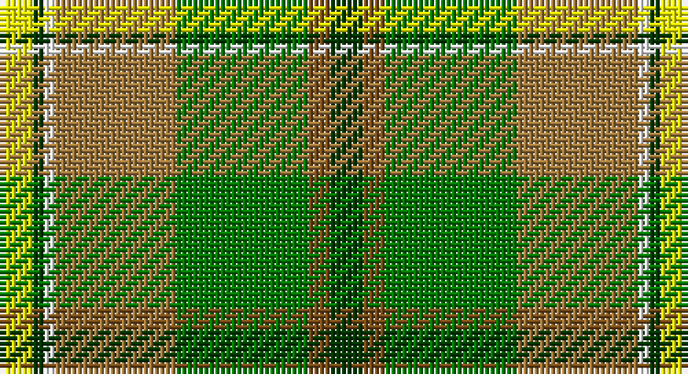

This page is one **sett** — a single exact thread-count. It belongs to the [tartan](/setts/dg3y2g12o11w1dg1ly3/)
(the same proportion at any scale), whose colour order is pattern [GGGRWGY](/stripes/gggrwgy/).

Part of the [Braemar House](/tartans/braemar-house/) tartan — the named design grouping this sett with its other cloths.

Sourced from register-of-tartans.  It is a [7 stripe tartan](/stripes/stripes7/).

Original link https://www.tartanregister.gov.uk/tartanDetails.aspx?ref=334

## Register references

External register numbers recorded for this tartan.

- Scottish Register of Tartans: [334](https://www.tartanregister.gov.uk/tartanDetails.aspx?ref=334)
- Scottish Tartans Authority (ITI): 908
- Scottish Tartans World Register: 908

## Thread count
Y/6 G2 W2 LT22 Ga24 T4 G/6

One full sett is **120 threads**.

## Palette

Palette: <strong>Tartan Register</strong> <small style="color:#888">(2 of 6 colours)</small>
<table><thead><tr><th>Colour</th><th>Threads</th><th>Shade</th><th>Base</th><th>OKLCh</th></tr></thead><tbody><tr><td>Y/</td><td style="text-align:right;font-variant-numeric:tabular-nums">6</td><td><code style="background-color:#FCFC00;">#FCFC00</code> <small style="color:#888">#FCFC00</small></td><td>Y <code style="background-color:#F2BF00;">#F2BF00</code></td><td><small style="color:#888">oklch(95.9% 0.209 109.8)</small></td></tr><tr><td>G</td><td style="text-align:right;font-variant-numeric:tabular-nums">2</td><td><code style="background-color:#003800;">#003800</code> <small style="color:#888">#003800</small></td><td>G <code style="background-color:#006100;">#006100</code></td><td><small style="color:#888">oklch(29.5% 0.100 142.5)</small></td></tr><tr><td>W</td><td style="text-align:right;font-variant-numeric:tabular-nums">2</td><td><code style="background-color:#FFFFFF;">#FFFFFF</code> <small style="color:#888">#FFFFFF</small></td><td>W <code style="background-color:#F7F7F7;">#F7F7F7</code></td><td><small style="color:#888">oklch(100.0% 0.000 89.9)</small></td></tr><tr><td>LT</td><td style="text-align:right;font-variant-numeric:tabular-nums">22</td><td><code style="background-color:#A0783C;">#A0783C</code> <small style="color:#888">#A0783C</small></td><td>R <code style="background-color:#CC0000;">#CC0000</code></td><td><small style="color:#888">oklch(60.0% 0.092 75.5)</small></td></tr><tr><td>Ga</td><td style="text-align:right;font-variant-numeric:tabular-nums">24</td><td><code style="background-color:#007800;">#007800</code> <small style="color:#888">#007800</small></td><td>G <code style="background-color:#006100;">#006100</code></td><td><small style="color:#888">oklch(49.6% 0.169 142.5)</small></td></tr><tr><td>T</td><td style="text-align:right;font-variant-numeric:tabular-nums">4</td><td><code style="background-color:#784C18;">#784C18</code> <small style="color:#888">#784C18</small></td><td>G <code style="background-color:#006100;">#006100</code></td><td><small style="color:#888">oklch(45.7% 0.088 66.1)</small></td></tr><tr><td>G/</td><td style="text-align:right;font-variant-numeric:tabular-nums">6</td><td><code style="background-color:#003800;">#003800</code> <small style="color:#888">#003800</small></td><td>G <code style="background-color:#006100;">#006100</code></td><td><small style="color:#888">oklch(29.5% 0.100 142.5)</small></td></tr></tbody></table>

# Sample pattern

## Nearest tartans

The nearest existing variants by ΔTartan distance, with this tartan at the top so the swatches line up against it.

ΔTartan

Tartan

Sett

—

<a href="/ttd/edit/#slug=dg3y2g12o11w1dg1ly3~x2">Braemar House</a> <a class="nn-out" href="/variants/s7/dg3y2g12o11w1dg1ly3~x2/" title="open its dictionary page">↗</a>

1.22

<a href="/ttd/edit/#slug=g4n2gi24dy10ly12r1ly12gi2~x2&amp;base=dg3y2g12o11w1dg1ly3~x2">Jolley (Personal)</a> <a class="nn-out" href="/variants/s8/g4n2gi24dy10ly12r1ly12gi2~x2/" title="open its dictionary page">↗</a>

1.36

<a href="/ttd/edit/#slug=g9lb2g9k2dy14ly4lb2r2~x4&amp;base=dg3y2g12o11w1dg1ly3~x2">McShane (Personal)</a> <a class="nn-out" href="/variants/s8/g9lb2g9k2dy14ly4lb2r2~x4/" title="open its dictionary page">↗</a>

1.37

<a href="/ttd/edit/#slug=o3w1o1w3gi1w1gi10g2gi1g10ly2r2~x2&amp;base=dg3y2g12o11w1dg1ly3~x2">Breacan</a> <a class="nn-out" href="/variants/s12/o3w1o1w3gi1w1gi10g2gi1g10ly2r2~x2/" title="open its dictionary page">↗</a>

1.41

<a href="/ttd/edit/#slug=dg70ly6o28g56o5g11o5g11lo12&amp;base=dg3y2g12o11w1dg1ly3~x2">Dalwhinnie Trade Tartan</a> <a class="nn-out" href="/variants/s9/dg70ly6o28g56o5g11o5g11lo12/" title="open its dictionary page">↗</a>

1.45

<a href="/ttd/edit/#slug=o3lb2g19lb6g2lb6oi14m4w2~x2&amp;base=dg3y2g12o11w1dg1ly3~x2">Royal Pharmaceutical, Society</a> <a class="nn-out" href="/variants/s9/o3lb2g19lb6g2lb6oi14m4w2~x2/" title="open its dictionary page">↗</a>

1.49

<a href="/ttd/edit/#slug=dg70ly6y28g56y5g11y5g11lo12&amp;base=dg3y2g12o11w1dg1ly3~x2">Dalwhinnie</a> <a class="nn-out" href="/variants/s9/dg70ly6y28g56y5g11y5g11lo12/" title="open its dictionary page">↗</a>

1.52

<a href="/ttd/edit/#slug=dg70ly6lr28g56lr5g11lr5g11r12&amp;base=dg3y2g12o11w1dg1ly3~x2">Dalwhinnie</a> <a class="nn-out" href="/variants/s9/dg70ly6lr28g56lr5g11lr5g11r12/" title="open its dictionary page">↗</a>

1.54

<a href="/ttd/edit/#slug=r2lo24r2lo3r2g24k8ly2~x2&amp;base=dg3y2g12o11w1dg1ly3~x2">Botherston (Name)</a> <a class="nn-out" href="/variants/s8/r2lo24r2lo3r2g24k8ly2~x2/" title="open its dictionary page">↗</a>

1.55

<a href="/ttd/edit/#slug=m5dg27o2g25ly7dg3m3~x2&amp;base=dg3y2g12o11w1dg1ly3~x2">Kilkenny</a> <a class="nn-out" href="/variants/s7/m5dg27o2g25ly7dg3m3~x2/" title="open its dictionary page">↗</a>

1.56

<a href="/ttd/edit/#slug=g42ly2gi16db7dr16r5~x2&amp;base=dg3y2g12o11w1dg1ly3~x2">Waterford</a> <a class="nn-out" href="/variants/s6/g42ly2gi16db7dr16r5~x2/" title="open its dictionary page">↗</a>

## Neighbour map

Every grey dot is one of 14360 variants placed by the first two principal components of the ΔTartan feature space (44% of its variance). Red is this tartan; blue dots are its nearest — click one to open its page.

<svg viewBox="0 0 640 380" role="img" style="max-width:100%;height:auto;border:1px solid #e0e0e0;border-radius:4px;display:block" xmlns="http://www.w3.org/2000/svg"><image href="/nn/cloud.v1.png" width="640" height="380"/><a href="/variants/s8/g4n2gi24dy10ly12r1ly12gi2~x2/"><circle cx="206.9" cy="138.8" r="4" fill="#3465a4"><title>Jolley (Personal)</title></circle></a><a href="/variants/s8/g9lb2g9k2dy14ly4lb2r2~x4/"><circle cx="156.1" cy="190.0" r="4" fill="#3465a4"><title>McShane (Personal)</title></circle></a><a href="/variants/s12/o3w1o1w3gi1w1gi10g2gi1g10ly2r2~x2/"><circle cx="111.8" cy="127.5" r="4" fill="#3465a4"><title>Breacan</title></circle></a><a href="/variants/s9/dg70ly6o28g56o5g11o5g11lo12/"><circle cx="202.9" cy="162.0" r="4" fill="#3465a4"><title>Dalwhinnie Trade Tartan</title></circle></a><a href="/variants/s9/o3lb2g19lb6g2lb6oi14m4w2~x2/"><circle cx="154.6" cy="164.9" r="4" fill="#3465a4"><title>Royal Pharmaceutical, Society</title></circle></a><a href="/variants/s9/dg70ly6y28g56y5g11y5g11lo12/"><circle cx="206.3" cy="164.8" r="4" fill="#3465a4"><title>Dalwhinnie</title></circle></a><a href="/variants/s9/dg70ly6lr28g56lr5g11lr5g11r12/"><circle cx="221.8" cy="170.8" r="4" fill="#3465a4"><title>Dalwhinnie</title></circle></a><a href="/variants/s8/r2lo24r2lo3r2g24k8ly2~x2/"><circle cx="226.4" cy="162.5" r="4" fill="#3465a4"><title>Botherston (Name)</title></circle></a><a href="/variants/s7/m5dg27o2g25ly7dg3m3~x2/"><circle cx="202.2" cy="165.6" r="4" fill="#3465a4"><title>Kilkenny</title></circle></a><a href="/variants/s6/g42ly2gi16db7dr16r5~x2/"><circle cx="240.0" cy="160.8" r="4" fill="#3465a4"><title>Waterford</title></circle></a><circle cx="158.3" cy="158.9" r="5" fill="#c00000"/></svg>

ID: /variants/s7/dg3y2g12o11w1dg1ly3~x2/
