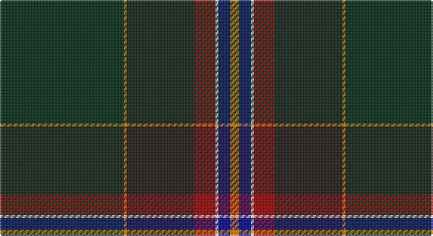

This page is one **sett** — a single exact thread-count. It belongs to the [tartan](/setts/dg42lo1k23r7w1db4lo3/)
(the same proportion at any scale), whose colour order is pattern [GYKRWBY](/stripes/gykrwby/).

Sourced from register-of-tartans.  It is a [7 stripe tartan](/stripes/stripes7/).

Original link https://www.tartanregister.gov.uk/tartanDetails.aspx?ref=11547

## Register references

External register numbers recorded for this tartan.

- Scottish Register of Tartans: [11547](https://www.tartanregister.gov.uk/tartanDetails.aspx?ref=11547)

## Thread count
DG/84 O2 K46 DR14 W2 DB8 O/6

One full sett is **234 threads**.

## Palette

Palette: <strong>Tartan Register</strong>
<table><thead><tr><th>Colour</th><th>Threads</th><th>Shade</th><th>Base</th><th>OKLCh</th></tr></thead><tbody><tr><td>DG/</td><td style="text-align:right;font-variant-numeric:tabular-nums">84</td><td><code style="background-color:#002814;">#002814</code> <small style="color:#888">#002814</small></td><td>G <code style="background-color:#006100;">#006100</code></td><td><small style="color:#888">oklch(24.4% 0.059 156.5)</small></td></tr><tr><td>O</td><td style="text-align:right;font-variant-numeric:tabular-nums">2</td><td><code style="background-color:#D87C00;">#D87C00</code> <small style="color:#888">#D87C00</small></td><td>Y <code style="background-color:#F2BF00;">#F2BF00</code></td><td><small style="color:#888">oklch(67.3% 0.155 61.8)</small></td></tr><tr><td>K</td><td style="text-align:right;font-variant-numeric:tabular-nums">46</td><td><code style="background-color:#1C1714;">#1C1714</code> <small style="color:#888">#1C1714</small></td><td>K <code style="background-color:#000000;">#000000</code></td><td><small style="color:#888">oklch(20.9% 0.010 52.9)</small></td></tr><tr><td>DR</td><td style="text-align:right;font-variant-numeric:tabular-nums">14</td><td><code style="background-color:#960000;">#960000</code> <small style="color:#888">#960000</small></td><td>R <code style="background-color:#CC0000;">#CC0000</code></td><td><small style="color:#888">oklch(42.3% 0.173 29.2)</small></td></tr><tr><td>W</td><td style="text-align:right;font-variant-numeric:tabular-nums">2</td><td><code style="background-color:#F8F8F8;">#F8F8F8</code> <small style="color:#888">#F8F8F8</small></td><td>W <code style="background-color:#F7F7F7;">#F7F7F7</code></td><td><small style="color:#888">oklch(97.9% 0.000 89.9)</small></td></tr><tr><td>DB</td><td style="text-align:right;font-variant-numeric:tabular-nums">8</td><td><code style="background-color:#00008C;">#00008C</code> <small style="color:#888">#00008C</small></td><td>B <code style="background-color:#2A418A;">#2A418A</code></td><td><small style="color:#888">oklch(28.9% 0.200 264.1)</small></td></tr><tr><td>O/</td><td style="text-align:right;font-variant-numeric:tabular-nums">6</td><td><code style="background-color:#D87C00;">#D87C00</code> <small style="color:#888">#D87C00</small></td><td>Y <code style="background-color:#F2BF00;">#F2BF00</code></td><td><small style="color:#888">oklch(67.3% 0.155 61.8)</small></td></tr></tbody></table>

# Sample pattern

## Nearest tartans

The nearest existing variants by ΔTartan distance, with this tartan at the top so the swatches line up against it.

ΔTartan

Tartan

Sett

—

<a href="/ttd/edit/#slug=dg42lo1k23r7w1db4lo3~x2">Henschke, Felix (Personal)</a> <a class="nn-out" href="/variants/s7/dg42lo1k23r7w1db4lo3~x2/" title="open its dictionary page">↗</a>

0.75

<a href="/ttd/edit/#slug=db10ly2dg2w1dg18r1k45r2~x2&amp;base=dg42lo1k23r7w1db4lo3~x2">Downs</a> <a class="nn-out" href="/variants/s8/db10ly2dg2w1dg18r1k45r2~x2/" title="open its dictionary page">↗</a>

1.09

<a href="/ttd/edit/#slug=b10lr2k2b1k18lr1k45lr2~x2&amp;base=dg42lo1k23r7w1db4lo3~x2">Downs (Name)</a> <a class="nn-out" href="/variants/s8/b10lr2k2b1k18lr1k45lr2~x2/" title="open its dictionary page">↗</a>

1.32

<a href="/ttd/edit/#slug=dp23w1o3w1dp12lo9dg40dp3~x2&amp;base=dg42lo1k23r7w1db4lo3~x2">Pictou County</a> <a class="nn-out" href="/variants/s8/dp23w1o3w1dp12lo9dg40dp3~x2/" title="open its dictionary page">↗</a>

1.37

<a href="/ttd/edit/#slug=w2k2r1dt20k15dg30ly1~x2&amp;base=dg42lo1k23r7w1db4lo3~x2">Muir-Hill (Personal)</a> <a class="nn-out" href="/variants/s7/w2k2r1dt20k15dg30ly1~x2/" title="open its dictionary page">↗</a>

1.59

<a href="/ttd/edit/#slug=dg3w2dg39k3t3k3dg3k20g10r2~x2&amp;base=dg42lo1k23r7w1db4lo3~x2">Zorra Caledonian Society (Corporate</a> <a class="nn-out" href="/variants/s10/dg3w2dg39k3t3k3dg3k20g10r2~x2/" title="open its dictionary page">↗</a>

1.59

<a href="/ttd/edit/#slug=dg47ly2dg5ly2dg4k15db19r2~x2&amp;base=dg42lo1k23r7w1db4lo3~x2">Unidentified, Toy Bear</a> <a class="nn-out" href="/variants/s8/dg47ly2dg5ly2dg4k15db19r2~x2/" title="open its dictionary page">↗</a>

1.60

<a href="/ttd/edit/#slug=dg28r3k28db8t1dg8r2k3~x2&amp;base=dg42lo1k23r7w1db4lo3~x2">Stansbury</a> <a class="nn-out" href="/variants/s8/dg28r3k28db8t1dg8r2k3~x2/" title="open its dictionary page">↗</a>

1.61

<a href="/ttd/edit/#slug=k3n3k1dg26k10yi1k3dp5n4y2~x2&amp;base=dg42lo1k23r7w1db4lo3~x2">Rikaco Heirloom</a> <a class="nn-out" href="/variants/s10/k3n3k1dg26k10yi1k3dp5n4y2~x2/" title="open its dictionary page">↗</a>

1.62

<a href="/ttd/edit/#slug=k4r1w1r2k48dr4w1db30ly2r2~x2&amp;base=dg42lo1k23r7w1db4lo3~x2">RCACA</a> <a class="nn-out" href="/variants/s10/k4r1w1r2k48dr4w1db30ly2r2~x2/" title="open its dictionary page">↗</a>

1.63

<a href="/variants/s7/db2k4kii36g1ki34db4w2~x2/">Police College Tulliallan</a>

## Neighbour map

Every grey dot is one of 14360 variants placed by the first two principal components of the ΔTartan feature space (44% of its variance). Red is this tartan; blue dots are its nearest — click one to open its page.

<svg viewBox="0 0 640 380" role="img" style="max-width:100%;height:auto;border:1px solid #e0e0e0;border-radius:4px;display:block" xmlns="http://www.w3.org/2000/svg"><image href="/nn/cloud.v1.png" width="640" height="380"/><a href="/variants/s8/db10ly2dg2w1dg18r1k45r2~x2/"><circle cx="391.6" cy="119.5" r="4" fill="#3465a4"><title>Downs</title></circle></a><a href="/variants/s8/b10lr2k2b1k18lr1k45lr2~x2/"><circle cx="378.3" cy="114.2" r="4" fill="#3465a4"><title>Downs (Name)</title></circle></a><a href="/variants/s8/dp23w1o3w1dp12lo9dg40dp3~x2/"><circle cx="294.1" cy="124.6" r="4" fill="#3465a4"><title>Pictou County</title></circle></a><a href="/variants/s7/w2k2r1dt20k15dg30ly1~x2/"><circle cx="291.4" cy="161.3" r="4" fill="#3465a4"><title>Muir-Hill (Personal)</title></circle></a><a href="/variants/s10/dg3w2dg39k3t3k3dg3k20g10r2~x2/"><circle cx="317.1" cy="142.1" r="4" fill="#3465a4"><title>Zorra Caledonian Society (Corporate</title></circle></a><a href="/variants/s8/dg47ly2dg5ly2dg4k15db19r2~x2/"><circle cx="391.7" cy="172.3" r="4" fill="#3465a4"><title>Unidentified, Toy Bear</title></circle></a><a href="/variants/s8/dg28r3k28db8t1dg8r2k3~x2/"><circle cx="349.2" cy="184.4" r="4" fill="#3465a4"><title>Stansbury</title></circle></a><a href="/variants/s10/k3n3k1dg26k10yi1k3dp5n4y2~x2/"><circle cx="286.7" cy="133.9" r="4" fill="#3465a4"><title>Rikaco Heirloom</title></circle></a><a href="/variants/s10/k4r1w1r2k48dr4w1db30ly2r2~x2/"><circle cx="388.7" cy="89.1" r="4" fill="#3465a4"><title>RCACA</title></circle></a><a href="/variants/s7/db2k4kii36g1ki34db4w2~x2/"><circle cx="322.1" cy="146.3" r="4" fill="#3465a4"><title>Police College Tulliallan</title></circle></a><circle cx="362.5" cy="135.6" r="5" fill="#c00000"/></svg>

ID: /variants/s7/dg42lo1k23r7w1db4lo3~x2/
