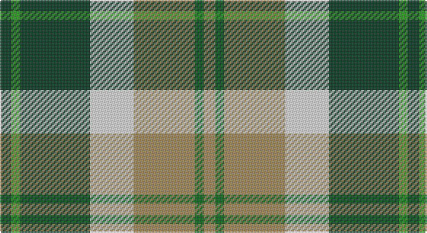

This page is one **sett** — a single exact thread-count. It belongs to the [tartan](/setts/dg4g3dg24w15lo21gi3lo4/)
(the same proportion at any scale), whose colour order is pattern [GGGWYGY](/stripes/gggwygy/).

Sourced from register-of-tartans.  It is a [7 stripe tartan](/stripes/stripes7/).

Original link https://www.tartanregister.gov.uk/tartanDetails.aspx?ref=197

## Also known as

This cloth is also recorded under:

- Bannockbane Dark Green

## Register references

External register numbers recorded for this tartan.

- Scottish Register of Tartans: [197](https://www.tartanregister.gov.uk/tartanDetails.aspx?ref=197)
- Scottish Tartans Authority (ITI): 761
- Scottish Tartans World Register: 761

## Thread count
DG/8 Ga6 DG48 LN30 LT42 G6 LT/8

One full sett is **280 threads**.

## Palette

Palette: <strong>Tartan Register</strong>
<table><thead><tr><th>Colour</th><th>Threads</th><th>Shade</th><th>Base</th><th>OKLCh</th></tr></thead><tbody><tr><td>DG/</td><td style="text-align:right;font-variant-numeric:tabular-nums">8</td><td><code style="background-color:#003820;">#003820</code> <small style="color:#888">#003820</small></td><td>G <code style="background-color:#006100;">#006100</code></td><td><small style="color:#888">oklch(30.0% 0.070 158.3)</small></td></tr><tr><td>Ga</td><td style="text-align:right;font-variant-numeric:tabular-nums">6</td><td><code style="background-color:#289C18;">#289C18</code> <small style="color:#888">#289C18</small></td><td>G <code style="background-color:#006100;">#006100</code></td><td><small style="color:#888">oklch(60.6% 0.191 141.6)</small></td></tr><tr><td>DG</td><td style="text-align:right;font-variant-numeric:tabular-nums">48</td><td><code style="background-color:#003820;">#003820</code> <small style="color:#888">#003820</small></td><td>G <code style="background-color:#006100;">#006100</code></td><td><small style="color:#888">oklch(30.0% 0.070 158.3)</small></td></tr><tr><td>LN</td><td style="text-align:right;font-variant-numeric:tabular-nums">30</td><td><code style="background-color:#E0E0E0;">#E0E0E0</code> <small style="color:#888">#E0E0E0</small></td><td>W <code style="background-color:#F7F7F7;">#F7F7F7</code></td><td><small style="color:#888">oklch(90.7% 0.000 89.9)</small></td></tr><tr><td>LT</td><td style="text-align:right;font-variant-numeric:tabular-nums">42</td><td><code style="background-color:#A08858;">#A08858</code> <small style="color:#888">#A08858</small></td><td>Y <code style="background-color:#F2BF00;">#F2BF00</code></td><td><small style="color:#888">oklch(63.7% 0.071 84.0)</small></td></tr><tr><td>G</td><td style="text-align:right;font-variant-numeric:tabular-nums">6</td><td><code style="background-color:#006818;">#006818</code> <small style="color:#888">#006818</small></td><td>G <code style="background-color:#006100;">#006100</code></td><td><small style="color:#888">oklch(45.0% 0.142 145.0)</small></td></tr><tr><td>LT/</td><td style="text-align:right;font-variant-numeric:tabular-nums">8</td><td><code style="background-color:#A08858;">#A08858</code> <small style="color:#888">#A08858</small></td><td>Y <code style="background-color:#F2BF00;">#F2BF00</code></td><td><small style="color:#888">oklch(63.7% 0.071 84.0)</small></td></tr></tbody></table>

# Sample pattern

## Nearest tartans

The nearest existing variants by ΔTartan distance, with this tartan at the top so the swatches line up against it.

ΔTartan

Tartan

Sett

—

<a href="/ttd/edit/#slug=dg4g3dg24w15lo21gi3lo4~x2">Bannockbane Dark Green</a> <a class="nn-out" href="/variants/s7/dg4g3dg24w15lo21gi3lo4~x2/" title="open its dictionary page">↗</a>

0.51

<a href="/ttd/edit/#slug=dg8gi6dg48w31o42g6o8&amp;base=dg4g3dg24w15lo21gi3lo4~x2">Bannockbane, Green</a> <a class="nn-out" href="/variants/s7/dg8gi6dg48w31o42g6o8/" title="open its dictionary page">↗</a>

0.83

<a href="/ttd/edit/#slug=g7p3w1lg2g1lp2p1~x8&amp;base=dg4g3dg24w15lo21gi3lo4~x2">Lindley-Highfield of Ballumbie Castle</a> <a class="nn-out" href="/variants/s7/g7p3w1lg2g1lp2p1~x8/" title="open its dictionary page">↗</a>

0.88

<a href="/ttd/edit/#slug=g1w1g6db5w6r1g1lo1~x4&amp;base=dg4g3dg24w15lo21gi3lo4~x2">Vermont Dress</a> <a class="nn-out" href="/variants/s8/g1w1g6db5w6r1g1lo1~x4/" title="open its dictionary page">↗</a>

0.92

<a href="/ttd/edit/#slug=g10dp42r5gi42g42ly5g6&amp;base=dg4g3dg24w15lo21gi3lo4~x2">New Mexico (Fashion)</a> <a class="nn-out" href="/variants/s7/g10dp42r5gi42g42ly5g6/" title="open its dictionary page">↗</a>

0.96

<a href="/ttd/edit/#slug=dy17g5db2w12db2ly4g7~x4&amp;base=dg4g3dg24w15lo21gi3lo4~x2">Northern Ontario</a> <a class="nn-out" href="/variants/s7/dy17g5db2w12db2ly4g7~x4/" title="open its dictionary page">↗</a>

1.01

<a href="/ttd/edit/#slug=do21r2lg18r2lg18r2dg8w6do10~x2&amp;base=dg4g3dg24w15lo21gi3lo4~x2">Red Dirt Girl</a> <a class="nn-out" href="/variants/s9/do21r2lg18r2lg18r2dg8w6do10~x2/" title="open its dictionary page">↗</a>

1.02

<a href="/ttd/edit/#slug=g36lb4g8k29r24w7~x2&amp;base=dg4g3dg24w15lo21gi3lo4~x2">Entre Rios Province (Provisional</a> <a class="nn-out" href="/variants/s6/g36lb4g8k29r24w7~x2/" title="open its dictionary page">↗</a>

1.02

<a href="/ttd/edit/#slug=db8w33k15dg17t3dg17t3~x2&amp;base=dg4g3dg24w15lo21gi3lo4~x2">MacRobart Dress (Personal)</a> <a class="nn-out" href="/variants/s7/db8w33k15dg17t3dg17t3~x2/" title="open its dictionary page">↗</a>

1.06

<a href="/ttd/edit/#slug=db2y1o1dg6w3o3o1y1&amp;base=dg4g3dg24w15lo21gi3lo4~x2">Equorian Olympic</a> <a class="nn-out" href="/variants/s8/db2y1o1dg6w3o3o1y1/" title="open its dictionary page">↗</a>

1.06

<a href="/ttd/edit/#slug=ly5k5g17k6o24k6ly3~x2&amp;base=dg4g3dg24w15lo21gi3lo4~x2">Cape Breton District Tartan</a> <a class="nn-out" href="/variants/s7/ly5k5g17k6o24k6ly3~x2/" title="open its dictionary page">↗</a>

## Neighbour map

Every grey dot is one of 14360 variants placed by the first two principal components of the ΔTartan feature space (44% of its variance). Red is this tartan; blue dots are its nearest — click one to open its page.

<svg viewBox="0 0 640 380" role="img" style="max-width:100%;height:auto;border:1px solid #e0e0e0;border-radius:4px;display:block" xmlns="http://www.w3.org/2000/svg"><image href="/nn/cloud.v1.png" width="640" height="380"/><a href="/variants/s7/dg8gi6dg48w31o42g6o8/"><circle cx="142.4" cy="185.0" r="4" fill="#3465a4"><title>Bannockbane, Green</title></circle></a><a href="/variants/s7/g7p3w1lg2g1lp2p1~x8/"><circle cx="169.8" cy="188.1" r="4" fill="#3465a4"><title>Lindley-Highfield of Ballumbie Castle</title></circle></a><a href="/variants/s8/g1w1g6db5w6r1g1lo1~x4/"><circle cx="110.5" cy="181.1" r="4" fill="#3465a4"><title>Vermont Dress</title></circle></a><a href="/variants/s7/g10dp42r5gi42g42ly5g6/"><circle cx="171.4" cy="198.7" r="4" fill="#3465a4"><title>New Mexico (Fashion)</title></circle></a><a href="/variants/s7/dy17g5db2w12db2ly4g7~x4/"><circle cx="102.8" cy="176.6" r="4" fill="#3465a4"><title>Northern Ontario</title></circle></a><a href="/variants/s9/do21r2lg18r2lg18r2dg8w6do10~x2/"><circle cx="150.9" cy="163.9" r="4" fill="#3465a4"><title>Red Dirt Girl</title></circle></a><a href="/variants/s6/g36lb4g8k29r24w7~x2/"><circle cx="144.0" cy="194.7" r="4" fill="#3465a4"><title>Entre Rios Province (Provisional</title></circle></a><a href="/variants/s7/db8w33k15dg17t3dg17t3~x2/"><circle cx="114.3" cy="175.9" r="4" fill="#3465a4"><title>MacRobart Dress (Personal)</title></circle></a><a href="/variants/s8/db2y1o1dg6w3o3o1y1/"><circle cx="95.6" cy="195.7" r="4" fill="#3465a4"><title>Equorian Olympic</title></circle></a><a href="/variants/s7/ly5k5g17k6o24k6ly3~x2/"><circle cx="152.1" cy="208.8" r="4" fill="#3465a4"><title>Cape Breton District Tartan</title></circle></a><circle cx="144.3" cy="185.4" r="5" fill="#c00000"/></svg>

ID: /variants/s7/dg4g3dg24w15lo21gi3lo4~x2/
