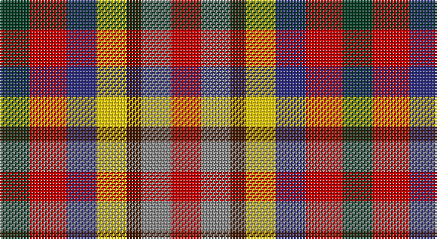

This page is one **sett** — a single exact thread-count. It belongs to the [tartan](/setts/dg4r5db4ly4do2o4r4/)
(the same proportion at any scale), whose colour order is pattern [GRBYBRR](/stripes/grbybrr/).

Part of the [Krifa-Jean](/tartans/krifa-jean/) tartan — the named design grouping this sett with its other cloths.

Sourced from tartans-authority.  It is a [7 stripe tartan](/stripes/stripes7/).

Original link http://www.tartansauthority.com/tartan-ferret/display/11232/

## Register references

External register numbers recorded for this tartan.

- Scottish Register of Tartans: [11232](https://www.tartanregister.gov.uk/tartanDetails?ref=11232)
- Scottish Tartans Authority (ITI): 11232

## Thread count
DG/20 R25 DB20 Y20 DR10 N20 Ra/20

One full sett is **230 threads**.

## Palette

Palette: <strong>Tartan Register</strong>
<table><thead><tr><th>Colour</th><th>Threads</th><th>Shade</th><th>Base</th><th>OKLCh</th></tr></thead><tbody><tr><td>DG/</td><td style="text-align:right;font-variant-numeric:tabular-nums">20</td><td><code style="background-color:#003820;">#003820</code> <small style="color:#888">#003820</small></td><td>G <code style="background-color:#006100;">#006100</code></td><td><small style="color:#888">oklch(30.0% 0.070 158.3)</small></td></tr><tr><td>R</td><td style="text-align:right;font-variant-numeric:tabular-nums">25</td><td><code style="background-color:#C80000;">#C80000</code> <small style="color:#888">#C80000</small></td><td>R <code style="background-color:#CC0000;">#CC0000</code></td><td><small style="color:#888">oklch(52.3% 0.215 29.2)</small></td></tr><tr><td>DB</td><td style="text-align:right;font-variant-numeric:tabular-nums">20</td><td><code style="background-color:#2C2C80;">#2C2C80</code> <small style="color:#888">#2C2C80</small></td><td>B <code style="background-color:#2A418A;">#2A418A</code></td><td><small style="color:#888">oklch(35.0% 0.138 276.6)</small></td></tr><tr><td>Y</td><td style="text-align:right;font-variant-numeric:tabular-nums">20</td><td><code style="background-color:#FCCC00;">#FCCC00</code> <small style="color:#888">#FCCC00</small></td><td>Y <code style="background-color:#F2BF00;">#F2BF00</code></td><td><small style="color:#888">oklch(86.2% 0.176 91.5)</small></td></tr><tr><td>DR</td><td style="text-align:right;font-variant-numeric:tabular-nums">10</td><td><code style="background-color:#441800;">#441800</code> <small style="color:#888">#441800</small></td><td>B <code style="background-color:#2A418A;">#2A418A</code></td><td><small style="color:#888">oklch(27.3% 0.076 46.3)</small></td></tr><tr><td>N</td><td style="text-align:right;font-variant-numeric:tabular-nums">20</td><td><code style="background-color:#888888;">#888888</code> <small style="color:#888">#888888</small></td><td>R <code style="background-color:#CC0000;">#CC0000</code></td><td><small style="color:#888">oklch(62.7% 0.000 89.9)</small></td></tr><tr><td>Ra/</td><td style="text-align:right;font-variant-numeric:tabular-nums">20</td><td><code style="background-color:#C80000;">#C80000</code> <small style="color:#888">#C80000</small></td><td>R <code style="background-color:#CC0000;">#CC0000</code></td><td><small style="color:#888">oklch(52.3% 0.215 29.2)</small></td></tr></tbody></table>

# Sample pattern

## Compared to the master

This cloth is one sett of its design; the master sett (the exemplar the design is anchored on) is below for comparison.

<figure style="margin:0"><figcaption style="color:#888;font-size:smaller">this sett</figcaption></figure>
<figure style="margin:0"><figcaption style="color:#888;font-size:smaller"><a href="/setts/dg4ri5ly4db4dy2k4r4/">master sett →</a></figcaption></figure>

## Nearest tartans

The nearest existing variants by ΔTartan distance, with this tartan at the top so the swatches line up against it.

ΔTartan

Tartan

Sett

—

<a href="/ttd/edit/#slug=dg4r5db4ly4do2o4r4~x5">Krifa-Jean (Personal)</a> <a class="nn-out" href="/variants/s7/dg4r5db4ly4do2o4r4~x5/" title="open its dictionary page">↗</a>

0.89

<a href="/ttd/edit/#slug=dg4ri5ly4db4dy2k4r4~x10&amp;base=dg4r5db4ly4do2o4r4~x5">Krifa-Jean (Personal)</a> <a class="nn-out" href="/variants/s7/dg4ri5ly4db4dy2k4r4~x10/" title="open its dictionary page">↗</a>

1.80

<a href="/ttd/edit/#slug=g2ly1lo1r1dp1db1~x36&amp;base=dg4r5db4ly4do2o4r4~x5">Rainbow (Fashion)</a> <a class="nn-out" href="/variants/s6/g2ly1lo1r1dp1db1~x36/" title="open its dictionary page">↗</a>

1.84

<a href="/ttd/edit/#slug=g2ly1lo1r1p1db1~x36&amp;base=dg4r5db4ly4do2o4r4~x5">Rainbow</a> <a class="nn-out" href="/variants/s6/g2ly1lo1r1p1db1~x36/" title="open its dictionary page">↗</a>

2.00

<a href="/ttd/edit/#slug=lb3lbi2db3r3k3ly1~x8&amp;base=dg4r5db4ly4do2o4r4~x5">Becker (Name)</a> <a class="nn-out" href="/variants/s6/lb3lbi2db3r3k3ly1~x8/" title="open its dictionary page">↗</a>

2.02

<a href="/ttd/edit/#slug=db1dt1r1dp2ri1ly1~x10&amp;base=dg4r5db4ly4do2o4r4~x5">Lytley Formal (Personal)</a> <a class="nn-out" href="/variants/s6/db1dt1r1dp2ri1ly1~x10/" title="open its dictionary page">↗</a>

2.19

<a href="/ttd/edit/#slug=dp15dpi15g15dg15k8w5~x2&amp;base=dg4r5db4ly4do2o4r4~x5">Williams, Edmund (Personal)</a> <a class="nn-out" href="/variants/s6/dp15dpi15g15dg15k8w5~x2/" title="open its dictionary page">↗</a>

2.33

<a href="/ttd/edit/#slug=db8r11g5dbi3ly3w5k3~x2&amp;base=dg4r5db4ly4do2o4r4~x5">Nicolson of Assynt &amp; Coigach (Name)</a> <a class="nn-out" href="/variants/s7/db8r11g5dbi3ly3w5k3~x2/" title="open its dictionary page">↗</a>

2.34

<a href="/ttd/edit/#slug=r11dbi3db8w3ly3g5k5~x4&amp;base=dg4r5db4ly4do2o4r4~x5">Nicolson of Taransay Hunting (Personal)</a> <a class="nn-out" href="/variants/s7/r11dbi3db8w3ly3g5k5~x4/" title="open its dictionary page">↗</a>

2.39

<a href="/ttd/edit/#slug=b15g15o11r17m15~x2&amp;base=dg4r5db4ly4do2o4r4~x5">Highland Princess, The</a> <a class="nn-out" href="/variants/s5/b15g15o11r17m15~x2/" title="open its dictionary page">↗</a>

2.46

<a href="/ttd/edit/#slug=r10lr36k24r30lo8k16w18db16lo9&amp;base=dg4r5db4ly4do2o4r4~x5">Tipperary County Crest (Fashion)</a> <a class="nn-out" href="/variants/s9/r10lr36k24r30lo8k16w18db16lo9/" title="open its dictionary page">↗</a>

## Neighbour map

Every grey dot is one of 14360 variants placed by the first two principal components of the ΔTartan feature space (44% of its variance). Red is this tartan; blue dots are its nearest — click one to open its page.

<svg viewBox="0 0 640 380" role="img" style="max-width:100%;height:auto;border:1px solid #e0e0e0;border-radius:4px;display:block" xmlns="http://www.w3.org/2000/svg"><image href="/nn/cloud.v1.png" width="640" height="380"/><a href="/variants/s7/dg4ri5ly4db4dy2k4r4~x10/"><circle cx="14.0" cy="257.6" r="4" fill="#3465a4"><title>Krifa-Jean (Personal)</title></circle></a><a href="/variants/s6/g2ly1lo1r1dp1db1~x36/"><circle cx="14.0" cy="275.2" r="4" fill="#3465a4"><title>Rainbow (Fashion)</title></circle></a><a href="/variants/s6/g2ly1lo1r1p1db1~x36/"><circle cx="14.0" cy="272.9" r="4" fill="#3465a4"><title>Rainbow</title></circle></a><a href="/variants/s6/lb3lbi2db3r3k3ly1~x8/"><circle cx="14.0" cy="256.4" r="4" fill="#3465a4"><title>Becker (Name)</title></circle></a><a href="/variants/s6/db1dt1r1dp2ri1ly1~x10/"><circle cx="14.0" cy="278.4" r="4" fill="#3465a4"><title>Lytley Formal (Personal)</title></circle></a><a href="/variants/s6/dp15dpi15g15dg15k8w5~x2/"><circle cx="14.0" cy="267.6" r="4" fill="#3465a4"><title>Williams, Edmund (Personal)</title></circle></a><a href="/variants/s7/db8r11g5dbi3ly3w5k3~x2/"><circle cx="14.0" cy="198.9" r="4" fill="#3465a4"><title>Nicolson of Assynt &amp; Coigach (Name)</title></circle></a><a href="/variants/s7/r11dbi3db8w3ly3g5k5~x4/"><circle cx="14.0" cy="203.0" r="4" fill="#3465a4"><title>Nicolson of Taransay Hunting (Personal)</title></circle></a><a href="/variants/s5/b15g15o11r17m15~x2/"><circle cx="14.0" cy="345.4" r="4" fill="#3465a4"><title>Highland Princess, The</title></circle></a><a href="/variants/s9/r10lr36k24r30lo8k16w18db16lo9/"><circle cx="14.0" cy="202.2" r="4" fill="#3465a4"><title>Tipperary County Crest (Fashion)</title></circle></a><circle cx="14.0" cy="262.0" r="5" fill="#c00000"/></svg>

ID: /variants/s7/dg4r5db4ly4do2o4r4~x5/
