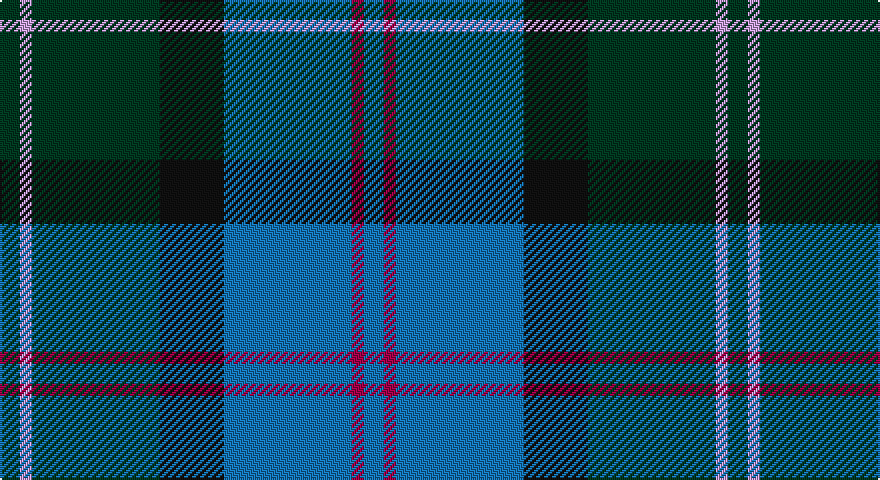

This page is one **sett** — a single exact thread-count. It belongs to the [tartan](/setts/dg5lp3dg32k16b32m3b5/)
(the same proportion at any scale), whose colour order is pattern [BRBKGWG](/stripes/brbkgwg/).

Part of the [MacThomas](/tartans/macthomas/) tartan — the named design grouping this sett with its other cloths.

Sourced from tartans-authority.  It is a [7 stripe tartan](/stripes/stripes7/).

Original link http://www.tartansauthority.com/tartan-ferret/display/407/

## Register references

External register numbers recorded for this tartan.

- Scottish Tartans Authority (ITI): 407

## Thread count
DG/10 LP6 DG64 K32 B64 R6 B/10

One full sett is **364 threads**.

## Palette

Palette: <strong>Tartan Register</strong>
<table><thead><tr><th>Colour</th><th>Threads</th><th>Shade</th><th>Base</th><th>OKLCh</th></tr></thead><tbody><tr><td>DG/</td><td style="text-align:right;font-variant-numeric:tabular-nums">10</td><td><code style="background-color:#003820;">#003820</code> <small style="color:#888">#003820</small></td><td>G <code style="background-color:#006100;">#006100</code></td><td><small style="color:#888">oklch(30.0% 0.070 158.3)</small></td></tr><tr><td>LP</td><td style="text-align:right;font-variant-numeric:tabular-nums">6</td><td><code style="background-color:#C49CD8;">#C49CD8</code> <small style="color:#888">#C49CD8</small></td><td>W <code style="background-color:#F7F7F7;">#F7F7F7</code></td><td><small style="color:#888">oklch(75.0% 0.095 314.2)</small></td></tr><tr><td>DG</td><td style="text-align:right;font-variant-numeric:tabular-nums">64</td><td><code style="background-color:#003820;">#003820</code> <small style="color:#888">#003820</small></td><td>G <code style="background-color:#006100;">#006100</code></td><td><small style="color:#888">oklch(30.0% 0.070 158.3)</small></td></tr><tr><td>K</td><td style="text-align:right;font-variant-numeric:tabular-nums">32</td><td><code style="background-color:#101010;">#101010</code> <small style="color:#888">#101010</small></td><td>K <code style="background-color:#000000;">#000000</code></td><td><small style="color:#888">oklch(17.3% 0.000 89.9)</small></td></tr><tr><td>B</td><td style="text-align:right;font-variant-numeric:tabular-nums">64</td><td><code style="background-color:#1474B4;">#1474B4</code> <small style="color:#888">#1474B4</small></td><td>B <code style="background-color:#2A418A;">#2A418A</code></td><td><small style="color:#888">oklch(54.0% 0.129 245.1)</small></td></tr><tr><td>R</td><td style="text-align:right;font-variant-numeric:tabular-nums">6</td><td><code style="background-color:#A00048;">#A00048</code> <small style="color:#888">#A00048</small></td><td>R <code style="background-color:#CC0000;">#CC0000</code></td><td><small style="color:#888">oklch(45.4% 0.182 5.3)</small></td></tr><tr><td>B/</td><td style="text-align:right;font-variant-numeric:tabular-nums">10</td><td><code style="background-color:#1474B4;">#1474B4</code> <small style="color:#888">#1474B4</small></td><td>B <code style="background-color:#2A418A;">#2A418A</code></td><td><small style="color:#888">oklch(54.0% 0.129 245.1)</small></td></tr></tbody></table>

# Sample pattern

## Nearest tartans

The nearest existing variants by ΔTartan distance, with this tartan at the top so the swatches line up against it.

ΔTartan

Tartan

Sett

—

<a href="/ttd/edit/#slug=dg5lp3dg32k16b32m3b5~x2">MacThomas (Clan)</a> <a class="nn-out" href="/variants/s7/dg5lp3dg32k16b32m3b5~x2/" title="open its dictionary page">↗</a>

0.48

<a href="/ttd/edit/#slug=db3m2db22k11g24lp2g3~x2&amp;base=dg5lp3dg32k16b32m3b5~x2">MacThomas Clan Tartan</a> <a class="nn-out" href="/variants/s7/db3m2db22k11g24lp2g3~x2/" title="open its dictionary page">↗</a>

0.68

<a href="/ttd/edit/#slug=b11k4g4m1g4k1r1~x4&amp;base=dg5lp3dg32k16b32m3b5~x2">Ednie (Personal)</a> <a class="nn-out" href="/variants/s7/b11k4g4m1g4k1r1~x4/" title="open its dictionary page">↗</a>

0.75

<a href="/ttd/edit/#slug=r2db23k14dg16k2w2~x2&amp;base=dg5lp3dg32k16b32m3b5~x2">MacPhail Hunting</a> <a class="nn-out" href="/variants/s6/r2db23k14dg16k2w2~x2/" title="open its dictionary page">↗</a>

0.77

<a href="/ttd/edit/#slug=r1k1g7k5db10k1ly1~x2&amp;base=dg5lp3dg32k16b32m3b5~x2">MacLeod Small Clan Tartan</a> <a class="nn-out" href="/variants/s7/r1k1g7k5db10k1ly1~x2/" title="open its dictionary page">↗</a>

0.78

<a href="/ttd/edit/#slug=db20k6lo4db3g20w2~x2&amp;base=dg5lp3dg32k16b32m3b5~x2">DeLoughery (Personal)</a> <a class="nn-out" href="/variants/s6/db20k6lo4db3g20w2~x2/" title="open its dictionary page">↗</a>

0.80

<a href="/ttd/edit/#slug=k6g15w2db22r2k4~x2&amp;base=dg5lp3dg32k16b32m3b5~x2">Leslie, Hebridean</a> <a class="nn-out" href="/variants/s6/k6g15w2db22r2k4~x2/" title="open its dictionary page">↗</a>

0.84

<a href="/ttd/edit/#slug=g26r2g3db15dbi26ri2dbi3db4~x2&amp;base=dg5lp3dg32k16b32m3b5~x2">Grampian</a> <a class="nn-out" href="/variants/s8/g26r2g3db15dbi26ri2dbi3db4~x2/" title="open its dictionary page">↗</a>

0.85

<a href="/ttd/edit/#slug=db12k4g4r1g4k1lo1~x4&amp;base=dg5lp3dg32k16b32m3b5~x2">MacLaren</a> <a class="nn-out" href="/variants/s7/db12k4g4r1g4k1lo1~x4/" title="open its dictionary page">↗</a>

0.86

<a href="/ttd/edit/#slug=g5mi3g32k16b32m3b5~x2&amp;base=dg5lp3dg32k16b32m3b5~x2">MacThomas</a> <a class="nn-out" href="/variants/s7/g5mi3g32k16b32m3b5~x2/" title="open its dictionary page">↗</a>

0.90

<a href="/ttd/edit/#slug=n6db8n8g12dt29w3dt4~x2&amp;base=dg5lp3dg32k16b32m3b5~x2">Dickson (Kirkcudbrightshire) (Name)</a> <a class="nn-out" href="/variants/s7/n6db8n8g12dt29w3dt4~x2/" title="open its dictionary page">↗</a>

## Neighbour map

Every grey dot is one of 14360 variants placed by the first two principal components of the ΔTartan feature space (44% of its variance). Red is this tartan; blue dots are its nearest — click one to open its page.

<svg viewBox="0 0 640 380" role="img" style="max-width:100%;height:auto;border:1px solid #e0e0e0;border-radius:4px;display:block" xmlns="http://www.w3.org/2000/svg"><image href="/nn/cloud.v1.png" width="640" height="380"/><a href="/variants/s7/db3m2db22k11g24lp2g3~x2/"><circle cx="233.7" cy="195.6" r="4" fill="#3465a4"><title>MacThomas Clan Tartan</title></circle></a><a href="/variants/s7/b11k4g4m1g4k1r1~x4/"><circle cx="212.9" cy="195.3" r="4" fill="#3465a4"><title>Ednie (Personal)</title></circle></a><a href="/variants/s6/r2db23k14dg16k2w2~x2/"><circle cx="214.9" cy="210.7" r="4" fill="#3465a4"><title>MacPhail Hunting</title></circle></a><a href="/variants/s7/r1k1g7k5db10k1ly1~x2/"><circle cx="196.2" cy="195.4" r="4" fill="#3465a4"><title>MacLeod Small Clan Tartan</title></circle></a><a href="/variants/s6/db20k6lo4db3g20w2~x2/"><circle cx="206.5" cy="204.1" r="4" fill="#3465a4"><title>DeLoughery (Personal)</title></circle></a><a href="/variants/s6/k6g15w2db22r2k4~x2/"><circle cx="214.4" cy="198.6" r="4" fill="#3465a4"><title>Leslie, Hebridean</title></circle></a><a href="/variants/s8/g26r2g3db15dbi26ri2dbi3db4~x2/"><circle cx="194.9" cy="175.6" r="4" fill="#3465a4"><title>Grampian</title></circle></a><a href="/variants/s7/db12k4g4r1g4k1lo1~x4/"><circle cx="236.6" cy="187.8" r="4" fill="#3465a4"><title>MacLaren</title></circle></a><a href="/variants/s7/g5mi3g32k16b32m3b5~x2/"><circle cx="212.0" cy="199.5" r="4" fill="#3465a4"><title>MacThomas</title></circle></a><a href="/variants/s7/n6db8n8g12dt29w3dt4~x2/"><circle cx="212.6" cy="203.7" r="4" fill="#3465a4"><title>Dickson (Kirkcudbrightshire) (Name)</title></circle></a><circle cx="213.8" cy="201.7" r="5" fill="#c00000"/></svg>

ID: /variants/s7/dg5lp3dg32k16b32m3b5~x2/
