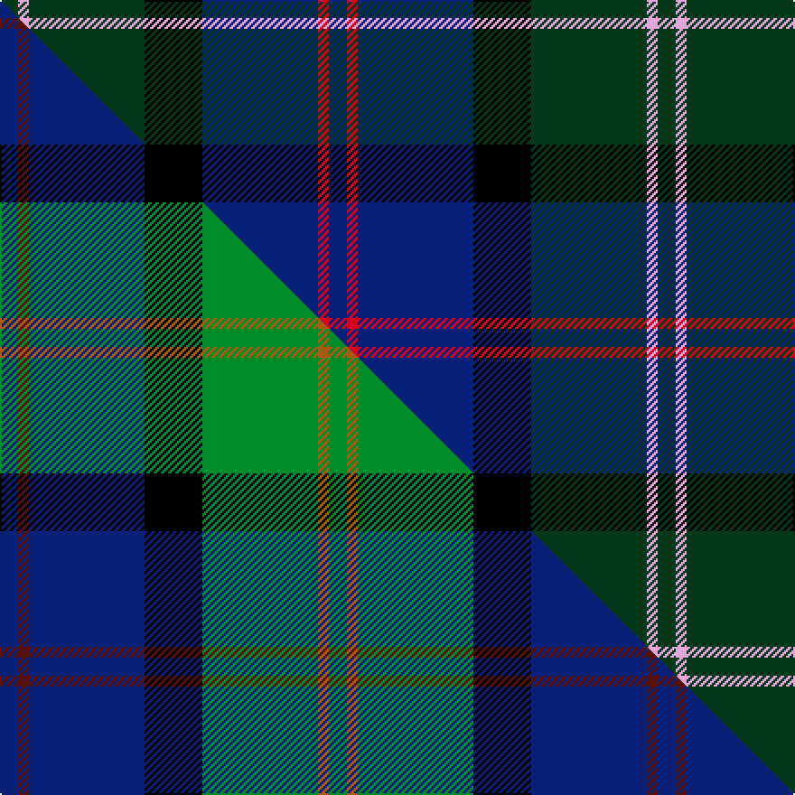

This is one **variant** — a specific cloth: this exact thread count and colourway, with its own
provenance below. It is one weaving of the [sett](/tartans/m/ma/macthomas/) (the scale-free proportion — the
same cloth at any scale or shade), whose colour order is pattern [BRBKGWG](/stripes/brbkgwg/).

Part of the [MacThomas](/tartans/m/ma/macthomas/) tartan — the named design grouping this sett with its other cloths.

Sourced from tartans-authority.  It is a [7 stripe tartan](/stripes/stripes7/).

Original link <code>http://www.tartansauthority.com/tartan-ferret/display/407/</code> — retired · [Internet Archive copy](https://web.archive.org/web/*/http://www.tartansauthority.com/tartan-ferret/display/407/*)

Dataset <small>— provenance for this record, inherited from the source manifest</small>

<dl class="dataset-prov">
<dt>source</dt><dd><a href="/sources/tartans-authority/">Scottish Tartans Authority</a></dd>
<dt>data captured from</dt><dd><a href="https://github.com/thetartan/tartan-database/blob/master/data/tartans-authority/data.csv">https://github.com/thetartan/tartan-database/blob/master/data/tartans-authority/data.csv</a></dd>
<dt>data date</dt><dd>1954 <small>(this record)</small></dd>
<dt>licence</dt><dd><a href="https://creativecommons.org/licenses/by-nc-nd/4.0/">CC BY-NC-ND 4.0</a></dd>
</dl>

Capture chain <small>— the hands this data passed through, oldest first; each capture carries its own licence</small>

<ol class="capture-chain">
<li><a href="https://www.tartansauthority.com/">Scottish Tartans Authority</a> <small>the heritage body’s archive — its tartan-ferret record browser is retired; dead record links are shown unlinked, with an Internet Archive copy (ITI numbers are not SRT references)</small></li>
<li><a href="https://github.com/thetartan/tartan-database">thetartan/tartan-database</a> <small>2016-2017</small> · <a href="https://creativecommons.org/licenses/by-nc-nd/4.0/">CC BY-NC-ND 4.0</a> <small>Levko Kravets's frozen compilation — the capture we vendored, and where its CC licence text came from</small></li>
<li>this dictionary <small>captured 2026-06-10 · commit 5bf86c7566</small> <small>each re-capture is a git commit to data/sources</small></li>
</ol>

## Register references

External register numbers recorded for this tartan.

- Scottish Tartans Authority (ITI): 407

## Thread count
DG/10 LP6 DG64 K32 DB64 R6 DB/10

One full sett is **364 threads**.

## Palette
<table><thead><tr><th>Colour</th><th>Shade</th><th>OKLCh</th></tr></thead><tbody><tr><td>DB</td><td><code style="background-color:#082077;">#082077</code> <small style="color:#888">#082077</small></td><td><small style="color:#888">oklch(30.0% 0.149 265.1)</small></td></tr><tr><td>DG</td><td><code style="background-color:#053819;">#053819</code> <small style="color:#888">#053819</small></td><td><small style="color:#888">oklch(30.0% 0.075 151.3)</small></td></tr><tr><td>K</td><td><code style="background-color:#000000;">#000000</code> <small style="color:#888">#000000</small></td><td><small style="color:#888">oklch(0.0% 0.000 0.0)</small></td></tr><tr><td>LP</td><td><code style="background-color:#E4A6DB;">#E4A6DB</code> <small style="color:#888">#E4A6DB</small></td><td><small style="color:#888">oklch(80.0% 0.100 331.6)</small></td></tr><tr><td>R</td><td><code style="background-color:#D60020;">#D60020</code> <small style="color:#888">#D60020</small></td><td><small style="color:#888">oklch(55.2% 0.224 25.5)</small></td></tr></tbody></table>

# Sample pattern

## Compared to the master

This cloth is one sett of its design; the master sett (the exemplar the design is anchored on) is below for comparison.

Its **ΔTartan distance** from the master is **0.42** — the same measure the nearest-tartans table ranks by (0 is identical; a re-scale of the same cloth is near 0, a recolour or a different proportion further).

<figure class="master-compare" style="margin:0">

this sett
master sett ★

<figcaption style="color:#888;font-size:smaller">One weave of this sett against the <a href="/setts/db5dr3db32k16g32o3g5/">master sett ★</a>, split on the diagonal: a shared proportion runs seamlessly across it with only the shades shifting; a different proportion breaks on it.</figcaption>
</figure>

## Nearest tartan variants

The nearest existing variants by ΔTartan distance, with this cloth at the top so the swatches line up against it.

ΔTartan

Threads

Variant

Sett

—

364

<a href="/variants/s7/dg5lp3dg32k16db32r3db5~x2/">MacThomas (Clan)</a>

<a href="/ttd/edit/#slug=db15dp3db30k22dg18dp3dg3w3~x2&amp;base=dg5lp3dg32k16db32r3db5~x2" title="compare in the TTD">1.19</a>

352

<a href="/variants/s8/db15dp3db30k22dg18dp3dg3w3~x2/">Moray (Corporate)</a>

<a href="/ttd/edit/#slug=db3r2db18k6dg18y2g3~x2&amp;base=dg5lp3dg32k16db32r3db5~x2" title="compare in the TTD">1.63</a>

196

<a href="/variants/s7/db3r2db18k6dg18y2g3~x2/">McComb</a>

<a href="/ttd/edit/#slug=db3r2db18k6dg18y2g3~x2~dg4514144-g5408159&amp;base=dg5lp3dg32k16db32r3db5~x2" title="compare in the TTD">1.63</a>

196

<a href="/variants/s7/db3r2db18k6dg18y2g3~x2~dg4514144-g5408159/">McComb (Personal)</a>

<a href="/ttd/edit/#slug=db44k3ly20dr3db8k34db5k15~x2~k17-ly6614084&amp;base=dg5lp3dg32k16db32r3db5~x2" title="compare in the TTD">1.84</a>

410

<a href="/variants/s8/db44k3ly20dr3db8k34db5k15~x2~k17-ly6614084/">U.S. Air Force Reserve P. B. (Corpor</a>

<a href="/ttd/edit/#slug=dy4w1dg12k3db16r1db1r1~x2&amp;base=dg5lp3dg32k16db32r3db5~x2" title="compare in the TTD">2.11</a>

146

<a href="/variants/s8/dy4w1dg12k3db16r1db1r1~x2/">Purves (2014)</a>

<a href="/ttd/edit/#slug=dg28k2db3k11db3k2db17b4lb2~x2~db2719264-b3826264&amp;base=dg5lp3dg32k16db32r3db5~x2" title="compare in the TTD">2.16</a>

228

<a href="/variants/s9/dg28k2db3k11db3k2db17b4lb2~x2~db2719264-b3826264/">West of Wells</a>

<a href="/ttd/edit/#slug=dg27dr2dg4o15db26k2db6~x2~dg4309123&amp;base=dg5lp3dg32k16db32r3db5~x2" title="compare in the TTD">2.19</a>

262

<a href="/variants/s7/dg27dr2dg4o15db26k2db6~x2~dg4309123/">Bailies of Bennachie Corporate Tartan</a>

<a href="/ttd/edit/#slug=db12k4g4r1g4k1y1~x4&amp;base=dg5lp3dg32k16db32r3db5~x2" title="compare in the TTD">2.25</a>

164

<a href="/variants/s7/db12k4g4r1g4k1y1~x4/">MacLaren</a>

<a href="/ttd/edit/#slug=db11k1db1k1db1k7dg8r1n7~x4~db2911276-n5507264&amp;base=dg5lp3dg32k16db32r3db5~x2" title="compare in the TTD">2.25</a>

232

<a href="/variants/s9/db11k1db1k1db1k7dg8r1n7~x4~db2911276-n5507264/">Damm, Alexander (Personal)</a>

<a href="/ttd/edit/#slug=db22r3db2r3db2k17dg18o4~x2&amp;base=dg5lp3dg32k16db32r3db5~x2" title="compare in the TTD">2.25</a>

232

<a href="/variants/s8/db22r3db2r3db2k17dg18o4~x2/">Scotch House 2000, original</a>

## Neighbour map

Every grey dot is one of 13662 variants placed by the first two principal components of the ΔTartan feature space (42% of its variance). Red is this tartan; blue dots are its nearest — click one to open its page. The map is a flat projection of a many-dimensional space — [how to read it](/posts/neighbourhood-maps/).

<svg viewBox="0 0 640 380" role="img" style="max-width:100%;height:auto;border:1px solid #e0e0e0;border-radius:4px;display:block" xmlns="http://www.w3.org/2000/svg"><image href="/nn/cloud.v1.png" width="640" height="380"/><a href="/variants/s8/db15dp3db30k22dg18dp3dg3w3~x2/"><circle cx="218.0" cy="185.1" r="4" fill="#3465a4"><title>Moray (Corporate)</title></circle></a><a href="/variants/s7/db3r2db18k6dg18y2g3~x2/"><circle cx="200.3" cy="181.5" r="4" fill="#3465a4"><title>McComb</title></circle></a><a href="/variants/s7/db3r2db18k6dg18y2g3~x2~dg4514144-g5408159/"><circle cx="176.1" cy="175.0" r="4" fill="#3465a4"><title>McComb (Personal)</title></circle></a><a href="/variants/s8/db44k3ly20dr3db8k34db5k15~x2~k17-ly6614084/"><circle cx="240.5" cy="169.3" r="4" fill="#3465a4"><title>U.S. Air Force Reserve P. B. (Corpor</title></circle></a><a href="/variants/s8/dy4w1dg12k3db16r1db1r1~x2/"><circle cx="240.6" cy="141.0" r="4" fill="#3465a4"><title>Purves (2014)</title></circle></a><a href="/variants/s9/dg28k2db3k11db3k2db17b4lb2~x2~db2719264-b3826264/"><circle cx="218.8" cy="155.3" r="4" fill="#3465a4"><title>West of Wells</title></circle></a><a href="/variants/s7/dg27dr2dg4o15db26k2db6~x2~dg4309123/"><circle cx="252.4" cy="190.1" r="4" fill="#3465a4"><title>Bailies of Bennachie Corporate Tartan</title></circle></a><a href="/variants/s7/db12k4g4r1g4k1y1~x4/"><circle cx="193.7" cy="165.2" r="4" fill="#3465a4"><title>MacLaren</title></circle></a><a href="/variants/s9/db11k1db1k1db1k7dg8r1n7~x4~db2911276-n5507264/"><circle cx="161.3" cy="171.8" r="4" fill="#3465a4"><title>Damm, Alexander (Personal)</title></circle></a><a href="/variants/s8/db22r3db2r3db2k17dg18o4~x2/"><circle cx="171.3" cy="172.3" r="4" fill="#3465a4"><title>Scotch House 2000, original</title></circle></a><circle cx="219.3" cy="188.7" r="5" fill="#c00000"/><text x="320" y="376" text-anchor="middle" font-size="11" fill="#999">ground</text><text x="11" y="190" text-anchor="middle" font-size="11" fill="#999" transform="rotate(-90 11 190)">complexity</text></svg>

ID: /variants/s7/dg5lp3dg32k16db32r3db5~x2/
