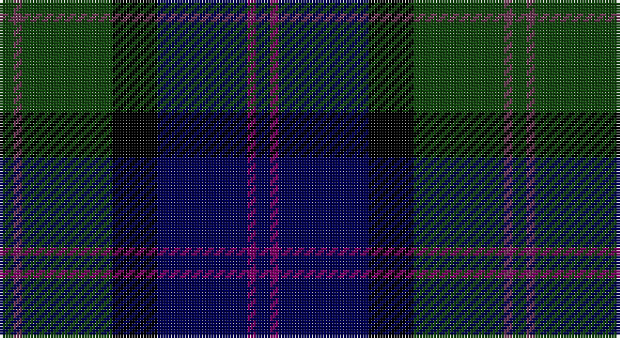

This page is one **sett** — a single exact thread-count. It belongs to the [tartan](/setts/dg5n3dg32k16db32dp3db5/)
(the same proportion at any scale), whose colour order is pattern [BBBKGBG](/stripes/bbbkgbg/).

Part of the [MacThomas LC](/tartans/macthomas-lc/) tartan — the named design grouping this sett with its other cloths.

Sourced from weddslist.  It is a [7 stripe tartan](/stripes/stripes7/).

Original link http://www.weddslist.com/cgi-bin/tartans/pg.pl?source=x

## Thread count
DG/5 N3 DG32 K16 DB32 P3 DB/5

One full sett is **182 threads**.

## Palette

Palette: <strong>Ingles Buchan</strong> <small style="color:#888">(1 of 5 colours)</small>
<table><thead><tr><th>Colour</th><th>Threads</th><th>Shade</th><th>Base</th><th>OKLCh</th></tr></thead><tbody><tr><td>DG/</td><td style="text-align:right;font-variant-numeric:tabular-nums">5</td><td><code style="background-color:#11450D;">#11450D</code> <small style="color:#888">#11450D</small></td><td>G <code style="background-color:#006100;">#006100</code></td><td><small style="color:#888">oklch(34.4% 0.101 142.1)</small></td></tr><tr><td>N</td><td style="text-align:right;font-variant-numeric:tabular-nums">3</td><td><code style="background-color:#6D3855;">#6D3855</code> <small style="color:#888">#6D3855</small></td><td>B <code style="background-color:#2A418A;">#2A418A</code></td><td><small style="color:#888">oklch(41.8% 0.084 347.4)</small></td></tr><tr><td>DG</td><td style="text-align:right;font-variant-numeric:tabular-nums">32</td><td><code style="background-color:#11450D;">#11450D</code> <small style="color:#888">#11450D</small></td><td>G <code style="background-color:#006100;">#006100</code></td><td><small style="color:#888">oklch(34.4% 0.101 142.1)</small></td></tr><tr><td>K</td><td style="text-align:right;font-variant-numeric:tabular-nums">16</td><td><code style="background-color:#000000;">#000000</code> <small style="color:#888">#000000</small></td><td>K <code style="background-color:#000000;">#000000</code></td><td><small style="color:#888">oklch(0.0% 0.000 0.0)</small></td></tr><tr><td>DB</td><td style="text-align:right;font-variant-numeric:tabular-nums">32</td><td><code style="background-color:#000052;">#000052</code> <small style="color:#888">#000052</small></td><td>B <code style="background-color:#2A418A;">#2A418A</code></td><td><small style="color:#888">oklch(19.8% 0.137 264.1)</small></td></tr><tr><td>P</td><td style="text-align:right;font-variant-numeric:tabular-nums">3</td><td><code style="background-color:#7F0066;">#7F0066</code> <small style="color:#888">#7F0066</small></td><td>B <code style="background-color:#2A418A;">#2A418A</code></td><td><small style="color:#888">oklch(40.3% 0.176 339.5)</small></td></tr><tr><td>DB/</td><td style="text-align:right;font-variant-numeric:tabular-nums">5</td><td><code style="background-color:#000052;">#000052</code> <small style="color:#888">#000052</small></td><td>B <code style="background-color:#2A418A;">#2A418A</code></td><td><small style="color:#888">oklch(19.8% 0.137 264.1)</small></td></tr></tbody></table>

# Sample pattern

## Nearest tartans

The nearest existing variants by ΔTartan distance, with this tartan at the top so the swatches line up against it.

ΔTartan

Tartan

Sett

—

<a href="/ttd/edit/#slug=dg5n3dg32k16db32dp3db5">MacThomas LC</a> <a class="nn-out" href="/variants/s7/dg5n3dg32k16db32dp3db5/" title="open its dictionary page">↗</a>

0.00

<a href="/ttd/edit/#slug=dg5n3dg32k16db32dp3db5~x2&amp;base=dg5n3dg32k16db32dp3db5">MacThomas LC</a> <a class="nn-out" href="/variants/s7/dg5n3dg32k16db32dp3db5~x2/" title="open its dictionary page">↗</a>

0.88

<a href="/ttd/edit/#slug=dg3dr2dg21k11db21dr2db3~x2&amp;base=dg5n3dg32k16db32dp3db5">MacThomas</a> <a class="nn-out" href="/variants/s7/dg3dr2dg21k11db21dr2db3~x2/" title="open its dictionary page">↗</a>

0.88

<a href="/ttd/edit/#slug=dg3dr2dg21k11db21dr2db3&amp;base=dg5n3dg32k16db32dp3db5">MacThomas</a> <a class="nn-out" href="/variants/s7/dg3dr2dg21k11db21dr2db3/" title="open its dictionary page">↗</a>

0.99

<a href="/ttd/edit/#slug=dg5dp3dg32k16db32dp3db5&amp;base=dg5n3dg32k16db32dp3db5">MacThomas LC</a> <a class="nn-out" href="/variants/s7/dg5dp3dg32k16db32dp3db5/" title="open its dictionary page">↗</a>

1.01

<a href="/ttd/edit/#slug=k2r1dg15k15db15ly1k2~x2&amp;base=dg5n3dg32k16db32dp3db5">MacCaskill (Personal)</a> <a class="nn-out" href="/variants/s7/k2r1dg15k15db15ly1k2~x2/" title="open its dictionary page">↗</a>

1.04

<a href="/variants/s7/ki3o6ki32k36dg36k4r3/">McEwan &quot;1856&quot;, The</a>

1.04

<a href="/ttd/edit/#slug=dg5db2dg9dbi19dr9ly2~x2&amp;base=dg5n3dg32k16db32dp3db5">Lyle and Scott</a> <a class="nn-out" href="/variants/s6/dg5db2dg9dbi19dr9ly2~x2/" title="open its dictionary page">↗</a>

1.04

<a href="/ttd/edit/#slug=r3k2dg15k10db20k2ly2~x2&amp;base=dg5n3dg32k16db32dp3db5">MacLeod</a> <a class="nn-out" href="/variants/s7/r3k2dg15k10db20k2ly2~x2/" title="open its dictionary page">↗</a>

1.04

<a href="/ttd/edit/#slug=r3k2dg15k10db20k2ly2&amp;base=dg5n3dg32k16db32dp3db5">MacLeod</a> <a class="nn-out" href="/variants/s7/r3k2dg15k10db20k2ly2/" title="open its dictionary page">↗</a>

1.10

<a href="/ttd/edit/#slug=db20k3db3k3db3k16g3lo3g12r2~x2&amp;base=dg5n3dg32k16db32dp3db5">Barnes Hunting (Personal)</a> <a class="nn-out" href="/variants/s10/db20k3db3k3db3k16g3lo3g12r2~x2/" title="open its dictionary page">↗</a>

## Neighbour map

Every grey dot is one of 14360 variants placed by the first two principal components of the ΔTartan feature space (44% of its variance). Red is this tartan; blue dots are its nearest — click one to open its page.

<svg viewBox="0 0 640 380" role="img" style="max-width:100%;height:auto;border:1px solid #e0e0e0;border-radius:4px;display:block" xmlns="http://www.w3.org/2000/svg"><image href="/nn/cloud.v1.png" width="640" height="380"/><a href="/variants/s7/dg5n3dg32k16db32dp3db5~x2/"><circle cx="230.6" cy="214.6" r="4" fill="#3465a4"><title>MacThomas LC</title></circle></a><a href="/variants/s7/dg3dr2dg21k11db21dr2db3~x2/"><circle cx="250.7" cy="233.0" r="4" fill="#3465a4"><title>MacThomas</title></circle></a><a href="/variants/s7/dg3dr2dg21k11db21dr2db3/"><circle cx="250.7" cy="233.0" r="4" fill="#3465a4"><title>MacThomas</title></circle></a><a href="/variants/s7/dg5dp3dg32k16db32dp3db5/"><circle cx="235.0" cy="224.6" r="4" fill="#3465a4"><title>MacThomas LC</title></circle></a><a href="/variants/s7/k2r1dg15k15db15ly1k2~x2/"><circle cx="234.0" cy="193.4" r="4" fill="#3465a4"><title>MacCaskill (Personal)</title></circle></a><a href="/variants/s7/ki3o6ki32k36dg36k4r3/"><circle cx="211.0" cy="214.2" r="4" fill="#3465a4"><title>McEwan &quot;1856&quot;, The</title></circle></a><a href="/variants/s6/dg5db2dg9dbi19dr9ly2~x2/"><circle cx="202.9" cy="222.8" r="4" fill="#3465a4"><title>Lyle and Scott</title></circle></a><a href="/variants/s7/r3k2dg15k10db20k2ly2~x2/"><circle cx="182.4" cy="201.7" r="4" fill="#3465a4"><title>MacLeod</title></circle></a><a href="/variants/s7/r3k2dg15k10db20k2ly2/"><circle cx="182.4" cy="201.7" r="4" fill="#3465a4"><title>MacLeod</title></circle></a><a href="/variants/s10/db20k3db3k3db3k16g3lo3g12r2~x2/"><circle cx="198.7" cy="186.3" r="4" fill="#3465a4"><title>Barnes Hunting (Personal)</title></circle></a><circle cx="230.6" cy="214.6" r="5" fill="#c00000"/></svg>

ID: /variants/s7/dg5n3dg32k16db32dp3db5/
