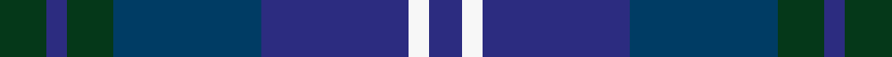

This is one **variant** — a specific cloth: this exact thread count and colourway, with its own
provenance below. It is one weaving of the [sett](/setts/dg7dbi3dg7db22dbi22w3dbi5/) (the scale-free proportion — the
same cloth at any scale or shade), whose colour order is pattern [BWBBGBG](/stripes/bwbbgbg/).

Part of the [United Colours of Scotland](/tartans/u/un/united-colours-of-scotland/) tartan — the named design grouping this sett with its other cloths.

Sourced from tartans-authority.  It is a [7 stripe tartan](/stripes/stripes7/).

Original link [https://www.tartanregister.gov.uk/tartanDetails.aspx?ref=6504](https://www.tartanregister.gov.uk/tartanDetails.aspx?ref=6504)

2 attestations — the source records this cloth was collapsed from (oldest owns this page)

<ul>
<li>2004, December — United Colours of Scotland (Corporat (tartans-authority, <a href="https://www.tartanregister.gov.uk/tartanDetails.aspx?ref=6504">record</a>)  <em>Corporate tartan for the kilt hire business of Nicholsons Highland Supplies, Ingatestone, Essex. CM4 9EY. Marton Mills & Thread count from Lochcarron.</em></li>
<li>undated — United Colours of Scotland (register-of-tartans, <a href="https://www.tartanregister.gov.uk/tartanDetails.aspx?ref=4978">record</a>)  <em>Corporate tartan for the kilt hire business of Nicholsons Highland Supplies, Ingatestone, Essex. CM4 9EY. www.nicholsonssupplies.com. Tel: 01277 356969. Weavers Marton Mills. Woven sample.</em></li>
</ul>

Dataset <small>— provenance for this record, inherited from the source manifest</small>

<dl class="dataset-prov">
<dt>source</dt><dd><a href="/sources/tartans-authority/">Scottish Tartans Authority</a></dd>
<dt>data captured from</dt><dd><a href="https://github.com/thetartan/tartan-database/blob/master/data/tartans-authority/data.csv">https://github.com/thetartan/tartan-database/blob/master/data/tartans-authority/data.csv</a></dd>
<dt>data date</dt><dd>2004, December <small>(this record)</small></dd>
<dt>licence</dt><dd><a href="https://creativecommons.org/licenses/by-nc-nd/4.0/">CC BY-NC-ND 4.0</a></dd>
</dl>

Capture chain <small>— the hands this data passed through, oldest first; each capture carries its own licence</small>

<ol class="capture-chain">
<li><a href="https://www.tartansauthority.com/">Scottish Tartans Authority</a> <small>the heritage body's archive — its tartan-ferret record browser is retired (links repaired to the SRT, above)</small></li>
<li><a href="https://github.com/thetartan/tartan-database">thetartan/tartan-database</a> <small>2016-2017</small> · <a href="https://creativecommons.org/licenses/by-nc-nd/4.0/">CC BY-NC-ND 4.0</a> <small>Levko Kravets's frozen compilation — the capture we vendored, and where its CC licence text came from</small></li>
<li>this dictionary <small>captured 2026-06-10 · commit 5bf86c7566</small> <small>each re-capture is a git commit to data/sources</small></li>
</ol>

## Register references

External register numbers recorded for this tartan.

- Scottish Register of Tartans: [4978](https://www.tartanregister.gov.uk/tartanDetails.aspx?ref=4978)
- Scottish Tartans Authority (ITI): 6504
- Scottish Tartans World Register: 3029

## Thread count
DG/14 DBi6 DG14 DB44 DBi44 W6 DBi/10

One full sett is **252 threads**.

## Palette
<table><thead><tr><th>Colour</th><th>Shade</th><th>OKLCh</th></tr></thead><tbody><tr><td>DB</td><td><code style="background-color:#003C64;">#003C64</code> <small style="color:#888">#003C64</small></td><td><small style="color:#888">oklch(34.5% 0.089 246.0)</small></td></tr><tr><td>DB</td><td><code style="background-color:#2C2C80;">#2C2C80</code> <small style="color:#888">#2C2C80</small></td><td><small style="color:#888">oklch(35.0% 0.138 276.6)</small></td></tr><tr><td>DG</td><td><code style="background-color:#053819;">#053819</code> <small style="color:#888">#053819</small></td><td><small style="color:#888">oklch(30.0% 0.075 151.3)</small></td></tr><tr><td>W</td><td><code style="background-color:#F7F7F7;">#F7F7F7</code> <small style="color:#888">#F7F7F7</small></td><td><small style="color:#888">oklch(97.6% 0.000 89.9)</small></td></tr></tbody></table>

# Sample pattern

## Nearest tartan variants

The nearest existing variants by ΔTartan distance, with this cloth at the top so the swatches line up against it.

ΔTartan

Threads

Variant

Sett

—

252

<a href="/variants/s7/dg7dbi3dg7db22dbi22w3dbi5~x2~dbi1406275-db1404245/">United Colours of Scotland (Corporat</a>

<a href="/ttd/edit/#slug=g15b2w2b11n28b4~x2~g2003152-n2002277&amp;base=dg7dbi3dg7db22dbi22w3dbi5~x2~dbi1406275-db1404245" title="compare in the TTD">1.87</a>

210

<a href="/variants/s6/g15b2w2b11n28b4~x2~g2003152-n2002277/">Rhode Island, The State of</a>

<a href="/ttd/edit/#slug=dy3db6dt2ly2dt11db2dt2dy3~x2~db1406275-dt1204274&amp;base=dg7dbi3dg7db22dbi22w3dbi5~x2~dbi1406275-db1404245" title="compare in the TTD">2.19</a>

112

<a href="/variants/s8/dy3dbi6db2ly2db11dbi2db2dy3~x2~dbi1406275-db1204274/">Daks (Blue)</a>

<a href="/ttd/edit/#slug=dy5db12dt4ly4dt22db3dt4dy5~db1406275-dt1204274&amp;base=dg7dbi3dg7db22dbi22w3dbi5~x2~dbi1406275-db1404245" title="compare in the TTD">2.32</a>

108

<a href="/variants/s8/dy5dbi12db4ly4db22dbi3db4dy5~dbi1406275-db1204274/">Daks Muted blue Trade Tartan</a>

<a href="/ttd/edit/#slug=dt5dp1dt4db4dt7db8w1db2y1~x4&amp;base=dg7dbi3dg7db22dbi22w3dbi5~x2~dbi1406275-db1404245" title="compare in the TTD">3.60</a>

240

<a href="/variants/s9/dt5dp1dt4db4dt7db8w1db2y1~x4/">Romantic Scotland (Madonna)</a>

<a href="/ttd/edit/#slug=lb8n4db30dt30r3dt4~x2~db1406275&amp;base=dg7dbi3dg7db22dbi22w3dbi5~x2~dbi1406275-db1404245" title="compare in the TTD">3.62</a>

292

<a href="/variants/s6/lb8n4db30dt30r3dt4~x2~db1406275/">Hutchesons' Grammar School</a>

<a href="/ttd/edit/#slug=n9db1n1db1n1db7dg7dr2~x4&amp;base=dg7dbi3dg7db22dbi22w3dbi5~x2~dbi1406275-db1404245" title="compare in the TTD">3.64</a>

188

<a href="/variants/s8/n9db1n1db1n1db7dg7dr2~x4/">Caledonian Hotel (Corporate)</a>

## Neighbour map

Every grey dot is one of 13621 variants placed by the first two principal components of the ΔTartan feature space (42% of its variance). Red is this tartan; blue dots are its nearest — click one to open its page. The map is a flat projection of a many-dimensional space — [how to read it](/posts/neighbourhood-maps/).

<svg viewBox="0 0 640 380" role="img" style="max-width:100%;height:auto;border:1px solid #e0e0e0;border-radius:4px;display:block" xmlns="http://www.w3.org/2000/svg"><image href="/nn/cloud.v1.png" width="640" height="380"/><a href="/variants/s6/g15b2w2b11n28b4~x2~g2003152-n2002277/"><circle cx="457.9" cy="280.0" r="4" fill="#3465a4"><title>Rhode Island, The State of</title></circle></a><a href="/variants/s8/dy3dbi6db2ly2db11dbi2db2dy3~x2~dbi1406275-db1204274/"><circle cx="348.4" cy="280.4" r="4" fill="#3465a4"><title>Daks (Blue)</title></circle></a><a href="/variants/s8/dy5dbi12db4ly4db22dbi3db4dy5~dbi1406275-db1204274/"><circle cx="370.4" cy="262.4" r="4" fill="#3465a4"><title>Daks Muted blue Trade Tartan</title></circle></a><a href="/variants/s9/dt5dp1dt4db4dt7db8w1db2y1~x4/"><circle cx="359.1" cy="261.1" r="4" fill="#3465a4"><title>Romantic Scotland (Madonna)</title></circle></a><a href="/variants/s6/lb8n4db30dt30r3dt4~x2~db1406275/"><circle cx="312.1" cy="211.0" r="4" fill="#3465a4"><title>Hutchesons' Grammar School</title></circle></a><a href="/variants/s8/n9db1n1db1n1db7dg7dr2~x4/"><circle cx="337.8" cy="260.1" r="4" fill="#3465a4"><title>Caledonian Hotel (Corporate)</title></circle></a><circle cx="354.0" cy="282.6" r="5" fill="#c00000"/><text x="320" y="376" text-anchor="middle" font-size="11" fill="#999">ground</text><text x="11" y="190" text-anchor="middle" font-size="11" fill="#999" transform="rotate(-90 11 190)">complexity</text></svg>

ID: /variants/s7/dg7dbi3dg7db22dbi22w3dbi5~x2~dbi1406275-db1404245/
