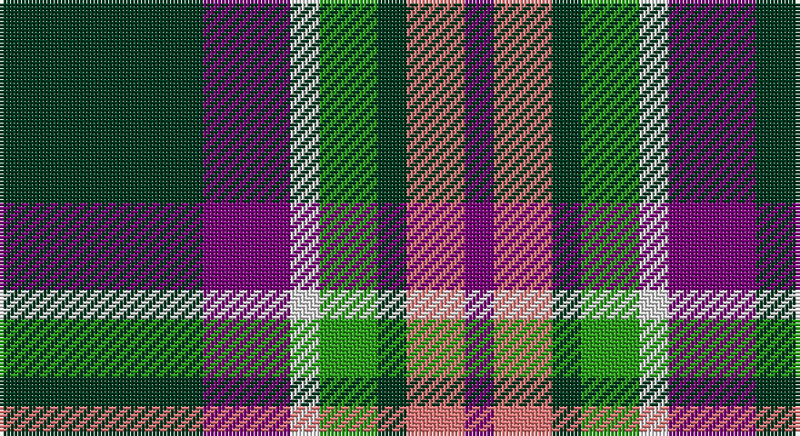

This page is one **sett** — a single exact thread-count. It belongs to the [tartan](/setts/dg7dp3w1g2dg1r2dp1/)
(the same proportion at any scale), whose colour order is pattern [BRGGWBG](/stripes/brggwbg/).

Part of the [Lindley-Highfield](/tartans/lindley-highfield/) tartan — the named design grouping this sett with its other cloths.

Sourced from tartans-authority.  It is a [7 stripe tartan](/stripes/stripes7/).

Original link http://www.tartansauthority.com/tartan-ferret/display/10002/

## Register references

External register numbers recorded for this tartan.

- Scottish Register of Tartans: [10002](https://www.tartanregister.gov.uk/tartanDetails?ref=10002)
- Scottish Tartans Authority (ITI): 10002

## Thread count
DG/56 P24 LN8 G16 DG8 LR16 P/8

One full sett is **208 threads**.

## Palette

Palette: <strong>Tartan Register</strong>
<table><thead><tr><th>Colour</th><th>Threads</th><th>Shade</th><th>Base</th><th>OKLCh</th></tr></thead><tbody><tr><td>DG/</td><td style="text-align:right;font-variant-numeric:tabular-nums">56</td><td><code style="background-color:#003820;">#003820</code> <small style="color:#888">#003820</small></td><td>G <code style="background-color:#006100;">#006100</code></td><td><small style="color:#888">oklch(30.0% 0.070 158.3)</small></td></tr><tr><td>P</td><td style="text-align:right;font-variant-numeric:tabular-nums">24</td><td><code style="background-color:#780078;">#780078</code> <small style="color:#888">#780078</small></td><td>B <code style="background-color:#2A418A;">#2A418A</code></td><td><small style="color:#888">oklch(40.2% 0.185 328.4)</small></td></tr><tr><td>LN</td><td style="text-align:right;font-variant-numeric:tabular-nums">8</td><td><code style="background-color:#E0E0E0;">#E0E0E0</code> <small style="color:#888">#E0E0E0</small></td><td>W <code style="background-color:#F7F7F7;">#F7F7F7</code></td><td><small style="color:#888">oklch(90.7% 0.000 89.9)</small></td></tr><tr><td>G</td><td style="text-align:right;font-variant-numeric:tabular-nums">16</td><td><code style="background-color:#289C18;">#289C18</code> <small style="color:#888">#289C18</small></td><td>G <code style="background-color:#006100;">#006100</code></td><td><small style="color:#888">oklch(60.6% 0.191 141.6)</small></td></tr><tr><td>DG</td><td style="text-align:right;font-variant-numeric:tabular-nums">8</td><td><code style="background-color:#003820;">#003820</code> <small style="color:#888">#003820</small></td><td>G <code style="background-color:#006100;">#006100</code></td><td><small style="color:#888">oklch(30.0% 0.070 158.3)</small></td></tr><tr><td>LR</td><td style="text-align:right;font-variant-numeric:tabular-nums">16</td><td><code style="background-color:#E87878;">#E87878</code> <small style="color:#888">#E87878</small></td><td>R <code style="background-color:#CC0000;">#CC0000</code></td><td><small style="color:#888">oklch(70.0% 0.139 21.2)</small></td></tr><tr><td>P/</td><td style="text-align:right;font-variant-numeric:tabular-nums">8</td><td><code style="background-color:#780078;">#780078</code> <small style="color:#888">#780078</small></td><td>B <code style="background-color:#2A418A;">#2A418A</code></td><td><small style="color:#888">oklch(40.2% 0.185 328.4)</small></td></tr></tbody></table>

# Sample pattern

## Nearest tartans

The nearest existing variants by ΔTartan distance, with this tartan at the top so the swatches line up against it.

ΔTartan

Tartan

Sett

—

<a href="/ttd/edit/#slug=dg7dp3w1g2dg1r2dp1~x8">Lindley-Highfield (Name)</a> <a class="nn-out" href="/variants/s7/dg7dp3w1g2dg1r2dp1~x8/" title="open its dictionary page">↗</a>

0.66

<a href="/ttd/edit/#slug=k2t1p6g6r1g1~x4&amp;base=dg7dp3w1g2dg1r2dp1~x8">Wilson's, No 183</a> <a class="nn-out" href="/variants/s6/k2t1p6g6r1g1~x4/" title="open its dictionary page">↗</a>

0.85

<a href="/variants/s8/dp19w2g12t3k4~x2/">Wilson's No.111</a>

0.85

<a href="/ttd/edit/#slug=g6db11lb8k4lb8k27lb4r4~x2&amp;base=dg7dp3w1g2dg1r2dp1~x8">Kervegant, Suzanne (Personal)</a> <a class="nn-out" href="/variants/s8/g6db11lb8k4lb8k27lb4r4~x2/" title="open its dictionary page">↗</a>

0.98

<a href="/ttd/edit/#slug=k20w3t20k3r3dg20r10w3k20~x2&amp;base=dg7dp3w1g2dg1r2dp1~x8">Soutar (Name)</a> <a class="nn-out" href="/variants/s9/k20w3t20k3r3dg20r10w3k20~x2/" title="open its dictionary page">↗</a>

0.99

<a href="/ttd/edit/#slug=w6k29o29dp7k3r3~x2&amp;base=dg7dp3w1g2dg1r2dp1~x8">Jewell of Kernow (Personal)</a> <a class="nn-out" href="/variants/s6/w6k29o29dp7k3r3~x2/" title="open its dictionary page">↗</a>

1.00

<a href="/ttd/edit/#slug=r12db3g5dbi16ly2g2~x2&amp;base=dg7dp3w1g2dg1r2dp1~x8">Dunbog, Primary School</a> <a class="nn-out" href="/variants/s6/r12db3g5dbi16ly2g2~x2/" title="open its dictionary page">↗</a>

1.03

<a href="/ttd/edit/#slug=k4t3p11g14ly2~x2&amp;base=dg7dp3w1g2dg1r2dp1~x8">Wellington, No 122</a> <a class="nn-out" href="/variants/s5/k4t3p11g14ly2~x2/" title="open its dictionary page">↗</a>

1.06

<a href="/ttd/edit/#slug=k4t3p11g14w2~x2&amp;base=dg7dp3w1g2dg1r2dp1~x8">Wellington, No 229</a> <a class="nn-out" href="/variants/s5/k4t3p11g14w2~x2/" title="open its dictionary page">↗</a>

1.07

<a href="/ttd/edit/#slug=r4t28k6lb12k12lo3~x2&amp;base=dg7dp3w1g2dg1r2dp1~x8">MacTavish Dress</a> <a class="nn-out" href="/variants/s6/r4t28k6lb12k12lo3~x2/" title="open its dictionary page">↗</a>

1.08

<a href="/ttd/edit/#slug=lr4g24db10r3db12lo4~x2&amp;base=dg7dp3w1g2dg1r2dp1~x8">Inglis (Name)</a> <a class="nn-out" href="/variants/s6/lr4g24db10r3db12lo4~x2/" title="open its dictionary page">↗</a>

## Neighbour map

Every grey dot is one of 14360 variants placed by the first two principal components of the ΔTartan feature space (44% of its variance). Red is this tartan; blue dots are its nearest — click one to open its page.

<svg viewBox="0 0 640 380" role="img" style="max-width:100%;height:auto;border:1px solid #e0e0e0;border-radius:4px;display:block" xmlns="http://www.w3.org/2000/svg"><image href="/nn/cloud.v1.png" width="640" height="380"/><a href="/variants/s6/k2t1p6g6r1g1~x4/"><circle cx="161.0" cy="206.6" r="4" fill="#3465a4"><title>Wilson's, No 183</title></circle></a><a href="/variants/s8/dp19w2g12t3k4~x2/"><circle cx="183.0" cy="184.3" r="4" fill="#3465a4"><title>Wilson's No.111</title></circle></a><a href="/variants/s8/g6db11lb8k4lb8k27lb4r4~x2/"><circle cx="144.9" cy="185.7" r="4" fill="#3465a4"><title>Kervegant, Suzanne (Personal)</title></circle></a><a href="/variants/s9/k20w3t20k3r3dg20r10w3k20~x2/"><circle cx="134.6" cy="196.7" r="4" fill="#3465a4"><title>Soutar (Name)</title></circle></a><a href="/variants/s6/w6k29o29dp7k3r3~x2/"><circle cx="188.2" cy="178.3" r="4" fill="#3465a4"><title>Jewell of Kernow (Personal)</title></circle></a><a href="/variants/s6/r12db3g5dbi16ly2g2~x2/"><circle cx="159.6" cy="194.4" r="4" fill="#3465a4"><title>Dunbog, Primary School</title></circle></a><a href="/variants/s5/k4t3p11g14ly2~x2/"><circle cx="147.4" cy="214.7" r="4" fill="#3465a4"><title>Wellington, No 122</title></circle></a><a href="/variants/s5/k4t3p11g14w2~x2/"><circle cx="145.5" cy="214.0" r="4" fill="#3465a4"><title>Wellington, No 229</title></circle></a><a href="/variants/s6/r4t28k6lb12k12lo3~x2/"><circle cx="167.8" cy="188.3" r="4" fill="#3465a4"><title>MacTavish Dress</title></circle></a><a href="/variants/s6/lr4g24db10r3db12lo4~x2/"><circle cx="183.1" cy="209.9" r="4" fill="#3465a4"><title>Inglis (Name)</title></circle></a><circle cx="185.0" cy="195.1" r="5" fill="#c00000"/></svg>

ID: /variants/s7/dg7dp3w1g2dg1r2dp1~x8/
