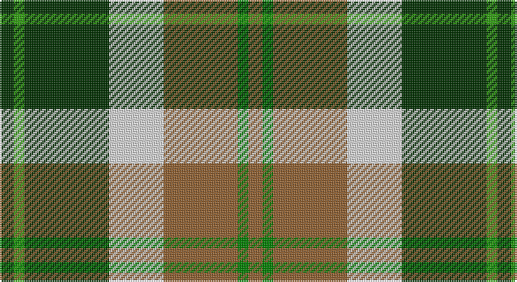

This page is one **sett** — a single exact thread-count. It belongs to the [tartan](/setts/dg8gi6dg48w31o42g6o8/)
(the same proportion at any scale), whose colour order is pattern [GGGWRGR](/stripes/gggwrgr/).

Part of the [Bannockbane](/tartans/bannockbane/) tartan — the named design grouping this sett with its other cloths.

Sourced from weddslist.  It is a [7 stripe tartan](/stripes/stripes7/).

Original link http://www.weddslist.com/cgi-bin/tartans/pg.pl?source=sts

## Also known as

This cloth is also recorded under:

- Bannockbane Blue
- Bannockbane Blue #1
- Bannockbane Blue #2
- Bannockbane Blue #3
- Bannockbane Brown #2
- Bannockbane Green
- Bannockbane Grey #1
- Bannockbane Grey #2
- Bannockbane Grey #3
- Bannockbane, Blue
- Bannockbane, Green
- Bannockbane, Grey
- Bannockbane, Light Tan

## Thread count
DG/8 G6 DG48 LN31 LT42 Ga6 LT/8

One full sett is **282 threads**.

## Palette

Palette: <strong>Tartan Dictionary</strong> <small style="color:#888">(1 of 5 colours)</small>
<table><thead><tr><th>Colour</th><th>Threads</th><th>Shade</th><th>Base</th><th>OKLCh</th></tr></thead><tbody><tr><td>DG/</td><td style="text-align:right;font-variant-numeric:tabular-nums">8</td><td><code style="background-color:#003000;">#003000</code> <small style="color:#888">#003000</small></td><td>G <code style="background-color:#006100;">#006100</code></td><td><small style="color:#888">oklch(26.8% 0.091 142.5)</small></td></tr><tr><td>G</td><td style="text-align:right;font-variant-numeric:tabular-nums">6</td><td><code style="background-color:#30A010;">#30A010</code> <small style="color:#888">#30A010</small></td><td>G <code style="background-color:#006100;">#006100</code></td><td><small style="color:#888">oklch(61.9% 0.195 140.5)</small></td></tr><tr><td>DG</td><td style="text-align:right;font-variant-numeric:tabular-nums">48</td><td><code style="background-color:#003000;">#003000</code> <small style="color:#888">#003000</small></td><td>G <code style="background-color:#006100;">#006100</code></td><td><small style="color:#888">oklch(26.8% 0.091 142.5)</small></td></tr><tr><td>LN</td><td style="text-align:right;font-variant-numeric:tabular-nums">31</td><td><code style="background-color:#E0E0E0;">#E0E0E0</code> <small style="color:#888">#E0E0E0</small></td><td>W <code style="background-color:#F7F7F7;">#F7F7F7</code></td><td><small style="color:#888">oklch(90.7% 0.000 89.9)</small></td></tr><tr><td>LT</td><td style="text-align:right;font-variant-numeric:tabular-nums">42</td><td><code style="background-color:#906030;">#906030</code> <small style="color:#888">#906030</small></td><td>R <code style="background-color:#CC0000;">#CC0000</code></td><td><small style="color:#888">oklch(53.1% 0.089 63.7)</small></td></tr><tr><td>Ga</td><td style="text-align:right;font-variant-numeric:tabular-nums">6</td><td><code style="background-color:#008000;">#008000</code> <small style="color:#888">#008000</small></td><td>G <code style="background-color:#006100;">#006100</code></td><td><small style="color:#888">oklch(52.0% 0.177 142.5)</small></td></tr><tr><td>LT/</td><td style="text-align:right;font-variant-numeric:tabular-nums">8</td><td><code style="background-color:#906030;">#906030</code> <small style="color:#888">#906030</small></td><td>R <code style="background-color:#CC0000;">#CC0000</code></td><td><small style="color:#888">oklch(53.1% 0.089 63.7)</small></td></tr></tbody></table>

# Sample pattern

## Compared to the master

This cloth is one sett of its design; the master sett (the exemplar the design is anchored on) is below for comparison.

<figure style="margin:0"><figcaption style="color:#888;font-size:smaller">this sett</figcaption></figure>
<figure style="margin:0"><figcaption style="color:#888;font-size:smaller"><a href="/setts/o2dy2o15dy2w10lo15dy2lo2/">master sett →</a></figcaption></figure>

## Nearest tartans

The nearest existing variants by ΔTartan distance, with this tartan at the top so the swatches line up against it.

ΔTartan

Tartan

Sett

—

<a href="/ttd/edit/#slug=dg8gi6dg48w31o42g6o8">Bannockbane, Green</a> <a class="nn-out" href="/variants/s7/dg8gi6dg48w31o42g6o8/" title="open its dictionary page">↗</a>

0.51

<a href="/ttd/edit/#slug=dg4g3dg24w15lo21gi3lo4~x2&amp;base=dg8gi6dg48w31o42g6o8">Bannockbane Dark Green</a> <a class="nn-out" href="/variants/s7/dg4g3dg24w15lo21gi3lo4~x2/" title="open its dictionary page">↗</a>

0.80

<a href="/ttd/edit/#slug=g36lb4g8k29r24w7~x2&amp;base=dg8gi6dg48w31o42g6o8">Entre Rios Province (Provisional</a> <a class="nn-out" href="/variants/s6/g36lb4g8k29r24w7~x2/" title="open its dictionary page">↗</a>

0.89

<a href="/ttd/edit/#slug=do21r2lg18r2lg18r2dg8w6do10~x2&amp;base=dg8gi6dg48w31o42g6o8">Red Dirt Girl</a> <a class="nn-out" href="/variants/s9/do21r2lg18r2lg18r2dg8w6do10~x2/" title="open its dictionary page">↗</a>

0.96

<a href="/ttd/edit/#slug=k20w4r4gi20w5gi2g2~x2&amp;base=dg8gi6dg48w31o42g6o8">Hackett (Personal)</a> <a class="nn-out" href="/variants/s7/k20w4r4gi20w5gi2g2~x2/" title="open its dictionary page">↗</a>

0.99

<a href="/ttd/edit/#slug=w16dg2k5r2k10dg11ly2dg11k2~x2&amp;base=dg8gi6dg48w31o42g6o8">Unidentified #46</a> <a class="nn-out" href="/variants/s9/w16dg2k5r2k10dg11ly2dg11k2~x2/" title="open its dictionary page">↗</a>

0.99

<a href="/ttd/edit/#slug=g10dp42r5gi42g42ly5g6&amp;base=dg8gi6dg48w31o42g6o8">New Mexico (Fashion)</a> <a class="nn-out" href="/variants/s7/g10dp42r5gi42g42ly5g6/" title="open its dictionary page">↗</a>

1.00

<a href="/ttd/edit/#slug=ly5k5g17k6o24k6ly3~x2&amp;base=dg8gi6dg48w31o42g6o8">Cape Breton District Tartan</a> <a class="nn-out" href="/variants/s7/ly5k5g17k6o24k6ly3~x2/" title="open its dictionary page">↗</a>

1.00

<a href="/ttd/edit/#slug=dg9w2dg9k2loi14lo4w2r2~x4&amp;base=dg8gi6dg48w31o42g6o8">MacShane (Clan)</a> <a class="nn-out" href="/variants/s8/dg9w2dg9k2loi14lo4w2r2~x4/" title="open its dictionary page">↗</a>

1.01

<a href="/ttd/edit/#slug=g7p3w1lg2g1lp2p1~x8&amp;base=dg8gi6dg48w31o42g6o8">Lindley-Highfield of Ballumbie Castle</a> <a class="nn-out" href="/variants/s7/g7p3w1lg2g1lp2p1~x8/" title="open its dictionary page">↗</a>

1.05

<a href="/ttd/edit/#slug=g6lr2g10k3r1k3lo10lr2lo6~x4&amp;base=dg8gi6dg48w31o42g6o8">Eire (District?)</a> <a class="nn-out" href="/variants/s9/g6lr2g10k3r1k3lo10lr2lo6~x4/" title="open its dictionary page">↗</a>

## Neighbour map

Every grey dot is one of 14360 variants placed by the first two principal components of the ΔTartan feature space (44% of its variance). Red is this tartan; blue dots are its nearest — click one to open its page.

<svg viewBox="0 0 640 380" role="img" style="max-width:100%;height:auto;border:1px solid #e0e0e0;border-radius:4px;display:block" xmlns="http://www.w3.org/2000/svg"><image href="/nn/cloud.v1.png" width="640" height="380"/><a href="/variants/s7/dg4g3dg24w15lo21gi3lo4~x2/"><circle cx="144.3" cy="185.4" r="4" fill="#3465a4"><title>Bannockbane Dark Green</title></circle></a><a href="/variants/s6/g36lb4g8k29r24w7~x2/"><circle cx="144.0" cy="194.7" r="4" fill="#3465a4"><title>Entre Rios Province (Provisional</title></circle></a><a href="/variants/s9/do21r2lg18r2lg18r2dg8w6do10~x2/"><circle cx="150.9" cy="163.9" r="4" fill="#3465a4"><title>Red Dirt Girl</title></circle></a><a href="/variants/s7/k20w4r4gi20w5gi2g2~x2/"><circle cx="152.9" cy="167.0" r="4" fill="#3465a4"><title>Hackett (Personal)</title></circle></a><a href="/variants/s9/w16dg2k5r2k10dg11ly2dg11k2~x2/"><circle cx="124.2" cy="177.3" r="4" fill="#3465a4"><title>Unidentified #46</title></circle></a><a href="/variants/s7/g10dp42r5gi42g42ly5g6/"><circle cx="171.4" cy="198.7" r="4" fill="#3465a4"><title>New Mexico (Fashion)</title></circle></a><a href="/variants/s7/ly5k5g17k6o24k6ly3~x2/"><circle cx="152.1" cy="208.8" r="4" fill="#3465a4"><title>Cape Breton District Tartan</title></circle></a><a href="/variants/s8/dg9w2dg9k2loi14lo4w2r2~x4/"><circle cx="127.4" cy="171.8" r="4" fill="#3465a4"><title>MacShane (Clan)</title></circle></a><a href="/variants/s7/g7p3w1lg2g1lp2p1~x8/"><circle cx="169.8" cy="188.1" r="4" fill="#3465a4"><title>Lindley-Highfield of Ballumbie Castle</title></circle></a><a href="/variants/s9/g6lr2g10k3r1k3lo10lr2lo6~x4/"><circle cx="135.1" cy="176.6" r="4" fill="#3465a4"><title>Eire (District?)</title></circle></a><circle cx="142.4" cy="185.0" r="5" fill="#c00000"/></svg>

ID: /variants/s7/dg8gi6dg48w31o42g6o8/
