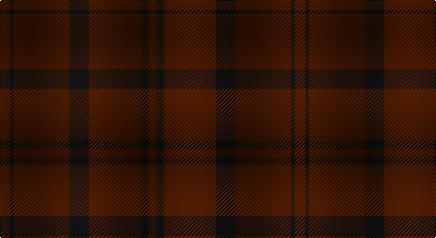

This page is one **sett** — a single exact thread-count. It belongs to the [tartan](/setts/do5k2do28k10do26k4do4/)
(the same proportion at any scale), whose colour order is pattern [BKBKBKB](/stripes/bkbkbkb/).

Sourced from register-of-tartans.  It is a [7 stripe tartan](/stripes/stripes7/).

Original link https://www.tartanregister.gov.uk/tartanDetails.aspx?ref=1020

## Register references

External register numbers recorded for this tartan.

- Scottish Register of Tartans: [1020](https://www.tartanregister.gov.uk/tartanDetails.aspx?ref=1020)
- Scottish Tartans Authority (ITI): 4745

## Thread count
DR/10 K4 DR56 K20 DR52 K8 DR/8

One full sett is **298 threads**.

## Palette

Palette: <strong>Tartan Register</strong>
<table><thead><tr><th>Colour</th><th>Threads</th><th>Shade</th><th>Base</th><th>OKLCh</th></tr></thead><tbody><tr><td>DR/</td><td style="text-align:right;font-variant-numeric:tabular-nums">10</td><td><code style="background-color:#441800;">#441800</code> <small style="color:#888">#441800</small></td><td>B <code style="background-color:#2A418A;">#2A418A</code></td><td><small style="color:#888">oklch(27.3% 0.076 46.3)</small></td></tr><tr><td>K</td><td style="text-align:right;font-variant-numeric:tabular-nums">4</td><td><code style="background-color:#101010;">#101010</code> <small style="color:#888">#101010</small></td><td>K <code style="background-color:#000000;">#000000</code></td><td><small style="color:#888">oklch(17.3% 0.000 89.9)</small></td></tr><tr><td>DR</td><td style="text-align:right;font-variant-numeric:tabular-nums">56</td><td><code style="background-color:#441800;">#441800</code> <small style="color:#888">#441800</small></td><td>B <code style="background-color:#2A418A;">#2A418A</code></td><td><small style="color:#888">oklch(27.3% 0.076 46.3)</small></td></tr><tr><td>K</td><td style="text-align:right;font-variant-numeric:tabular-nums">20</td><td><code style="background-color:#101010;">#101010</code> <small style="color:#888">#101010</small></td><td>K <code style="background-color:#000000;">#000000</code></td><td><small style="color:#888">oklch(17.3% 0.000 89.9)</small></td></tr><tr><td>DR</td><td style="text-align:right;font-variant-numeric:tabular-nums">52</td><td><code style="background-color:#441800;">#441800</code> <small style="color:#888">#441800</small></td><td>B <code style="background-color:#2A418A;">#2A418A</code></td><td><small style="color:#888">oklch(27.3% 0.076 46.3)</small></td></tr><tr><td>K</td><td style="text-align:right;font-variant-numeric:tabular-nums">8</td><td><code style="background-color:#101010;">#101010</code> <small style="color:#888">#101010</small></td><td>K <code style="background-color:#000000;">#000000</code></td><td><small style="color:#888">oklch(17.3% 0.000 89.9)</small></td></tr><tr><td>DR/</td><td style="text-align:right;font-variant-numeric:tabular-nums">8</td><td><code style="background-color:#441800;">#441800</code> <small style="color:#888">#441800</small></td><td>B <code style="background-color:#2A418A;">#2A418A</code></td><td><small style="color:#888">oklch(27.3% 0.076 46.3)</small></td></tr></tbody></table>

# Sample pattern

## Nearest tartans

The nearest existing variants by ΔTartan distance, with this tartan at the top so the swatches line up against it.

ΔTartan

Tartan

Sett

—

<a href="/ttd/edit/#slug=do5k2do28k10do26k4do4~x2">Dunbar, John Telfer (Personal)</a> <a class="nn-out" href="/variants/s7/do5k2do28k10do26k4do4~x2/" title="open its dictionary page">↗</a>

2.09

<a href="/ttd/edit/#slug=n2y3n3y3n10y2n18y1~x4&amp;base=do5k2do28k10do26k4do4~x2">Hebridean Cairn Fashion Tartan</a> <a class="nn-out" href="/variants/s8/n2y3n3y3n10y2n18y1~x4/" title="open its dictionary page">↗</a>

2.76

<a href="/ttd/edit/#slug=dt4k2dt16k2dt16k1~x4&amp;base=do5k2do28k10do26k4do4~x2">Ben Dubh (The Black Mount)</a> <a class="nn-out" href="/variants/s6/dt4k2dt16k2dt16k1~x4/" title="open its dictionary page">↗</a>

2.97

<a href="/variants/s7/k17ki4k13ki4k3ki45k3~x2/">Black Spirit Fashion Tartan</a>

3.06

<a href="/ttd/edit/#slug=dt4k2dt4k45n2k3n2~x2&amp;base=do5k2do28k10do26k4do4~x2">STLTH (Corporate)</a> <a class="nn-out" href="/variants/s7/dt4k2dt4k45n2k3n2~x2/" title="open its dictionary page">↗</a>

3.06

<a href="/ttd/edit/#slug=k46dg6k6dg6k42dg47k12&amp;base=do5k2do28k10do26k4do4~x2">Taiheiyo Club, Inc.</a> <a class="nn-out" href="/variants/s7/k46dg6k6dg6k42dg47k12/" title="open its dictionary page">↗</a>

3.07

<a href="/ttd/edit/#slug=n2o3n3o3n10o2n18o1~x4&amp;base=do5k2do28k10do26k4do4~x2">Hebridean Cairn (Fashion)</a> <a class="nn-out" href="/variants/s8/n2o3n3o3n10o2n18o1~x4/" title="open its dictionary page">↗</a>

3.20

<a href="/ttd/edit/#slug=k120db4k12dt36dg3k6&amp;base=do5k2do28k10do26k4do4~x2">Scottish Football Association (Corp)</a> <a class="nn-out" href="/variants/s6/k120db4k12dt36dg3k6/" title="open its dictionary page">↗</a>

3.34

<a href="/ttd/edit/#slug=n18o2n10o3n3o3n2o3n3o3n10o2n18o1~x4&amp;base=do5k2do28k10do26k4do4~x2">Hebridean Cairn</a> <a class="nn-out" href="/variants/s14/n18o2n10o3n3o3n2o3n3o3n10o2n18o1~x4/" title="open its dictionary page">↗</a>

3.38

<a href="/ttd/edit/#slug=k4dt2k43dt20k4dt2k2dt4k2dt2k4dt20k43dt2k4dt2~x2&amp;base=do5k2do28k10do26k4do4~x2">Dark Island</a> <a class="nn-out" href="/variants/s16/k4dt2k43dt20k4dt2k2dt4k2dt2k4dt20k43dt2k4dt2~x2/" title="open its dictionary page">↗</a>

3.44

<a href="/ttd/edit/#slug=do11n1do4n8r1~x8&amp;base=do5k2do28k10do26k4do4~x2">Cairns, David (Personal)</a> <a class="nn-out" href="/variants/s5/do11n1do4n8r1~x8/" title="open its dictionary page">↗</a>

## Neighbour map

Every grey dot is one of 14360 variants placed by the first two principal components of the ΔTartan feature space (44% of its variance). Red is this tartan; blue dots are its nearest — click one to open its page.

<svg viewBox="0 0 640 380" role="img" style="max-width:100%;height:auto;border:1px solid #e0e0e0;border-radius:4px;display:block" xmlns="http://www.w3.org/2000/svg"><image href="/nn/cloud.v1.png" width="640" height="380"/><a href="/variants/s8/n2y3n3y3n10y2n18y1~x4/"><circle cx="626.0" cy="322.2" r="4" fill="#3465a4"><title>Hebridean Cairn Fashion Tartan</title></circle></a><a href="/variants/s6/dt4k2dt16k2dt16k1~x4/"><circle cx="626.0" cy="366.0" r="4" fill="#3465a4"><title>Ben Dubh (The Black Mount)</title></circle></a><a href="/variants/s7/k17ki4k13ki4k3ki45k3~x2/"><circle cx="626.0" cy="352.5" r="4" fill="#3465a4"><title>Black Spirit Fashion Tartan</title></circle></a><a href="/variants/s7/dt4k2dt4k45n2k3n2~x2/"><circle cx="626.0" cy="265.1" r="4" fill="#3465a4"><title>STLTH (Corporate)</title></circle></a><a href="/variants/s7/k46dg6k6dg6k42dg47k12/"><circle cx="576.6" cy="366.0" r="4" fill="#3465a4"><title>Taiheiyo Club, Inc.</title></circle></a><a href="/variants/s8/n2o3n3o3n10o2n18o1~x4/"><circle cx="626.0" cy="297.6" r="4" fill="#3465a4"><title>Hebridean Cairn (Fashion)</title></circle></a><a href="/variants/s6/k120db4k12dt36dg3k6/"><circle cx="626.0" cy="264.3" r="4" fill="#3465a4"><title>Scottish Football Association (Corp)</title></circle></a><a href="/variants/s14/n18o2n10o3n3o3n2o3n3o3n10o2n18o1~x4/"><circle cx="626.0" cy="279.5" r="4" fill="#3465a4"><title>Hebridean Cairn</title></circle></a><a href="/variants/s16/k4dt2k43dt20k4dt2k2dt4k2dt2k4dt20k43dt2k4dt2~x2/"><circle cx="626.0" cy="299.7" r="4" fill="#3465a4"><title>Dark Island</title></circle></a><a href="/variants/s5/do11n1do4n8r1~x8/"><circle cx="545.4" cy="340.3" r="4" fill="#3465a4"><title>Cairns, David (Personal)</title></circle></a><circle cx="626.0" cy="356.0" r="5" fill="#c00000"/></svg>

ID: /variants/s7/do5k2do28k10do26k4do4~x2/
