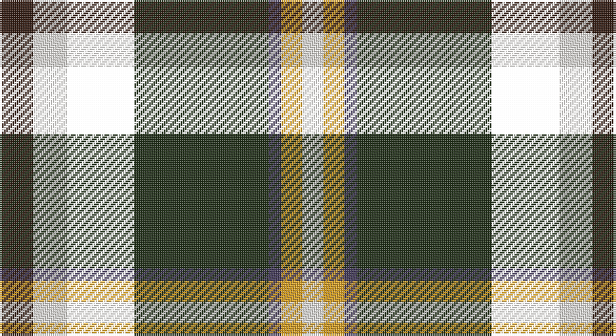

This page is one **sett** — a single exact thread-count. It belongs to the [tartan](/setts/do8w8k16dg32dp3lo5w5/)
(the same proportion at any scale), whose colour order is pattern [BWKGBYW](/stripes/bwkgbyw/).

Sourced from register-of-tartans.  It is a [7 stripe tartan](/stripes/stripes7/).

Original link https://www.tartanregister.gov.uk/tartanDetails.aspx?ref=10320

## Register references

External register numbers recorded for this tartan.

- Scottish Register of Tartans: [10320](https://www.tartanregister.gov.uk/tartanDetails.aspx?ref=10320)

## Thread count
Ka/16 W16 T32 K64 N6 Y10 W/10

One full sett is **282 threads**.

## Palette

Palette: <strong>Tartan Dictionary</strong> <small style="color:#888">(1 of 5 colours)</small>
<table><thead><tr><th>Colour</th><th>Threads</th><th>Shade</th><th>Base</th><th>OKLCh</th></tr></thead><tbody><tr><td>Ka/</td><td style="text-align:right;font-variant-numeric:tabular-nums">16</td><td><code style="background-color:#351E14;">#351E14</code> <small style="color:#888">#351E14</small></td><td>B <code style="background-color:#2A418A;">#2A418A</code></td><td><small style="color:#888">oklch(26.3% 0.040 44.1)</small></td></tr><tr><td>W</td><td style="text-align:right;font-variant-numeric:tabular-nums">16</td><td><code style="background-color:#F9F5EF;">#F9F5EF</code> <small style="color:#888">#F9F5EF</small></td><td>W <code style="background-color:#F7F7F7;">#F7F7F7</code></td><td><small style="color:#888">oklch(97.2% 0.009 78.3)</small></td></tr><tr><td></td><td style="text-align:right;font-variant-numeric:tabular-nums">32</td><td><code style="background-color:;"></code> <small style="color:#888"></small></td><td> <code style="background-color:;"></code></td><td><small style="color:#888"></small></td></tr><tr><td>K</td><td style="text-align:right;font-variant-numeric:tabular-nums">64</td><td><code style="background-color:#23321B;">#23321B</code> <small style="color:#888">#23321B</small></td><td>G <code style="background-color:#006100;">#006100</code></td><td><small style="color:#888">oklch(29.7% 0.045 135.3)</small></td></tr><tr><td>N</td><td style="text-align:right;font-variant-numeric:tabular-nums">6</td><td><code style="background-color:#433A5A;">#433A5A</code> <small style="color:#888">#433A5A</small></td><td>B <code style="background-color:#2A418A;">#2A418A</code></td><td><small style="color:#888">oklch(37.2% 0.055 296.6)</small></td></tr><tr><td>Y</td><td style="text-align:right;font-variant-numeric:tabular-nums">10</td><td><code style="background-color:#E0A126;">#E0A126</code> <small style="color:#888">#E0A126</small></td><td>Y <code style="background-color:#F2BF00;">#F2BF00</code></td><td><small style="color:#888">oklch(75.1% 0.146 78.3)</small></td></tr><tr><td>W/</td><td style="text-align:right;font-variant-numeric:tabular-nums">10</td><td><code style="background-color:#F9F5EF;">#F9F5EF</code> <small style="color:#888">#F9F5EF</small></td><td>W <code style="background-color:#F7F7F7;">#F7F7F7</code></td><td><small style="color:#888">oklch(97.2% 0.009 78.3)</small></td></tr></tbody></table>

# Sample pattern

## Nearest tartans

The nearest existing variants by ΔTartan distance, with this tartan at the top so the swatches line up against it.

ΔTartan

Tartan

Sett

—

<a href="/ttd/edit/#slug=do8w8k16dg32dp3lo5w5~x2">Mellor, Phillip (Oldham)</a> <a class="nn-out" href="/variants/s7/do8w8k16dg32dp3lo5w5~x2/" title="open its dictionary page">↗</a>

1.00

<a href="/ttd/edit/#slug=w3db1w1db3k1ly1k8g3p2~x2&amp;base=do8w8k16dg32dp3lo5w5~x2">Scottish Cultural Society Ltd</a> <a class="nn-out" href="/variants/s9/w3db1w1db3k1ly1k8g3p2~x2/" title="open its dictionary page">↗</a>

1.08

<a href="/ttd/edit/#slug=k45lo10g7r3w4db13w9r6~x2&amp;base=do8w8k16dg32dp3lo5w5~x2">Legion of Frontiersmen (Corporate)</a> <a class="nn-out" href="/variants/s8/k45lo10g7r3w4db13w9r6~x2/" title="open its dictionary page">↗</a>

1.08

<a href="/ttd/edit/#slug=o4ly2o21dr11w2k20r3~x2&amp;base=do8w8k16dg32dp3lo5w5~x2">Barbour</a> <a class="nn-out" href="/variants/s7/o4ly2o21dr11w2k20r3~x2/" title="open its dictionary page">↗</a>

1.11

<a href="/variants/s8/w4k2t18g18k18wi3k18r3~x2/">Hislop (Name)</a>

1.15

<a href="/ttd/edit/#slug=r2k8ly2k7ly1k1w3k2g9db8r2~x2&amp;base=do8w8k16dg32dp3lo5w5~x2">Hislop Hunting (Name)</a> <a class="nn-out" href="/variants/s11/r2k8ly2k7ly1k1w3k2g9db8r2~x2/" title="open its dictionary page">↗</a>

1.15

<a href="/ttd/edit/#slug=g2dp2g10k6r2k6t10k1lb2~x2&amp;base=do8w8k16dg32dp3lo5w5~x2">Birch (Personal) (Estimated threadcount)</a> <a class="nn-out" href="/variants/s9/g2dp2g10k6r2k6t10k1lb2~x2/" title="open its dictionary page">↗</a>

1.16

<a href="/ttd/edit/#slug=r2k2w2k14dg13g6ly2k2w2~x2&amp;base=do8w8k16dg32dp3lo5w5~x2">Madewell</a> <a class="nn-out" href="/variants/s9/r2k2w2k14dg13g6ly2k2w2~x2/" title="open its dictionary page">↗</a>

1.17

<a href="/ttd/edit/#slug=k6g14t2r3t2k16ly2b16g16r3~x2&amp;base=do8w8k16dg32dp3lo5w5~x2">Unnamed 4</a> <a class="nn-out" href="/variants/s10/k6g14t2r3t2k16ly2b16g16r3~x2/" title="open its dictionary page">↗</a>

1.19

<a href="/ttd/edit/#slug=r5k12ly2dg25ly2db12t5~x2&amp;base=do8w8k16dg32dp3lo5w5~x2">James</a> <a class="nn-out" href="/variants/s7/r5k12ly2dg25ly2db12t5~x2/" title="open its dictionary page">↗</a>

1.20

<a href="/ttd/edit/#slug=g16gi2p13t2k6ly2g16t2k12~x2&amp;base=do8w8k16dg32dp3lo5w5~x2">Wilson's, No 225</a> <a class="nn-out" href="/variants/s9/g16gi2p13t2k6ly2g16t2k12~x2/" title="open its dictionary page">↗</a>

## Neighbour map

Every grey dot is one of 14360 variants placed by the first two principal components of the ΔTartan feature space (44% of its variance). Red is this tartan; blue dots are its nearest — click one to open its page.

<svg viewBox="0 0 640 380" role="img" style="max-width:100%;height:auto;border:1px solid #e0e0e0;border-radius:4px;display:block" xmlns="http://www.w3.org/2000/svg"><image href="/nn/cloud.v1.png" width="640" height="380"/><a href="/variants/s9/w3db1w1db3k1ly1k8g3p2~x2/"><circle cx="88.4" cy="152.8" r="4" fill="#3465a4"><title>Scottish Cultural Society Ltd</title></circle></a><a href="/variants/s8/k45lo10g7r3w4db13w9r6~x2/"><circle cx="182.2" cy="122.1" r="4" fill="#3465a4"><title>Legion of Frontiersmen (Corporate)</title></circle></a><a href="/variants/s7/o4ly2o21dr11w2k20r3~x2/"><circle cx="152.3" cy="156.8" r="4" fill="#3465a4"><title>Barbour</title></circle></a><a href="/variants/s8/w4k2t18g18k18wi3k18r3~x2/"><circle cx="145.4" cy="176.4" r="4" fill="#3465a4"><title>Hislop (Name)</title></circle></a><a href="/variants/s11/r2k8ly2k7ly1k1w3k2g9db8r2~x2/"><circle cx="105.0" cy="156.0" r="4" fill="#3465a4"><title>Hislop Hunting (Name)</title></circle></a><a href="/variants/s9/g2dp2g10k6r2k6t10k1lb2~x2/"><circle cx="76.5" cy="159.3" r="4" fill="#3465a4"><title>Birch (Personal) (Estimated threadcount)</title></circle></a><a href="/variants/s9/r2k2w2k14dg13g6ly2k2w2~x2/"><circle cx="125.1" cy="160.9" r="4" fill="#3465a4"><title>Madewell</title></circle></a><a href="/variants/s10/k6g14t2r3t2k16ly2b16g16r3~x2/"><circle cx="91.8" cy="158.3" r="4" fill="#3465a4"><title>Unnamed 4</title></circle></a><a href="/variants/s7/r5k12ly2dg25ly2db12t5~x2/"><circle cx="143.2" cy="166.2" r="4" fill="#3465a4"><title>James</title></circle></a><a href="/variants/s9/g16gi2p13t2k6ly2g16t2k12~x2/"><circle cx="134.6" cy="169.8" r="4" fill="#3465a4"><title>Wilson's, No 225</title></circle></a><circle cx="127.2" cy="152.9" r="5" fill="#c00000"/></svg>

ID: /variants/s7/do8w8k16dg32dp3lo5w5~x2/
