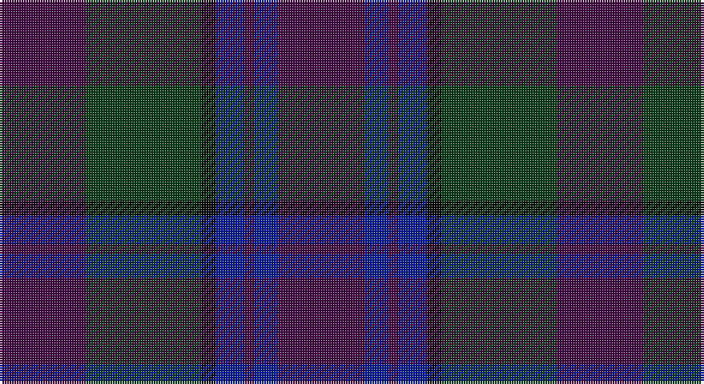

This page is one **sett** — a single exact thread-count. It belongs to the [tartan](/setts/dp18dg24k3db6dp2db5dp18/)
(the same proportion at any scale), whose colour order is pattern [BBBBKGB](/stripes/bbbbkgb/).

Part of the [Saorsa](/tartans/saorsa/) tartan — the named design grouping this sett with its other cloths.

Sourced from register-of-tartans.  It is a [7 stripe tartan](/stripes/stripes7/).

Original link https://www.tartanregister.gov.uk/tartanDetails.aspx?ref=10739

## Register references

External register numbers recorded for this tartan.

- Scottish Register of Tartans: [10739](https://www.tartanregister.gov.uk/tartanDetails.aspx?ref=10739)

## Thread count
DP/36 DG48 K6 DB12 DP4 DB10 DP/36

One full sett is **232 threads**.

## Palette

Palette: <strong>Tartan Register</strong> <small style="color:#888">(3 of 4 colours)</small>
<table><thead><tr><th>Colour</th><th>Threads</th><th>Shade</th><th>Base</th><th>OKLCh</th></tr></thead><tbody><tr><td>DP/</td><td style="text-align:right;font-variant-numeric:tabular-nums">36</td><td><code style="background-color:#440044;">#440044</code> <small style="color:#888">#440044</small></td><td>B <code style="background-color:#2A418A;">#2A418A</code></td><td><small style="color:#888">oklch(27.1% 0.125 328.4)</small></td></tr><tr><td>DG</td><td style="text-align:right;font-variant-numeric:tabular-nums">48</td><td><code style="background-color:#003C14;">#003C14</code> <small style="color:#888">#003C14</small></td><td>G <code style="background-color:#006100;">#006100</code></td><td><small style="color:#888">oklch(31.1% 0.089 148.5)</small></td></tr><tr><td>K</td><td style="text-align:right;font-variant-numeric:tabular-nums">6</td><td><code style="background-color:#000000;">#000000</code> <small style="color:#888">#000000</small></td><td>K <code style="background-color:#000000;">#000000</code></td><td><small style="color:#888">oklch(0.0% 0.000 0.0)</small></td></tr><tr><td>DB</td><td style="text-align:right;font-variant-numeric:tabular-nums">12</td><td><code style="background-color:#001A99;">#001A99</code> <small style="color:#888">#001A99</small></td><td>B <code style="background-color:#2A418A;">#2A418A</code></td><td><small style="color:#888">oklch(33.1% 0.199 264.1)</small></td></tr><tr><td>DP</td><td style="text-align:right;font-variant-numeric:tabular-nums">4</td><td><code style="background-color:#440044;">#440044</code> <small style="color:#888">#440044</small></td><td>B <code style="background-color:#2A418A;">#2A418A</code></td><td><small style="color:#888">oklch(27.1% 0.125 328.4)</small></td></tr><tr><td>DB</td><td style="text-align:right;font-variant-numeric:tabular-nums">10</td><td><code style="background-color:#001A99;">#001A99</code> <small style="color:#888">#001A99</small></td><td>B <code style="background-color:#2A418A;">#2A418A</code></td><td><small style="color:#888">oklch(33.1% 0.199 264.1)</small></td></tr><tr><td>DP/</td><td style="text-align:right;font-variant-numeric:tabular-nums">36</td><td><code style="background-color:#440044;">#440044</code> <small style="color:#888">#440044</small></td><td>B <code style="background-color:#2A418A;">#2A418A</code></td><td><small style="color:#888">oklch(27.1% 0.125 328.4)</small></td></tr></tbody></table>

# Sample pattern

## Nearest tartans

The nearest existing variants by ΔTartan distance, with this tartan at the top so the swatches line up against it.

ΔTartan

Tartan

Sett

—

<a href="/ttd/edit/#slug=dp18dg24k3db6dp2db5dp18~x2">Saorsa</a> <a class="nn-out" href="/variants/s7/dp18dg24k3db6dp2db5dp18~x2/" title="open its dictionary page">↗</a>

1.14

<a href="/ttd/edit/#slug=k4r2k12db12k1lo2~x2&amp;base=dp18dg24k3db6dp2db5dp18~x2">Robert Gordon University</a> <a class="nn-out" href="/variants/s6/k4r2k12db12k1lo2~x2/" title="open its dictionary page">↗</a>

1.44

<a href="/ttd/edit/#slug=db37r10dg22db11dg3r3~x2&amp;base=dp18dg24k3db6dp2db5dp18~x2">Perthshire, New /Tourist Board</a> <a class="nn-out" href="/variants/s6/db37r10dg22db11dg3r3~x2/" title="open its dictionary page">↗</a>

1.46

<a href="/ttd/edit/#slug=k1db12k12g1k12db12g1~x4&amp;base=dp18dg24k3db6dp2db5dp18~x2">Marchmont (Personal)</a> <a class="nn-out" href="/variants/s7/k1db12k12g1k12db12g1~x4/" title="open its dictionary page">↗</a>

1.49

<a href="/ttd/edit/#slug=dp32dg16o14k4o6dp7k2~x2&amp;base=dp18dg24k3db6dp2db5dp18~x2">Aisteach</a> <a class="nn-out" href="/variants/s7/dp32dg16o14k4o6dp7k2~x2/" title="open its dictionary page">↗</a>

1.50

<a href="/ttd/edit/#slug=db16k2db2k2db2k6dg13ly2dg3~x2&amp;base=dp18dg24k3db6dp2db5dp18~x2">Christian Dewar (Personal)</a> <a class="nn-out" href="/variants/s9/db16k2db2k2db2k6dg13ly2dg3~x2/" title="open its dictionary page">↗</a>

1.52

<a href="/ttd/edit/#slug=k3n6k2n8dt20o3dt2o2dt3~x2&amp;base=dp18dg24k3db6dp2db5dp18~x2">Scottish Monuments (Corporate)</a> <a class="nn-out" href="/variants/s9/k3n6k2n8dt20o3dt2o2dt3~x2/" title="open its dictionary page">↗</a>

1.52

<a href="/ttd/edit/#slug=dri26w2dri3dt15dt26dr2dt3~x2&amp;base=dp18dg24k3db6dp2db5dp18~x2">Gavin</a> <a class="nn-out" href="/variants/s7/dri26w2dri3dt15dt26dr2dt3~x2/" title="open its dictionary page">↗</a>

1.52

<a href="/ttd/edit/#slug=dp5db8dt13g21db34dt55o3&amp;base=dp18dg24k3db6dp2db5dp18~x2">Bouncing Blackie (Personal)</a> <a class="nn-out" href="/variants/s7/dp5db8dt13g21db34dt55o3/" title="open its dictionary page">↗</a>

1.53

<a href="/ttd/edit/#slug=db15dp3db30k22dg18dp3dg3w3~x2&amp;base=dp18dg24k3db6dp2db5dp18~x2">Moray (Corporate)</a> <a class="nn-out" href="/variants/s8/db15dp3db30k22dg18dp3dg3w3~x2/" title="open its dictionary page">↗</a>

1.53

<a href="/ttd/edit/#slug=k3r2k12db8k2db4k2db4k12db22ly3~x2&amp;base=dp18dg24k3db6dp2db5dp18~x2">Caledonian Dragon (Corporate)</a> <a class="nn-out" href="/variants/s11/k3r2k12db8k2db4k2db4k12db22ly3~x2/" title="open its dictionary page">↗</a>

## Neighbour map

Every grey dot is one of 14360 variants placed by the first two principal components of the ΔTartan feature space (44% of its variance). Red is this tartan; blue dots are its nearest — click one to open its page.

<svg viewBox="0 0 640 380" role="img" style="max-width:100%;height:auto;border:1px solid #e0e0e0;border-radius:4px;display:block" xmlns="http://www.w3.org/2000/svg"><image href="/nn/cloud.v1.png" width="640" height="380"/><a href="/variants/s6/k4r2k12db12k1lo2~x2/"><circle cx="338.6" cy="238.5" r="4" fill="#3465a4"><title>Robert Gordon University</title></circle></a><a href="/variants/s6/db37r10dg22db11dg3r3~x2/"><circle cx="387.9" cy="266.5" r="4" fill="#3465a4"><title>Perthshire, New /Tourist Board</title></circle></a><a href="/variants/s7/k1db12k12g1k12db12g1~x4/"><circle cx="366.9" cy="265.4" r="4" fill="#3465a4"><title>Marchmont (Personal)</title></circle></a><a href="/variants/s7/dp32dg16o14k4o6dp7k2~x2/"><circle cx="351.7" cy="236.0" r="4" fill="#3465a4"><title>Aisteach</title></circle></a><a href="/variants/s9/db16k2db2k2db2k6dg13ly2dg3~x2/"><circle cx="273.1" cy="233.1" r="4" fill="#3465a4"><title>Christian Dewar (Personal)</title></circle></a><a href="/variants/s9/k3n6k2n8dt20o3dt2o2dt3~x2/"><circle cx="328.7" cy="219.9" r="4" fill="#3465a4"><title>Scottish Monuments (Corporate)</title></circle></a><a href="/variants/s7/dri26w2dri3dt15dt26dr2dt3~x2/"><circle cx="411.7" cy="229.5" r="4" fill="#3465a4"><title>Gavin</title></circle></a><a href="/variants/s7/dp5db8dt13g21db34dt55o3/"><circle cx="344.7" cy="218.9" r="4" fill="#3465a4"><title>Bouncing Blackie (Personal)</title></circle></a><a href="/variants/s8/db15dp3db30k22dg18dp3dg3w3~x2/"><circle cx="255.2" cy="218.0" r="4" fill="#3465a4"><title>Moray (Corporate)</title></circle></a><a href="/variants/s11/k3r2k12db8k2db4k2db4k12db22ly3~x2/"><circle cx="339.5" cy="215.3" r="4" fill="#3465a4"><title>Caledonian Dragon (Corporate)</title></circle></a><circle cx="335.2" cy="249.2" r="5" fill="#c00000"/></svg>

ID: /variants/s7/dp18dg24k3db6dp2db5dp18~x2/
