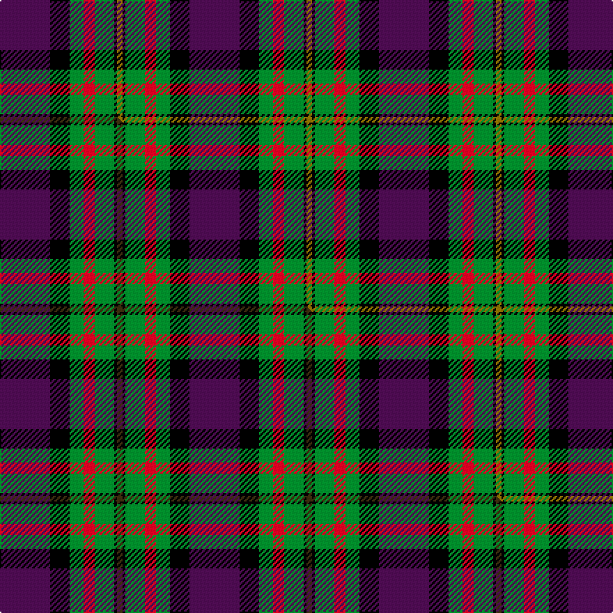

This is one **variant** — a specific cloth: this exact thread count and colourway, with its own
provenance below. It is one weaving of the [sett](/setts/dp18k7g5r4g7k1y2/) (the scale-free proportion — the
same cloth at any scale or shade), whose colour order is pattern [BKGRGKG](/stripes/bkgrgkg/).

Part of the [Regent](/tartans/r/re/regent/) tartan — the named design grouping this sett with its other cloths.

Sourced from house-of-tartan.  It is a [7 stripe tartan](/stripes/stripes7/).

Original link [http://www.house-of-tartan.scotland.net/house/TartanViewjs.asp?colr=Def&tnam=341](http://www.house-of-tartan.scotland.net/house/TartanViewjs.asp?colr=Def&tnam=341)

## Provenance

Earliest known date: 1819 See MacLaren

2 attestations — the source records this cloth was collapsed from (oldest owns this page)

<ul>
<li>1819 — Regent Trade Tartan (house-of-tartan, <a href="http://www.house-of-tartan.scotland.net/house/TartanViewjs.asp?colr=Def&tnam=341">record</a>) </li>
<li>undated — Regent (weddslist, <a href="http://www.weddslist.com/cgi-bin/tartans/pg.pl?source=sts">record</a>) </li>
</ul>

Dataset <small>— provenance for this record, inherited from the source manifest</small>

<dl class="dataset-prov">
<dt>source</dt><dd><a href="/sources/house-of-tartan/">House of Tartan</a></dd>
<dt>data captured from</dt><dd><a href="https://github.com/thetartan/tartan-database/blob/master/data/house-of-tartan/data.csv">https://github.com/thetartan/tartan-database/blob/master/data/house-of-tartan/data.csv</a></dd>
<dt>data date</dt><dd>1819 <small>(this record)</small></dd>
<dt>licence</dt><dd><a href="https://creativecommons.org/licenses/by-nc-nd/4.0/">CC BY-NC-ND 4.0</a></dd>
</dl>

Capture chain <small>— the hands this data passed through, oldest first; each capture carries its own licence</small>

<ol class="capture-chain">
<li><a href="http://www.house-of-tartan.scotland.net/">House of Tartan</a> <small>the weaver/retailer's database — the site is now offline; the URL is kept as the ultimate source's identity</small></li>
<li><a href="https://github.com/thetartan/tartan-database">thetartan/tartan-database</a> <small>2016-2017</small> · <a href="https://creativecommons.org/licenses/by-nc-nd/4.0/">CC BY-NC-ND 4.0</a> <small>Levko Kravets's frozen compilation — the capture we vendored, and where its CC licence text came from</small></li>
<li>this dictionary <small>captured 2026-06-10 · commit 5bf86c7566</small> <small>each re-capture is a git commit to data/sources</small></li>
</ol>

## Thread count
DP/36 K14 G10 R8 G14 K2 Y/4

One full sett is **136 threads**.

## Palette
<table><thead><tr><th>Colour</th><th>Shade</th><th>OKLCh</th></tr></thead><tbody><tr><td>G</td><td><code style="background-color:#008B2A;">#008B2A</code> <small style="color:#888">#008B2A</small></td><td><small style="color:#888">oklch(55.4% 0.170 145.9)</small></td></tr><tr><td>K</td><td><code style="background-color:#000000;">#000000</code> <small style="color:#888">#000000</small></td><td><small style="color:#888">oklch(0.0% 0.000 0.0)</small></td></tr><tr><td>DP</td><td><code style="background-color:#4B0B4F;">#4B0B4F</code> <small style="color:#888">#4B0B4F</small></td><td><small style="color:#888">oklch(30.1% 0.125 325.4)</small></td></tr><tr><td>R</td><td><code style="background-color:#D60020;">#D60020</code> <small style="color:#888">#D60020</small></td><td><small style="color:#888">oklch(55.2% 0.224 25.5)</small></td></tr><tr><td>Y</td><td><code style="background-color:#8B6E00;">#8B6E00</code> <small style="color:#888">#8B6E00</small></td><td><small style="color:#888">oklch(55.1% 0.113 90.4)</small></td></tr></tbody></table>

# Sample pattern

## Compared to the master

This cloth is one sett of its design; the master sett (the exemplar the design is anchored on) is below for comparison.

Its **ΔTartan distance** from the master is **0.03** — the same measure the nearest-tartans table ranks by (0 is identical; a re-scale of the same cloth is near 0, a recolour or a different proportion further).

<figure class="master-compare" style="margin:0">

this sett
master sett ★

<figcaption style="color:#888;font-size:smaller">One weave of this sett against the <a href="/setts/dp18k7g5r4g7k1dy2/">master sett ★</a>, split on the diagonal: a shared proportion runs seamlessly across it with only the shades shifting; a different proportion breaks on it.</figcaption>
</figure>

## Nearest tartan variants

The nearest existing variants by ΔTartan distance, with this cloth at the top so the swatches line up against it.

ΔTartan

Threads

Variant

Sett

—

136

<a href="/variants/s7/dp18k7g5r4g7k1y2~x2/">Regent Trade Tartan</a>

<a href="/ttd/edit/#slug=dp18k7g5r4g7k1dy2~x2&amp;base=dp18k7g5r4g7k1y2~x2" title="compare in the TTD">0.03</a>

136

<a href="/variants/s7/dp18k7g5r4g7k1dy2~x2/">Regent</a>

<a href="/ttd/edit/#slug=dp72k40g23r4g23k2w4~x2&amp;base=dp18k7g5r4g7k1y2~x2" title="compare in the TTD">0.83</a>

520

<a href="/variants/s7/dp72k40g23r4g23k2w4~x2/">Ferguson Unidentified</a>

<a href="/ttd/edit/#slug=r2y18k2y3k20dy30w2~x2~y2300000&amp;base=dp18k7g5r4g7k1y2~x2" title="compare in the TTD">1.57</a>

300

<a href="/variants/s7/r2y18k2y3k20dy30w2~x2~y2300000/">Bennett, John Paul Personal Tartan</a>

<a href="/ttd/edit/#slug=r2n18k2n3k20dy30w2~x2&amp;base=dp18k7g5r4g7k1y2~x2" title="compare in the TTD">1.87</a>

300

<a href="/variants/s7/r2n18k2n3k20dy30w2~x2/">Bennett, J P. (Personal)</a>

<a href="/ttd/edit/#slug=db18k10g6r4g6k1w2~x2&amp;base=dp18k7g5r4g7k1y2~x2" title="compare in the TTD">1.93</a>

148

<a href="/variants/s7/db18k10g6r4g6k1w2~x2/">Ferguson - 1830 of Atholl (Clan)</a>

<a href="/ttd/edit/#slug=dt18k5r26k5g25k5dt18y2~x2~dt1204274&amp;base=dp18k7g5r4g7k1y2~x2" title="compare in the TTD">2.05</a>

376

<a href="/variants/s8/db18k5r26k5g25k5db18y2~x2~db1204274/">St. Clement of Rome School</a>

<a href="/ttd/edit/#slug=r1n12k6ly1do10r1~x4&amp;base=dp18k7g5r4g7k1y2~x2" title="compare in the TTD">2.12</a>

240

<a href="/variants/s6/r1n12k6ly1do10r1~x4/">Andover (Fashion)</a>

<a href="/ttd/edit/#slug=db18k5r26k5g25k5db18y2~x2&amp;base=dp18k7g5r4g7k1y2~x2" title="compare in the TTD">2.21</a>

376

<a href="/variants/s8/db18k5r26k5g25k5db18y2~x2/">St. Clement of Rome (Corporate)</a>

<a href="/ttd/edit/#slug=y2k6g33k33dp33w2~x2&amp;base=dp18k7g5r4g7k1y2~x2" title="compare in the TTD">2.30</a>

428

<a href="/variants/s6/y2k6g33k33dp33w2~x2/">MacNeil 8</a>

<a href="/ttd/edit/#slug=dg1r24dg8k8dg8r1k4db16w1~x2&amp;base=dp18k7g5r4g7k1y2~x2" title="compare in the TTD">2.35</a>

280

<a href="/variants/s9/dg1r24dg8k8dg8r1k4db16w1~x2/">Manson</a>

## Neighbour map

Every grey dot is one of 13621 variants placed by the first two principal components of the ΔTartan feature space (42% of its variance). Red is this tartan; blue dots are its nearest — click one to open its page.

<svg viewBox="0 0 640 380" role="img" style="max-width:100%;height:auto;border:1px solid #e0e0e0;border-radius:4px;display:block" xmlns="http://www.w3.org/2000/svg"><image href="/nn/cloud.v1.png" width="640" height="380"/><a href="/variants/s7/dp18k7g5r4g7k1dy2~x2/"><circle cx="183.8" cy="154.6" r="4" fill="#3465a4"><title>Regent</title></circle></a><a href="/variants/s7/dp72k40g23r4g23k2w4~x2/"><circle cx="220.5" cy="114.2" r="4" fill="#3465a4"><title>Ferguson Unidentified</title></circle></a><a href="/variants/s7/r2y18k2y3k20dy30w2~x2~y2300000/"><circle cx="184.2" cy="150.3" r="4" fill="#3465a4"><title>Bennett, John Paul Personal Tartan</title></circle></a><a href="/variants/s7/r2n18k2n3k20dy30w2~x2/"><circle cx="198.9" cy="156.0" r="4" fill="#3465a4"><title>Bennett, J P. (Personal)</title></circle></a><a href="/variants/s7/db18k10g6r4g6k1w2~x2/"><circle cx="147.9" cy="156.6" r="4" fill="#3465a4"><title>Ferguson - 1830 of Atholl (Clan)</title></circle></a><a href="/variants/s8/db18k5r26k5g25k5db18y2~x2~db1204274/"><circle cx="124.7" cy="170.6" r="4" fill="#3465a4"><title>St. Clement of Rome School</title></circle></a><a href="/variants/s6/r1n12k6ly1do10r1~x4/"><circle cx="195.9" cy="180.8" r="4" fill="#3465a4"><title>Andover (Fashion)</title></circle></a><a href="/variants/s8/db18k5r26k5g25k5db18y2~x2/"><circle cx="120.8" cy="170.5" r="4" fill="#3465a4"><title>St. Clement of Rome (Corporate)</title></circle></a><a href="/variants/s6/y2k6g33k33dp33w2~x2/"><circle cx="158.9" cy="163.2" r="4" fill="#3465a4"><title>MacNeil 8</title></circle></a><a href="/variants/s9/dg1r24dg8k8dg8r1k4db16w1~x2/"><circle cx="161.9" cy="121.4" r="4" fill="#3465a4"><title>Manson</title></circle></a><circle cx="181.1" cy="153.8" r="5" fill="#c00000"/><text x="320" y="376" text-anchor="middle" font-size="11" fill="#999">ground</text><text x="11" y="190" text-anchor="middle" font-size="11" fill="#999" transform="rotate(-90 11 190)">complexity</text></svg>

ID: /variants/s7/dp18k7g5r4g7k1y2~x2/
