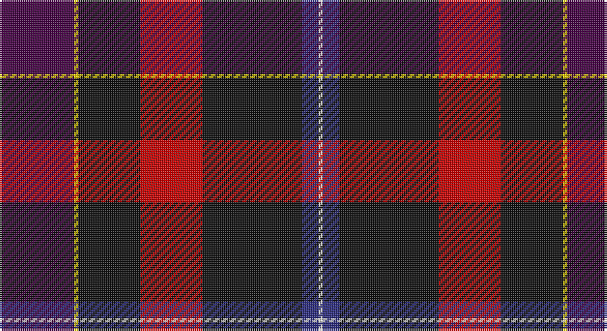

This page is one **sett** — a single exact thread-count. It belongs to the [tartan](/setts/dp18ly1k15r15k24db4w1/)
(the same proportion at any scale), whose colour order is pattern [BYKRKBW](/stripes/bykrkbw/).

Sourced from tartans-authority.  It is a [7 stripe tartan](/stripes/stripes7/).

Original link http://www.tartansauthority.com/tartan-ferret/display/10683/

## Register references

External register numbers recorded for this tartan.

- Scottish Register of Tartans: [10683](https://www.tartanregister.gov.uk/tartanDetails?ref=10683)
- Scottish Tartans Authority (ITI): 10683

## Thread count
DP/36 Y2 K30 R30 K48 DB8 LN/2

One full sett is **274 threads**.

## Palette

Palette: <strong>Tartan Register</strong>
<table><thead><tr><th>Colour</th><th>Threads</th><th>Shade</th><th>Base</th><th>OKLCh</th></tr></thead><tbody><tr><td>DP/</td><td style="text-align:right;font-variant-numeric:tabular-nums">36</td><td><code style="background-color:#440044;">#440044</code> <small style="color:#888">#440044</small></td><td>B <code style="background-color:#2A418A;">#2A418A</code></td><td><small style="color:#888">oklch(27.1% 0.125 328.4)</small></td></tr><tr><td>Y</td><td style="text-align:right;font-variant-numeric:tabular-nums">2</td><td><code style="background-color:#FCCC00;">#FCCC00</code> <small style="color:#888">#FCCC00</small></td><td>Y <code style="background-color:#F2BF00;">#F2BF00</code></td><td><small style="color:#888">oklch(86.2% 0.176 91.5)</small></td></tr><tr><td>K</td><td style="text-align:right;font-variant-numeric:tabular-nums">30</td><td><code style="background-color:#101010;">#101010</code> <small style="color:#888">#101010</small></td><td>K <code style="background-color:#000000;">#000000</code></td><td><small style="color:#888">oklch(17.3% 0.000 89.9)</small></td></tr><tr><td>R</td><td style="text-align:right;font-variant-numeric:tabular-nums">30</td><td><code style="background-color:#C80000;">#C80000</code> <small style="color:#888">#C80000</small></td><td>R <code style="background-color:#CC0000;">#CC0000</code></td><td><small style="color:#888">oklch(52.3% 0.215 29.2)</small></td></tr><tr><td>K</td><td style="text-align:right;font-variant-numeric:tabular-nums">48</td><td><code style="background-color:#101010;">#101010</code> <small style="color:#888">#101010</small></td><td>K <code style="background-color:#000000;">#000000</code></td><td><small style="color:#888">oklch(17.3% 0.000 89.9)</small></td></tr><tr><td>DB</td><td style="text-align:right;font-variant-numeric:tabular-nums">8</td><td><code style="background-color:#2C2C80;">#2C2C80</code> <small style="color:#888">#2C2C80</small></td><td>B <code style="background-color:#2A418A;">#2A418A</code></td><td><small style="color:#888">oklch(35.0% 0.138 276.6)</small></td></tr><tr><td>LN/</td><td style="text-align:right;font-variant-numeric:tabular-nums">2</td><td><code style="background-color:#E0E0E0;">#E0E0E0</code> <small style="color:#888">#E0E0E0</small></td><td>W <code style="background-color:#F7F7F7;">#F7F7F7</code></td><td><small style="color:#888">oklch(90.7% 0.000 89.9)</small></td></tr></tbody></table>

# Sample pattern

## Nearest tartans

The nearest existing variants by ΔTartan distance, with this tartan at the top so the swatches line up against it.

ΔTartan

Tartan

Sett

—

<a href="/ttd/edit/#slug=dp18ly1k15r15k24db4w1~x2">European Congress of Immunology (Cor</a> <a class="nn-out" href="/variants/s7/dp18ly1k15r15k24db4w1~x2/" title="open its dictionary page">↗</a>

1.31

<a href="/ttd/edit/#slug=dg3k24lo1r18db18w1~x2&amp;base=dp18ly1k15r15k24db4w1~x2">Hegarty, Philip David (Personal)</a> <a class="nn-out" href="/variants/s6/dg3k24lo1r18db18w1~x2/" title="open its dictionary page">↗</a>

1.46

<a href="/ttd/edit/#slug=r3ly2dp26k13y2k8w3~x2&amp;base=dp18ly1k15r15k24db4w1~x2">Curnow of Kernow (Personal)</a> <a class="nn-out" href="/variants/s7/r3ly2dp26k13y2k8w3~x2/" title="open its dictionary page">↗</a>

1.49

<a href="/ttd/edit/#slug=g3k24ly1r18db18w1~x2&amp;base=dp18ly1k15r15k24db4w1~x2">Hegarty, Philip David (Personal)</a> <a class="nn-out" href="/variants/s6/g3k24ly1r18db18w1~x2/" title="open its dictionary page">↗</a>

1.56

<a href="/ttd/edit/#slug=db4dg2r18ri10dg10db29b4~x2&amp;base=dp18ly1k15r15k24db4w1~x2">Ross Dempster (Personal)</a> <a class="nn-out" href="/variants/s7/db4dg2r18ri10dg10db29b4~x2/" title="open its dictionary page">↗</a>

1.61

<a href="/ttd/edit/#slug=dg8db5k1db17r10db2r10o2~x2&amp;base=dp18ly1k15r15k24db4w1~x2">Harrower, John Anthony (Personal)</a> <a class="nn-out" href="/variants/s8/dg8db5k1db17r10db2r10o2~x2/" title="open its dictionary page">↗</a>

1.61

<a href="/ttd/edit/#slug=dp18k7g5r4g7k1ly2~x2&amp;base=dp18ly1k15r15k24db4w1~x2">Regent</a> <a class="nn-out" href="/variants/s7/dp18k7g5r4g7k1ly2~x2/" title="open its dictionary page">↗</a>

1.63

<a href="/ttd/edit/#slug=o3ri18k2dg18k24r1~x2&amp;base=dp18ly1k15r15k24db4w1~x2">205 (Scottish) Field Hospital (Mil.)</a> <a class="nn-out" href="/variants/s6/o3ri18k2dg18k24r1~x2/" title="open its dictionary page">↗</a>

1.63

<a href="/ttd/edit/#slug=dg10w2dt10lo5db35r6~x2&amp;base=dp18ly1k15r15k24db4w1~x2">Hatfield &amp; Mize (Personal)</a> <a class="nn-out" href="/variants/s6/dg10w2dt10lo5db35r6~x2/" title="open its dictionary page">↗</a>

1.68

<a href="/ttd/edit/#slug=w2dp5m34k5n9k12dp1~x2&amp;base=dp18ly1k15r15k24db4w1~x2">Thomson, Reona Ellen (Personal)</a> <a class="nn-out" href="/variants/s7/w2dp5m34k5n9k12dp1~x2/" title="open its dictionary page">↗</a>

1.69

<a href="/ttd/edit/#slug=db4w1k2db25k12b1k2r16k2lo1~x2&amp;base=dp18ly1k15r15k24db4w1~x2">Sidey Dress Tartan (Name)</a> <a class="nn-out" href="/variants/s10/db4w1k2db25k12b1k2r16k2lo1~x2/" title="open its dictionary page">↗</a>

## Neighbour map

Every grey dot is one of 14360 variants placed by the first two principal components of the ΔTartan feature space (44% of its variance). Red is this tartan; blue dots are its nearest — click one to open its page.

<svg viewBox="0 0 640 380" role="img" style="max-width:100%;height:auto;border:1px solid #e0e0e0;border-radius:4px;display:block" xmlns="http://www.w3.org/2000/svg"><image href="/nn/cloud.v1.png" width="640" height="380"/><a href="/variants/s6/dg3k24lo1r18db18w1~x2/"><circle cx="211.8" cy="149.0" r="4" fill="#3465a4"><title>Hegarty, Philip David (Personal)</title></circle></a><a href="/variants/s7/r3ly2dp26k13y2k8w3~x2/"><circle cx="234.9" cy="152.1" r="4" fill="#3465a4"><title>Curnow of Kernow (Personal)</title></circle></a><a href="/variants/s6/g3k24ly1r18db18w1~x2/"><circle cx="196.4" cy="141.3" r="4" fill="#3465a4"><title>Hegarty, Philip David (Personal)</title></circle></a><a href="/variants/s7/db4dg2r18ri10dg10db29b4~x2/"><circle cx="224.6" cy="184.6" r="4" fill="#3465a4"><title>Ross Dempster (Personal)</title></circle></a><a href="/variants/s8/dg8db5k1db17r10db2r10o2~x2/"><circle cx="247.3" cy="175.7" r="4" fill="#3465a4"><title>Harrower, John Anthony (Personal)</title></circle></a><a href="/variants/s7/dp18k7g5r4g7k1ly2~x2/"><circle cx="215.0" cy="170.7" r="4" fill="#3465a4"><title>Regent</title></circle></a><a href="/variants/s6/o3ri18k2dg18k24r1~x2/"><circle cx="247.0" cy="180.4" r="4" fill="#3465a4"><title>205 (Scottish) Field Hospital (Mil.)</title></circle></a><a href="/variants/s6/dg10w2dt10lo5db35r6~x2/"><circle cx="254.0" cy="157.2" r="4" fill="#3465a4"><title>Hatfield &amp; Mize (Personal)</title></circle></a><a href="/variants/s7/w2dp5m34k5n9k12dp1~x2/"><circle cx="331.5" cy="137.8" r="4" fill="#3465a4"><title>Thomson, Reona Ellen (Personal)</title></circle></a><a href="/variants/s10/db4w1k2db25k12b1k2r16k2lo1~x2/"><circle cx="258.9" cy="106.6" r="4" fill="#3465a4"><title>Sidey Dress Tartan (Name)</title></circle></a><circle cx="265.6" cy="158.0" r="5" fill="#c00000"/></svg>

ID: /variants/s7/dp18ly1k15r15k24db4w1~x2/
