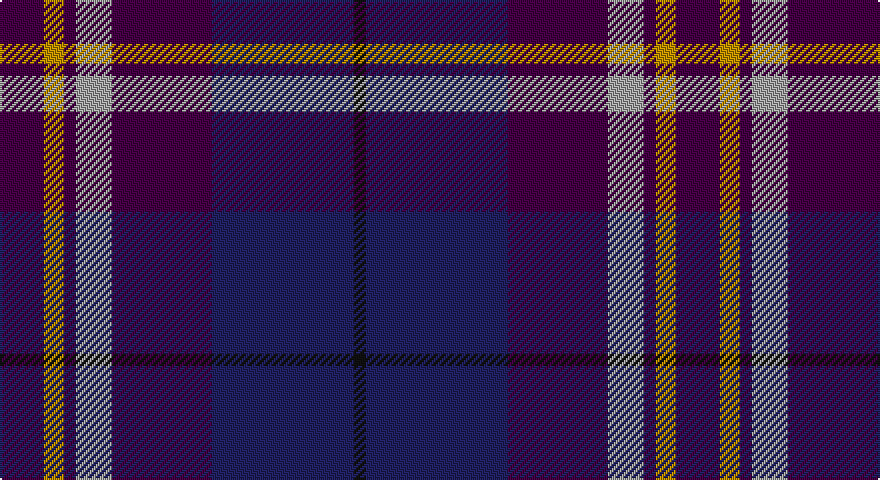

This page is one **sett** — a single exact thread-count. It belongs to the [tartan](/setts/dp22lo10dp6lr18dp50db71k6/)
(the same proportion at any scale), whose colour order is pattern [BYBYBBK](/stripes/bybybbk/).

Sourced from register-of-tartans.  It is a [7 stripe tartan](/stripes/stripes7/).

Original link https://www.tartanregister.gov.uk/tartanDetails.aspx?ref=616

2 attestations — the source records this cloth was collapsed from (oldest owns this page)

<ul>
<li>01/03/2004 — Charleston Police Department (register-of-tartans, <a href="https://www.tartanregister.gov.uk/tartanDetails.aspx?ref=616">record</a>)</li>
<li>2004, March — Charleston Police Department (Corp) (tartans-authority, <a href="http://www.tartansauthority.com/tartan-ferret/display/6153/">record</a>)</li>
</ul>

## Register references

External register numbers recorded for this tartan.

- Scottish Register of Tartans: [616](https://www.tartanregister.gov.uk/tartanDetails.aspx?ref=616)
- Scottish Tartans Authority (ITI): 6153

## Thread count
DP/22 DY10 DP6 N18 DP50 DB71 K/6

One full sett is **338 threads**.

## Palette

Palette: <strong>Tartan Register</strong>
<table><thead><tr><th>Colour</th><th>Threads</th><th>Shade</th><th>Base</th><th>OKLCh</th></tr></thead><tbody><tr><td>DP/</td><td style="text-align:right;font-variant-numeric:tabular-nums">22</td><td><code style="background-color:#440044;">#440044</code> <small style="color:#888">#440044</small></td><td>B <code style="background-color:#2A418A;">#2A418A</code></td><td><small style="color:#888">oklch(27.1% 0.125 328.4)</small></td></tr><tr><td>DY</td><td style="text-align:right;font-variant-numeric:tabular-nums">10</td><td><code style="background-color:#BC8C00;">#BC8C00</code> <small style="color:#888">#BC8C00</small></td><td>Y <code style="background-color:#F2BF00;">#F2BF00</code></td><td><small style="color:#888">oklch(66.8% 0.137 84.1)</small></td></tr><tr><td>DP</td><td style="text-align:right;font-variant-numeric:tabular-nums">6</td><td><code style="background-color:#440044;">#440044</code> <small style="color:#888">#440044</small></td><td>B <code style="background-color:#2A418A;">#2A418A</code></td><td><small style="color:#888">oklch(27.1% 0.125 328.4)</small></td></tr><tr><td>N</td><td style="text-align:right;font-variant-numeric:tabular-nums">18</td><td><code style="background-color:#A0A0A0;">#A0A0A0</code> <small style="color:#888">#A0A0A0</small></td><td>Y <code style="background-color:#F2BF00;">#F2BF00</code></td><td><small style="color:#888">oklch(70.6% 0.000 89.9)</small></td></tr><tr><td>DP</td><td style="text-align:right;font-variant-numeric:tabular-nums">50</td><td><code style="background-color:#440044;">#440044</code> <small style="color:#888">#440044</small></td><td>B <code style="background-color:#2A418A;">#2A418A</code></td><td><small style="color:#888">oklch(27.1% 0.125 328.4)</small></td></tr><tr><td>DB</td><td style="text-align:right;font-variant-numeric:tabular-nums">71</td><td><code style="background-color:#202060;">#202060</code> <small style="color:#888">#202060</small></td><td>B <code style="background-color:#2A418A;">#2A418A</code></td><td><small style="color:#888">oklch(28.9% 0.111 276.9)</small></td></tr><tr><td>K/</td><td style="text-align:right;font-variant-numeric:tabular-nums">6</td><td><code style="background-color:#101010;">#101010</code> <small style="color:#888">#101010</small></td><td>K <code style="background-color:#000000;">#000000</code></td><td><small style="color:#888">oklch(17.3% 0.000 89.9)</small></td></tr></tbody></table>

# Sample pattern

## Nearest tartans

The nearest existing variants by ΔTartan distance, with this tartan at the top so the swatches line up against it.

ΔTartan

Tartan

Sett

—

<a href="/ttd/edit/#slug=dp22lo10dp6lr18dp50db71k6">Charleston Police Department</a> <a class="nn-out" href="/variants/s7/dp22lo10dp6lr18dp50db71k6/" title="open its dictionary page">↗</a>

0.86

<a href="/ttd/edit/#slug=m4dp1m1dp12k6dt16w1~x2&amp;base=dp22lo10dp6lr18dp50db71k6">First (Corporate)</a> <a class="nn-out" href="/variants/s7/m4dp1m1dp12k6dt16w1~x2/" title="open its dictionary page">↗</a>

1.02

<a href="/ttd/edit/#slug=dp1m4dp1m1dp12k6dt16w1~x2&amp;base=dp22lo10dp6lr18dp50db71k6">First</a> <a class="nn-out" href="/variants/s8/dp1m4dp1m1dp12k6dt16w1~x2/" title="open its dictionary page">↗</a>

1.15

<a href="/ttd/edit/#slug=lb2db20n2dt15r9lb2~x2&amp;base=dp22lo10dp6lr18dp50db71k6">Open Championship (1998)</a> <a class="nn-out" href="/variants/s6/lb2db20n2dt15r9lb2~x2/" title="open its dictionary page">↗</a>

1.21

<a href="/ttd/edit/#slug=db20k4g5dp14w1db2~x2&amp;base=dp22lo10dp6lr18dp50db71k6">Riley's Theme (Fashion)</a> <a class="nn-out" href="/variants/s6/db20k4g5dp14w1db2~x2/" title="open its dictionary page">↗</a>

1.26

<a href="/ttd/edit/#slug=dp24dt2g3m2g3k11dt29w2~x2&amp;base=dp22lo10dp6lr18dp50db71k6">Alba</a> <a class="nn-out" href="/variants/s8/dp24dt2g3m2g3k11dt29w2~x2/" title="open its dictionary page">↗</a>

1.26

<a href="/ttd/edit/#slug=db15dp3db30k22dg18dp3dg3w3~x2&amp;base=dp22lo10dp6lr18dp50db71k6">Moray (Corporate)</a> <a class="nn-out" href="/variants/s8/db15dp3db30k22dg18dp3dg3w3~x2/" title="open its dictionary page">↗</a>

1.27

<a href="/ttd/edit/#slug=r30db5r3db33g8k3db8w2~x2&amp;base=dp22lo10dp6lr18dp50db71k6">St. Margaret Youth Group (Corporate)</a> <a class="nn-out" href="/variants/s8/r30db5r3db33g8k3db8w2~x2/" title="open its dictionary page">↗</a>

1.28

<a href="/ttd/edit/#slug=k6dg11w2db22r2k4~x2&amp;base=dp22lo10dp6lr18dp50db71k6">Leslie Hebridean Artifact Tartan</a> <a class="nn-out" href="/variants/s6/k6dg11w2db22r2k4~x2/" title="open its dictionary page">↗</a>

1.32

<a href="/ttd/edit/#slug=k2m1db17m17dt1ly2~x4&amp;base=dp22lo10dp6lr18dp50db71k6">Murdoch</a> <a class="nn-out" href="/variants/s6/k2m1db17m17dt1ly2~x4/" title="open its dictionary page">↗</a>

1.33

<a href="/ttd/edit/#slug=db23dp2g11dp24lb3~x2&amp;base=dp22lo10dp6lr18dp50db71k6">Scottish Open Squash (Corporate)</a> <a class="nn-out" href="/variants/s5/db23dp2g11dp24lb3~x2/" title="open its dictionary page">↗</a>

## Neighbour map

Every grey dot is one of 14360 variants placed by the first two principal components of the ΔTartan feature space (44% of its variance). Red is this tartan; blue dots are its nearest — click one to open its page.

<svg viewBox="0 0 640 380" role="img" style="max-width:100%;height:auto;border:1px solid #e0e0e0;border-radius:4px;display:block" xmlns="http://www.w3.org/2000/svg"><image href="/nn/cloud.v1.png" width="640" height="380"/><a href="/variants/s7/m4dp1m1dp12k6dt16w1~x2/"><circle cx="252.3" cy="184.0" r="4" fill="#3465a4"><title>First (Corporate)</title></circle></a><a href="/variants/s8/dp1m4dp1m1dp12k6dt16w1~x2/"><circle cx="254.6" cy="172.4" r="4" fill="#3465a4"><title>First</title></circle></a><a href="/variants/s6/lb2db20n2dt15r9lb2~x2/"><circle cx="205.1" cy="204.7" r="4" fill="#3465a4"><title>Open Championship (1998)</title></circle></a><a href="/variants/s6/db20k4g5dp14w1db2~x2/"><circle cx="311.3" cy="197.8" r="4" fill="#3465a4"><title>Riley's Theme (Fashion)</title></circle></a><a href="/variants/s8/dp24dt2g3m2g3k11dt29w2~x2/"><circle cx="236.9" cy="154.6" r="4" fill="#3465a4"><title>Alba</title></circle></a><a href="/variants/s8/db15dp3db30k22dg18dp3dg3w3~x2/"><circle cx="255.2" cy="218.0" r="4" fill="#3465a4"><title>Moray (Corporate)</title></circle></a><a href="/variants/s8/r30db5r3db33g8k3db8w2~x2/"><circle cx="321.4" cy="171.0" r="4" fill="#3465a4"><title>St. Margaret Youth Group (Corporate)</title></circle></a><a href="/variants/s6/k6dg11w2db22r2k4~x2/"><circle cx="261.4" cy="208.8" r="4" fill="#3465a4"><title>Leslie Hebridean Artifact Tartan</title></circle></a><a href="/variants/s6/k2m1db17m17dt1ly2~x4/"><circle cx="313.9" cy="172.4" r="4" fill="#3465a4"><title>Murdoch</title></circle></a><a href="/variants/s5/db23dp2g11dp24lb3~x2/"><circle cx="258.6" cy="240.6" r="4" fill="#3465a4"><title>Scottish Open Squash (Corporate)</title></circle></a><circle cx="262.0" cy="200.9" r="5" fill="#c00000"/></svg>

ID: /variants/s7/dp22lo10dp6lr18dp50db71k6/
