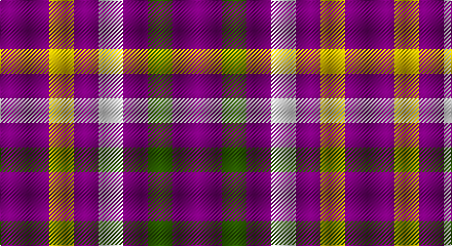

This page is one **sett** — a single exact thread-count. It belongs to the [tartan](/setts/dp2dg1dp1w1dp1ly1dp2/)
(the same proportion at any scale), whose colour order is pattern [BGBWBYB](/stripes/bgbwbyb/).

Sourced from tartans-authority.  It is a [7 stripe tartan](/stripes/stripes7/).

Original link http://www.tartansauthority.com/tartan-ferret/display/109/

## Register references

External register numbers recorded for this tartan.

- Scottish Tartans Authority (ITI): 109

## Thread count
P/48 Y24 P24 W24 P24 G24 P/48

One full sett is **336 threads**.

## Palette

Palette: <strong>Tartan Register</strong>
<table><thead><tr><th>Colour</th><th>Threads</th><th>Shade</th><th>Base</th><th>OKLCh</th></tr></thead><tbody><tr><td>P/</td><td style="text-align:right;font-variant-numeric:tabular-nums">48</td><td><code style="background-color:#780078;">#780078</code> <small style="color:#888">#780078</small></td><td>B <code style="background-color:#2A418A;">#2A418A</code></td><td><small style="color:#888">oklch(40.2% 0.185 328.4)</small></td></tr><tr><td>Y</td><td style="text-align:right;font-variant-numeric:tabular-nums">24</td><td><code style="background-color:#E8C000;">#E8C000</code> <small style="color:#888">#E8C000</small></td><td>Y <code style="background-color:#F2BF00;">#F2BF00</code></td><td><small style="color:#888">oklch(81.9% 0.168 93.7)</small></td></tr><tr><td>P</td><td style="text-align:right;font-variant-numeric:tabular-nums">24</td><td><code style="background-color:#780078;">#780078</code> <small style="color:#888">#780078</small></td><td>B <code style="background-color:#2A418A;">#2A418A</code></td><td><small style="color:#888">oklch(40.2% 0.185 328.4)</small></td></tr><tr><td>W</td><td style="text-align:right;font-variant-numeric:tabular-nums">24</td><td><code style="background-color:#FCFCFC;">#FCFCFC</code> <small style="color:#888">#FCFCFC</small></td><td>W <code style="background-color:#F7F7F7;">#F7F7F7</code></td><td><small style="color:#888">oklch(99.1% 0.000 89.9)</small></td></tr><tr><td>P</td><td style="text-align:right;font-variant-numeric:tabular-nums">24</td><td><code style="background-color:#780078;">#780078</code> <small style="color:#888">#780078</small></td><td>B <code style="background-color:#2A418A;">#2A418A</code></td><td><small style="color:#888">oklch(40.2% 0.185 328.4)</small></td></tr><tr><td>G</td><td style="text-align:right;font-variant-numeric:tabular-nums">24</td><td><code style="background-color:#285800;">#285800</code> <small style="color:#888">#285800</small></td><td>G <code style="background-color:#006100;">#006100</code></td><td><small style="color:#888">oklch(41.0% 0.122 135.8)</small></td></tr><tr><td>P/</td><td style="text-align:right;font-variant-numeric:tabular-nums">48</td><td><code style="background-color:#780078;">#780078</code> <small style="color:#888">#780078</small></td><td>B <code style="background-color:#2A418A;">#2A418A</code></td><td><small style="color:#888">oklch(40.2% 0.185 328.4)</small></td></tr></tbody></table>

# Sample pattern

## Nearest tartans

The nearest existing variants by ΔTartan distance, with this tartan at the top so the swatches line up against it.

ΔTartan

Tartan

Sett

—

<a href="/ttd/edit/#slug=dp2dg1dp1w1dp1ly1dp2~x24">Justus International (Personal)</a> <a class="nn-out" href="/variants/s7/dp2dg1dp1w1dp1ly1dp2~x24/" title="open its dictionary page">↗</a>

0.20

<a href="/ttd/edit/#slug=dp2g1dp1w1dp1ly1dp2~x6&amp;base=dp2dg1dp1w1dp1ly1dp2~x24">Justus International Tartan</a> <a class="nn-out" href="/variants/s7/dp2g1dp1w1dp1ly1dp2~x6/" title="open its dictionary page">↗</a>

0.23

<a href="/ttd/edit/#slug=p2g1p1w1p1ly1p2~x24&amp;base=dp2dg1dp1w1dp1ly1dp2~x24">Justus International</a> <a class="nn-out" href="/variants/s7/p2g1p1w1p1ly1p2~x24/" title="open its dictionary page">↗</a>

1.71

<a href="/variants/s12/dp2dg1dp1w1dp1ly1dp2~x24/">Justus International (Personal)</a>

2.42

<a href="/ttd/edit/#slug=y5k2r2ly2y5~x10&amp;base=dp2dg1dp1w1dp1ly1dp2~x24">Ikelman No 3</a> <a class="nn-out" href="/variants/s5/y5k2r2ly2y5~x10/" title="open its dictionary page">↗</a>

2.48

<a href="/ttd/edit/#slug=r5db6r1db6r1db6r5w5~x4&amp;base=dp2dg1dp1w1dp1ly1dp2~x24">U.S. Coast Guard</a> <a class="nn-out" href="/variants/s8/r5db6r1db6r1db6r5w5~x4/" title="open its dictionary page">↗</a>

2.59

<a href="/ttd/edit/#slug=db6r1db6r5w5~x4&amp;base=dp2dg1dp1w1dp1ly1dp2~x24">U.S. Coast Guard (Corporate)</a> <a class="nn-out" href="/variants/s5/db6r1db6r5w5~x4/" title="open its dictionary page">↗</a>

2.70

<a href="/ttd/edit/#slug=db11r4ly9db4ly2db11~x2&amp;base=dp2dg1dp1w1dp1ly1dp2~x24">Unidentified Sample</a> <a class="nn-out" href="/variants/s6/db11r4ly9db4ly2db11~x2/" title="open its dictionary page">↗</a>

2.71

<a href="/ttd/edit/#slug=db7w1r7db4r2db4w2~x2&amp;base=dp2dg1dp1w1dp1ly1dp2~x24">Coronation</a> <a class="nn-out" href="/variants/s7/db7w1r7db4r2db4w2~x2/" title="open its dictionary page">↗</a>

2.74

<a href="/ttd/edit/#slug=w15n25r10w5n25w7n16k9n17k10n23r9&amp;base=dp2dg1dp1w1dp1ly1dp2~x24">North Carolina State University</a> <a class="nn-out" href="/variants/s12/w15n25r10w5n25w7n16k9n17k10n23r9/" title="open its dictionary page">↗</a>

2.75

<a href="/ttd/edit/#slug=k3w7k4w6o3~x2&amp;base=dp2dg1dp1w1dp1ly1dp2~x24">Daks - House Check, C.6700.03</a> <a class="nn-out" href="/variants/s5/k3w7k4w6o3~x2/" title="open its dictionary page">↗</a>

## Neighbour map

Every grey dot is one of 14360 variants placed by the first two principal components of the ΔTartan feature space (44% of its variance). Red is this tartan; blue dots are its nearest — click one to open its page.

<svg viewBox="0 0 640 380" role="img" style="max-width:100%;height:auto;border:1px solid #e0e0e0;border-radius:4px;display:block" xmlns="http://www.w3.org/2000/svg"><image href="/nn/cloud.v1.png" width="640" height="380"/><a href="/variants/s7/dp2g1dp1w1dp1ly1dp2~x6/"><circle cx="231.8" cy="297.3" r="4" fill="#3465a4"><title>Justus International Tartan</title></circle></a><a href="/variants/s7/p2g1p1w1p1ly1p2~x24/"><circle cx="231.0" cy="295.4" r="4" fill="#3465a4"><title>Justus International</title></circle></a><a href="/variants/s12/dp2dg1dp1w1dp1ly1dp2~x24/"><circle cx="136.8" cy="270.5" r="4" fill="#3465a4"><title>Justus International (Personal)</title></circle></a><a href="/variants/s5/y5k2r2ly2y5~x10/"><circle cx="223.8" cy="290.6" r="4" fill="#3465a4"><title>Ikelman No 3</title></circle></a><a href="/variants/s8/r5db6r1db6r1db6r5w5~x4/"><circle cx="222.8" cy="255.0" r="4" fill="#3465a4"><title>U.S. Coast Guard</title></circle></a><a href="/variants/s5/db6r1db6r5w5~x4/"><circle cx="211.3" cy="278.4" r="4" fill="#3465a4"><title>U.S. Coast Guard (Corporate)</title></circle></a><a href="/variants/s6/db11r4ly9db4ly2db11~x2/"><circle cx="292.7" cy="266.5" r="4" fill="#3465a4"><title>Unidentified Sample</title></circle></a><a href="/variants/s7/db7w1r7db4r2db4w2~x2/"><circle cx="275.9" cy="244.0" r="4" fill="#3465a4"><title>Coronation</title></circle></a><a href="/variants/s12/w15n25r10w5n25w7n16k9n17k10n23r9/"><circle cx="231.8" cy="230.3" r="4" fill="#3465a4"><title>North Carolina State University</title></circle></a><a href="/variants/s5/k3w7k4w6o3~x2/"><circle cx="167.4" cy="310.3" r="4" fill="#3465a4"><title>Daks - House Check, C.6700.03</title></circle></a><circle cx="226.6" cy="294.1" r="5" fill="#c00000"/></svg>

ID: /variants/s7/dp2dg1dp1w1dp1ly1dp2~x24/
