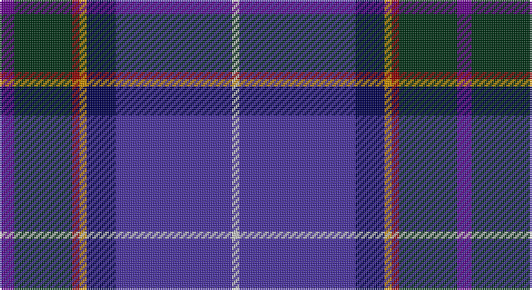

This page is one **sett** — a single exact thread-count. It belongs to the [tartan](/setts/dp2dg8r1lo1db4dbi16lb1/)
(the same proportion at any scale), whose colour order is pattern [BGRYBBW](/stripes/bgrybbw/).

Part of the [Ellan Vannin](/tartans/ellan-vannin/) tartan — the named design grouping this sett with its other cloths.

Sourced from register-of-tartans.  It is a [7 stripe tartan](/stripes/stripes7/).

Original link https://www.tartanregister.gov.uk/tartanDetails.aspx?ref=1100

## Register references

External register numbers recorded for this tartan.

- Scottish Register of Tartans: [1100](https://www.tartanregister.gov.uk/tartanDetails.aspx?ref=1100)
- Scottish Tartans Authority (ITI): 4805

## Thread count
P/8 DG32 DR4 DY4 DB16 B64 N/4

One full sett is **252 threads**.

## Palette

Palette: <strong>Tartan Register</strong> <small style="color:#888">(3 of 7 colours)</small>
<table><thead><tr><th>Colour</th><th>Threads</th><th>Shade</th><th>Base</th><th>OKLCh</th></tr></thead><tbody><tr><td>P/</td><td style="text-align:right;font-variant-numeric:tabular-nums">8</td><td><code style="background-color:#64008C;">#64008C</code> <small style="color:#888">#64008C</small></td><td>B <code style="background-color:#2A418A;">#2A418A</code></td><td><small style="color:#888">oklch(38.5% 0.193 311.3)</small></td></tr><tr><td>DG</td><td style="text-align:right;font-variant-numeric:tabular-nums">32</td><td><code style="background-color:#003014;">#003014</code> <small style="color:#888">#003014</small></td><td>G <code style="background-color:#006100;">#006100</code></td><td><small style="color:#888">oklch(27.1% 0.071 152.1)</small></td></tr><tr><td>DR</td><td style="text-align:right;font-variant-numeric:tabular-nums">4</td><td><code style="background-color:#8C0000;">#8C0000</code> <small style="color:#888">#8C0000</small></td><td>R <code style="background-color:#CC0000;">#CC0000</code></td><td><small style="color:#888">oklch(40.2% 0.165 29.2)</small></td></tr><tr><td>DY</td><td style="text-align:right;font-variant-numeric:tabular-nums">4</td><td><code style="background-color:#C88C00;">#C88C00</code> <small style="color:#888">#C88C00</small></td><td>Y <code style="background-color:#F2BF00;">#F2BF00</code></td><td><small style="color:#888">oklch(68.2% 0.142 78.2)</small></td></tr><tr><td>DB</td><td style="text-align:right;font-variant-numeric:tabular-nums">16</td><td><code style="background-color:#000050;">#000050</code> <small style="color:#888">#000050</small></td><td>B <code style="background-color:#2A418A;">#2A418A</code></td><td><small style="color:#888">oklch(19.5% 0.135 264.1)</small></td></tr><tr><td>B</td><td style="text-align:right;font-variant-numeric:tabular-nums">64</td><td><code style="background-color:#4830A0;">#4830A0</code> <small style="color:#888">#4830A0</small></td><td>B <code style="background-color:#2A418A;">#2A418A</code></td><td><small style="color:#888">oklch(41.0% 0.171 286.0)</small></td></tr><tr><td>N/</td><td style="text-align:right;font-variant-numeric:tabular-nums">4</td><td><code style="background-color:#C8C8C8;">#C8C8C8</code> <small style="color:#888">#C8C8C8</small></td><td>W <code style="background-color:#F7F7F7;">#F7F7F7</code></td><td><small style="color:#888">oklch(83.3% 0.000 89.9)</small></td></tr></tbody></table>

# Sample pattern

## Nearest tartans

The nearest existing variants by ΔTartan distance, with this tartan at the top so the swatches line up against it.

ΔTartan

Tartan

Sett

—

<a href="/ttd/edit/#slug=dp2dg8r1lo1db4dbi16lb1~x4">Ellan Vannin (1958)</a> <a class="nn-out" href="/variants/s7/dp2dg8r1lo1db4dbi16lb1~x4/" title="open its dictionary page">↗</a>

1.17

<a href="/ttd/edit/#slug=r4oi10k9o2k9db33dt7g4~x2&amp;base=dp2dg8r1lo1db4dbi16lb1~x4">Anne Arundel County</a> <a class="nn-out" href="/variants/s8/r4oi10k9o2k9db33dt7g4~x2/" title="open its dictionary page">↗</a>

1.22

<a href="/variants/s8/db39dyi3k14dyi3t14ly4w2dy2~x2/">Unidentified Lady's kilt</a>

1.42

<a href="/ttd/edit/#slug=db11dt5g4w3r3k16dt28lb2~x2&amp;base=dp2dg8r1lo1db4dbi16lb1~x4">Scottish Italian</a> <a class="nn-out" href="/variants/s8/db11dt5g4w3r3k16dt28lb2~x2/" title="open its dictionary page">↗</a>

1.45

<a href="/ttd/edit/#slug=dg24b4dg3db11dp8db37k3db2lr4~x2&amp;base=dp2dg8r1lo1db4dbi16lb1~x4">Stewmann (2009) (Personal)</a> <a class="nn-out" href="/variants/s9/dg24b4dg3db11dp8db37k3db2lr4~x2/" title="open its dictionary page">↗</a>

1.46

<a href="/ttd/edit/#slug=t27db9lb3g6db33lb3dr3ly2~x2&amp;base=dp2dg8r1lo1db4dbi16lb1~x4">Blue Ridge Highlands Heritage</a> <a class="nn-out" href="/variants/s8/t27db9lb3g6db33lb3dr3ly2~x2/" title="open its dictionary page">↗</a>

1.46

<a href="/ttd/edit/#slug=r2db16k8g1dp8lo1dp2w2~x2&amp;base=dp2dg8r1lo1db4dbi16lb1~x4">Freemasons' Universal</a> <a class="nn-out" href="/variants/s8/r2db16k8g1dp8lo1dp2w2~x2/" title="open its dictionary page">↗</a>

1.49

<a href="/ttd/edit/#slug=m4k3b18r3dt34w3~x2&amp;base=dp2dg8r1lo1db4dbi16lb1~x4">Margach, William (Personal)</a> <a class="nn-out" href="/variants/s6/m4k3b18r3dt34w3~x2/" title="open its dictionary page">↗</a>

1.49

<a href="/ttd/edit/#slug=b11db5g4w3r3k16db28b2~x2&amp;base=dp2dg8r1lo1db4dbi16lb1~x4">Scottish Italian</a> <a class="nn-out" href="/variants/s8/b11db5g4w3r3k16db28b2~x2/" title="open its dictionary page">↗</a>

1.49

<a href="/ttd/edit/#slug=dbi49g3k22r2b33db3b7~x2&amp;base=dp2dg8r1lo1db4dbi16lb1~x4">U.S. 2001 Air Force (Military?)</a> <a class="nn-out" href="/variants/s7/dbi49g3k22r2b33db3b7~x2/" title="open its dictionary page">↗</a>

1.52

<a href="/ttd/edit/#slug=t2g13r2k6db23w1~x4&amp;base=dp2dg8r1lo1db4dbi16lb1~x4">Gamblin Thompson (Personal)</a> <a class="nn-out" href="/variants/s6/t2g13r2k6db23w1~x4/" title="open its dictionary page">↗</a>

## Neighbour map

Every grey dot is one of 14360 variants placed by the first two principal components of the ΔTartan feature space (44% of its variance). Red is this tartan; blue dots are its nearest — click one to open its page.

<svg viewBox="0 0 640 380" role="img" style="max-width:100%;height:auto;border:1px solid #e0e0e0;border-radius:4px;display:block" xmlns="http://www.w3.org/2000/svg"><image href="/nn/cloud.v1.png" width="640" height="380"/><a href="/variants/s8/r4oi10k9o2k9db33dt7g4~x2/"><circle cx="196.3" cy="143.8" r="4" fill="#3465a4"><title>Anne Arundel County</title></circle></a><a href="/variants/s8/db39dyi3k14dyi3t14ly4w2dy2~x2/"><circle cx="231.1" cy="115.2" r="4" fill="#3465a4"><title>Unidentified Lady's kilt</title></circle></a><a href="/variants/s8/db11dt5g4w3r3k16dt28lb2~x2/"><circle cx="195.3" cy="147.6" r="4" fill="#3465a4"><title>Scottish Italian</title></circle></a><a href="/variants/s9/dg24b4dg3db11dp8db37k3db2lr4~x2/"><circle cx="287.8" cy="150.7" r="4" fill="#3465a4"><title>Stewmann (2009) (Personal)</title></circle></a><a href="/variants/s8/t27db9lb3g6db33lb3dr3ly2~x2/"><circle cx="263.2" cy="146.6" r="4" fill="#3465a4"><title>Blue Ridge Highlands Heritage</title></circle></a><a href="/variants/s8/r2db16k8g1dp8lo1dp2w2~x2/"><circle cx="175.9" cy="124.1" r="4" fill="#3465a4"><title>Freemasons' Universal</title></circle></a><a href="/variants/s6/m4k3b18r3dt34w3~x2/"><circle cx="275.8" cy="176.3" r="4" fill="#3465a4"><title>Margach, William (Personal)</title></circle></a><a href="/variants/s8/b11db5g4w3r3k16db28b2~x2/"><circle cx="208.2" cy="156.9" r="4" fill="#3465a4"><title>Scottish Italian</title></circle></a><a href="/variants/s7/dbi49g3k22r2b33db3b7~x2/"><circle cx="262.6" cy="159.2" r="4" fill="#3465a4"><title>U.S. 2001 Air Force (Military?)</title></circle></a><a href="/variants/s6/t2g13r2k6db23w1~x4/"><circle cx="268.1" cy="149.6" r="4" fill="#3465a4"><title>Gamblin Thompson (Personal)</title></circle></a><circle cx="248.1" cy="141.5" r="5" fill="#c00000"/></svg>

ID: /variants/s7/dp2dg8r1lo1db4dbi16lb1~x4/
