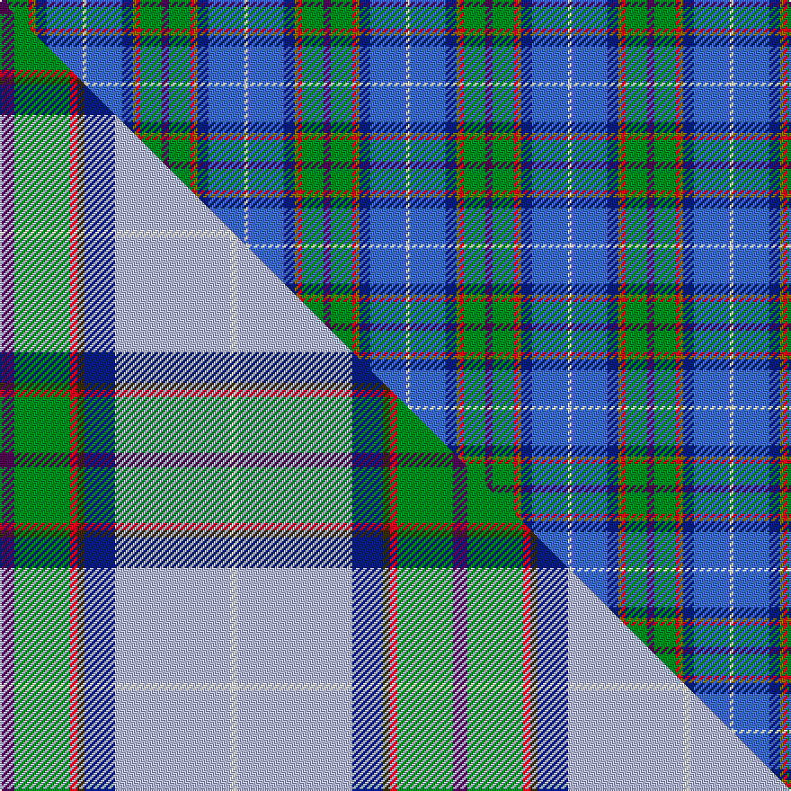

This is one **variant** — a specific cloth: this exact thread count and colourway, with its own
provenance below. It is one weaving of the [sett](/tartans/m/ma/manx-national/) (the scale-free proportion — the
same cloth at any scale or shade), whose colour order is pattern [BGRGBBW](/stripes/bgrgbbw/).

Part of the [Manx National](/tartans/m/ma/manx-national/) tartan — the named design grouping this sett with its other cloths.

Sourced from weddslist.  It is a [7 stripe tartan](/stripes/stripes7/).

Original link [http://www.weddslist.com/cgi-bin/tartans/pg.pl?source=sts](http://www.weddslist.com/cgi-bin/tartans/pg.pl?source=sts)

Dataset <small>— provenance for this record, inherited from the source manifest</small>

<dl class="dataset-prov">
<dt>source</dt><dd><a href="/sources/weddslist/">Weddslist</a></dd>
<dt>data captured from</dt><dd><a href="https://github.com/thetartan/tartan-database/blob/master/data/weddslist/data.csv">https://github.com/thetartan/tartan-database/blob/master/data/weddslist/data.csv</a></dd>
<dt>data date</dt><dd>2016-11-17 <small>(dataset default)</small></dd>
<dt>licence</dt><dd><a href="https://creativecommons.org/licenses/by-nc-nd/4.0/">CC BY-NC-ND 4.0</a></dd>
</dl>

Capture chain <small>— the hands this data passed through, oldest first; each capture carries its own licence</small>

<ol class="capture-chain">
<li><a href="https://www.weddslist.com/tartans/">Weddslist</a> <small>the living privately compiled reference</small></li>
<li><a href="https://github.com/thetartan/tartan-database">thetartan/tartan-database</a> <small>2016-2017</small> · <a href="https://creativecommons.org/licenses/by-nc-nd/4.0/">CC BY-NC-ND 4.0</a> <small>Levko Kravets's frozen compilation — the capture we vendored, and where its CC licence text came from</small></li>
<li>this dictionary <small>captured 2026-06-10 · commit 5bf86c7566</small> <small>each re-capture is a git commit to data/sources</small></li>
</ol>

## Thread count
DP/4 G12 R2 Y2 DB6 B20 W/2

One full sett is **90 threads**.

## Palette
<table><thead><tr><th>Colour</th><th>Shade</th><th>OKLCh</th></tr></thead><tbody><tr><td>B</td><td><code style="background-color:#466CC8;">#466CC8</code> <small style="color:#888">#466CC8</small></td><td><small style="color:#888">oklch(55.1% 0.149 265.0)</small></td></tr><tr><td>DB</td><td><code style="background-color:#082077;">#082077</code> <small style="color:#888">#082077</small></td><td><small style="color:#888">oklch(30.0% 0.149 265.1)</small></td></tr><tr><td>G</td><td><code style="background-color:#008B2A;">#008B2A</code> <small style="color:#888">#008B2A</small></td><td><small style="color:#888">oklch(55.4% 0.170 145.9)</small></td></tr><tr><td>Y</td><td><code style="background-color:#8B6E00;">#8B6E00</code> <small style="color:#888">#8B6E00</small></td><td><small style="color:#888">oklch(55.1% 0.113 90.4)</small></td></tr><tr><td>W</td><td><code style="background-color:#F7F7F7;">#F7F7F7</code> <small style="color:#888">#F7F7F7</small></td><td><small style="color:#888">oklch(97.6% 0.000 89.9)</small></td></tr><tr><td>DP</td><td><code style="background-color:#4B0B4F;">#4B0B4F</code> <small style="color:#888">#4B0B4F</small></td><td><small style="color:#888">oklch(30.1% 0.125 325.4)</small></td></tr><tr><td>R</td><td><code style="background-color:#D60020;">#D60020</code> <small style="color:#888">#D60020</small></td><td><small style="color:#888">oklch(55.2% 0.224 25.5)</small></td></tr></tbody></table>

# Sample pattern

## Compared to the master

This cloth is one sett of its design; the master sett (the exemplar the design is anchored on) is below for comparison.

Its **ΔTartan distance** from the master is **0.54** — the same measure the nearest-tartans table ranks by (0 is identical; a re-scale of the same cloth is near 0, a recolour or a different proportion further).

<figure class="master-compare" style="margin:0">

this sett
master sett ★

<figcaption style="color:#888;font-size:smaller">One weave of this sett against the <a href="/setts/dp8g31r4dy4db17lb64w4/">master sett ★</a>, split on the diagonal: a shared proportion runs seamlessly across it with only the shades shifting; a different proportion breaks on it.</figcaption>
</figure>

## Nearest tartan variants

The nearest existing variants by ΔTartan distance, with this cloth at the top so the swatches line up against it.

ΔTartan

Threads

Variant

Sett

—

90

<a href="/variants/s7/dp2g6r1y1db3b10w1~x2/">Manx National</a>

<a href="/ttd/edit/#slug=dp2g6r1dy1db3lb10w1~x2&amp;base=dp2g6r1y1db3b10w1~x2" title="compare in the TTD">0.18</a>

90

<a href="/variants/s7/dp2g6r1dy1db3lb10w1~x2/">Manx National District Tartan</a>

<a href="/ttd/edit/#slug=dp8g31r4y4db17b64w4&amp;base=dp2g6r1y1db3b10w1~x2" title="compare in the TTD">0.44</a>

252

<a href="/variants/s7/dp8g31r4y4db17b64w4/">Manx National</a>

<a href="/ttd/edit/#slug=p5g9r2dy2db6lb14w3~x4&amp;base=dp2g6r1y1db3b10w1~x2" title="compare in the TTD">0.44</a>

296

<a href="/variants/s7/p5g9r2dy2db6lb14w3~x4/">Manx National</a>

<a href="/ttd/edit/#slug=lp5g9r2dy2db6lb14w3~x4&amp;base=dp2g6r1y1db3b10w1~x2" title="compare in the TTD">0.45</a>

296

<a href="/variants/s7/lp5g9r2dy2db6lb14w3~x4/">Manx National (District)</a>

<a href="/ttd/edit/#slug=dp2g8r1dy1db6lb15w1~x4&amp;base=dp2g6r1y1db3b10w1~x2" title="compare in the TTD">0.51</a>

260

<a href="/variants/s7/dp2g8r1dy1db6lb15w1~x4/">Manx National District Tartan</a>

<a href="/ttd/edit/#slug=dp8g31r4dy4db17lb64w4&amp;base=dp2g6r1y1db3b10w1~x2" title="compare in the TTD">0.54</a>

252

<a href="/variants/s7/dp8g31r4dy4db17lb64w4/">Manx National #2</a>

<a href="/ttd/edit/#slug=db13y2r4g2lb8w2~x6&amp;base=dp2g6r1y1db3b10w1~x2" title="compare in the TTD">1.84</a>

282

<a href="/variants/s6/db13y2r4g2lb8w2~x6/">Meh Dundee</a>

<a href="/ttd/edit/#slug=r3dt20db20g2lr4lri17w3~x2~lr7402111-lri7402246&amp;base=dp2g6r1y1db3b10w1~x2" title="compare in the TTD">2.32</a>

264

<a href="/variants/s7/r3dt20db20g2lr4lri17w3~x2~lr7402111-lri7402246/">Silversea</a>

<a href="/ttd/edit/#slug=g2db14lg6n1g1n6r1~x4~db2316264-lg6709222&amp;base=dp2g6r1y1db3b10w1~x2" title="compare in the TTD">2.37</a>

236

<a href="/variants/s7/g2db14lg6n1g1n6r1~x4~db2316264-lg6709222/">Loch Ness in Scotland</a>

<a href="/ttd/edit/#slug=r3db24k7dbi11g11y2~x2~db3409246-dbi3514276&amp;base=dp2g6r1y1db3b10w1~x2" title="compare in the TTD">2.44</a>

222

<a href="/variants/s6/r3db24k7dbi11g11y2~x2~db3409246-dbi3514276/">Cowie</a>

## Neighbour map

Every grey dot is one of 13662 variants placed by the first two principal components of the ΔTartan feature space (42% of its variance). Red is this tartan; blue dots are its nearest — click one to open its page. The map is a flat projection of a many-dimensional space — [how to read it](/posts/neighbourhood-maps/).

<svg viewBox="0 0 640 380" role="img" style="max-width:100%;height:auto;border:1px solid #e0e0e0;border-radius:4px;display:block" xmlns="http://www.w3.org/2000/svg"><image href="/nn/cloud.v1.png" width="640" height="380"/><a href="/variants/s7/dp2g6r1dy1db3lb10w1~x2/"><circle cx="148.6" cy="161.6" r="4" fill="#3465a4"><title>Manx National District Tartan</title></circle></a><a href="/variants/s7/dp8g31r4y4db17b64w4/"><circle cx="251.4" cy="145.4" r="4" fill="#3465a4"><title>Manx National</title></circle></a><a href="/variants/s7/p5g9r2dy2db6lb14w3~x4/"><circle cx="82.6" cy="195.4" r="4" fill="#3465a4"><title>Manx National</title></circle></a><a href="/variants/s7/lp5g9r2dy2db6lb14w3~x4/"><circle cx="85.6" cy="198.3" r="4" fill="#3465a4"><title>Manx National (District)</title></circle></a><a href="/variants/s7/dp2g8r1dy1db6lb15w1~x4/"><circle cx="180.8" cy="140.0" r="4" fill="#3465a4"><title>Manx National District Tartan</title></circle></a><a href="/variants/s7/dp8g31r4dy4db17lb64w4/"><circle cx="213.0" cy="131.7" r="4" fill="#3465a4"><title>Manx National #2</title></circle></a><a href="/variants/s6/db13y2r4g2lb8w2~x6/"><circle cx="143.4" cy="200.5" r="4" fill="#3465a4"><title>Meh Dundee</title></circle></a><a href="/variants/s7/r3dt20db20g2lr4lri17w3~x2~lr7402111-lri7402246/"><circle cx="100.7" cy="176.1" r="4" fill="#3465a4"><title>Silversea</title></circle></a><a href="/variants/s7/g2db14lg6n1g1n6r1~x4~db2316264-lg6709222/"><circle cx="239.6" cy="175.4" r="4" fill="#3465a4"><title>Loch Ness in Scotland</title></circle></a><a href="/variants/s6/r3db24k7dbi11g11y2~x2~db3409246-dbi3514276/"><circle cx="178.1" cy="188.1" r="4" fill="#3465a4"><title>Cowie</title></circle></a><circle cx="180.3" cy="172.9" r="5" fill="#c00000"/><text x="320" y="376" text-anchor="middle" font-size="11" fill="#999">ground</text><text x="11" y="190" text-anchor="middle" font-size="11" fill="#999" transform="rotate(-90 11 190)">complexity</text></svg>

ID: /variants/s7/dp2g6r1y1db3b10w1~x2/
