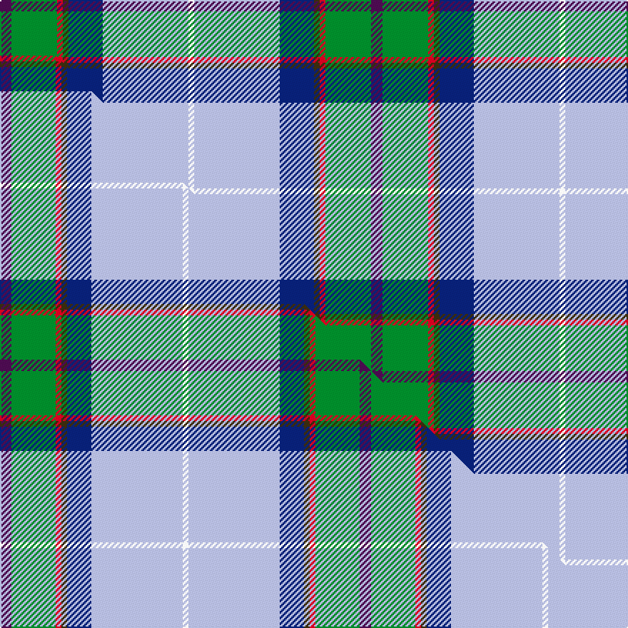

This page is one **sett** — a single exact thread-count. It belongs to the [tartan](/setts/dp2g8r1dy1db6lb15w1/)
(the same proportion at any scale), whose colour order is pattern [BGRGBWW](/stripes/bgrgbww/).

Part of the [Manx National](/tartans/manx-national/) tartan — the named design grouping this sett with its other cloths.

Sourced from house-of-tartan.  It is a [7 stripe tartan](/stripes/stripes7/).

Original link [http://www.house-of-tartan.scotland.net/house/TartanViewjs.asp?colr=Def&tnam=186](http://www.house-of-tartan.scotland.net/house/TartanViewjs.asp?colr=Def&tnam=186)

## Provenance

Earliest known date: pre 2003 Thread count of the sample donated by Dr. D.G. Teall in 1987, when the cloth was commercially available on the island. It differs slightly from the sett recorded by Stewart in 1959, but the design is essentially the same. D C Stewart's Nomindex (Name Index) notes. Th is seven-colour tartan was designed by Miss Patricia 'Paddy' McQaid as the Manx National Tartan at the instigation in 1958 of the Rt. Hon the Lord Sempill who was Chairman of Ellynyn ny Gael - a Manx Gaelic Society. The colours were explained as follows: light blue of the sky, dark blue of the sea, green of the hills & valleys, white of the cottages, purple of the heather, gold of the gorse in bloom and reddish brown of the bracken. The tartan was registered with the Tartans Society on 3rd November 1959 and Paddy McQuaid held the sole rights to production for some years. The tartan was very popular with the Royal Family of the day.

Dataset <small>— provenance for this record, inherited from the source manifest</small>

<dl class="dataset-prov">
<dt>source</dt><dd><a href="/sources/house-of-tartan/">House of Tartan</a></dd>
<dt>data captured from</dt><dd><a href="https://github.com/thetartan/tartan-database/blob/master/data/house-of-tartan/data.csv">https://github.com/thetartan/tartan-database/blob/master/data/house-of-tartan/data.csv</a></dd>
<dt>data date</dt><dd>2017-01-10 <small>(dataset default)</small></dd>
<dt>licence</dt><dd><a href="https://creativecommons.org/licenses/by-nc-nd/4.0/">CC BY-NC-ND 4.0</a></dd>
</dl>

Capture chain <small>— the hands this data passed through, oldest first; each capture carries its own licence</small>

<ol class="capture-chain">
<li><a href="http://www.house-of-tartan.scotland.net/">House of Tartan</a> <small>the weaver/retailer's database — the site is now offline; the URL is kept as the ultimate source's identity</small></li>
<li><a href="https://github.com/thetartan/tartan-database">thetartan/tartan-database</a> <small>2016-2017</small> · <a href="https://creativecommons.org/licenses/by-nc-nd/4.0/">CC BY-NC-ND 4.0</a> <small>Levko Kravets's frozen compilation — the capture we vendored, and where its CC licence text came from</small></li>
<li>this dictionary <small>captured 2026-06-10 · commit 5bf86c7566</small> <small>each re-capture is a git commit to data/sources</small></li>
</ol>

## Thread count
DP/8 G32 R4 DY4 DB24 LB60 W/4

One full sett is **260 threads**.

## Palette
<table><thead><tr><th>Colour</th><th>Shade</th><th>OKLCh</th></tr></thead><tbody><tr><td>LB</td><td><code style="background-color:#B5BBDE;">#B5BBDE</code> <small style="color:#888">#B5BBDE</small></td><td><small style="color:#888">oklch(79.9% 0.050 277.6)</small></td></tr><tr><td>DB</td><td><code style="background-color:#082077;">#082077</code> <small style="color:#888">#082077</small></td><td><small style="color:#888">oklch(30.0% 0.149 265.1)</small></td></tr><tr><td>G</td><td><code style="background-color:#008B2A;">#008B2A</code> <small style="color:#888">#008B2A</small></td><td><small style="color:#888">oklch(55.4% 0.170 145.9)</small></td></tr><tr><td>W</td><td><code style="background-color:#F7F7F7;">#F7F7F7</code> <small style="color:#888">#F7F7F7</small></td><td><small style="color:#888">oklch(97.6% 0.000 89.9)</small></td></tr><tr><td>DP</td><td><code style="background-color:#4B0B4F;">#4B0B4F</code> <small style="color:#888">#4B0B4F</small></td><td><small style="color:#888">oklch(30.1% 0.125 325.4)</small></td></tr><tr><td>R</td><td><code style="background-color:#D60020;">#D60020</code> <small style="color:#888">#D60020</small></td><td><small style="color:#888">oklch(55.2% 0.224 25.5)</small></td></tr><tr><td>DY</td><td><code style="background-color:#3A2B0D;">#3A2B0D</code> <small style="color:#888">#3A2B0D</small></td><td><small style="color:#888">oklch(30.0% 0.049 82.0)</small></td></tr></tbody></table>

# Sample pattern

## Compared to the master

This cloth is one sett of its design; the master sett (the exemplar the design is anchored on) is below for comparison.

Its **ΔTartan distance** from the master is **0.17** — the same measure the nearest-tartans table ranks by (0 is identical; a re-scale of the same cloth is near 0, a recolour or a different proportion further).

<figure class="master-compare" style="margin:0">

this sett
master sett ★

<figcaption style="color:#888;font-size:smaller">One weave of this sett against the <a href="/setts/dp8g31r4dy4db17lb64w4/">master sett ★</a>, split on the diagonal: a shared proportion runs seamlessly across it with only the shades shifting; a different proportion breaks on it.</figcaption>
</figure>

## Nearest tartan variants

The nearest existing variants by ΔTartan distance, with this cloth at the top so the swatches line up against it.

ΔTartan

Threads

Variant

Sett

—

260

<a href="/variants/s7/dp2g8r1dy1db6lb15w1~x4/">Manx National District Tartan</a>

<a href="/ttd/edit/#slug=dp8g31r4dy4db17lb64w4&amp;base=dp2g8r1dy1db6lb15w1~x4" title="compare in the TTD">0.17</a>

252

<a href="/variants/s7/dp8g31r4dy4db17lb64w4/">Manx National #2</a>

<a href="/ttd/edit/#slug=dp8g31r4y4db17b64w4&amp;base=dp2g8r1dy1db6lb15w1~x4" title="compare in the TTD">0.32</a>

252

<a href="/variants/s7/dp8g31r4y4db17b64w4/">Manx National</a>

<a href="/ttd/edit/#slug=dp2g6r1dy1db3lb10w1~x2&amp;base=dp2g8r1dy1db6lb15w1~x4" title="compare in the TTD">0.41</a>

90

<a href="/variants/s7/dp2g6r1dy1db3lb10w1~x2/">Manx National District Tartan</a>

<a href="/ttd/edit/#slug=dp2g6r1y1db3b10w1~x2&amp;base=dp2g8r1dy1db6lb15w1~x4" title="compare in the TTD">0.51</a>

90

<a href="/variants/s7/dp2g6r1y1db3b10w1~x2/">Manx National</a>

<a href="/ttd/edit/#slug=p5g9r2dy2db6lb14w3~x4&amp;base=dp2g8r1dy1db6lb15w1~x4" title="compare in the TTD">0.58</a>

296

<a href="/variants/s7/p5g9r2dy2db6lb14w3~x4/">Manx National</a>

<a href="/ttd/edit/#slug=lp5g9r2dy2db6lb14w3~x4&amp;base=dp2g8r1dy1db6lb15w1~x4" title="compare in the TTD">0.59</a>

296

<a href="/variants/s7/lp5g9r2dy2db6lb14w3~x4/">Manx National (District)</a>

<a href="/ttd/edit/#slug=db13y2r4g2lb8w2~x6&amp;base=dp2g8r1dy1db6lb15w1~x4" title="compare in the TTD">1.81</a>

282

<a href="/variants/s6/db13y2r4g2lb8w2~x6/">Meh Dundee</a>

<a href="/ttd/edit/#slug=o2lb14k1g11k2lr2b2k1~x4~o1604043-lr3103019&amp;base=dp2g8r1dy1db6lb15w1~x4" title="compare in the TTD">2.00</a>

268

<a href="/variants/s8/o2lb14k1g11k2lr2b2k1~x4~o1604043-lr3103019/">Mission</a>

<a href="/ttd/edit/#slug=r3dt20db20g2lr4lri17w3~x2~lr3001120-lri3001240&amp;base=dp2g8r1dy1db6lb15w1~x4" title="compare in the TTD">2.21</a>

264

<a href="/variants/s7/r3dt20db20g2lr4lri17w3~x2~lr3001120-lri3001240/">Silversea</a>

<a href="/ttd/edit/#slug=w50db3w8db8dt12r4dt12g16dg12n4w4~db1406275-dt1204274&amp;base=dp2g8r1dy1db6lb15w1~x4" title="compare in the TTD">2.80</a>

212

<a href="/variants/s11/w50dbi3w8dbi8db12r4db12g16dg12n4w4~dbi1406275-db1204274/">Fothergill (Personal)</a>

## Neighbour map

Every grey dot is one of 13621 variants placed by the first two principal components of the ΔTartan feature space (42% of its variance). Red is this tartan; blue dots are its nearest — click one to open its page.

<svg viewBox="0 0 640 380" role="img" style="max-width:100%;height:auto;border:1px solid #e0e0e0;border-radius:4px;display:block" xmlns="http://www.w3.org/2000/svg"><image href="/nn/cloud.v1.png" width="640" height="380"/><a href="/variants/s7/dp8g31r4dy4db17lb64w4/"><circle cx="213.0" cy="131.9" r="4" fill="#3465a4"><title>Manx National #2</title></circle></a><a href="/variants/s7/dp8g31r4y4db17b64w4/"><circle cx="251.6" cy="145.2" r="4" fill="#3465a4"><title>Manx National</title></circle></a><a href="/variants/s7/dp2g6r1dy1db3lb10w1~x2/"><circle cx="148.6" cy="161.9" r="4" fill="#3465a4"><title>Manx National District Tartan</title></circle></a><a href="/variants/s7/dp2g6r1y1db3b10w1~x2/"><circle cx="180.6" cy="172.9" r="4" fill="#3465a4"><title>Manx National</title></circle></a><a href="/variants/s7/p5g9r2dy2db6lb14w3~x4/"><circle cx="82.7" cy="195.9" r="4" fill="#3465a4"><title>Manx National</title></circle></a><a href="/variants/s7/lp5g9r2dy2db6lb14w3~x4/"><circle cx="85.7" cy="198.7" r="4" fill="#3465a4"><title>Manx National (District)</title></circle></a><a href="/variants/s6/db13y2r4g2lb8w2~x6/"><circle cx="143.5" cy="201.2" r="4" fill="#3465a4"><title>Meh Dundee</title></circle></a><a href="/variants/s8/o2lb14k1g11k2lr2b2k1~x4~o1604043-lr3103019/"><circle cx="148.2" cy="128.8" r="4" fill="#3465a4"><title>Mission</title></circle></a><a href="/variants/s7/r3dt20db20g2lr4lri17w3~x2~lr3001120-lri3001240/"><circle cx="101.0" cy="176.3" r="4" fill="#3465a4"><title>Silversea</title></circle></a><a href="/variants/s11/w50dbi3w8dbi8db12r4db12g16dg12n4w4~dbi1406275-db1204274/"><circle cx="157.9" cy="108.2" r="4" fill="#3465a4"><title>Fothergill (Personal)</title></circle></a><circle cx="180.8" cy="140.2" r="5" fill="#c00000"/><text x="320" y="376" text-anchor="middle" font-size="11" fill="#999">ground</text><text x="11" y="190" text-anchor="middle" font-size="11" fill="#999" transform="rotate(-90 11 190)">complexity</text></svg>

ID: /variants/s7/dp2g8r1dy1db6lb15w1~x4/
