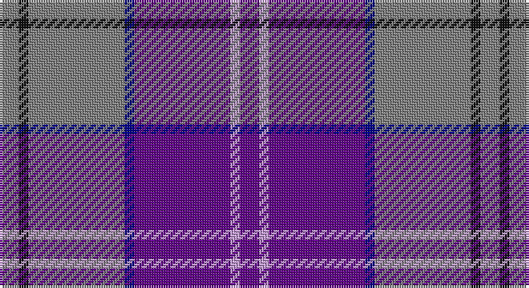

This page is one **sett** — a single exact thread-count. It belongs to the [tartan](/setts/dp2lp1dp10db1y10k1y2/)
(the same proportion at any scale), whose colour order is pattern [BWBBGKG](/stripes/bwbbgkg/).

Sourced from register-of-tartans.  It is a [7 stripe tartan](/stripes/stripes7/).

Original link https://www.tartanregister.gov.uk/tartanDetails.aspx?ref=11442

## Register references

External register numbers recorded for this tartan.

- Scottish Register of Tartans: [11442](https://www.tartanregister.gov.uk/tartanDetails.aspx?ref=11442)

## Thread count
N/8 K4 N40 DB4 P40 LP4 P/8

One full sett is **200 threads**.

## Palette

Palette: <strong>Tartan Register</strong>
<table><thead><tr><th>Colour</th><th>Threads</th><th>Shade</th><th>Base</th><th>OKLCh</th></tr></thead><tbody><tr><td>N/</td><td style="text-align:right;font-variant-numeric:tabular-nums">8</td><td><code style="background-color:#808080;">#808080</code> <small style="color:#888">#808080</small></td><td>G <code style="background-color:#006100;">#006100</code></td><td><small style="color:#888">oklch(60.0% 0.000 89.9)</small></td></tr><tr><td>K</td><td style="text-align:right;font-variant-numeric:tabular-nums">4</td><td><code style="background-color:#101010;">#101010</code> <small style="color:#888">#101010</small></td><td>K <code style="background-color:#000000;">#000000</code></td><td><small style="color:#888">oklch(17.3% 0.000 89.9)</small></td></tr><tr><td>N</td><td style="text-align:right;font-variant-numeric:tabular-nums">40</td><td><code style="background-color:#808080;">#808080</code> <small style="color:#888">#808080</small></td><td>G <code style="background-color:#006100;">#006100</code></td><td><small style="color:#888">oklch(60.0% 0.000 89.9)</small></td></tr><tr><td>DB</td><td style="text-align:right;font-variant-numeric:tabular-nums">4</td><td><code style="background-color:#00008C;">#00008C</code> <small style="color:#888">#00008C</small></td><td>B <code style="background-color:#2A418A;">#2A418A</code></td><td><small style="color:#888">oklch(28.9% 0.200 264.1)</small></td></tr><tr><td>P</td><td style="text-align:right;font-variant-numeric:tabular-nums">40</td><td><code style="background-color:#64008C;">#64008C</code> <small style="color:#888">#64008C</small></td><td>B <code style="background-color:#2A418A;">#2A418A</code></td><td><small style="color:#888">oklch(38.5% 0.193 311.3)</small></td></tr><tr><td>LP</td><td style="text-align:right;font-variant-numeric:tabular-nums">4</td><td><code style="background-color:#C49CD8;">#C49CD8</code> <small style="color:#888">#C49CD8</small></td><td>W <code style="background-color:#F7F7F7;">#F7F7F7</code></td><td><small style="color:#888">oklch(75.0% 0.095 314.2)</small></td></tr><tr><td>P/</td><td style="text-align:right;font-variant-numeric:tabular-nums">8</td><td><code style="background-color:#64008C;">#64008C</code> <small style="color:#888">#64008C</small></td><td>B <code style="background-color:#2A418A;">#2A418A</code></td><td><small style="color:#888">oklch(38.5% 0.193 311.3)</small></td></tr></tbody></table>

# Sample pattern

## Nearest tartans

The nearest existing variants by ΔTartan distance, with this tartan at the top so the swatches line up against it.

ΔTartan

Tartan

Sett

—

<a href="/ttd/edit/#slug=dp2lp1dp10db1y10k1y2~x4">Lennox Primary School</a> <a class="nn-out" href="/variants/s7/dp2lp1dp10db1y10k1y2~x4/" title="open its dictionary page">↗</a>

1.26

<a href="/ttd/edit/#slug=p9lb1g2lb1db4r1~x12&amp;base=dp2lp1dp10db1y10k1y2~x4">McIntosh, Georgina (Personal)</a> <a class="nn-out" href="/variants/s6/p9lb1g2lb1db4r1~x12/" title="open its dictionary page">↗</a>

1.34

<a href="/ttd/edit/#slug=p26w2p3db15o26r2o3db4~x2&amp;base=dp2lp1dp10db1y10k1y2~x4">Scottish Highlander Dress (Fashion)</a> <a class="nn-out" href="/variants/s8/p26w2p3db15o26r2o3db4~x2/" title="open its dictionary page">↗</a>

1.42

<a href="/ttd/edit/#slug=db9r1db2r1r4w1~x12&amp;base=dp2lp1dp10db1y10k1y2~x4">McIntosh, Georgina (Personal)</a> <a class="nn-out" href="/variants/s6/db9r1db2r1r4w1~x12/" title="open its dictionary page">↗</a>

1.43

<a href="/ttd/edit/#slug=db4dpi2dp3db24t24w3~x2&amp;base=dp2lp1dp10db1y10k1y2~x4">Aberdeen Academy of Performing Art</a> <a class="nn-out" href="/variants/s6/db4dpi2dp3db24t24w3~x2/" title="open its dictionary page">↗</a>

1.47

<a href="/ttd/edit/#slug=k2m1db17m17dt1ly2~x4&amp;base=dp2lp1dp10db1y10k1y2~x4">Murdoch</a> <a class="nn-out" href="/variants/s6/k2m1db17m17dt1ly2~x4/" title="open its dictionary page">↗</a>

1.51

<a href="/ttd/edit/#slug=db6dp12lg3dp12b6db2b26dp16lb2dp6~x2&amp;base=dp2lp1dp10db1y10k1y2~x4">Serenade (Fashion)</a> <a class="nn-out" href="/variants/s10/db6dp12lg3dp12b6db2b26dp16lb2dp6~x2/" title="open its dictionary page">↗</a>

1.52

<a href="/ttd/edit/#slug=p16lp2p5dp12p8lg2db4p8dp23lg4~x2&amp;base=dp2lp1dp10db1y10k1y2~x4">Learmonth Family (Herts) (Personal)</a> <a class="nn-out" href="/variants/s10/p16lp2p5dp12p8lg2db4p8dp23lg4~x2/" title="open its dictionary page">↗</a>

1.54

<a href="/ttd/edit/#slug=db1lo1db13loi3y3loi3r1loi1~x4&amp;base=dp2lp1dp10db1y10k1y2~x4">Glen Moray</a> <a class="nn-out" href="/variants/s8/db1lo1db13loi3y3loi3r1loi1~x4/" title="open its dictionary page">↗</a>

1.58

<a href="/ttd/edit/#slug=dp10ly3dp8db42g5o5~x2&amp;base=dp2lp1dp10db1y10k1y2~x4">Cheadle (Personal)</a> <a class="nn-out" href="/variants/s6/dp10ly3dp8db42g5o5~x2/" title="open its dictionary page">↗</a>

1.59

<a href="/ttd/edit/#slug=r16db2o6r3k4t2db40t6~x2&amp;base=dp2lp1dp10db1y10k1y2~x4">St. Leonards (Corporate)</a> <a class="nn-out" href="/variants/s8/r16db2o6r3k4t2db40t6~x2/" title="open its dictionary page">↗</a>

## Neighbour map

Every grey dot is one of 14360 variants placed by the first two principal components of the ΔTartan feature space (44% of its variance). Red is this tartan; blue dots are its nearest — click one to open its page.

<svg viewBox="0 0 640 380" role="img" style="max-width:100%;height:auto;border:1px solid #e0e0e0;border-radius:4px;display:block" xmlns="http://www.w3.org/2000/svg"><image href="/nn/cloud.v1.png" width="640" height="380"/><a href="/variants/s6/p9lb1g2lb1db4r1~x12/"><circle cx="248.3" cy="187.2" r="4" fill="#3465a4"><title>McIntosh, Georgina (Personal)</title></circle></a><a href="/variants/s8/p26w2p3db15o26r2o3db4~x2/"><circle cx="213.0" cy="163.9" r="4" fill="#3465a4"><title>Scottish Highlander Dress (Fashion)</title></circle></a><a href="/variants/s6/db9r1db2r1r4w1~x12/"><circle cx="285.0" cy="202.3" r="4" fill="#3465a4"><title>McIntosh, Georgina (Personal)</title></circle></a><a href="/variants/s6/db4dpi2dp3db24t24w3~x2/"><circle cx="265.6" cy="184.4" r="4" fill="#3465a4"><title>Aberdeen Academy of Performing Art</title></circle></a><a href="/variants/s6/k2m1db17m17dt1ly2~x4/"><circle cx="313.9" cy="172.4" r="4" fill="#3465a4"><title>Murdoch</title></circle></a><a href="/variants/s10/db6dp12lg3dp12b6db2b26dp16lb2dp6~x2/"><circle cx="296.8" cy="188.1" r="4" fill="#3465a4"><title>Serenade (Fashion)</title></circle></a><a href="/variants/s10/p16lp2p5dp12p8lg2db4p8dp23lg4~x2/"><circle cx="240.9" cy="177.1" r="4" fill="#3465a4"><title>Learmonth Family (Herts) (Personal)</title></circle></a><a href="/variants/s8/db1lo1db13loi3y3loi3r1loi1~x4/"><circle cx="306.1" cy="157.9" r="4" fill="#3465a4"><title>Glen Moray</title></circle></a><a href="/variants/s6/dp10ly3dp8db42g5o5~x2/"><circle cx="356.2" cy="186.5" r="4" fill="#3465a4"><title>Cheadle (Personal)</title></circle></a><a href="/variants/s8/r16db2o6r3k4t2db40t6~x2/"><circle cx="318.2" cy="137.0" r="4" fill="#3465a4"><title>St. Leonards (Corporate)</title></circle></a><circle cx="278.0" cy="182.8" r="5" fill="#c00000"/></svg>

ID: /variants/s7/dp2lp1dp10db1y10k1y2~x4/
